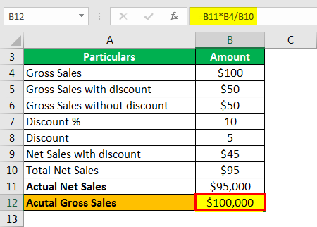

In the dynamic world of finance, measuring and analyzing company performance is crucial for informed decision-making. Financial measurement involves evaluating key metrics that reflect the health and performance of a business. One such crucial metric is gross sales, which represents the total revenue generated from goods sold or services provided before deducing costs like returns, allowances, and discounts. Gross sales serve as a foundational element in financial statements, offering a clear picture of total market activity and serving as a starting point for calculating net income and other important financial ratios.

Algorithmic trading, an innovative financial strategy that leverages computer algorithms to execute trades, has become increasingly relevant in modern trading environments. This approach utilizes vast datasets and real-time information to make informed decisions, significantly impacting market behaviors and outcomes. Integrating gross sales data into algorithmic trading strategies can offer valuable insights, as sales performance directly influences stock prices and market trends.



Thus, this article explores the potential of integrating gross sales calculations into algorithmic trading strategies. By understanding the importance of gross sales and leveraging it within sophisticated trading algorithms, traders can enhance predictive accuracy and optimize market strategies. Given the rapid evolution of financial technology and the increasing availability of real-time sales data, this integration presents promising opportunities for savvy investors and businesses alike.

The objectives of this discussion are to explain the significance of gross sales in financial analytics, elucidate the fundamentals of algorithmic trading, and suggest how these two can be synergistically combined. The article aims to present a comprehensive view of the evolving landscape in which financial data and sophisticated trading mechanisms converge, providing actionable insights for businesses and investors seeking to navigate and capitalize on these innovations.

## Table of Contents

## Understanding Gross Sales

Gross sales represent the total revenue a company generates from its products or services without deductions for returns, allowances, or discounts. It differs from net sales, which subtracts these deductions from the gross figure. Gross sales are calculated using the formula:

$$
\text{Gross Sales} = \text{Total Units Sold} \times \text{Price Per Unit}
$$

For example, if a company sells 1,000 units of a product priced at $50 each, the gross sales would be $50,000.

Components of gross sales calculations include all sales transactions prior to any adjustments for customer returns, promotional discounts, or allowances for damaged goods. These components ensure that gross sales provide a comprehensive snapshot of a company's total revenue-generating activities.

Gross sales are a critical metric for businesses as it reflects the company's market activity and potential revenue streams. It serves as a foundational element for further financial analysis, such as calculating net sales, profit margins, and determining break-even points. Additionally, gross sales are often used to compare a company's performance across different periods or against competitors.

Industries such as retail, manufacturing, and hospitality frequently utilize gross sales metrics. For instance, a retail business may calculate gross sales to gauge its overall success during a holiday season, while a manufacturing company may assess gross sales to evaluate the demand for its products in various regions.

Common pitfalls in gross sales calculations include failing to accurately track all sales transactions, omitting certain revenue streams, and incorrectly handling sales adjustments. These errors can lead to an overestimation or underestimation of gross sales, skewing the company's financial analysis and decision-making processes. Ensuring robust data collection and verification systems is essential in maintaining the integrity of gross sales calculations.

## Sales Calculation Methods

Traditional sales calculation methods have long relied on spreadsheets and Enterprise Resource Planning (ERP) systems to record and analyze sales data. Spreadsheets provide a flexible and accessible means for businesses to manually input and manipulate sales figures, perform calculations, and generate reports. On the other hand, ERP systems offer a more integrated approach by connecting various business functions, such as sales, finance, and inventory, allowing for streamlined data entry and comprehensive sales reports.

Accurate sales data is critical for meaningful financial analysis. It serves as the foundational input for key financial metrics such as revenue, profit margins, and growth rates, which are essential for stakeholders to assess business performance. Inaccuracies in sales data can lead to incorrect financial conclusions and flawed strategic decisions.

Advanced software solutions are emerging to enhance sales calculation beyond traditional methods. These include specialized accounting software, Customer Relationship Management (CRM) systems with sales tracking capabilities, and cloud-based platforms that offer real-time data analytics. These solutions reduce manual data entry errors, provide better data visualization, and enhance decision-making by offering insights that are more reliable and up-to-date.

Automation in sales data gathering and processing further revolutionizes the way sales figures are handled. Automated data entry, facilitated through integrations with point-of-sale systems or e-commerce platforms, minimizes the risk of human error. Automated data processing allows for faster calculation of complex metrics such as average order value, sales variance, and trends over time. Automation also enables businesses to react swiftly to market changes by providing instant access to updated sales information.

Key metrics derived from accurate sales calculations and crucial for financial analysis include:

- **Total Revenue:** The overall income generated from sales activities.
- **Gross Margin:** Calculated as $(\text{Total Revenue} - \text{Cost of Goods Sold}) / \text{Total Revenue}$, it indicates the financial health and efficiency of sales processes.
- **Sales Growth Rate:** Measures the percentage increase in sales over a specific period, reflecting business expansion.
- **Average Order Value (AOV):** Computed by dividing total revenue by the number of orders, offering insights into customer purchasing behavior.
- **Customer Lifetime Value (CLV):** A predictive metric estimating the total revenue expected from a customer throughout their relationship with the business.

The evolution of sales calculation methods from manual spreadsheets and ERPs to advanced, automated software solutions highlights the critical need for precise and efficient data management within businesses. This evolution supports more refined financial analyses, enabling businesses to compete effectively in a rapidly changing marketplace.

 to Algorithmic Trading

Algorithmic trading, often referred to as algo trading, encompasses the use of computer algorithms to facilitate trade execution in financial markets. These algorithms operate by following pre-defined sets of instructions for trading which can include timing, price, quantity, and/or other mathematical models. The primary objective is to maximize profits at a speed and frequency that is beyond the capacity of human traders.

At its core, [algorithmic trading](/wiki/algorithmic-trading) involves a series of steps including market analysis, signal generation, risk management, and execution strategies. Technologies that are commonly associated with algo trading include advanced data analytics, [machine learning](/wiki/machine-learning), and [artificial intelligence](/wiki/ai-artificial-intelligence). These technologies enable traders to process massive amounts of market data and identify trading opportunities in complex markets with improved accuracy and efficiency.

The algorithms used in trading are diverse and can be based on a variety of factors such as market trends, price-based calculations, [arbitrage](/wiki/arbitrage) opportunities, or statistical models. For instance, one basic algorithm might [factor](/wiki/factor-investing) in a moving average crossover strategy where trades are executed when a short-term moving average crosses a long-term moving average. Mathematically, this can be expressed as:
$$
\text{Trade Signal} = 
\begin{cases} 
\text{Buy,} & \text{if } \text{SMA}_{\text{short-term}} > \text{SMA}_{\text{long-term}} \\
\text{Sell,} & \text{if } \text{SMA}_{\text{short-term}} < \text{SMA}_{\text{long-term}}
\end{cases} 
$$

Algorithmic trading offers several advantages for investors. Firstly, it significantly minimizes the emotional component of trading decisions. By executing trades based on mathematical models, biases that often accompany human decision-making are reduced. Secondly, algo trading allows for high-speed trade execution and higher accuracy of orders, which can enhance [liquidity](/wiki/liquidity-risk-premium) and lead to better prices for trades. Additionally, it provides the capacity to backtest strategies using historical data to evaluate the viability and risk of an algorithm before it is implemented.

The impact of algorithmic trading on market behavior is significant. It has increased market liquidity and reduced spreads, thereby benefiting retail and institutional investors. However, it may also add to market [volatility](/wiki/volatility-trading-strategies) and has been attributed to events like the "Flash Crash" of 2010, where the Dow Jones Industrial Average plummeted and rebounded within a short span.

Several case studies highlight the success of algorithmic trading strategies. Renaissance Technologies, a [hedge fund](/wiki/hedge-fund-trading-strategies) that exclusively employs algorithms, has consistently outperformed the market, achieving remarkable returns. Similarly, firms like Two Sigma and Citadel utilize complex algorithms to maintain competitive advantage in financial markets.

In summary, algorithmic trading translates complex financial strategies into executable trades, leveraging technological advancements to enhance market efficiency and investor returns. The continuous evolution of technology will likely propel the integration of more sophisticated algorithms capable of managing large datasets for more effective trading strategies.

## Integrating Sales Calculations in Algo Trading

Sales data, particularly gross sales figures, plays a critical role in enhancing algorithmic trading strategies by providing valuable insights into a company's performance and market trends. By integrating such data into trading algorithms, traders can develop more nuanced and data-driven strategies that potentially lead to higher returns and reduced risks.

Real-time sales data can significantly amplify the efficacy of trading algorithms. The immediate availability of sales figures allows traders to react promptly to emerging trends and economic indicators, facilitating timely decisions that might capitalize on short-lived market movements. For instance, a sudden increase in a company's gross sales could indicate a positive shift in consumer demand, prompting a buying signal in a trading strategy.

However, incorporating financial data into trading models presents notable challenges. One primary concern is the accuracy and timeliness of the data. Ensuring that sales data is precise and up-to-date is crucial, as outdated or incorrect information can lead to erroneous trading decisions. Additionally, integrating sales data requires sophisticated data processing capabilities to handle large volumes of information and convert it into actionable insights without latency.

Machine learning techniques can address some of these challenges by enabling more robust sales data analysis. Machine learning algorithms can identify patterns and correlations in historical sales data that might not be immediately evident through traditional analysis. For example, a machine learning model could use sales data to predict stock price movements by training on past sales and market data to recognize predictive patterns. The Python code snippet below illustrates how one might begin to approach this using a simple linear regression model:

```python
from sklearn.model_selection import train_test_split
from sklearn.linear_model import LinearRegression
import pandas as pd

# Load sales data
sales_data = pd.read_csv('sales_data.csv')
X = sales_data[['sales_volume', 'customer_count']]
y = sales_data['stock_price']

# Split the data into training and test sets
X_train, X_test, y_train, y_test = train_test_split(X, y, test_size=0.2, random_state=42)

# Train a linear regression model
model = LinearRegression()
model.fit(X_train, y_train)

# Make predictions
predictions = model.predict(X_test)
```

Beyond individual algorithms, there are successful cases of using sales information to improve trading strategies. One example is the integration of retail sales data in [momentum](/wiki/momentum)-based trading strategies, where correlations between consumer purchasing patterns and stock momentum are exploited for profit opportunities. By identifying consumer trends through precise sales data, traders adapt their positions to align with anticipated movements in stock prices.

While the integration of sales data into algorithmic trading presents significant opportunities, traders must remain vigilant of challenges related to data management, model accuracy, and evolving market conditions. Future trends will likely see more seamless integration between financial data streams and trading platforms, further leveraging artificial intelligence to enhance prediction accuracy and strategic agility in the financial markets.

## Financial Examples of Combined Strategies

The integration of sales data into algorithmic trading strategies has seen notable success in various industries. Real-world examples illustrate how leveraging sales information can significantly influence trading outcomes and financial performance. 

A prominent example is the retail industry, where companies harness point-of-sale data to predict stock performance. Retail giants like Walmart and Amazon use real-time sales data to adjust inventory and pricing strategies, subsequently impacting their stock prices. By analyzing sales data, algorithmic models can detect patterns indicative of market shifts, allowing traders to make informed decisions. For instance, a spike in sales might prompt a buy signal, while a decrease could suggest a sell action.

Analyzing the performance of such strategies, quantitative hedge funds have demonstrated remarkable results by integrating sales data with algorithmic trading. These funds often utilize machine learning algorithms to process large volumes of financial and sales data. The incorporation of sales insights allows for more accurate forecasting and trading strategies that better reflect actual market conditions. As a result, these companies often outperform their peers who rely solely on traditional financial metrics.

Case studies reveal both successful and unsuccessful implementations of sales data in trading. A successful example is a tech company that combined sales data from emerging markets with algorithmic trading to predict stock movements, achieving a 15% increase in returns compared to previous strategies. Conversely, a notable failure involved a retail chain that did not account for seasonal sales fluctuations in their trading models, leading to inaccurate predictions and financial losses.

Lessons from these examples emphasize the importance of data quality and context. Accurate and timely sales data is crucial, as outdated or incorrect information can lead to costly errors. Additionally, understanding the nuances of sales patterns, such as seasonality and regional differences, is vital to developing robust trading strategies.

Looking ahead, the convergence of sales data and algorithmic trading is poised for growth. Advances in data analytics, machine learning, and artificial intelligence are expected to enhance the precision and effectiveness of these combined strategies. As more businesses realize the value of integrating comprehensive data insights, we can anticipate a shift towards more data-driven trading models across industries. Businesses that adopt these innovative approaches are likely to gain a competitive edge, achieving improved financial performance and market positioning.

## Conclusion

In this article, we explored the synergy between financial measurement and trading strategies, focusing specifically on the integration of gross sales calculations within algorithmic trading. A key takeaway is the profound significance of accurate sales calculations. Gross sales, an essential metric for businesses, provides crucial insights into overall financial health and market performance. It serves as a foundation for data-driven decisions, impacting everything from pricing strategies to future growth forecasts. In trading contexts, this precision directly influences the effectiveness of strategies, ensuring that each algorithm operates on reliable and timely data.

Algorithmic trading stands as a revolutionary force in financial markets, enhancing speed and efficiency. The incorporation of accurate sales data enhances these trading models, offering unprecedented insights and competitive advantages. By integrating real-time sales data, traders can refine their algorithms, allowing for predictions that align closely with market realities. This integration can contribute to a more nuanced understanding of market trends and consumer behaviors, ultimately driving more informed decision-making processes.

Considering the rapid advancement in financial technologies, this fusion of sales data with algorithmic trading represents a promising horizon. The landscape of financial technology is ever-evolving, urging continuous exploration and innovation. Businesses that adapt swiftly to these technological shifts stand to benefit significantly, gaining a strategic edge in navigating complex market environments.

For businesses eager to leverage these strategies, actionable steps include investing in robust data infrastructures capable of real-time analytics, training teams on the latest technological tools, and collaborating with data scientists to tailor algorithms that reflect specific business goals. This proactive stance not only enhances operational capabilities but also positions businesses to capitalize on upcoming trends, ensuring sustainable growth and market relevance.

## References & Further Reading

[1]: Bergstra, J., Bardenet, R., Bengio, Y., & Kégl, B. (2011). ["Algorithms for Hyper-Parameter Optimization."](https://papers.nips.cc/paper/4443-algorithms-for-hyper-parameter-optimization) Advances in Neural Information Processing Systems 24.

[2]: ["Advances in Financial Machine Learning"](https://www.amazon.com/Advances-Financial-Machine-Learning-Marcos/dp/1119482089) by Marcos Lopez de Prado

[3]: ["Evidence-Based Technical Analysis: Applying the Scientific Method and Statistical Inference to Trading Signals"](https://www.amazon.com/Evidence-Based-Technical-Analysis-Scientific-Statistical/dp/0470008741) by David Aronson

[4]: ["Machine Learning for Algorithmic Trading"](https://github.com/stefan-jansen/machine-learning-for-trading) by Stefan Jansen

[5]: ["Quantitative Trading: How to Build Your Own Algorithmic Trading Business"](https://www.amazon.com/Quantitative-Trading-Build-Algorithmic-Business/dp/1119800064) by Ernest P. Chan