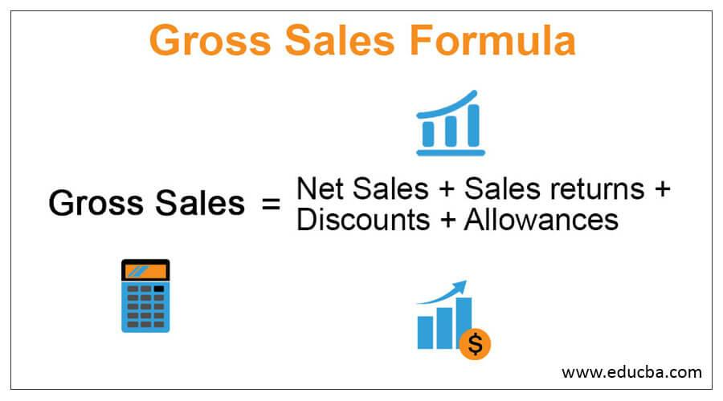

## Table of Contents

## What is gross sales?

Gross sales is the total amount of money a business makes from selling its products or services before any costs or discounts are taken away. It's like the starting point for figuring out how well a business is doing. If a store sells 100 shirts at $10 each, the gross sales would be $1,000.

This number is important because it shows the total revenue before any expenses like taxes, returns, or discounts are subtracted. Businesses use gross sales to understand their overall performance and to plan for the future. It's a key piece of information that helps them see how much money is coming in before they start looking at what they have to pay out.

## How do you calculate gross sales?

To calculate gross sales, you just add up all the money you made from selling your products or services. If you sold 50 hats at $20 each, you would multiply 50 by $20 to get your gross sales, which would be $1,000. It's that simple - you're just looking at the total money coming in before you start thinking about any costs or discounts.

This number is important because it shows you the starting point of your business's earnings. It doesn't take away any money for things like returns, discounts, or taxes. So, if you want to know how much money your business made before any expenses, gross sales is the number you need to look at.

## Can you provide a simple example of gross sales calculation?

Let's say you own a small bakery and you sold 30 cakes in a day. Each cake was sold for $15. To find your gross sales for the day, you would multiply the number of cakes sold by the price per cake. So, 30 cakes times $15 each equals $450. That $450 is your gross sales for the day.

Gross sales is just the total money you made before you start taking away costs like ingredients or rent. It's like the first step in seeing how your business is doing. If you want to know how much money came into your bakery before you paid for anything, you look at the gross sales number.

## What is the difference between gross sales and net sales?

Gross sales and net sales are two important numbers that businesses look at, but they show different things. Gross sales is the total money a business makes from selling its products or services before taking away any costs or discounts. It's like the starting point of your earnings. For example, if you sold 100 T-shirts at $10 each, your gross sales would be $1,000.

Net sales, on the other hand, is what you get after you subtract things like returns, discounts, and allowances from your gross sales. It's the money you actually keep after giving back some of it. Using the same example, if 10 of those T-shirts were returned and you gave a $1 discount on each of the remaining 90 shirts, your net sales would be lower than your gross sales. After subtracting the $100 from returns and $90 from discounts, your net sales would be $810. This number is important because it shows you the real money you made after all the adjustments.

## How does gross sales impact a company's financial statements?

Gross sales is an important number that shows up on a company's financial statements. It's the total money a company makes from selling its products or services before taking away any costs or discounts. You can find gross sales on the income statement, which is like a report card that shows how much money a business made and spent over a certain time. Gross sales is usually one of the first numbers you see on the income statement because it's the starting point for figuring out how well the business is doing.

Gross sales helps businesses and people who look at the financial statements understand the overall performance of the company. It shows how much money is coming in before any expenses are subtracted, so it gives a clear picture of the company's sales activity. However, gross sales alone doesn't tell the whole story. To get a better idea of the company's financial health, you need to look at other numbers like net sales and net income, which take into account things like returns, discounts, and costs. But gross sales is a key piece of information that helps set the stage for understanding the company's financial situation.

## What are common mistakes to avoid when calculating gross sales?

When calculating gross sales, one common mistake is mixing up gross sales with net sales. Gross sales is the total money you make from selling your stuff before taking away any costs or discounts. Net sales is what you get after you subtract things like returns and discounts. If you mix these up, you might think you made more or less money than you really did. So, always remember that gross sales is just the starting point - it's all the money you made before any adjustments.

Another mistake to avoid is not including all your sales. Sometimes, people forget to count sales from different places or sales that happened at different times. If you run a business with multiple locations or you sell things online and in a store, make sure you add up all the sales from every place. Gross sales should include every penny you made from selling your products or services, no matter where or when the sale happened. Keeping track of everything helps you get an accurate picture of your business's performance.

## How can gross sales be used to analyze business performance?

Gross sales is a key number that businesses use to see how well they are doing. It shows the total money a business makes from selling its products or services before any costs or discounts are taken away. By looking at gross sales, a business can understand how much money is coming in from sales alone. This helps them see if their sales are growing or if they need to make changes to sell more. For example, if a store's gross sales go up over time, it might mean that more people are buying their stuff, which is a good sign.

Gross sales can also be compared to past numbers to see trends. If a company looks at its gross sales from last year and sees that this year's numbers are higher, it might mean the business is doing better. On the other hand, if gross sales are going down, the business might need to figure out why and make some changes. By keeping an eye on gross sales, a business can make smart decisions about things like pricing, marketing, and expanding to new places. It's like a first look at how the business is doing before looking at all the other costs and expenses.

## What role do returns and allowances play in gross sales?

Returns and allowances don't directly affect gross sales. Gross sales is just the total money a business makes from selling its stuff before taking away any costs or discounts. So, if a store sold 100 hats at $10 each, the gross sales would be $1,000, no matter if some hats were returned later.

But returns and allowances do come into play when you want to figure out net sales. Net sales is what you get after you subtract things like returns and allowances from your gross sales. If 10 of those hats were returned and you gave a $1 discount on each of the remaining 90 hats, your net sales would be lower than your gross sales. After taking away the $100 from returns and $90 from discounts, your net sales would be $810. So, while returns and allowances don't change your gross sales, they do affect the money you actually keep after all the adjustments.

## How do seasonal trends affect gross sales figures?

Seasonal trends can really change how much money a business makes from selling things, which is called gross sales. For example, if you sell ice cream, you might see your gross sales go up a lot during the summer because more people want to buy ice cream when it's hot. But in the winter, your gross sales might go down because fewer people are thinking about ice cream when it's cold outside. So, understanding seasonal trends helps businesses know when they might make more or less money from sales.

Businesses can use this information to plan better. If they know their gross sales go up during certain times of the year, they can make sure they have enough stuff to sell and maybe even run special sales or promotions to make even more money. On the other hand, if they know their gross sales go down during other times, they can plan to spend less money or find other ways to bring in more sales. By looking at how seasonal trends affect their gross sales, businesses can make smarter decisions to keep their money coming in steady all year long.

## What advanced metrics can be derived from gross sales data?

Gross sales data can be used to figure out some important numbers that help businesses understand how they're doing. One of these numbers is the gross profit margin, which shows how much money a business keeps after paying for the things it sells. To find the gross profit margin, you take the gross sales and subtract the cost of goods sold, then divide that by the gross sales and multiply by 100 to get a percentage. This number tells a business if it's making enough money from selling its stuff to cover the costs of making or buying it.

Another important number is the sales growth rate, which shows if a business is selling more over time. To find this, you take the gross sales from this period and subtract the gross sales from the last period, then divide that by the gross sales from the last period and multiply by 100. This gives you a percentage that tells you if your sales are going up or down. Knowing the sales growth rate helps businesses see if they're doing better than before and plan for the future.

## How do different industries calculate and interpret gross sales differently?

Different industries might calculate and interpret gross sales in their own way because of how they work and what they sell. For example, in the retail industry, gross sales are usually the total money made from selling things in stores or online before any discounts or returns. Retail businesses look at gross sales to see how well they're doing at selling their products and to plan for things like how much stuff to buy for the next season. But in the service industry, like restaurants or hotels, gross sales might include the money made from services like meals or room bookings. They might use gross sales to understand how busy they are and if they need to change their prices or add new services.

In the manufacturing industry, gross sales can be a bit more complicated. They might include the money made from selling the things they make, but they also have to think about the cost of making those things. So, they might use gross sales to figure out if they're making enough money to cover the costs of production and still have some left over. Each industry has its own way of looking at gross sales because what they sell and how they sell it can be very different. But no matter the industry, gross sales is always the starting point for understanding how much money is coming in before any other costs are taken away.

## What are some case studies of companies using gross sales effectively for strategic decisions?

A well-known case is how Walmart uses gross sales to make smart choices about where to open new stores. They look at how much money they make from selling things in different places. If they see that gross sales are high in a certain area, they might decide to open a new store there. This helps them grow their business and make more money. By understanding their gross sales, Walmart can plan where to go next and make sure they're selling in places where people want to buy their stuff.

Another example is how Apple uses gross sales to decide when to launch new products. They keep track of how much money they make from selling their current products. If they see that gross sales are starting to go down for an older product, they might decide it's time to release a new one. This helps them keep their sales numbers up and stay ahead of other companies. By looking at their gross sales, Apple can figure out the best time to bring out new phones, computers, or other gadgets.

## What is Understanding Gross Sales?

Gross sales represent the total revenue a company generates from its products or services without deductions for returns, allowances, or discounts. It differs from net sales, which subtracts these deductions from the gross figure. Gross sales are calculated using the formula:

$$
\text{Gross Sales} = \text{Total Units Sold} \times \text{Price Per Unit}
$$

For example, if a company sells 1,000 units of a product priced at $50 each, the gross sales would be $50,000.

Components of gross sales calculations include all sales transactions prior to any adjustments for customer returns, promotional discounts, or allowances for damaged goods. These components ensure that gross sales provide a comprehensive snapshot of a company's total revenue-generating activities.

Gross sales are a critical metric for businesses as it reflects the company's market activity and potential revenue streams. It serves as a foundational element for further financial analysis, such as calculating net sales, profit margins, and determining break-even points. Additionally, gross sales are often used to compare a company's performance across different periods or against competitors.

Industries such as retail, manufacturing, and hospitality frequently utilize gross sales metrics. For instance, a retail business may calculate gross sales to gauge its overall success during a holiday season, while a manufacturing company may assess gross sales to evaluate the demand for its products in various regions.

Common pitfalls in gross sales calculations include failing to accurately track all sales transactions, omitting certain revenue streams, and incorrectly handling sales adjustments. These errors can lead to an overestimation or underestimation of gross sales, skewing the company's financial analysis and decision-making processes. Ensuring robust data collection and verification systems is essential in maintaining the integrity of gross sales calculations.

## References & Further Reading

[1]: Bergstra, J., Bardenet, R., Bengio, Y., & Kégl, B. (2011). ["Algorithms for Hyper-Parameter Optimization."](https://papers.nips.cc/paper/4443-algorithms-for-hyper-parameter-optimization) Advances in Neural Information Processing Systems 24.

[2]: ["Advances in Financial Machine Learning"](https://www.amazon.com/Advances-Financial-Machine-Learning-Marcos/dp/1119482089) by Marcos Lopez de Prado

[3]: ["Evidence-Based Technical Analysis: Applying the Scientific Method and Statistical Inference to Trading Signals"](https://www.amazon.com/Evidence-Based-Technical-Analysis-Scientific-Statistical/dp/0470008741) by David Aronson

[4]: ["Machine Learning for Algorithmic Trading"](https://github.com/stefan-jansen/machine-learning-for-trading) by Stefan Jansen

[5]: ["Quantitative Trading: How to Build Your Own Algorithmic Trading Business"](https://www.amazon.com/Quantitative-Trading-Build-Algorithmic-Business/dp/1119800064) by Ernest P. Chan