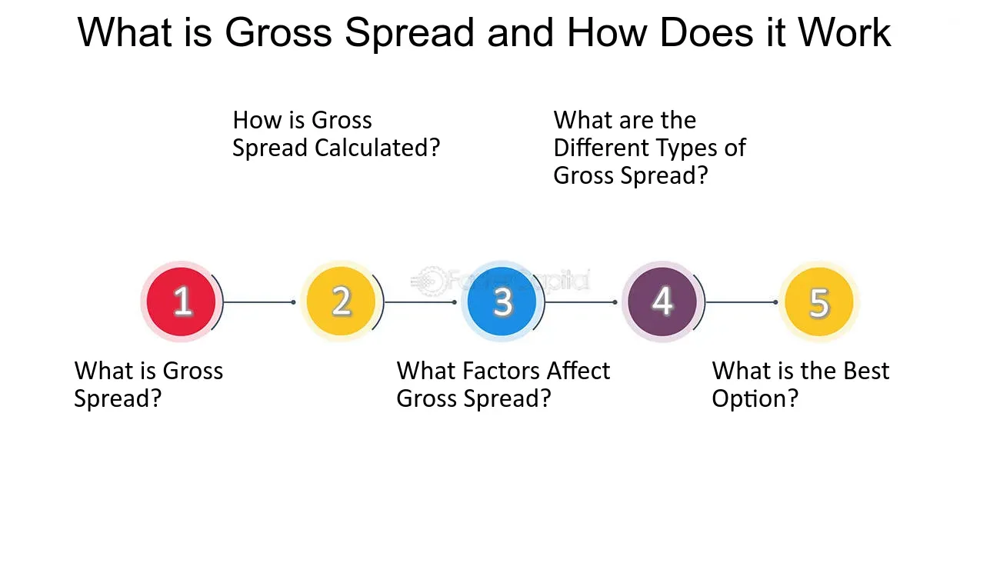

## Table of Contents

## What is the gross spread in financial markets?

The gross spread in financial markets refers to the difference between the price at which an investment bank buys securities from an issuer and the price at which it sells those securities to investors. This spread is essentially the bank's profit margin for underwriting and distributing the securities. For example, if a bank buys bonds from a company at $99 per bond and sells them to investors at $100 per bond, the gross spread is $1 per bond.

This concept is important because it helps cover the costs and risks the bank takes on during the underwriting process. These costs can include due diligence, marketing, and legal fees. The gross spread also compensates the bank for the risk of holding the securities temporarily before they are sold to investors. Understanding the gross spread is crucial for both issuers, who want to minimize their costs, and investors, who want to know how much of their investment goes towards the bank's fees rather than the actual security.

## How is the gross spread calculated?

The gross spread is calculated by finding the difference between the price at which the investment bank buys securities from the issuer and the price at which it sells those securities to investors. For example, if the bank buys bonds at $99 each and sells them at $100 each, the gross spread is $1 per bond. This simple calculation shows how much money the bank makes from each security it underwrites.

This spread is important because it helps the bank cover its costs and risks. When a bank underwrites securities, it has to do a lot of work like checking the company's finances, marketing the securities, and paying for legal fees. The gross spread helps pay for all these things. It also gives the bank some money to make up for the risk of holding the securities for a short time before selling them to investors.

## What are the components of the gross spread?

The gross spread in financial markets is made up of several parts. The main part is the management fee, which is what the investment bank charges for managing the whole process of selling the securities. Another part is the underwriting fee, which is what the bank charges for taking on the risk of buying the securities from the issuer and then trying to sell them to investors. 

There's also the selling concession, which is the money that the bank gives to the brokers and dealers who actually sell the securities to the public. Sometimes, there's a small extra fee called the reallowance fee, which is given to other brokers who help sell the securities but aren't part of the main selling group. All these parts together make up the gross spread, which is the total profit the bank makes from the deal.

## Why is the gross spread important in underwriting?

The gross spread is important in underwriting because it's how investment banks make money from helping companies sell securities. When a bank agrees to underwrite securities, it buys them from the company at a lower price and then sells them to investors at a higher price. The difference between these two prices is the gross spread, which is the bank's profit. This money helps the bank pay for all the work it does, like checking the company's finances, marketing the securities, and covering legal costs.

The gross spread also helps the bank manage the risk of holding the securities for a short time before selling them. If the bank can't sell all the securities, it might lose money. The gross spread gives the bank a cushion to cover these risks. For companies issuing securities, understanding the gross spread is important because it affects how much money they get from the sale. For investors, knowing the gross spread helps them see how much of their investment goes to the bank's fees instead of the actual security.

## How does the gross spread differ from the net spread?

The gross spread and the net spread are two different ways to look at the money made from selling securities. The gross spread is the total difference between the price the investment bank pays to buy securities from a company and the price it sells those securities to investors. This includes all the fees the bank charges, like the management fee for running the sale, the underwriting fee for taking on the risk, and the selling concession for brokers who help sell the securities.

The net spread is what's left after the bank pays all its costs. These costs can include things like legal fees, printing costs for the securities, and other expenses related to the sale. So, the net spread is the gross spread minus all these costs. It shows the actual profit the bank makes from the deal, after everything is paid for.

## Can you explain the role of the gross spread in initial public offerings (IPOs)?

In an initial public offering (IPO), the gross spread is really important because it's how the investment bank makes money. When a company wants to go public, it hires an investment bank to help sell its shares to the public. The bank buys the shares from the company at a certain price and then sells them to investors at a higher price. The difference between these two prices is the gross spread. This money helps the bank pay for all the work it does, like checking the company's finances, marketing the IPO, and covering legal costs.

The gross spread also matters because it affects how much money the company gets from the IPO. If the gross spread is high, the company gets less money because more of the money from selling the shares goes to the bank. For investors, knowing the gross spread is helpful because it shows how much of their money is going to the bank's fees instead of the company. So, the gross spread is a big part of making sure everyone understands how much money is moving around in an IPO.

## What factors influence the size of the gross spread?

The size of the gross spread in an IPO or any securities offering can be affected by many things. One big thing is how much risk the investment bank is taking. If the bank thinks it might be hard to sell the securities, it might want a bigger gross spread to cover that risk. Another thing is how much work the bank has to do. If the company's finances are complicated or if the bank has to do a lot of marketing, it might charge more. The size of the company and how well-known it is can also make a difference. Big, well-known companies might get lower gross spreads because they are easier to sell.

Also, the market conditions at the time of the offering play a big role. If the stock market is doing well and investors are eager to buy, the gross spread might be smaller because it's easier for the bank to sell the securities. On the other hand, if the market is not doing so well, the bank might want a bigger gross spread to make up for the extra risk. Competition among investment banks can also affect the gross spread. If there are a lot of banks trying to win the business, they might offer lower gross spreads to attract the company.

## How does the gross spread impact the pricing of securities?

The gross spread plays a big role in deciding how much securities will cost. When a bank helps a company sell securities, it buys them at a lower price and sells them at a higher price. The difference between these two prices is the gross spread. If the gross spread is big, the price that investors pay for the securities will be higher. This means the company gets less money because more of the money goes to the bank. So, the gross spread directly affects how much the securities cost and how much money the company gets from selling them.

The size of the gross spread can also change depending on different things. If the bank thinks it will be hard to sell the securities, it might want a bigger gross spread to cover the risk. Also, if the market is doing well and investors want to buy, the gross spread might be smaller because it's easier to sell the securities. But if the market is not doing so well, the bank might want a bigger gross spread to make up for the extra risk. All these factors help decide the final price of the securities and how much the gross spread will be.

## What are the typical ranges for gross spreads in different types of securities?

Gross spreads can be different for different types of securities. For stocks, like in an initial public offering (IPO), the gross spread is usually between 6% and 7% of the total money raised. This means if a company wants to raise $100 million, the bank might keep $6 million to $7 million as its fee. But, this can change. For big, well-known companies, the gross spread might be less, maybe around 3% to 5%. For smaller or riskier companies, it might be more, sometimes up to 10%.

For bonds, the gross spread is usually smaller than for stocks. It can be anywhere from 0.5% to 2% of the total money raised. This means if a company is selling $100 million in bonds, the bank might keep $500,000 to $2 million as its fee. The size of the gross spread for bonds can depend on things like how much risk the bank is taking and how easy it is to sell the bonds. For example, if the bonds are hard to sell, the gross spread might be on the higher side of the range.

## How do regulatory environments affect the gross spread?

Regulatory environments can have a big impact on the gross spread. When rules and laws are strict, banks might have to do more work to make sure they follow all the regulations. This extra work can make the gross spread bigger because the banks need more money to cover their costs. Also, if the rules make it harder for banks to sell securities, they might want a bigger gross spread to cover the extra risk. So, the rules set by governments and financial watchdogs can change how much money banks make from underwriting.

In some places, there are rules that try to keep gross spreads fair. These rules might say that banks can't charge too much for their services. This can make the gross spread smaller because banks have to follow these rules. But, in other places, there might not be as many rules, so banks might be able to charge more. The way regulations work can be different in each country, so the gross spread can be different too. This means that where a company is selling its securities can affect how much money the bank makes from the deal.

## What strategies can issuers use to negotiate a lower gross spread?

Issuers can try to get a lower gross spread by shopping around and talking to different banks. If they can find a few banks that want to help them sell their securities, the banks might offer a lower gross spread to win the business. Issuers can also use their size and how well-known they are to their advantage. Big, famous companies might be able to get a better deal because banks know it will be easier to sell their securities.

Another way issuers can negotiate a lower gross spread is by doing some of the work themselves. For example, if the issuer can handle some of the marketing or legal work, the bank might not need to charge as much. Issuers can also look at what other companies in their industry are paying for gross spreads. If they can show that other companies are getting lower gross spreads, they might be able to ask for the same. By using these strategies, issuers can try to keep more of the money they raise from selling securities.

## How has the gross spread evolved over time, and what future trends might we expect?

Over the years, the gross spread has changed a lot. In the past, gross spreads were usually bigger because there were fewer banks and less competition. But as more banks started offering underwriting services, they began to compete more, and gross spreads got smaller. Also, technology has made it easier for banks to sell securities, so they don't need as much money to cover their costs. This has helped push gross spreads down even more. For example, in the 1990s, gross spreads for IPOs were often around 7%, but now they can be as low as 3% to 5% for big companies.

In the future, we might see gross spreads keep getting smaller. As technology keeps getting better, it could make the process of selling securities even easier and cheaper for banks. Also, if more rules are put in place to keep gross spreads fair, that could help lower them too. But, if the market gets riskier or if there are big changes in the economy, banks might want bigger gross spreads to cover their risks. So, while we might see smaller gross spreads in the future, a lot depends on what happens with technology, rules, and the economy.

## References & Further Reading

[1]: Ritter, J. R. (2003). ["Investment Banking and Securities Issuance"](https://www.sciencedirect.com/science/article/pii/S1574010203010094). Handbook of the Economics of Finance.

[2]: Hasbrouck, J. (2007). ["Empirical Market Microstructure: The Institutions, Economics, and Econometrics of Securities Trading"](https://academic.oup.com/book/52241). Oxford University Press.

[3]: De Prado, M. L. (2018). ["Advances in Financial Machine Learning"](https://www.amazon.com/Advances-Financial-Machine-Learning-Marcos/dp/1119482089). Wiley.

[4]: Johnson, B., & Levin, M. (2009). ["Algorithmic and High-Frequency Trading"](https://assets.cambridge.org/97811070/91146/frontmatter/9781107091146_frontmatter.pdf). Taylor & Francis Group.

[5]: Chan, E. (2008). ["Quantitative Trading: How to Build Your Own Algorithmic Trading Business"](https://github.com/ftvision/quant_trading_echan_book). Wiley.