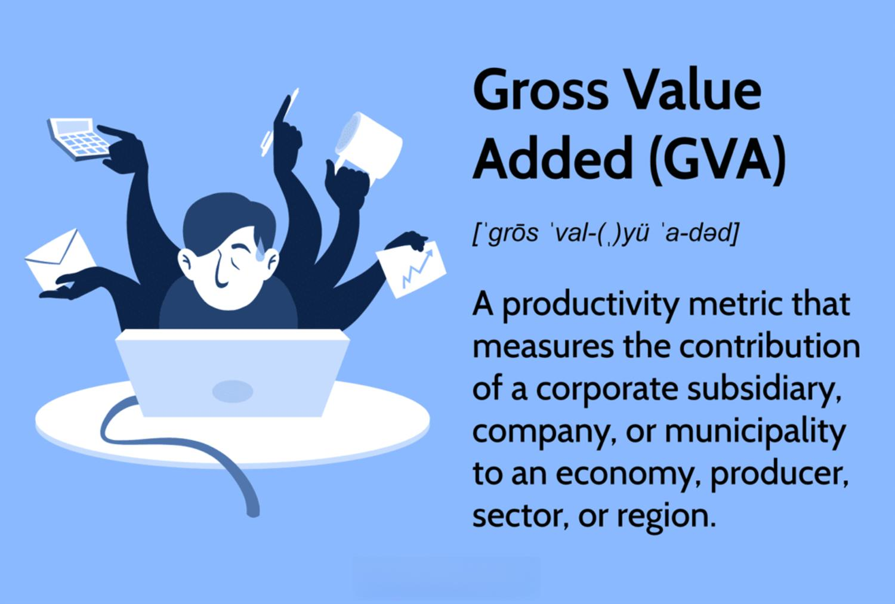

In the ever-evolving world of finance and economics, staying updated with key economic indicators is crucial for traders and investors. Gross Value Added (GVA) is one such economic indicator that has gained immense significance in recent years. GVA serves as a vital measure of an economy's output and provides insights into the value generated by various sectors, enabling stakeholders to assess economic performance at a more granular level. This metric is particularly useful for understanding the productivity and contribution of specific industries or regions within a nation, thereby offering a nuanced perspective beyond traditional indicators like Gross Domestic Product (GDP).

This article aims to provide a comprehensive understanding of the Gross Value Added (GVA) economic indicator and its application in algorithmic trading. Algorithmic trading, which involves the use of advanced computer systems and pre-defined algorithms to execute trades, has increasingly incorporated GVA to refine strategies and enhance decision-making processes. By integrating GVA data, traders gain a clearer picture of economic conditions, allowing them to better predict market movements and optimize investment selections.



Moreover, the increasing complexity of financial markets necessitates the use of sophisticated metrics to stay competitive. As a more precise indicator that adjusts GDP by accounting for taxes and subsidies, GVA offers advantages that make it an essential component in the toolkit of modern financial analysts and traders. Advanced metrics like GVA help in constructing robust, data-driven trading models that can adapt to volatile market conditions.

Understanding how GVA operates and its value in economic analysis is key for anyone involved in finance and trading. By using GVA as a parameter in trading algorithms, investors can develop more effective strategies that anticipate economic trends and sectoral shifts, maximizing returns and minimizing risks. As we explore the intricacies and applications of GVA in the context of algorithmic trading, the synergy between economic indicators and technology emerges as a catalyst for innovation and strategic advantage in the financial markets.

## Table of Contents

## What is Gross Value Added (GVA)?

Gross Value Added (GVA) is an essential economic metric that quantifies the contribution of a particular entity, such as a corporation, industry, or geographic region, to the overall economy. It serves as a vital measure of productivity by evaluating the value generated by the production of goods and services within a particular scope, while accounting for the costs related to inputs and raw materials involved in this production process.

To compute the Gross Value Added, the formula utilized is:

$$
\text{GVA} = \text{Output} - \text{Intermediate Consumption}
$$

In this formula, "Output" refers to the total value produced by an organization or sector, while "Intermediate Consumption" encompasses the cost of goods and services consumed as inputs in the production process. This equation underscores the economic contributions that are retained as value-added within the economy, thereby excluding the value passed on as input costs.

Gross Value Added plays a pivotal role in refining the Gross Domestic Product (GDP) figures by adjusting for any subsidies and taxes associated with the production of goods and services. This adjusted measure:

$$
\text{GVA} = \text{GDP} + \text{Subsidies on Products} - \text{Taxes on Products}
$$

Here, subsidies on products provide financial assistance aimed at reducing costs for producers or consumers, while taxes on products can drive up the cost and thereby affect the final economic output. By incorporating these elements, GVA provides a more nuanced indicator compared to GDP, which merely aggregates all economic activity without these adjustments.

The significance of GVA lies in its ability to offer detailed insights into productivity levels across various sectors of the economy. While GDP provides a broad, overarching view of economic performance, GVA allows for a granular analysis of economic contributions at a more focused level—be it by sector, company, or region. This level of detail facilitates a better understanding of which segments of the economy are driving growth or exhibiting efficiency, thus enabling more informed decision-making and policy formulation. GVA, by offering a clearer picture of economic activity, is instrumental for policymakers, businesses, and economists aiming to optimize resources and enhance productivity across different sectors.

## Formula and Calculation of GVA

Gross Value Added (GVA) serves as a critical economic metric that reflects the true economic output by adjusting Gross Domestic Product (GDP) with considerations for product-related taxes and subsidies. The formula to calculate GVA is expressed as:

$$
\text{GVA} = \text{GDP} + \text{SP} - \text{TP}
$$

Where:
- **GDP** represents the Gross Domestic Product,
- **SP** (Subsidies on Products) are government financial supports that help lower the production cost,
- **TP** (Taxes on Products) are taxes imposed on goods and services.

The consideration of taxes and subsidies allows GVA to provide a refined economic metric that offers a true reflection of economic productivity by adjusting the aggregate GDP figure. This nuanced approach addresses the limitations of GDP, which does not differentiate the impact of tax policies and subsidies on economic activity.

Calculating GVA requires a comprehensive understanding of its components, including gross output, intermediate consumption, and net output. Gross output refers to the total value of goods and services produced by an entity. Intermediate consumption represents the value of services and goods consumed as inputs minus any taxes. Net output, therefore, reflects the actual economic value added, demonstrating the entity's productivity.

For example, consider a fictional country where GDP is calculated by aggregating private consumption, gross and government investment, government spending, and net exports. Suppose private consumption accounts for $500 billion, gross investment is $150 billion, and government spending is $200 billion, while exports are valued at $100 billion, and imports are $50 billion, resulting in a net export value of $50 billion. Thus, GDP is:

$$
\text{GDP} = (\text{Private Consumption} + \text{Gross Investment} + \text{Government Spending} + \text{Net Exports})
$$
$$
\text{GDP} = \$500\text{B} + \$150\text{B} + \$200\text{B} + \$50\text{B} = \$900\text{B}
$$

If subsidies provided are $20 billion and taxes on products are $30 billion, GVA will be calculated as:

$$
\text{GVA} = \$900\text{B} + \$20\text{B} - \$30\text{B} = \$890\text{B}
$$

This example illustrates how adjustments for taxes and subsidies culminate in GVA, yielding insightful data on the added value exacted from production activities beyond the GDP's aggregate measure. By focusing on these finer details, GVA allows policymakers and economists to grasp a more precise picture of the economic output's genuine productivity.

## Importance of GVA in Economic Analysis

Gross Value Added (GVA) is an essential metric for refining the Gross Domestic Product (GDP), and its significance in economic analysis cannot be understated. By adjusting GDP to focus on the net output of various economic units, GVA provides a clearer and more detailed picture of economic health and productivity.

GVA serves as a critical tool for isolating the contributions of individual sectors, companies, or regions within the broader economy. This granularity is invaluable for policymakers and analysts who need to identify which segments are driving growth or experiencing decline. As opposed to the aggregated perspective offered by GDP, GVA enables a nuanced analysis of productivity, revealing areas where efficiencies can be realized or enhanced.

For businesses, GVA is instrumental in assessing the profitability impact of their products or services. By understanding the value added by each component of their operations, firms can better strategize their market presence and optimize resources. This is especially vital when analyzing regional variations in market performance, as GVA allows businesses to tailor their strategies according to regional economic conditions.

On a larger economic scale, GVA contributes to the formulation of monetary and fiscal policies aimed at sustainable economic development. By providing insights into net contributions across various economic units, GVA helps in pinpointing where government intervention might be necessary, whether through investment, subsidies, or regulatory adjustments. Policymakers can thus craft more effective economic strategies that promote balanced growth and development.

In summary, GVA stands as a cornerstone of economic analysis, offering detailed insights into economic productivity and facilitating informed decision-making across both micro and macroeconomic levels.

## GVA and Its Role in Algorithmic Trading

Algorithmic trading, known for its speed and precision, increasingly incorporates economic indicators, such as Gross Value Added (GVA), to improve investment outcomes. GVA provides insightful data that can enhance the decision-making frameworks utilized in [algorithmic trading](/wiki/algorithmic-trading) by offering a refined measure of economic productivity.

GVA serves as a significant input in algorithmic trading strategies by helping traders predict market trends and economic transitions. By analyzing changes in GVA, trading algorithms can forecast economic shifts with higher accuracy, allowing traders to make more informed and timely decisions. For example, if a national economy exhibits a consistent rise in GVA, it may indicate robust economic health and potential growth in the equities market. Conversely, a decline could signal an economic downturn, leading to adjustments in trading strategies, such as short selling or capital reallocation to safer assets.

To effectively use GVA in algorithmic trading, advanced algorithms integrate this metric to evaluate sectoral performance. By dissecting GVA contributions across different economic sectors, algorithms can identify lucrative investment opportunities or potential risks. For traders focused on sector-specific investments, analyzing GVA enables the identification of high-performing sectors, thereby optimizing portfolio allocation. Python libraries such as pandas and scikit-learn can be employed to perform data analysis and predictive modeling based on GVA trends:

```python
import pandas as pd
from sklearn.linear_model import LinearRegression

# Sample data loading
df = pd.read_csv('gva_sector_data.csv')
x = df[['Year']]
y = df[['GVA']]

# Creating and training the model
model = LinearRegression().fit(x, y)

# Predicting future values
future_years = pd.DataFrame({'Year': [2023, 2024]})
predictions = model.predict(future_years)
```

Incorporating GVA data into algorithmic trading systems enhances predictive analytics, refining the accuracy of market models and trading signals. The utilization of GVA improves the algorithms' ability to reflect real-time economic conditions, thereby minimizing risks associated with unexpected market movements.

Financial institutions also leverage GVA metrics to evaluate economic health, forming strategic insights that optimize portfolio returns. By interpreting GVA data, these institutions can adjust their investment strategies in response to macroeconomic indicators, thereby maintaining resilient and adaptive portfolios. The effective application of GVA in trading systems allows for dynamic strategy adjustments, driving longer-term investment success in today's volatile financial landscape.

## Practical Applications and Case Studies

Gross Value Added (GVA) has gradually been integrated into trading algorithms, offering a sophisticated approach to assessing economic activities and predicting market movements. The application of GVA in algorithmic trading is gaining traction, with several case studies highlighting its efficacy in different market conditions.

One notable example is the utilization of GVA in quantitative hedge funds. These funds have incorporated GVA indicators to enhance their algorithmic models. By analyzing GVA data, the funds have been able to identify sectorial strengths and weaknesses, adjusting their portfolios to optimize returns. This approach was particularly beneficial during periods of economic [volatility](/wiki/volatility-trading-strategies), where traditional indicators failed to provide early warnings of market shifts. GVA provided a more granular view of economic contributions, invaluable for fine-tuning investment strategies.

However, the integration of GVA into trading algorithms is not without challenges. One primary difficulty faced by traders is the time lag in GVA data availability, which may restrict its application in high-frequency trading environments. Additionally, interpreting GVA in conjunction with other economic indicators requires sophisticated models to ensure accuracy and reliability. Despite these challenges, the benefits often outweigh the downsides as GVA aids in uncovering hidden market opportunities and in improving the precision of trading models.

Sector-specific trading strategies have been particularly adept at leveraging GVA data. Industries such as manufacturing and services often exhibit diverse reactions to changes in GVA, allowing traders to differentiate between sectors that are poised for growth and those at risk. For instance, a rise in GVA in the technology sector can signal increased productivity and potential market leadership, prompting algorithmic trading systems to overweight in tech stocks. Conversely, a declining GVA in heavy industries may trigger a reduction in exposure, mitigating potential losses.

Lessons learned from these practical applications underscore the importance of aligning GVA data with other quantitative metrics. Successful implementation often requires an integrated approach, combining GVA with cutting-edge data analytics and [machine learning](/wiki/machine-learning) techniques. This integration can offer nuanced insights, enabling traders to adapt rapidly to evolving market dynamics.

The integration of GVA into trading platforms has spurred continuous innovation as traders seek to refine their algorithmic strategies. By learning from past implementations, market participants can enhance their predictive models, fostering more dynamic and responsive trading systems. As more financial institutions recognize the strategic advantages of using GVA, its role in shaping the future of algorithmic trading is expected to grow significantly.

## Conclusion

Gross Value Added (GVA) stands as a crucial economic indicator, offering a detailed lens through which to gauge an economy's productivity and contributions across various sectors. Its importance is underscored by its ability to hone in on sector-specific data, providing stakeholders with insights that are more refined than those offered by Gross Domestic Product (GDP) alone. As the financial markets evolve, integrating GVA into algorithmic trading systems not only aligns with contemporary demands but also confers substantial strategic advantages.

Algorithmic trading, characterized by its use of computer algorithms to execute trades at high speed and [volume](/wiki/volume-trading-strategy), thrives on the precision of inputs. Therefore, incorporating GVA into these systems enhances the robustness of trading algorithms. This integration facilitates informed decision-making by enabling traders to capture subtle economic shifts and sectoral performance, translating this data into predictive market activities. As a result, traders can expect more reliable and data-driven outcomes, boosting confidence and potentially increasing returns.

The partnership between economic indicators like GVA and advanced technological systems is reshaping the trading landscape. By infusing technology with such nuanced economic metrics, the precision and accuracy of trading models are significantly improved. This synergy allows for a more comprehensive analysis of market conditions and fosters the development of sophisticated trading strategies tailored to specific economic signals.

As the exploration of innovative trading methodologies continues, the significance and application of GVA are set to expand further. This expansion promises to offer new dimensions to economic analysis and enrich trading strategies with more refined and actionable insights. The ongoing enhancement of trading platforms to incorporate advanced metrics like GVA underlines its growing importance in the financial ecosystem, paving the way for more strategic and informed investment decisions in an increasingly complex global market.

## References & Further Reading

[1]: Stiglitz, J. E., Sen, A., & Fitoussi, J.-P. (2009). ["The Measurement of Economic Performance and Social Progress Revisited"](https://ec.europa.eu/eurostat/documents/8131721/8131772/Stiglitz-Sen-Fitoussi-Commission-report.pdf). The Commission on the Measurement of Economic Performance and Social Progress.

[2]: ["The Essential Guide to Machine Learning in Finance with Python"](https://www.datacamp.com/courses/machine-learning-for-finance-in-python) by Mohammad Hashemi & Ali Naderi Afooshteh

[3]: Sichel, D. E. (2013). ["An Introduction to Algorithmic Trading and Market Efficiency"](https://www.sciencedirect.com/science/article/pii/S1386418124000272). Finance and Economics Discussion Series.

[4]: ["Algorithmic and High-Frequency Trading"](https://www.cambridge.org/us/universitypress/subjects/mathematics/mathematical-finance/algorithmic-and-high-frequency-trading) by Álvaro Cartea, Sebastian Jaimungal, and José Penalva

[5]: OECD. (2020). ["Understanding National Accounts: Second Edition"](https://www.oecd-ilibrary.org/economics/understanding-national-accounts_9789264214637-en). Paris: OECD Publishing.