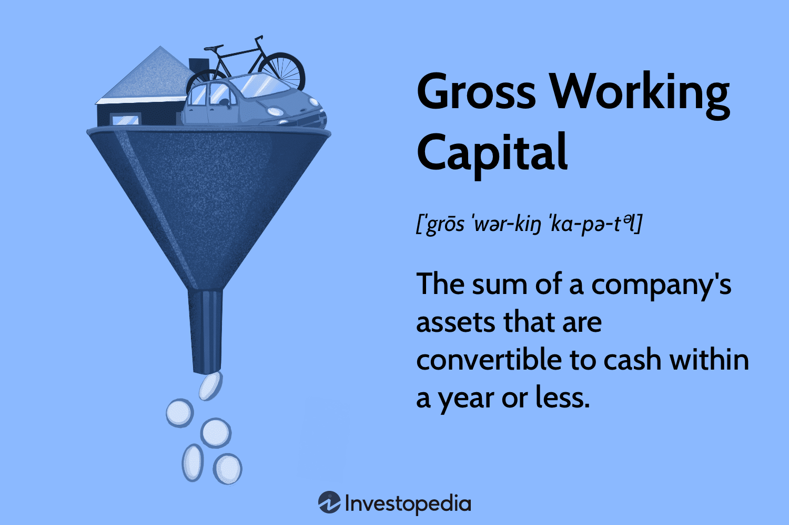

## Table of Contents

## What is Gross Working Capital?

Gross Working Capital is the total amount of money a company uses to run its day-to-day operations. This includes money spent on things like buying inventory, paying wages, and covering other short-term expenses. It's like the money a company keeps in its wallet to make sure it can keep the lights on and the business running smoothly.

Think of Gross Working Capital as the fuel that keeps the company's engine running. Without enough of it, a company might struggle to buy the things it needs to make its products or provide its services. It's important for a company to manage its Gross Working Capital carefully, making sure it has enough to cover all its short-term needs without tying up too much money that could be used for other investments.

## How is Gross Working Capital calculated?

Gross Working Capital is calculated by adding up all the current assets a company has. Current assets are things that can be turned into cash within a year. This includes cash itself, money in the bank, inventory (the stuff a company has to sell), and accounts receivable (money that customers owe the company for things they've already bought).

To find the total Gross Working Capital, you just need to look at the company's balance sheet and add up all these current assets. It's like making a list of all the money and things that can quickly be turned into money that the company has right now. This number tells you how much money the company has to work with in the short term, which is important for keeping the business running smoothly.

## What are the components of Gross Working Capital?

Gross Working Capital is made up of all the current assets a company has. These are things that can be turned into cash within a year. The main parts of Gross Working Capital are cash, which is the money the company has in its bank accounts, and money in the bank, which is similar but might be in different types of accounts. Another big part is inventory, which is all the stuff the company has to sell or use to make things to sell. 

Another important part of Gross Working Capital is accounts receivable. This is money that customers owe the company for things they've already bought but haven't paid for yet. Sometimes, Gross Working Capital can also include other things like short-term investments, which are investments that the company can sell quickly if it needs cash, and prepaid expenses, which are things the company has paid for in advance, like rent or insurance. All these parts together make up the Gross Working Capital, which is the money the company uses to keep running every day.

## Why is Gross Working Capital important for a business?

Gross Working Capital is important for a business because it helps the company pay for the things it needs every day. This includes buying inventory, paying employees, and covering other short-term costs. Without enough Gross Working Capital, a company might not be able to keep up with its day-to-day operations, which could lead to problems like running out of products to sell or not being able to pay bills on time.

Having the right amount of Gross Working Capital also helps a business stay flexible and ready for unexpected changes. If a company has enough money in its current assets, it can handle sudden expenses or take advantage of new opportunities without having to borrow money quickly. This makes the business stronger and more able to grow and succeed in the long run.

## How does Gross Working Capital differ from Net Working Capital?

Gross Working Capital and Net Working Capital are both important for understanding a company's financial health, but they look at different things. Gross Working Capital is all about the money a company has to run its daily operations. It includes all the current assets, like cash, inventory, and money that customers owe. It's like looking at how much money the company has in its pocket right now to keep things going.

Net Working Capital, on the other hand, is a bit different. It's calculated by taking the Gross Working Capital and then subtracting the company's current liabilities. Current liabilities are the bills and debts that need to be paid within a year, like loans or money owed to suppliers. So, Net Working Capital tells you not just how much money the company has, but also how much of that money is left after paying off what it owes in the short term. It gives a clearer picture of the company's ability to meet its short-term financial obligations.

## Can you provide an example of calculating Gross Working Capital?

Let's say we have a small bakery called "Sweet Treats." To find out the Gross Working Capital of Sweet Treats, we need to add up all the current assets the bakery has. Imagine Sweet Treats has $5,000 in cash, $3,000 worth of flour, sugar, and other baking supplies in inventory, and $2,000 in accounts receivable from customers who haven't paid yet. To calculate the Gross Working Capital, we simply add these amounts together: $5,000 (cash) + $3,000 (inventory) + $2,000 (accounts receivable) = $10,000. So, the Gross Working Capital of Sweet Treats is $10,000.

This $10,000 is the total amount of money Sweet Treats has to keep the bakery running every day. It's important for the bakery to have enough Gross Working Capital to buy more ingredients, pay the bakers, and cover other short-term costs. If Sweet Treats manages its Gross Working Capital well, it can keep making delicious treats and serving its customers without running into money problems.

## What are the advantages of focusing on Gross Working Capital?

Focusing on Gross Working Capital helps a business make sure it has enough money to keep running every day. It's like having enough cash in your wallet to buy groceries and pay the bills. If a company knows how much money it has in its current assets, it can plan better and make sure it doesn't run out of money for important things like buying inventory or paying employees. This helps the business stay stable and avoid problems that could come from not having enough money to cover daily costs.

Another advantage is that by keeping an eye on Gross Working Capital, a company can be ready for surprises. If something unexpected happens, like a sudden need to buy more supplies or a chance to take advantage of a new opportunity, the company can use its current assets to handle it without having to borrow money quickly. This makes the business more flexible and able to grow and succeed in the long run.

## What are the limitations of using Gross Working Capital as a financial metric?

Gross Working Capital is useful, but it only tells part of the story. It shows how much money a company has in its current assets, but it doesn't say anything about the debts the company needs to pay soon. If a company has a lot of Gross Working Capital but also a lot of bills to pay, it might still have trouble keeping up with its day-to-day costs. So, looking at Gross Working Capital alone can make a company seem healthier than it really is.

Another problem with Gross Working Capital is that it doesn't show how well a company is using its money. Just having a lot of cash or inventory doesn't mean a company is doing well. The company might be holding onto too much inventory that isn't selling, or it might have cash that could be better used for growing the business. So, while Gross Working Capital is important, it's not enough by itself to understand a company's financial health.

## How does Gross Working Capital impact a company's liquidity?

Gross Working Capital is all about the money a company has in its current assets, like cash, inventory, and money customers owe. This is important for a company's liquidity, which means how easily it can turn its assets into cash to pay for things it needs right away. If a company has a lot of Gross Working Capital, it's more likely to be able to pay its bills and keep running smoothly, because it has enough money to cover its short-term needs.

But, having a lot of Gross Working Capital doesn't always mean a company is in a good spot. If a lot of that money is tied up in inventory that isn't selling or in accounts receivable that customers are slow to pay, the company might still have trouble getting the cash it needs quickly. So, while Gross Working Capital is a big part of a company's liquidity, it's also important to look at how quickly the company can actually use that money to meet its needs.

## How can changes in Gross Working Capital affect a company's financial strategy?

Changes in Gross Working Capital can have a big impact on a company's financial strategy. If Gross Working Capital goes up, it means the company has more money in its current assets like cash, inventory, and money customers owe. This can give the company more room to grow or take advantage of new opportunities. For example, with more cash, the company might decide to buy more inventory to sell, invest in new equipment, or even expand to new locations. It's like having more money in your pocket, which lets you make more choices about what to do next.

On the other hand, if Gross Working Capital goes down, it can make things harder for the company. Less money in current assets might mean the company has to be more careful with its spending. It might need to cut back on buying new inventory, delay plans for growth, or even borrow money to cover its costs. This can make the company more focused on saving money and making sure it can pay its bills on time. So, keeping an eye on Gross Working Capital helps the company plan its financial moves wisely, whether that means growing or tightening the belt.

## What are the industry-specific considerations when analyzing Gross Working Capital?

Different industries have different needs when it comes to Gross Working Capital. For example, in the retail industry, a lot of money is tied up in inventory. Stores need to have enough products on hand to sell to customers, so they need more Gross Working Capital to buy and keep inventory. On the other hand, a service-based business like a consulting firm might not need as much inventory, but it still needs enough cash to pay its employees and cover other costs. So, when looking at Gross Working Capital in different industries, it's important to think about what each industry needs to keep running smoothly.

Another thing to consider is how quickly money moves in and out of a business in different industries. In the manufacturing industry, it can take a long time to turn raw materials into finished products and then sell them. This means manufacturers need more Gross Working Capital to cover the time it takes to make and sell their products. In contrast, a tech company might get paid faster because it can sell software or services online. Understanding these differences helps companies in each industry figure out how much Gross Working Capital they need to keep their business going without running into money problems.

## How do financial analysts use Gross Working Capital in conjunction with other metrics to assess a company's financial health?

Financial analysts use Gross Working Capital along with other metrics to get a full picture of a company's financial health. Gross Working Capital shows how much money a company has in its current assets, like cash, inventory, and money customers owe. But, analysts also look at Net Working Capital, which is Gross Working Capital minus the company's short-term debts. This helps them see if the company has enough money to pay its bills after taking care of its daily needs. By looking at both, analysts can tell if a company is in a good spot to keep running smoothly or if it might run into money problems.

Another important metric analysts use is the Current Ratio, which is Gross Working Capital divided by the company's current liabilities. This tells them how well the company can pay its short-term debts with its current assets. If the Current Ratio is high, it means the company has a lot of money to cover its bills, which is good. But if it's too high, it might mean the company is holding onto too much money that could be used for growing the business. So, by looking at Gross Working Capital together with other metrics like Net Working Capital and the Current Ratio, analysts can make better judgments about a company's financial health and plan for its future.

## What is the difference between Gross Working Capital and Net Working Capital?

Gross working capital is a financial metric that comprises the total current assets of a company. These current assets are items on the balance sheet that are expected to be converted to cash within a year, and they typically include cash and cash equivalents, accounts receivable, inventory, and other short-term assets. Understanding gross working capital is fundamental when assessing a company's [liquidity](/wiki/liquidity-risk-premium) profile, as it reflects the resources available to meet short-term commitments.

Net working capital (NWC) is calculated as the difference between current assets and current liabilities. Current liabilities are financial obligations the company needs to settle within a year, such as accounts payable, short-term debt, and other similar obligations. The formula for net working capital is:

$$
\text{Net Working Capital} = \text{Current Assets} - \text{Current Liabilities}
$$

Net working capital serves as an indicator of a company's short-term financial health. A positive NWC suggests that a company possesses sufficient short-term assets to cover its short-term liabilities, indicating strong operational efficiency and financial stability. Conversely, a negative NWC may signal potential liquidity issues, suggesting that a company might struggle to meet its short-term obligations.

Both gross and net working capital are critical for understanding a firm's operational efficiency and overall financial stability. Gross working capital provides insight into the liquidity available to finance day-to-day operations, while net working capital offers a more comprehensive view by considering liabilities. These metrics are pivotal for stakeholders, such as investors and financial analysts, who assess the financial well-being and risk profile of an enterprise. 

In conclusion, analyzing gross and net working capital is integral to evaluating a company's immediate financial position. These metrics inform strategic decision-making and resource allocation, with implications for company performance and risk management.

## What are the key metrics for algorithmic trading?

When evaluating [algorithmic trading](/wiki/algorithmic-trading) strategies, several key metrics are used to assess their effectiveness and risk profile. The Sharpe Ratio is one of the most common measures. It evaluates the risk-adjusted return by comparing the excess return of the strategy with its [volatility](/wiki/volatility-trading-strategies). Mathematically, it is expressed as:

$$
\text{Sharpe Ratio} = \frac{E[R] - R_f}{\sigma}
$$

where $E[R]$ is the expected return of the trading strategy, $R_f$ is the risk-free rate, and $\sigma$ is the standard deviation of the returns. A higher Sharpe Ratio indicates a more attractive risk-adjusted return.

Another critical metric is the Maximum Drawdown, which reveals the largest peak-to-trough decline over a specific period. This metric serves as a proxy for understanding the potential risk exposure an algorithmic strategy may face. It helps investors gauge the maximum loss they might endure before a new peak is achieved in the equity curve.

The Win Rate metric describes the percentage of trades that are profitable out of the total trades executed. Although a high Win Rate may appear beneficial, it should be considered alongside other metrics like the Profit Factor, which is the ratio of gross profit to gross loss:

$$
\text{Profit Factor} = \frac{\text{Gross Profit}}{\text{Gross Loss}}
$$

A Profit Factor greater than one signifies a profitable strategy, while a [factor](/wiki/factor-investing) below one indicates potential losses. The Average Trade metric is another important consideration, representing the average profit or loss generated per trade. This helps in assessing the profitability on a per-trade basis, identifying whether the strategy can reliably generate returns over time.

For implementing these metrics in Python, here is a simple code snippet to calculate the Sharpe Ratio:

```python
import numpy as np

def sharpe_ratio(returns, risk_free_rate):
    excess_returns = returns - risk_free_rate
    return np.mean(excess_returns) / np.std(excess_returns)

# Example usage
returns = np.array([0.02, 0.03, 0.015, 0.025, 0.01])
risk_free_rate = 0.01
print("Sharpe Ratio:", sharpe_ratio(returns, risk_free_rate))
```

In summary, understanding these key metrics allows traders and analysts to evaluate and optimize algorithmic trading strategies, balancing risk and returns effectively.

## References & Further Reading

[1]: Brealey, R. A., Myers, S. C., & Allen, F. (2019). ["Principles of Corporate Finance."](https://www.mheducation.com/highered/product/principles-corporate-finance-brealey-myers/M9781264080946.html) McGraw-Hill Education.

[2]: Damodaran, A. (2001). ["Corporate Finance: Theory and Practice."](https://www.amazon.com/Corporate-Finance-Practice-Aswath-Damodaran/dp/0471283320) Wiley.

[3]: Chan, E. P. (2009). ["Quantitative Trading: How to Build Your Own Algorithmic Trading Business."](https://github.com/ftvision/quant_trading_echan_book) Wiley.

[4]: Lopez de Prado, M. (2018). ["Advances in Financial Machine Learning."](https://www.amazon.com/Advances-Financial-Machine-Learning-Marcos/dp/1119482089) Wiley.

[5]: Jansen, S. (2020). ["Machine Learning for Algorithmic Trading."](https://github.com/stefan-jansen/machine-learning-for-trading) Packt Publishing.

[6]: Aronson, D. R. (2006). ["Evidence-Based Technical Analysis: Applying the Scientific Method and Statistical Inference to Trading Signals."](https://www.amazon.com/Evidence-Based-Technical-Analysis-Scientific-Statistical/dp/0470008741) Wiley.