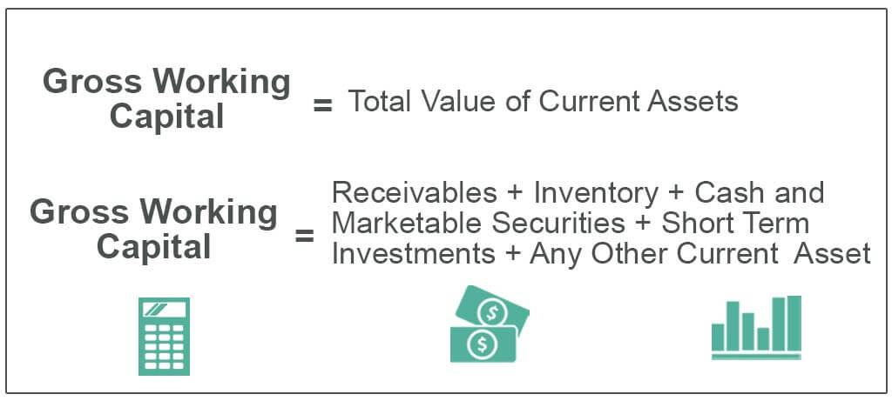

This article explores the interconnected realms of financial analysis, net working capital, gross working capital, and algorithmic trading, providing a comprehensive overview of their roles and significance in the financial sector. Understanding working capital is a fundamental aspect of assessing a company's short-term financial health. Working capital comprises two main components: gross working capital, which represents a firm's total current assets indicating its liquidity, and net working capital, defined as the difference between current assets and current liabilities, offering insights into a company's financial stability and efficiency in managing its short-term obligations.

As financial markets evolve, algorithmic trading emerges as a cutting-edge method for leveraging financial data, enabling traders to execute orders based on pre-defined criteria such as price, timing, and volume. These automated trading systems can process vast amounts of data at high speeds, minimizing human error, enhancing accuracy, and enabling more sophisticated and refined trading strategies. Algorithmic trading's ability to backtest strategies under historical market conditions presents opportunities for improving financial returns.



In this article, each topic will be examined in detail, highlighting their individual and collective importance within the financial industry. By synergizing the insights from financial analysis with advanced algorithmic trading techniques, organizations and investors can enhance their decision-making processes and optimize their financial outcomes.

## Table of Contents

## Understanding Financial Analysis

Financial analysis is a systematic approach to evaluating businesses, projects, budgets, and other finance-related entities, mainly to assess their performance and suitability for investment or other financial decisions. This process equips analysts, investors, and decision-makers with insights that aid in making informed choices based on quantitative and qualitative data.

The crux of financial analysis revolves around the interpretation of financial statements—documents that provide data on a company’s financial performance over a specific period. These include the balance sheet, income statement, and cash flow statement. By analyzing these documents, one can ascertain a company’s financial health, operational efficiency, profitability, and liquidity.

### Tools and Techniques in Financial Analysis

Financial analysts employ various tools and techniques to derive meaningful interpretations from financial data:

1. **Ratio Analysis**: This involves calculating ratios from financial statements to assess a company's performance. Common ratios include profitability ratios (e.g., return on equity, return on assets), liquidity ratios (e.g., current ratio, quick ratio), and solvency ratios (e.g., debt-to-equity ratio). For instance, the current ratio, calculated as Current Assets / Current Liabilities, measures a company's ability to cover its short-term obligations.

2. **Trend Analysis**: By examining financial data over multiple periods, analysts can identify trends in a company's performance. For instance, if a company's net income has been increasing consistently over several years, it might indicate growth and operational efficiency.

3. **Financial Modeling**: This technique involves constructing abstract mathematical models to simulate a company’s financial performance. Financial models are crucial for forecasting future financial outcomes based on historical data, assumptions, and financial indicators. A basic financial model might involve projecting future revenues based on historical growth rates and then estimating future expenses to arrive at projected profits.

### Importance of Financial Analysis

Financial analysis serves several important functions:

- **Investment Decisions**: Investors rely on financial analysis to determine the viability of investing in a particular company by evaluating its financial health and growth prospects.

- **Performance Evaluation**: Managers use financial analysis to measure their operational effectiveness and make improvements as necessary. It helps in setting realistic financial goals and tracking progress.

- **Risk Assessment**: By understanding the financial dynamics of a business, analysts can assess potential risks and uncertainties that could impact its performance. This is particularly crucial in volatile markets or during geopolitical instability.

In an era where data drives decision-making, financial analysis stands as a cornerstone of strategic planning and investment, ensuring that stakeholders have a comprehensive understanding of financial dynamics and potential outcomes.

## Gross Working Capital vs. Net Working Capital

Gross working capital is a financial metric that comprises the total current assets of a company. These current assets are items on the balance sheet that are expected to be converted to cash within a year, and they typically include cash and cash equivalents, accounts receivable, inventory, and other short-term assets. Understanding gross working capital is fundamental when assessing a company's [liquidity](/wiki/liquidity-risk-premium) profile, as it reflects the resources available to meet short-term commitments.

Net working capital (NWC) is calculated as the difference between current assets and current liabilities. Current liabilities are financial obligations the company needs to settle within a year, such as accounts payable, short-term debt, and other similar obligations. The formula for net working capital is:

$$
\text{Net Working Capital} = \text{Current Assets} - \text{Current Liabilities}
$$

Net working capital serves as an indicator of a company's short-term financial health. A positive NWC suggests that a company possesses sufficient short-term assets to cover its short-term liabilities, indicating strong operational efficiency and financial stability. Conversely, a negative NWC may signal potential liquidity issues, suggesting that a company might struggle to meet its short-term obligations.

Both gross and net working capital are critical for understanding a firm's operational efficiency and overall financial stability. Gross working capital provides insight into the liquidity available to finance day-to-day operations, while net working capital offers a more comprehensive view by considering liabilities. These metrics are pivotal for stakeholders, such as investors and financial analysts, who assess the financial well-being and risk profile of an enterprise. 

In conclusion, analyzing gross and net working capital is integral to evaluating a company's immediate financial position. These metrics inform strategic decision-making and resource allocation, with implications for company performance and risk management.

## The Role of Working Capital in Business

A company's working capital position is pivotal in indicating its ability to meet short-term obligations. Working capital, defined as the difference between current assets and current liabilities, provides insights into a company's liquidity and operational efficiency. Effective working capital management is essential for ensuring that a business can maintain smooth operations, sustain growth, and withstand financial uncertainties.

Efficient working capital management involves two primary objectives: ensuring the availability of cash flow to meet operational needs and safeguarding against unexpected expenses. This involves a strategic approach towards managing the company's receivables, payables, and inventory.

Managing receivables effectively minimizes the time taken to convert credit sales into cash. This is crucial for maintaining liquidity. Companies achieve this by implementing stringent credit policies and timely collection processes. On the other hand, managing payables involves optimizing the company's payment schedules to suppliers and creditors. By negotiating favorable payment terms, a business can maximize the use of its working capital.

Inventory management plays a critical role in working capital optimization. Holding excessive inventory ties up capital that could be deployed elsewhere in the business while insufficient inventory may lead to stockouts and lost sales. Techniques such as Just-In-Time (JIT) inventory systems can help in maintaining optimal inventory levels, thus freeing up cash.

In summary, a company's working capital position reflects its financial health and operational efficiency. Effective management of working capital enables a company to balance its income with its expenses, ensuring it can meet short-term commitments and invest in opportunities for long-term success.

## Enhancing Financial Strategies with Algorithmic Trading

Algorithmic trading, often referred to as algo trading, involves using computer algorithms to execute trading orders based on pre-defined criteria. These criteria may include price, timing, and [volume](/wiki/volume-trading-strategy), which are crucial for optimizing trading strategies. The primary advantage of [algorithmic trading](/wiki/algorithmic-trading) is its ability to execute trades with high speed and precision. This automation significantly reduces human error and bias, allowing traders to react swiftly to market changes.

High-frequency trading, a subset of algorithmic trading, capitalizes on this speed by executing hundreds or thousands of orders in milliseconds. Such rapid executions are impossible with manual trading, giving algo trading an edge in highly volatile markets.

An essential component of algorithmic trading is [backtesting](/wiki/backtesting). By running trading strategies through historical market data, traders can evaluate their effectiveness before applying them in real financial scenarios. Backtesting helps in identifying strategies that are robust and have the potential to perform well in future market conditions. A Python library like `[backtrader](/wiki/backtrader)` can be instrumental in facilitating this process:

```python
import backtrader as bt

class TestStrategy(bt.Strategy):
    def __init__(self):
        self.dataclose = self.datas[0].close

    def next(self):
        if not self.position:  # If not in position, we might want to buy
            if self.dataclose[0] < self.dataclose[-1]:  
                if self.dataclose[-1] < self.dataclose[-2]:  
                    self.buy()  # Enter long position

# Setup the tool with data and strategic overview
cerebro = bt.Cerebro()
cerebro.addstrategy(TestStrategy)

# Load data
data = bt.feeds.YahooFinanceData(dataname='AAPL', fromdate=datetime(2020, 1, 1),
                                 todate=datetime(2021, 1, 1))
cerebro.adddata(data)

# Run backtest
cerebro.run()
```

This code snippet illustrates a simple mean-reversion strategy where the program enters a long position based on specific price conditions observed over a definable look-back period. During backtesting, this strategy's efficacy can be gauged, providing insights into its performance under varying historical market conditions.

Algorithmic trading's capacity to process massive datasets efficiently and identify profitable trading opportunities has made it indispensable in modern financial markets. By leveraging advanced statistical models, [machine learning](/wiki/machine-learning) algorithms, and high-performance computing, traders can enhance their financial strategies, thereby achieving better returns and maintaining competitiveness in a rapidly evolving financial landscape.

## Key Metrics for Algorithmic Trading

When evaluating algorithmic trading strategies, several key metrics are used to assess their effectiveness and risk profile. The Sharpe Ratio is one of the most common measures. It evaluates the risk-adjusted return by comparing the excess return of the strategy with its [volatility](/wiki/volatility-trading-strategies). Mathematically, it is expressed as:

$$
\text{Sharpe Ratio} = \frac{E[R] - R_f}{\sigma}
$$

where $E[R]$ is the expected return of the trading strategy, $R_f$ is the risk-free rate, and $\sigma$ is the standard deviation of the returns. A higher Sharpe Ratio indicates a more attractive risk-adjusted return.

Another critical metric is the Maximum Drawdown, which reveals the largest peak-to-trough decline over a specific period. This metric serves as a proxy for understanding the potential risk exposure an algorithmic strategy may face. It helps investors gauge the maximum loss they might endure before a new peak is achieved in the equity curve.

The Win Rate metric describes the percentage of trades that are profitable out of the total trades executed. Although a high Win Rate may appear beneficial, it should be considered alongside other metrics like the Profit Factor, which is the ratio of gross profit to gross loss:

$$
\text{Profit Factor} = \frac{\text{Gross Profit}}{\text{Gross Loss}}
$$

A Profit Factor greater than one signifies a profitable strategy, while a [factor](/wiki/factor-investing) below one indicates potential losses. The Average Trade metric is another important consideration, representing the average profit or loss generated per trade. This helps in assessing the profitability on a per-trade basis, identifying whether the strategy can reliably generate returns over time.

For implementing these metrics in Python, here is a simple code snippet to calculate the Sharpe Ratio:

```python
import numpy as np

def sharpe_ratio(returns, risk_free_rate):
    excess_returns = returns - risk_free_rate
    return np.mean(excess_returns) / np.std(excess_returns)

# Example usage
returns = np.array([0.02, 0.03, 0.015, 0.025, 0.01])
risk_free_rate = 0.01
print("Sharpe Ratio:", sharpe_ratio(returns, risk_free_rate))
```

In summary, understanding these key metrics allows traders and analysts to evaluate and optimize algorithmic trading strategies, balancing risk and returns effectively.

## Challenges and Considerations in Algo Trading

Algorithmic trading has fundamentally transformed financial markets by leveraging computational power to execute trades with precision and speed. However, challenges such as overfitting, market adaptability, and transaction costs present significant hurdles that must be addressed to ensure consistent strategy success.

Overfitting is a frequent issue wherein a trading strategy is optimized to perform exceptionally well on historical data but fails to replicate such performance in live market conditions. This occurs when the strategy becomes too closely tailored to past data, capturing noise instead of signal. To mitigate overfitting, practitioners employ techniques such as cross-validation and out-of-sample testing, ensuring that models generalize well to unseen data. Additionally, reducing model complexity and incorporating regularization methods can help balance the trade-off between bias and variance.

The dynamic nature of financial markets necessitates constant tuning and adaptation of algorithmic strategies. Market conditions, influenced by economic events, regulatory changes, and technological advancements, require algorithms to remain flexible. One approach is to use machine learning models that can learn and adapt in real time, adjusting to new patterns as they emerge. Implementing robust risk management protocols also helps in dynamically reallocating resources based on changing market environments.

Transaction costs are another critical consideration in algorithmic trading. These include brokerage fees, slippage, and market impact, which can significantly erode trading profits. To minimize these costs, traders optimize execution strategies by employing smart order routers and liquidity-seeking algorithms that distribute large orders across multiple trading venues. Evaluating the net position after accounting for transaction costs is crucial for maintaining profitability.

Regulatory compliance is vital for the sustainable development of algorithmic trading systems. Regulations such as the EU's Markets in Financial Instruments Directive II (MiFID II) and the U.S. Securities and Exchange Commission's (SEC) rules mandate transparency and risk controls in algorithmic trading activities. Traders must implement compliance measures, including thorough audit trails and pre-trade risk checks, to adhere to the regulatory framework. Regular updates to ensure conformity with changing regulations form an integral part of strategic planning.

In conclusion, while algorithmic trading offers remarkable benefits in terms of speed and efficiency, overcoming challenges like overfitting, dynamic market adaptation, transaction costs, and regulatory compliance is essential for long-term success. By doing so, trading algorithms can truly enhance financial strategies in a rapidly evolving market landscape.

## Conclusion

Financial analysis serves as a cornerstone for evaluating and understanding a company's liquidity and operational efficiency, with working capital analysis being particularly crucial. This is due to its focus on assessing the balance between current assets and liabilities, which directly aids in determining a firm's ability to maintain smooth operations and meet its short-term obligations. For instance, net working capital, calculated as current assets minus current liabilities, measures a company's short-term financial health and operational capacity. 

In tandem with these traditional analytical techniques, algorithmic trading introduces a transformative approach for enhancing financial returns by leveraging data-driven strategies. Algorithms automate decision-making processes by executing trades based on pre-set criteria such as price movements, timing, and volume. This method minimizes human error and biases, achieving higher accuracy and speed in trading operations. Computational models within algorithmic trading can be backtested, thus validating strategies against historical market conditions and refining them for optimal performance.

By merging profound financial insights with sophisticated trading methodologies, organizations can unlock significant efficiencies and optimize financial outcomes. This integration of traditional financial analysis and modern technological innovations like algorithmic trading reflects a comprehensive strategy for achieving superior financial performance. As businesses continue to evolve, this combination presents a compelling path forward, encouraging a balanced and technologically savvy approach to financial strategy and operations.

## References & Further Reading

[1]: Brealey, R. A., Myers, S. C., & Allen, F. (2019). ["Principles of Corporate Finance."](https://www.mheducation.com/highered/product/principles-corporate-finance-brealey-myers/M9781264080946.html) McGraw-Hill Education.

[2]: Damodaran, A. (2001). ["Corporate Finance: Theory and Practice."](https://www.amazon.com/Corporate-Finance-Practice-Aswath-Damodaran/dp/0471283320) Wiley.

[3]: Chan, E. P. (2009). ["Quantitative Trading: How to Build Your Own Algorithmic Trading Business."](https://github.com/ftvision/quant_trading_echan_book) Wiley.

[4]: Lopez de Prado, M. (2018). ["Advances in Financial Machine Learning."](https://www.amazon.com/Advances-Financial-Machine-Learning-Marcos/dp/1119482089) Wiley.

[5]: Jansen, S. (2020). ["Machine Learning for Algorithmic Trading."](https://github.com/stefan-jansen/machine-learning-for-trading) Packt Publishing.

[6]: Aronson, D. R. (2006). ["Evidence-Based Technical Analysis: Applying the Scientific Method and Statistical Inference to Trading Signals."](https://www.amazon.com/Evidence-Based-Technical-Analysis-Scientific-Statistical/dp/0470008741) Wiley.