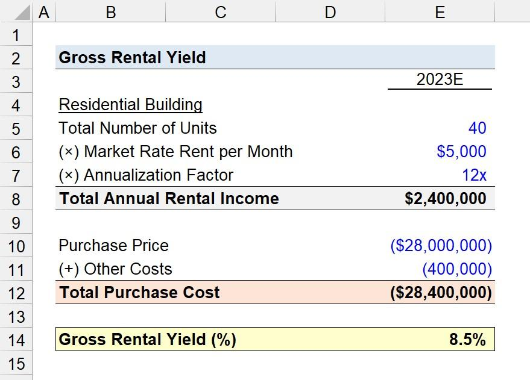

## Table of Contents

## What is gross yield?

Gross yield is a way to measure how much money you can earn from an investment before any costs are taken out. It is usually used for things like rental properties. To find the gross yield, you take the total yearly income from the investment and divide it by the total amount of money you spent to buy it. Then, you multiply that number by 100 to get a percentage. For example, if you bought a house for $100,000 and it brings in $10,000 a year in rent, the gross yield would be 10%.

Gross yield is helpful because it gives you a quick idea of how well an investment might do without worrying about extra costs like repairs or taxes. However, it does not tell the whole story because it doesn't include these costs. So, while gross yield can be a good starting point to compare different investments, you should also look at other measures like net yield, which does take those costs into account, to get a fuller picture of your investment's performance.

## How is gross yield calculated?

Gross yield is calculated by taking the total yearly income from an investment and dividing it by the total amount of money you spent to buy it. Then, you multiply that number by 100 to turn it into a percentage. For example, if you bought a rental property for $200,000 and it earns $20,000 in rent each year, you would divide $20,000 by $200,000 to get 0.1. Multiply 0.1 by 100, and you find that the gross yield is 10%.

This calculation helps you understand how much money you might make from your investment before any expenses are taken out. It's a simple way to compare different investments quickly. However, it's important to remember that gross yield doesn't include costs like maintenance or taxes, so it's just a starting point. To get a complete picture, you should also look at other measures like net yield, which does account for these costs.

## What is the difference between gross yield and net yield?

Gross yield and net yield are two ways to measure how much money you can make from an investment like a rental property. Gross yield is calculated by taking the total yearly income from the investment and dividing it by the total amount you spent to buy it, then multiplying by 100 to get a percentage. For example, if you buy a property for $100,000 and it earns $10,000 a year in rent, the gross yield is 10%. This measure is useful because it gives you a quick idea of how well an investment might do without worrying about other costs.

Net yield, on the other hand, gives you a more complete picture because it includes all the costs of owning the investment. To find the net yield, you subtract all the expenses like maintenance, taxes, and insurance from the yearly income before dividing by the total amount spent to buy the investment and multiplying by 100. Using the same example, if the $10,000 yearly rent comes with $2,000 in costs, the net income is $8,000. Dividing $8,000 by $100,000 gives you a net yield of 8%. Net yield is more accurate but takes more work to calculate because you need to know all the costs involved.

## Why is gross yield important in real estate investing?

Gross yield is important in real estate investing because it gives investors a quick and simple way to compare different properties. By calculating the gross yield, you can see how much money a property might make from rent each year compared to how much you paid for it. This helps you decide if a property could be a good investment without having to look at a lot of other details right away. It's like a first step to see if a property is worth looking into more.

However, gross yield does not tell the whole story because it does not include costs like repairs, taxes, and insurance. Even though it's a useful starting point, investors need to look at other measures, like net yield, to get a full picture of how much money they might actually make. Gross yield helps you sort through many options quickly, but you should use it along with other information to make the best choices in real estate investing.

## Can you provide a simple example of how to calculate gross yield?

Let's say you buy a house for $150,000 and you can rent it out for $1,000 every month. To find the gross yield, you need to know how much money you get from rent in a whole year. Since there are 12 months in a year, you multiply $1,000 by 12 to get $12,000. That's your yearly rental income.

Now, you take that yearly income of $12,000 and divide it by the amount you paid for the house, which is $150,000. This gives you 0.08. To turn that into a percentage, you multiply 0.08 by 100. So, the gross yield for this house is 8%. This means that before any other costs, the house could earn you 8% of what you paid for it each year in rent.

## What are the limitations of using gross yield as a metric?

Gross yield is a simple way to compare properties, but it has some limits. One big limit is that it doesn't include any costs like repairs, taxes, or insurance. These costs can be a lot, and they can make a big difference in how much money you really make from a property. If you only look at gross yield, you might think a property is a good investment when it's not, because the costs could eat up a lot of your rental income.

Another limit is that gross yield doesn't tell you about the risks or other details of the property. For example, it doesn't show if the property is in a good area or if it's easy to find good tenants. It also doesn't tell you if the rent might go up or down in the future. So, while gross yield can help you quickly compare properties, you need to look at other things too to make a smart decision about investing in real estate.

## How does gross yield compare to other investment yield metrics?

Gross yield is just one way to look at how much money you might make from an investment, like a rental property. It's simple because it only looks at the total rent you get each year divided by what you paid for the property. This makes it easy to compare different properties quickly. However, gross yield doesn't take away any costs like repairs, taxes, or insurance. So, it gives you a rough idea, but it's not the whole picture.

Other metrics like net yield give you a more complete view because they do include all the costs of owning a property. Net yield shows you how much money you really make after paying for everything. Another metric is the return on investment (ROI), which looks at how much money you make compared to what you spent, but it can be used for any kind of investment, not just real estate. ROI can be more detailed because it might include changes in the property's value over time, not just the rent. Each of these metrics helps in different ways, and using them together gives you a better idea of whether an investment is good or not.

## What factors can affect the gross yield of a property?

The gross yield of a property can be affected by many things. One big thing is how much rent you can charge. If the rent is high, the gross yield goes up because you're making more money each year. The location of the property matters too. If it's in a place where people want to live, you can usually charge more rent. Also, the type of property can make a difference. For example, apartments in a city might have different rent prices than houses in the countryside.

Another factor is the price you paid for the property. If you bought it for a low price, the gross yield will be higher because the rent is divided by a smaller number. Changes in the rental market can also affect gross yield. If the demand for rentals goes up, you might be able to raise the rent, which would increase the gross yield. But if the market goes down, you might have to lower the rent, and that would decrease the gross yield. So, many things can change how much money you might make from a property before costs.

## How can gross yield be used to compare different investment properties?

Gross yield is a simple way to compare different investment properties. You can use it to see how much money each property might make from rent each year compared to how much you paid for it. For example, if you have two properties and one has a higher gross yield, it means that property could give you more rent money for the price you paid. This helps you quickly decide which property might be a better investment without looking at a lot of other details right away.

However, gross yield is just a starting point. It doesn't include costs like repairs, taxes, and insurance, so it's not the whole story. You should use gross yield to narrow down your choices, but then look at other things like net yield, which does include costs, to get a full picture. By using gross yield along with other measures, you can make smarter choices about which properties are really the best investments for you.

## What are some common mistakes investors make when calculating gross yield?

One common mistake investors make when calculating gross yield is not using the right numbers. Sometimes, they might use the monthly rent instead of the yearly rent. This makes the gross yield look a lot smaller than it really is. They also might not use the full price they paid for the property. If they forget to include things like closing costs or fees, the gross yield will seem higher than it should be.

Another mistake is not checking their numbers carefully. It's easy to make a small math mistake, like dividing the wrong way or missing a step. These small errors can change the gross yield a lot. Also, some investors might think gross yield is all they need to know about a property. They forget that gross yield doesn't include costs like repairs and taxes, so they might think a property is a good investment when it's not. It's important to use gross yield as a starting point, but look at other things too, like net yield, to get a full picture of an investment.

## How does the concept of gross yield apply to different types of investments beyond real estate?

Gross yield isn't just for real estate. It can also be used for other types of investments like bonds or dividend-paying stocks. For bonds, gross yield is the yearly interest you get from the bond divided by the price you paid for it, then turned into a percentage. If you buy a bond for $1,000 and it pays $50 in interest each year, the gross yield is 5%. For stocks, gross yield looks at the dividends the company pays out each year compared to the stock's price. If a stock costs $100 and pays $4 in dividends each year, the gross yield is 4%. This helps you see how much money you might get back from these investments without thinking about other costs.

Just like with real estate, gross yield for other investments gives you a quick way to compare different options. If you're looking at two bonds and one has a higher gross yield, it means that bond could give you more interest money for the price you paid. The same goes for stocks; a higher gross yield means more dividend money for what you paid. But remember, gross yield doesn't include things like taxes or fees, so it's not the whole story. You should use gross yield to get a first look at different investments, but then look at other details to make the best choices.

## What advanced strategies can investors use to optimize gross yield?

One way investors can optimize gross yield is by increasing the rent they charge for their properties. This can be done by making improvements to the property that make it more appealing to tenants, like adding new appliances or fixing up the space. Another strategy is to choose properties in areas where demand for rentals is high. This means you can charge more rent because people are willing to pay more to live in that area. Also, buying properties at a lower price can help boost gross yield. If you can find a good deal on a property, the yearly rent will be a bigger percentage of what you paid for it.

Another advanced strategy is to look at ways to reduce the time a property sits empty between tenants. This is called reducing vacancy rates. If your property is empty, you're not making any money from rent, which hurts your gross yield. You can do things like offering good deals to new tenants or keeping the property in great shape so people want to move in quickly. Finally, investors can also look at diversifying their portfolio. By owning different types of properties in different areas, you can balance out the risks and maybe find higher gross yields in some places than others. Using these strategies together can help investors get the most out of their investments.

## What is Understanding Investment Yield?

Investment yield is a crucial financial metric for investors as it provides a measure of the income return generated by an investment relative to its cost. It is significant because it helps investors assess the efficiency and profitability of various investment options, guiding them in making informed financial decisions.

### Types of Yields and Their Calculations

#### Nominal Yield

Nominal yield, often referred to as coupon yield, is the annual income from an investment, expressed as a percentage of the original investment cost. It is commonly used for bonds and can be calculated using the formula:

$$
\text{Nominal Yield} = \frac{\text{Annual Coupon Payment}}{\text{Face Value of the Bond}}
$$

For example, if a bond with a face value of $1,000 offers a $50 annual coupon payment, the nominal yield would be 5%.

#### Current Yield

Unlike nominal yield, current yield provides a more realistic measure of income return by comparing the annual income with the current market price of the investment. It is calculated as:

$$
\text{Current Yield} = \frac{\text{Annual Coupon Payment}}{\text{Current Market Price of the Bond}}
$$

In the same bond example, if the current market price of the bond is $950, the current yield would be approximately 5.26%.

### Real-World Applications of Investment Yield

Investment yields are used extensively in evaluating the attractiveness of bonds, equities, and real estate. For instance, a high nominal yield bond may appear appealing; however, considering its current yield provides a clearer indication of its profitability. In the stock market, dividend yields help investors identify stocks that offer regular income. Similarly, real estate investors often use rental yield to determine the potential income from property investments.

### Evaluating Profitability with Investment Yield

Investment yield serves as a vital tool in assessing the profitability of an asset by enabling comparisons across different investment vehicles. It translates complex financial outcomes into more comprehensible figures, allowing investors to gauge the revenue-generating capacity of an investment. By analyzing both nominal and current yields, investors can gain insights into potential returns, considering both initial and current conditions of the market.

In summary, understanding investment yield and its various forms helps investors to make more informed and strategic decisions, usefully contrasting potential returns and exposure to different financial assets.

## What are Financial Metrics in Investment?

Financial metrics are vital tools for investors, serving as quantitative benchmarks to evaluate the performance and viability of various investment options. These metrics provide insights into an asset's profitability, risk level, and overall financial health, enabling investors to make data-driven decisions.

**Net Yield, Return on Investment (ROI), and Internal Rate of Return (IRR):**

Net yield, often referred to as the net return, is a measure that calculates the earnings generated from an investment after accounting for all related expenses. It is expressed as a percentage of the investment's costs and is calculated as follows:

$$
\text{Net Yield} = \left( \frac{\text{Total Income} - \text{Total Expenses}}{\text{Total Investment Cost}} \right) \times 100
$$

Return on Investment (ROI) is a widely used metric that evaluates the efficiency or profitability of an investment. ROI expresses the gain or loss on an investment relative to its cost, depicted as a percentage:

$$
\text{ROI} = \left( \frac{\text{Net Profit}}{\text{Cost of Investment}} \right) \times 100
$$

The Internal Rate of Return (IRR) measures the profitability of potential investments, calculated as the discount rate that makes the net present value (NPV) of all cash flows from the investment equal to zero. The IRR provides an estimate of the expected growth rate of an investment.

**Utilization of Financial Metrics for Informed Decisions:**

Investors utilize these metrics to compare the attractiveness of various investments, whether they are stocks, bonds, real estate, or other assets. By analyzing net yield, investors can assess how cost-effective an investment is after deducting expenses. ROI helps in understanding how much profit can be expected relative to the investment amount, aiding in comparisons across different investment opportunities. Meanwhile, IRR is instrumental in evaluating projects where cash flows may be inconsistent over time, offering a more dynamic perspective on potential profitability.

**Balancing Multiple Financial Metrics:**

Relying on a single metric can provide an incomplete picture, as each metric has its own limitations and strengths. For a comprehensive analysis, investors must balance multiple metrics to account for different dimensions of investment performance. For instance, while ROI might indicate high profitability, it might not consider the time value of money, which IRR accounts for, albeit being sensitive to the timing of cash flows. Meanwhile, net yield provides a clearer picture of returns, adjusted for costs, but may not reflect the broader market conditions or potential growth.

By integrating these various metrics, investors can better gauge risk, adapt to market changes, and devise strategies that align with their financial goals. Such a multi-faceted approach enables them to optimize their portfolios, ensuring a harmonious balance between return potentials and associated risks.

## What is Exploring Gross Yield?

Gross yield is a fundamental concept in investment analysis, offering a preliminary gauge of the income-generating potential of an asset before accounting for expenses. Gross yield is typically expressed as a percentage and serves as a straightforward tool for comparing the income returns of different investments. The formula for calculating gross yield is:

$$
\text{Gross Yield} = \left( \frac{\text{Annual Income}}{\text{Total Investment Cost}} \right) \times 100
$$

This metric highlights the income an investment generates relative to its cost, thus helping investors in determining the cash inflow potential.

**Differences between Gross Yield and Net Yield**

Distinguishing between gross yield and net yield is crucial. While gross yield provides a high-level view of an investment’s income potential, net yield offers a more nuanced picture by factoring in expenses such as taxes, maintenance, and management fees. Net yield thus reflects the actual return an investor receives after these costs. The formula for net yield can be expressed as:

$$
\text{Net Yield} = \left( \frac{\text{Annual Income} - \text{Expenses}}{\text{Total Investment Cost}} \right) \times 100
$$

Investors often use both metrics to assess investments comprehensively, with net yield providing a more accurate measure of profitability.

**Application of Gross Yield in Real Estate, Bonds, and Dividends**

1. **Real Estate**: In real estate investment, gross yield is used to evaluate rental income relative to the property price. It helps investors quickly compare different properties' potential without detailed cost breakdowns. For example, if a property is purchased for $200,000 and generates $20,000 in annual rent, the gross yield is 10%. However, investors must then consider property taxes, insurance, and maintenance to calculate net yield.

2. **Bonds**: For bonds, gross yield can be calculated using the bond's annual coupon payment relative to its current market price. This application helps investors compare bonds with similar maturities and risk profiles but varying market prices.

3. **Dividends**: In equities, gross yield is often synonymous with the dividend yield, calculated as the annual dividends per share divided by the share price. Dividend yield provides a snapshot of expected income return on stocks before accounting for taxes and brokerage fees.

**Limitations and Considerations**

Relying solely on gross yield can be misleading, as it ignores crucial factors such as expenses, tax implications, and investment risk. High gross yields may appear attractive but often accompany higher risks or hidden costs that reduce profitability. Additionally, using gross yield in isolation disregards potential appreciation or depreciation in the asset value. Investors should incorporate both qualitative and quantitative assessments, employing complementary metrics such as net yield and total return to form a complete investment appraisal.

By understanding and applying gross yield alongside other financial metrics, investors can make well-informed decisions that align with their financial goals and risk tolerance.

## What is the relationship between Algorithmic Trading and Financial Metrics?

Algorithmic trading, a method of executing orders using automated and pre-programmed trading instructions, has revolutionized the financial sector. This approach leverages historical data and algorithms to perform trades at speeds and frequencies impossible for human traders, significantly enhancing market efficiency. With its inception traced back to the 1970s, [algorithmic trading](/wiki/algorithmic-trading) has grown roots in various financial markets, contributing to over 60% of trading volumes in the U.S. equities market by the early 21st century. The use of algorithms helps reduce transaction costs and provides [liquidity](/wiki/liquidity-risk-premium) to the markets.

Key performance metrics are essential in algorithmic trading to evaluate and optimize trading strategies. Among these, cumulative returns and the Sharpe ratio stand out. Cumulative return measures the total change in investment value over a period, calculated as:

$$
\text{Cumulative Return} = \left( \frac{\text{Final Value} - \text{Initial Value}}{\text{Initial Value}} \right) \times 100 \%\]

This metric helps traders understand the overall profitability of a strategy without considering the time [factor](/wiki/factor-investing). On the other hand, the Sharpe ratio assesses the risk-adjusted return of an investment, calculated as:

$$
\text{Sharpe Ratio} = \frac{E[R] - R_f}{\sigma}
$$

where $E[R]$ is the expected return, $R_f$ is the risk-free rate, and $\sigma$ is the standard deviation of the return. A higher Sharpe ratio indicates better returns per unit of risk.

Algorithmic traders employ these metrics to refine and adjust trading strategies, ensuring that their approaches are both profitable and sustainable under varying market conditions. By analyzing cumulative returns, traders can determine the aggregate performance of their algorithms over time. Meanwhile, the Sharpe ratio offers insights into the risk management aspect, enabling traders to balance return and [volatility](/wiki/volatility-trading-strategies) effectively.

Technological advances play a crucial role in enhancing trading efficiency and decision-making in algorithmic trading. High-frequency trading ([HFT](/wiki/high-frequency-trading-strategies)), a subset of algorithmic trading, relies extensively on sophisticated technologies for rapid trade execution. These technologies include low-latency networks, co-location services, and advanced data analytics platforms. By leveraging big data, [machine learning](/wiki/machine-learning), and [artificial intelligence](/wiki/ai-artificial-intelligence), traders can process large volumes of information swiftly to make informed decisions, optimizing their strategies in real-time.

Furthermore, technology facilitates the development of robust simulation environments for [backtesting](/wiki/backtesting) algorithms against historical data. This allows for the evaluation of strategies' potential effectiveness before deploying them live, thereby reducing risks. As a result, technology not only speeds up trade execution but also enhances predictive accuracy, strategy evaluation, and overall decision-making processes in algorithmic trading.

## References & Further Reading

[1]: Bodie, Z., Kane, A., & Marcus, A. J. (2011). ["Investments and Portfolio Management"](https://www.amazon.com/Investments-Portfolio-Management-Zvi-Bodie/dp/0071289143). McGraw-Hill Education.

[2]: Fabozzi, F. J. (2007). ["Fixed Income Analysis"](https://www.amazon.com/Fixed-Income-Analysis-Frank-Fabozzi/dp/047005221X). CFA Institute Investment Series.

[3]: Andrew, R. L. (2020). ["Evaluating the Security and Profitability of Real Estate Investment Trusts (REITS) Using Yield Analysis"](https://www.investopedia.com/articles/04/030304.asp). The Journal of Real Estate Finance and Economics.

[4]: Lopez de Prado, M. (2018). ["Advances in Financial Machine Learning"](https://www.amazon.com/Advances-Financial-Machine-Learning-Marcos/dp/1119482089). Wiley.

[5]: Pardo, R. (2008). ["The Evaluation and Optimization of Trading Strategies,"](https://onlinelibrary.wiley.com/doi/book/10.1002/9781119196969) 2nd Edition. Wiley Trading.

[6]: Chan, E. P. (2009). ["Quantitative Trading: How to Build Your Own Algorithmic Trading Business"](https://github.com/ftvision/quant_trading_echan_book). Wiley Trading.