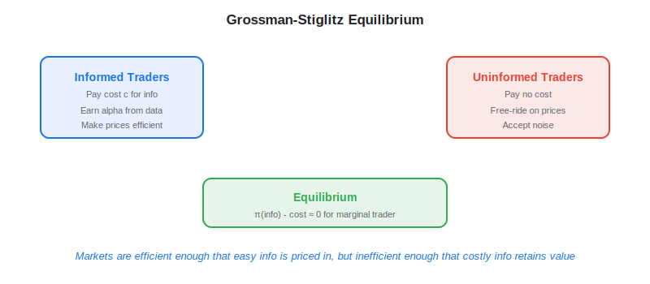
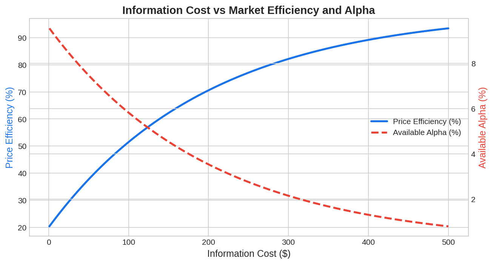

The Grossman-Stiglitz paradox is the theoretical foundation explaining why [alternative data](https://paperswithbacktest.com/wiki/best-alternative-data) has value in financial markets. Published in 1980 by Sanford Grossman and Joseph Stiglitz, the paradox demonstrates that perfectly informationally efficient markets are logically impossible — because if prices already reflected all information, no one would have an incentive to spend resources acquiring information. This creates a permanent equilibrium where information acquisition is profitable, and markets remain imperfectly efficient.

## What Is the Grossman-Stiglitz Paradox?

The paradox addresses a contradiction in the Efficient Market Hypothesis (EMH). If markets are perfectly efficient and all information is reflected in prices, then there is no reward for paying to acquire new information. But if no one acquires information, prices cannot reflect it — so markets cannot be efficient. This circular logic implies that markets must exist in an equilibrium where information gathering is costly but profitable enough to incentivize participation.

Formally, let $c$ be the cost of acquiring information and $\pi(I)$ the expected profit from trading on information $I$:

$$\pi(I) - c \geq 0$$

In equilibrium, the marginal informed trader earns just enough to cover the cost of information. Some traders remain uninformed (they free-ride on price signals), and prices are informationally efficient — but not perfectly so. The degree of inefficiency is proportional to the cost of information.

$$\text{Price Efficiency} = 1 - f(c, \sigma^2_{\text{noise}})$$

Where $\sigma^2_{\text{noise}}$ is the variance of noise trading, which prevents prices from perfectly revealing informed traders' information.



## Why It Matters for Alternative Data

The Grossman-Stiglitz framework directly explains the economics of alternative data in algo trading:

**Alternative data has value precisely because it is costly.** Satellite imagery, [credit card transaction feeds](https://paperswithbacktest.com/wiki/credit-card-transaction-data-trading), and [NLP sentiment](https://paperswithbacktest.com/wiki/nlp-sentiment-analysis-trading) are expensive to acquire and complex to process. This cost barrier ensures that not all market participants use the data, preserving informational advantage for those who do.

**Alpha decay is the equilibrium adjustment mechanism.** When alternative data is new and few traders use it, the information advantage is large. As adoption grows, the cost effectively decreases (shared vendor costs, better tools), and the alpha shrinks — but never to zero, because some cost always remains.

**Noise trading preserves the opportunity.** Even if many funds use the same data, retail investor noise, institutional constraints, and behavioral biases prevent prices from instantly adjusting. The [horizon effect](https://paperswithbacktest.com/wiki/alternative-data-horizon-effect) is a direct consequence: alternative data's alpha is strongest at short horizons before the information diffuses through the market.

## Python Implementation: Information Equilibrium Model

```python
import numpy as np

def grossman_stiglitz_equilibrium(
    info_cost: float,
    signal_precision: float,
    noise_variance: float,
    risk_aversion: float = 1.0,
    n_traders: int = 1000
) -> dict:
    """
    Simplified Grossman-Stiglitz equilibrium model.
    
    Parameters:
    - info_cost: Cost of acquiring information (per trader)
    - signal_precision: Precision of the information signal (1/variance)
    - noise_variance: Variance of noise trading
    - risk_aversion: Risk aversion coefficient
    - n_traders: Total number of traders in market
    """
    # In equilibrium, fraction informed is where marginal benefit = cost
    # Higher info cost → fewer informed traders → more inefficiency
    lambda_informed = max(0.01, min(0.99,
        1.0 - (info_cost / (signal_precision * noise_variance))
    ))
    
    n_informed = int(lambda_informed * n_traders)
    n_uninformed = n_traders - n_informed
    
    # Price efficiency: higher when more traders are informed
    price_efficiency = lambda_informed * signal_precision / (
        lambda_informed * signal_precision + 1.0 / noise_variance
    )
    
    # Expected profit per informed trader
    info_advantage = (1 - price_efficiency) * signal_precision * noise_variance
    expected_profit = info_advantage - info_cost
    
    return {
        "fraction_informed": f"{lambda_informed:.1%}",
        "n_informed": n_informed,
        "n_uninformed": n_uninformed,
        "price_efficiency": f"{price_efficiency:.2%}",
        "expected_profit_per_informed": f"${expected_profit:,.2f}",
        "market_regime": "Efficient" if price_efficiency > 0.9 else "Moderately Efficient" if price_efficiency > 0.5 else "Inefficient",
    }

# Scenario analysis: how does info cost affect equilibrium?
print("=== Impact of Information Cost on Market Efficiency ===")
for cost in [10, 50, 100, 500, 1000]:
    result = grossman_stiglitz_equilibrium(
        info_cost=cost, signal_precision=0.8,
        noise_variance=100, risk_aversion=1.0
    )
    print(f"\nInfo cost=${cost}: {result['market_regime']}")
    print(f"  Informed traders: {result['fraction_informed']}")
    print(f"  Price efficiency: {result['price_efficiency']}")
```



## Practical Implications for Traders

**1. Pay for data that others won't.** The Grossman-Stiglitz model says the alpha is proportional to the cost barrier. Expensive, hard-to-process data (raw satellite imagery, proprietary IoT sensors) offers more persistent edges than cheap, widely available data (free web traffic metrics).

**2. Monitor the adoption curve.** Track how many funds use a given data source. As adoption increases, the equilibrium shifts — more traders become informed, prices become more efficient, and alpha compresses.

**3. Invest in processing capability.** Even if two funds license the same raw data, the fund with better ML models, faster processing, and more sophisticated signal extraction has a higher effective $\text{signal\_precision}$, earning more from the same information.

**4. Combine multiple signals.** Composite signals from multiple data sources create a higher effective precision that single-source users cannot replicate. This raises your information advantage even in crowded data markets.

## Limitations and Risks

The Grossman-Stiglitz model is highly stylized. Real markets have heterogeneous traders, multiple information sources, and complex dynamics that the two-type (informed/uninformed) model does not capture. The model also assumes rational expectations, which may not hold for behavioral-driven market anomalies.

## Conclusion

The Grossman-Stiglitz paradox is the intellectual justification for the entire alternative data industry. Markets are efficient enough that easy information is already priced in, but inefficient enough that costly, novel information retains value. For algo traders, this means the game is always about finding the next information source whose cost-to-value ratio is favorable — before it becomes crowded.

---

**Explore further on PapersWithBacktest:**
- Browse [backtested trading strategies](https://paperswithbacktest.com/strategies) with Python code and performance metrics
- Access [clean historical market data](https://paperswithbacktest.com/datasets) for equities, crypto, and futures
- Take the [algo trading course](https://paperswithbacktest.com/course) — 60+ video lessons and notebooks
- Related wiki pages: [The Horizon Effect](https://paperswithbacktest.com/wiki/alternative-data-horizon-effect) · [Best Alternative Data Sources](https://paperswithbacktest.com/wiki/best-alternative-data)
