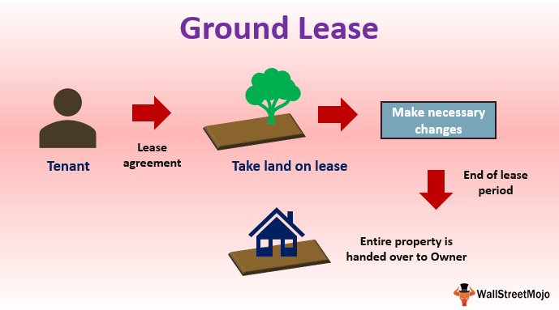

Real estate leasing plays a crucial role in modern economies, providing an essential framework for the occupation and use of land and property without transferring ownership. This sector encompasses a wide array of lease types, each serving different purposes and offering various advantages to both lessors and lessees. Within this spectrum, the concept of a ground lease emerges as a significant model, defined primarily by its structure where the landowner leases their land to a tenant who is allowed to develop and use the property for an agreed period. Unlike conventional leases, ground leases generally extend over long terms, typically ranging from 50 to 99 years, thus giving the tenant the opportunity to realize substantial developments on the leased land. At the end of the lease term, the ownership of the improvements on the land usually reverts to the landowner, unless otherwise stated in the lease agreement.

Lease agreements are indispensable to real estate transactions as they set forth the terms and conditions governing the relationship between the landlord and tenant. These documents detail essential components such as rent payment schedules, duration, renewal terms, and rights and responsibilities of both parties. Through well-crafted lease agreements, parties can ensure clarity and enforceability, minimizing disputes and providing a secure environment for economic activities.

In recent years, the advent of technology has paved the way for sophisticated methods, such as algorithmic trading, to influence real estate leasing decisions. Algorithmic trading, which originated in the financial markets for automated trading strategies, employs complex mathematical models and algorithms to analyze market data and make investment decisions at speeds and efficiencies unattainable by human traders. When applied to real estate leasing, such techniques offer the potential to revolutionize traditional leasing practices through enhanced data analysis, risk management, and market trend predictions.

The primary objective of this article is to explore the fascinating intersection of ground leasing and algorithmic trading. By examining how algorithmic tools can be leveraged within the ground lease framework, we aim to uncover innovative strategies that could potentially yield enhanced decision-making capabilities and investment returns in real estate leasing. Through this exploration, we will highlight the evolving landscape of property investment and the increasing importance of technological adaptation in the sector.

## Table of Contents

## Understanding Ground Lease in Real Estate

A ground lease is a long-term agreement in which a tenant rents land from a lessor, typically for periods ranging from 50 to 99 years. This arrangement allows the tenant to develop or use the land while paying rent. The key distinguishing [factor](/wiki/factor-investing) of a ground lease is that at the end of the lease term, the land and any improvements made to it revert to the landowner unless otherwise negotiated.

### Structure of a Ground Lease

The standard ground lease consists of several components:

1. **Term and Rent**: The lease term is significantly longer than traditional property leases to accommodate substantial investments by the lessee, often accompanied by periodic rent reviews or adjustments.

2. **Development Obligations**: Often, the lessee is required to develop or improve the property, which benefits the lessor through increased land value.

3. **Reversion of Improvements**: Any structures built on the land typically transfer to the lessor at the end of the lease term, unless specifically excluded.

### Benefits and Disadvantages

Ground leasing provides several benefits:

- **Capital Efficiency**: Lessees can invest capital in developing the land rather than purchasing it. This makes significant developments feasible without the upfront cost of land acquisition.
- **Tax Advantages**: Lease payments are fully deductible as an operating expense, which can be favorable for taxation purposes.
- **Flexibility**: It offers the flexibility to develop on prime locations without owning the land.

However, ground leases have disadvantages:

- **Reversion Risk**: At the lease's end, all improvements revert to the lessor unless there is a renewal or buyback agreement.
- **Financing Difficulties**: Lenders might be hesitant to finance developments on leased land due to reversion risks.
- **Long-term Cost**: Over decades, the cumulative rent may surpass the cost of purchasing the land outright.

### Beneficial Scenarios

Ground leases are particularly useful in contexts where land is scarce or costly. In urban centers, such leases allow for development without the high cost of land purchase, empowering developers to pursue projects in strategic locations. They are also beneficial for public entities owning large land parcels but lacking the resources or interest to develop them directly.

### Legal Considerations and Common Clauses

Several legal aspects are crucial in ground leases:

- **Renewal Options**: Terms for lease renewal or extension may be predefined to prevent tenant displacement.
- **Exit Strategies**: Clauses may exist for lease termination by either party under specified conditions.
- **Permitted Uses**: The lease will typically specify allowable uses of the land to ensure alignment with the lessor's intentions.

### Case Studies

Successful ground lease arrangements can be observed in cities like New York, where Rockefeller Center was developed on leased land. This iconic complex was made possible through creative use of a ground lease, creating significant value for both the lessee and lessor.

In conclusion, ground leases are a crucial tool within real estate, enabling developments that might not be feasible otherwise. Despite their complexities and potential drawbacks, they offer distinct advantages in particular geographic and financial scenarios. Understanding the intricacies of ground leases is vital for both developers and investors aiming to optimize their real estate strategies.

## Key Elements of Lease Agreements

Lease agreements are fundamental documents that govern the relationship between a landlord and a tenant, establishing terms and conditions under which the tenant can occupy a property. Ensuring clarity and enforceability in these agreements is crucial to prevent disputes and provide legal protection for both parties.

**Critical Components of Lease Agreements**

A well-drafted lease agreement typically contains several key components:

1. **Identification of Parties**: Clearly identifying the landlord and tenant, including legal names and contact information, is essential.

2. **Description of the Leased Property**: The agreement should include a detailed description of the property, specifying the boundaries and any included amenities or areas.

3. **Lease Term**: This defines the duration of the lease, including start and end dates. Terms may be fixed (e.g., one year) or periodic (e.g., month-to-month).

4. **Rent and Payment Details**: The agreement must specify the amount of rent, due dates, acceptable payment methods, and penalties for late payments. A clear schedule prevents ambiguity and potential disputes.

5. **Security Deposit**: It outlines the amount required as a security deposit, along with conditions for its return and deductions that may be made for damages or unpaid rent.

6. **Maintenance and Repairs**: Responsibilities of both landlord and tenant regarding maintenance and repairs should be delineated, ensuring clarity in terms of upkeep.

7. **Use of Property**: Permitted and prohibited uses of the property should be outlined, which is particularly vital in commercial leases to prevent unauthorized activities.

8. **Termination and Renewal**: Conditions under which the lease can be terminated or renewed need to be clearly defined, including any notice periods required.

9. **Default and Remedies**: The agreement should detail what constitutes a default by either party and the legal remedies available.

10. **Dispute Resolution**: Mechanisms for resolving disputes, such as mediation or arbitration, can help avoid costly legal battles.

**Types of Lease Agreements**

Beyond ground leases, there are several other types of lease agreements used in real estate:

- **Commercial Leases**: These are used for leasing business properties and involve more complex terms, including zoning laws adherence and business-specific stipulations.

- **Residential Leases**: Typically simpler, these leases govern the rental of living spaces and often include state-specific tenant rights and obligations.

- **Net and Gross Leases**: These terms define who pays for operating expenses—net leases require tenants to cover them, whereas gross leases include these costs in the rent.

**Negotiating Lease Agreements**

Negotiating a lease agreement necessitates a balanced approach to protect the interests of both parties. Key negotiation strategies include:

- **Understanding Market Conditions**: Knowing the current market rents and demand can provide leverage.

- **Identifying Priorities**: Both parties should clarify their essential needs and areas where they are willing to compromise.

- **Seeking Professional Guidance**: Engaging real estate attorneys or brokers ensures informed decisions and minimizes legal risks.

**Common Pitfalls and How to Avoid Them**

Common pitfalls in lease agreements include ambiguous terms, failure to comply with local laws, and overlooking early termination clauses. To avoid these:

- **Clarity and Specificity**: All terms should be clear and specific, leaving no room for misinterpretation.

- **Legal Compliance**: Ensure the agreement complies with local real estate laws and regulations.

- **Regular Updates**: Periodically review and update agreements to reflect any legal or market changes.

**Role in Security and Long-term Planning**

Lease agreements play a critical role in providing security and facilitating long-term planning for both investors and tenants. For investors, secure lease agreements ensure reliable income streams and enhance property value. For tenants, they offer stability and predictability in occupancy. This mutual benefit underscores the importance of well-constructed lease agreements in the real estate sector.

## Algorithmic Trading and Its Impact on Real Estate Leasing

Algorithmic trading, often referred to as algo trading, involves the use of computer programs to execute trading strategies at speeds and frequencies that are impossible for human traders. This method has transformed financial markets by enabling rapid execution of complex instructions derived from mathematical models, which evaluate pricing variations, market patterns, and more. Originating in the equity markets during the late 20th century, algo trading has expanded its influence into various asset classes, including real estate investments and leasing.

In real estate leasing, algorithmic techniques are starting to alter traditional approaches by providing sophisticated tools for data analysis and decision-making. These algorithms can analyze extensive datasets related to property values, rental yields, occupancy rates, and local economic indicators, which influence leasing decisions. These insights enable investors to identify lucrative leasing opportunities, optimize lease durations, and anticipate market shifts with greater precision.

The primary benefits of applying [algorithmic trading](/wiki/algorithmic-trading) to real estate leasing include enhanced data-driven decision-making and trend analysis. Algorithms can process vast amounts of data quickly, identifying patterns and correlations that may not be apparent through conventional analysis. This capability allows for more effective risk assessment and strategic planning, potentially leading to higher returns and reduced exposure to market [volatility](/wiki/volatility-trading-strategies).

Despite these advantages, challenges and limitations exist in the application of algorithms within the real estate sector. The complexity and variability of real estate markets pose significant difficulties for algorithmic models. Unlike securities which have a vast amount of standard financial metrics and historical data readily available, real estate properties vary significantly in terms of location, condition, and market dynamics. Moreover, leasing transactions often involve negotiation and subjective elements that are difficult to quantify, such as tenant relationships and property management considerations.

Additionally, data privacy and regulatory compliance present significant concerns. Data used for deploying algorithms must be accurate and comply with real estate laws and regulations, necessitating stringent governance frameworks.

Looking forward, the potential for algorithmic trading to revolutionize traditional leasing practices depends largely on technological advancements and integration capabilities. Emerging technologies like [machine learning](/wiki/machine-learning) and [artificial intelligence](/wiki/ai-artificial-intelligence) promise further improvements in predictive accuracy and decision-support systems. If these technologies can be effectively harnessed, they may lead to transformative changes in how real estate leasing is conducted, making it more efficient and responsive to market demands.

In conclusion, while algorithmic trading holds promise for advancing real estate leasing, its success will rely on overcoming current challenges and effectively adapting to the unique characteristics of the sector. Recognizing these dynamics is crucial for professionals eager to harness technological innovations in real estate investments.

## Integrating Algorithmic Trading with Ground Lease Strategies

The intersection of algorithmic trading with ground lease strategies offers a novel approach to optimizing real estate investments. Algorithmic trading employs advanced mathematical models and computational power to execute trades and make investment decisions based on pre-defined criteria. Applying these methodologies to ground lease investments can enhance decision-making, risk management, and potential returns.

Several firms have pioneered this integration effectively. For instance, Quantitative Property Group (QPG) uses proprietary algorithms to analyze market data, including property valuations, urban development trends, and lease duration variables. This data-driven approach facilitates the identification of lucrative ground lease opportunities, traditionally a time-intensive process. By automating analysis and decision-making, QPG has achieved higher efficiency in sourcing and managing ground lease portfolios.

The impact of combining algorithmic trading with ground lease strategies can be significant. Algorithms can instantly process large datasets to identify patterns and predict market shifts, which enhances decision-making capabilities. Risk management benefits through real-time monitoring and predictive analytics, allowing investors to adjust their strategies swiftly in response to emerging risks or opportunities. Returns can be optimized by dynamically adjusting investment strategies as market conditions evolve, ensuring that portfolios are rebalanced in line with strategic objectives.

Technological advancements underpinning this integration include big data analytics, machine learning, and high-performance computing. These technologies enable the processing and analysis of vast amounts of market data at unprecedented speeds and precision. Machine learning algorithms, for example, are particularly adept at recognizing complex patterns that might elude traditional analysis. Cloud computing platforms provide the necessary infrastructure to scale computations cost-effectively, making these advanced analytics widely accessible.

For investors interested in exploring algorithmically-driven ground lease opportunities, several guidelines are essential. First, developing or adopting robust algorithms tailored to real estate market analysis is crucial. Investors should also prioritize platforms that offer comprehensive data integration to ensure all relevant market inputs are considered. Collaborating with technology partners specializing in real estate and financial analytics can accelerate the adoption of these advanced strategies. Lastly, transparency in algorithm performance and continuous refinement of models based on real-world data outcomes ensure that the strategies remain effective and relevant.

In conclusion, the fusion of algorithmic trading and ground lease strategies represents a progressive frontier in real estate investment. As technology continues to evolve, the possibilities for innovation in this domain promise to transform conventional leasing practices and unlock new opportunities for market participants.

## Conclusion

Ground leases, lease agreements, and algorithmic trading represent crucial facets of the modern real estate landscape. Ground leases provide landowners with constant income streams while allowing tenants to undertake development projects without heavy upfront land purchase costs. This leasing structure has proven beneficial in both commercial and residential contexts, offering flexibility and strategic advantages. Meanwhile, robust lease agreements are the foundation upon which secure and transparent leasing transactions are built, ensuring the clarity and enforceability required for successful real estate investments.

Algorithmic trading, borrowed from financial markets, represents a transformative tool within real estate leasing. By employing advanced computational techniques, investors can analyze vast data sets, identify market trends, and make informed decisions with greater precision and speed than ever before. Integrating algorithmic trading into real estate leasing holds the promise of improved decision-making, refined risk management, and enhanced returns. The ability to process and respond to real-time data can enable investors to optimize ground lease strategies, tailoring them to the evolving market dynamics with unprecedented accuracy.

Looking toward the future of real estate investing, the fusion of technology and traditional real estate practices is anticipated to be groundbreaking. The integration of algorithmic trading with leasing strategies is just one example of potential advancements that can redefine investment paradigms. With the continued evolution of technology, real estate professionals have the opportunity to explore innovative strategies that not only leverage algorithmic trading but also incorporate other technological tools like machine learning and blockchain.

For industry professionals, embracing these innovations is more than an option—it's a necessity. As the real estate sector continues to evolve, adaptability will be key. Incorporating new methodologies and technologies can lead to discovering untapped potential and driving growth. Real estate investors and developers are thus encouraged to actively seek and adopt fresh, evidence-based approaches, aiming to transform challenges into opportunities.

Continued research and adaptation are vital as real estate intersects increasingly with technology. Developing a deeper understanding and application of these innovative strategies will facilitate the integration of traditional practices with cutting-edge technology, ultimately reshaping the real estate industry's future landscape.

## References & Further Reading

[1]: Jason, P. (2009). ["Real Estate Leases: Analysis and Valuation"](https://www.researchgate.net/publication/300805015_Real_Estate_Valuation). Palgrave Macmillan.

[2]: Lopez de Prado, M. (2018). ["Advances in Financial Machine Learning"](https://www.amazon.com/Advances-Financial-Machine-Learning-Marcos/dp/1119482089). John Wiley & Sons.

[3]: Aronson, D. (2006). ["Evidence-Based Technical Analysis: Applying the Scientific Method and Statistical Inference to Trading Signals"](https://www.amazon.com/Evidence-Based-Technical-Analysis-Scientific-Statistical/dp/0470008741). John Wiley & Sons.

[4]: Jansen, S. (2020). ["Machine Learning for Algorithmic Trading: Second Edition"](https://github.com/stefan-jansen/machine-learning-for-trading). Packt Publishing.

[5]: Chan, E. P. (2008). ["Quantitative Trading: How to Build Your Own Algorithmic Trading Business"](https://github.com/ftvision/quant_trading_echan_book). John Wiley & Sons.