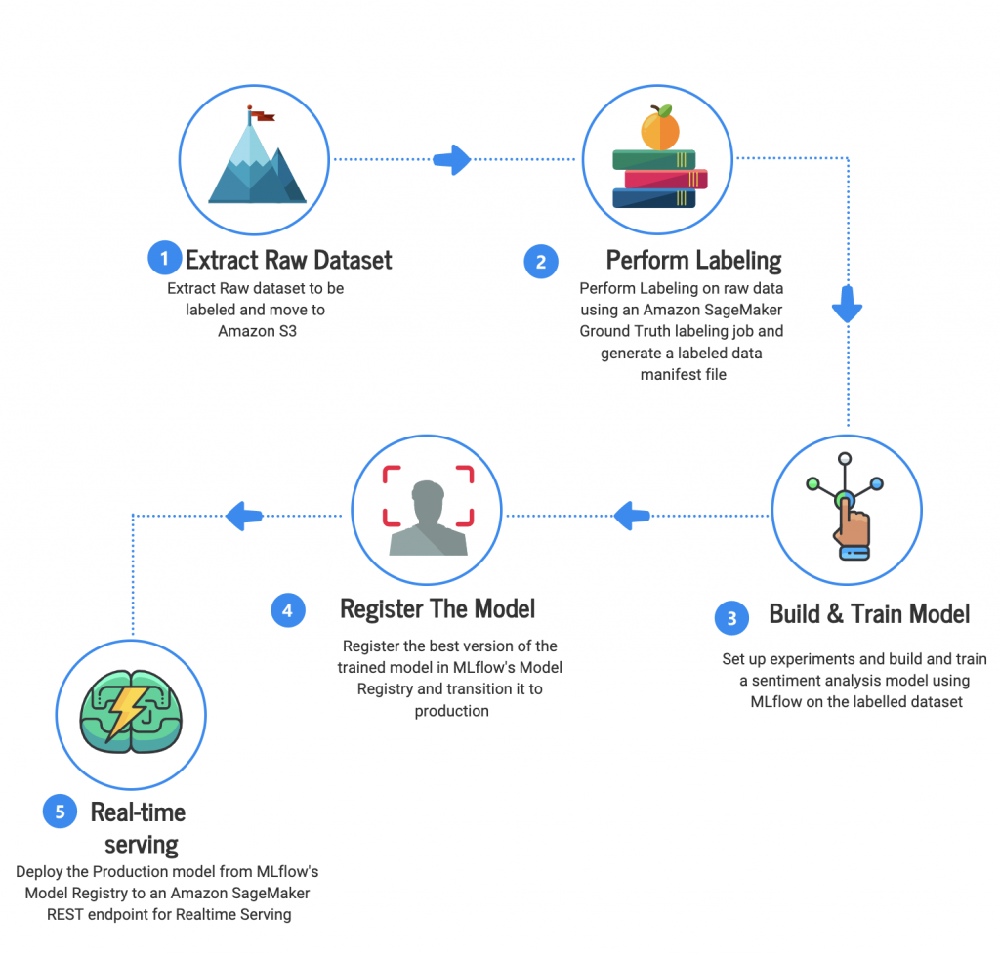

## Table of Contents

## What is ground truth in the context of machine learning?

In machine learning, ground truth refers to the accurate and verified data that is used to train and evaluate the performance of a model. It is the real, factual information that a model aims to predict or classify correctly. For example, if you are training a model to recognize pictures of cats and dogs, the ground truth would be the correct labels (cat or dog) assigned to each picture by human experts.

Ground truth is crucial because it provides a benchmark against which the model's predictions can be compared. If a model's output matches the ground truth, it means the model is performing well. However, obtaining ground truth can sometimes be challenging and costly, especially in fields like medical imaging where expert annotations are required. Despite these challenges, ground truth remains essential for developing reliable and accurate machine learning models.

## Why is ground truth important for training machine learning models?

Ground truth is really important when we train machine learning models because it gives us the right answers to compare with what the model predicts. Imagine you're teaching a kid to tell the difference between apples and oranges. You show them pictures and tell them which is which. In this case, you are the ground truth. The kid learns by comparing their guesses to what you told them. In machine learning, we use ground truth data to help the model learn the correct patterns and make accurate predictions.

Without ground truth, it would be hard to know if our model is learning the right things. If we didn't have the correct labels for our data, the model might learn wrong patterns and give us bad predictions. For example, if we're trying to predict if it will rain tomorrow, we need past weather data with the correct outcomes to train our model. By comparing the model's predictions to the actual weather that happened, we can see how well it's doing and make it better. So, ground truth is key to making sure our models are reliable and useful.

## How is ground truth data typically collected?

Ground truth data is usually collected by people who are experts in the field. For example, if you're working on a project to identify different types of birds, you might ask bird experts to look at pictures and label them correctly. This way, the data you use to train your machine learning model is as accurate as possible. Sometimes, collecting ground truth data can be a big job, especially if you need a lot of data or if the task is hard. But it's really important to get it right because this data helps the model learn the correct patterns.

In some cases, ground truth data can also come from reliable sources like official records or sensors. For instance, if you're building a model to predict traffic, you might use data from traffic cameras or sensors on the road. This kind of data is already collected and can be used directly as ground truth. No matter how it's collected, the goal is always the same: to make sure the data is accurate and trustworthy so that the machine learning model can learn and perform well.

## What are the challenges in obtaining accurate ground truth data?

Getting accurate ground truth data can be tough. One big problem is that it often needs a lot of people to do the work. For example, if you're trying to label pictures of animals, you need experts to look at each picture and say what animal is in it. This can take a long time and cost a lot of money. Also, sometimes different experts might not agree on what the right label should be, which can make the data less reliable.

Another challenge is that the world is always changing, and what was true in the past might not be true now. For instance, if you're using old data to predict future trends, you might miss new patterns that have developed. This means you need to keep updating your ground truth data, which can be hard to do. Plus, in some fields like medicine, getting the right ground truth can be really tricky because even experts can make mistakes or disagree on what the correct answer should be.

Despite these challenges, it's really important to get the ground truth right. If the data isn't accurate, the machine learning model won't learn the right things and might give wrong predictions. So, even though it's hard, finding ways to collect and keep good ground truth data is key to making sure your models work well.

## Can you explain the difference between ground truth and predicted labels?

Ground truth is the correct answer or label that we know for sure. It's like the answer key to a test. When we train a machine learning model, we use ground truth to teach it what the right answers are. For example, if we're teaching a computer to recognize pictures of cats and dogs, the ground truth would be the labels that say "cat" or "dog" for each picture, given by people who know for sure.

Predicted labels, on the other hand, are the guesses that the machine learning model makes. After the model has been trained with the ground truth, it tries to label new data on its own. These predicted labels might be right or wrong, and we compare them to the ground truth to see how well the model is doing. If the model's predicted label matches the ground truth, we know it's doing a good job. If not, we might need to train it more or fix something.

## How does ground truth impact the evaluation of machine learning models?

Ground truth is super important when we want to see how good a machine learning model is. It's like the answer sheet we use to check if the model's guesses are right. When we test a model, we compare its predictions to the ground truth. If the model's guesses match the ground truth a lot, we know it's doing well. If not, we might need to train it more or change something. This comparison helps us figure out how accurate the model is and where it might be making mistakes.

For example, if we're using a model to tell if an email is spam or not, the ground truth would be the correct labels given by people who know for sure. We then see how many times the model's guesses match these labels. If the model says an email is spam and the ground truth says it's spam too, that's a correct prediction. By looking at how often the model gets it right, we can tell if it's ready to use or if it needs more work. Ground truth helps us trust the model more because we can see how well it performs against what we know is true.

## What are some common methods to validate ground truth data?

To make sure ground truth data is correct, people often use a method called cross-validation. This means they split the data into different parts and use some parts to train the model and other parts to test it. If the model does well on the parts it hasn't seen before, it's a good sign that the ground truth data is accurate. Another way is to have more than one expert look at the data and label it. If different experts agree on the labels, it's more likely that the ground truth is right.

Sometimes, people also use a technique called inter-rater reliability to check ground truth data. This means they measure how much different people agree when they label the same data. If there's a lot of agreement, it means the ground truth is probably good. If there's not much agreement, it might mean the data needs to be looked at again. By using these methods, people can feel more sure that their ground truth data is accurate and that their machine learning models will learn the right things.

## How can biases in ground truth data affect machine learning outcomes?

Biases in ground truth data can really mess up the results of machine learning models. If the data used to train a model has biases, like if it only shows one type of people or leaves out important information, the model will learn those biases too. For example, if a model is trained to recognize faces but only sees pictures of people with light skin, it might not work well for people with darker skin. This can lead to unfair results and make the model less useful for everyone.

To fix this, it's important to check the ground truth data carefully and make sure it includes a good mix of different examples. If we find biases, we need to add more data to balance things out or use special methods to correct the biases. By doing this, we can make sure the machine learning model learns the right things and works fairly for everyone.

## What role does ground truth play in supervised learning versus unsupervised learning?

In supervised learning, ground truth is super important. It's like the teacher that shows the model what the right answers are. When we train a model, we give it examples with the correct labels, which is the ground truth. The model learns from these examples and tries to guess the right labels for new data. If the ground truth is accurate, the model can learn well and make good predictions. But if the ground truth has mistakes or biases, the model might learn the wrong things and give bad results.

In unsupervised learning, we don't use ground truth in the same way. Instead of giving the model the right answers, we let it find patterns in the data all by itself. The model tries to group similar things together or find hidden structures without any labels to guide it. Even though we don't use ground truth to train the model, we might still use it later to check how well the model did. For example, after the model groups data, we can compare those groups to the ground truth to see if the model found the right patterns.

## How can ground truth be used to improve model performance over time?

Ground truth helps us make our machine learning models better over time by showing us where the model is making mistakes. When we compare the model's guesses to the ground truth, we can see which predictions are wrong. This tells us what parts of the model need more work. For example, if a model is bad at telling the difference between cats and dogs, we can use the ground truth to find out which pictures it gets wrong and train it more with those types of pictures. By doing this, the model learns from its mistakes and gets better at making correct predictions.

We can also use ground truth to keep our models up to date. The world changes, and what was true before might not be true now. By regularly checking our model's predictions against new ground truth data, we can see if it's still working well. If the model starts making more mistakes, we can retrain it with the new data. This way, the model stays accurate and useful, even as things change. Using ground truth like this helps us keep our models performing well over time.

## What are advanced techniques for dealing with noisy or uncertain ground truth?

When ground truth data has some errors or isn't very clear, we can use special methods to help our machine learning models still learn the right things. One way is to use a technique called "label smoothing." Instead of using hard labels like 0 or 1, we use softer labels like 0.1 or 0.9. This helps the model not be too sure about its guesses and can make it better at dealing with mistakes in the data. Another way is to use "ensemble methods," where we train lots of models and then combine their guesses. This can help smooth out the errors and make the final prediction more accurate.

Another technique is called "active learning." With this method, the model asks for help from experts when it's not sure about something. By getting more ground truth for the tricky parts, the model can learn better. We can also use "Bayesian methods" to deal with uncertainty. These methods let the model know how sure it is about its guesses. If the model isn't very sure, it can ask for more data or be more careful with its predictions. By using these advanced techniques, we can make our models work well even when the ground truth isn't perfect.

## How do experts handle discrepancies between multiple sources of ground truth data?

When experts find different answers from different sources of ground truth data, they often use a method called "consensus building." This means they talk to each other and try to agree on what the right answer should be. They might look at all the different labels and see which one most experts agree on. If there's no clear agreement, they might need to do more research or get more data to help them decide. This way, they can make sure the ground truth they use is as accurate as possible.

Sometimes, experts use special math methods to handle these disagreements. They might use something called "voting" where each source of ground truth gets a vote, and the most common answer wins. Another way is to use "weighted voting," where some sources are considered more important than others. For example, if one expert is more experienced, their vote might count more. By using these methods, experts can combine different sources of ground truth and make the best decision they can, even when the data isn't perfect.