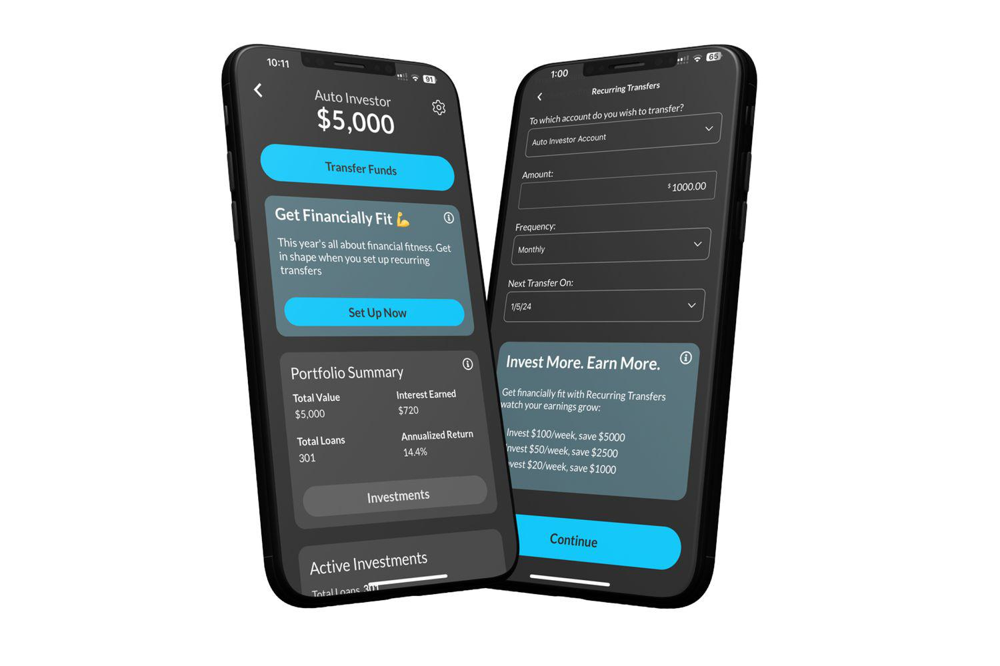

Algorithmic trading, a significant innovation in the field of finance, involves using computer algorithms to execute orders at speeds and frequencies that human traders cannot match. This method of trading has increasingly become vital in the financial markets due to its ability to process vast amounts of data swiftly, enhance market liquidity, and reduce transactional costs for large volume trades. Traders and institutions leverage algorithmic trading to optimize the timing of trades and maximize profits, making algorithmic strategies a cornerstone of modern financial markets.

Groundfloor is an innovative fintech platform that has embraced this trend by offering a robust suite of algorithmic trading services. Groundfloor's mission is to democratize finance by providing sophisticated trading technologies to individual investors, typically reserved for large institutions. Their services are designed not only to simplify the trading process but also to empower users with the same level of technological sophistication used by major financial players.

This article aims to review the 2024 version of Groundfloor's algorithmic trading services. The platform's latest iteration continues to integrate cutting-edge technologies to enhance trading efficiency and user experience. For traders, staying updated with the latest advancements in algorithmic trading is crucial to maintaining a competitive edge in a rapidly evolving marketplace. Continuous updates and innovations in trading technology can significantly impact trading strategies and outcomes, underscoring the importance of platforms like Groundfloor.

The review will comprehensively address various facets of Groundfloor's services, including the key features and tools introduced in 2024, performance metrics, reliability, and user experience. Additionally, it will evaluate the competitive positioning of Groundfloor in the context of the broader trading technology landscape, highlighting the platform's strengths and areas for improvement.

As the trading technologies continue to evolve rapidly in 2024, understanding the capabilities and offerings of platforms like Groundfloor becomes increasingly important for both novice and experienced traders. This review will provide valuable insights into how Groundfloor is adapting to these changes and what users can expect from its algorithmic trading services.

## Table of Contents

## Understanding Groundfloor's Algorithmic Trading

Groundfloor, a prominent player in the fintech sector, has carved out a notable niche with its commitment to democratizing investment opportunities in real estate. Founded with a mission to make real estate investment accessible to a broader audience, Groundfloor has expanded its offerings by integrating algorithmic trading services, reflecting its innovative approach in the financial technology space.

The [algorithmic trading](/wiki/algorithmic-trading) services provided by Groundfloor in 2024 are designed to offer retail and institutional investors alike a sophisticated platform that harnesses complex algorithms for executing trades. These services allow users to automate the trading process, capitalizing on high-frequency trading strategies and data-driven insights. This means investors can make split-second decisions based on market conditions without human intervention. The platform employs [machine learning](/wiki/machine-learning) and [artificial intelligence](/wiki/ai-artificial-intelligence) to optimize trading algorithms, ensuring they learn and adapt to market fluctuations over time.

Groundfloor’s integration of technology and finance facilitates a seamless trading experience. By leveraging cloud computing and real-time data analytics, the platform ensures that users can execute trades with minimal latency, a critical [factor](/wiki/factor-investing) in modern markets where even milliseconds can impact profitability. Furthermore, the use of API-driven architecture provides the flexibility for traders to customize their trading strategies and seamlessly integrate with other financial tools and datasets.

In 2024, the key features of Groundfloor's trading platform include an intuitive user interface, enhanced algorithmic capabilities, and robust data security measures. The interface is designed to cater to both novice and experienced traders, offering customizable dashboards, advanced charting tools, and real-time market data. Users can access a variety of trading algorithms and have the option to modify parameters or develop new algorithms using a built-in programming interface, often utilizing Python due to its widespread adoption in finance for algorithm development.

Groundfloor’s competitive edge lies in its ability to offer a unique combination of affordability and advanced technological features. Unlike many traditional platforms that cater primarily to institutional clients, Groundfloor is tailored to the needs of individual traders, providing access to cutting-edge trading tools without the prohibitive costs typically associated with sophisticated trading infrastructure. This democratization of technology enables a wider audience to participate in algo trading, leveling the playing field.

Moreover, Groundfloor places a strong emphasis on security to protect user data and financial transactions. Employing secure socket layer (SSL) encryption, multi-factor authentication, and regular security audits, the platform ensures a secure environment for its users.

Overall, Groundfloor’s expansion into algorithmic trading in 2024 underscores its commitment to innovation and accessibility, positioning it as a formidable contender in the evolving landscape of fintech platforms.

## Key Features and Tools of Groundfloor 2024

Groundfloor's 2024 algorithmic trading platform introduces a range of new features that enhance its functionality and user engagement. A prominent update is the revamped user interface, designed to improve navigability and provide a seamless trading experience regardless of a user's expertise level. This update includes intuitive dashboard configurations, customizable widgets, and a more responsive design, facilitating efficient interaction with the platform's tools and features.

Technological advancements have significantly influenced trading outcomes on Groundfloor's platform. The integration of machine learning algorithms enables more sophisticated data analysis, allowing traders to capitalize on market trends with heightened accuracy. These algorithms process vast datasets in real-time, identifying patterns and predicting market shifts, which enhances decision-making processes and trading strategies.

The platform offers a variety of trading algorithms that can be customized according to individual preferences and strategies. Users have access to both pre-built models and the flexibility to develop their own algorithms using Python. This customization is supported by a robust API that facilitates seamless integration with external data sources and analytical tools, empowering traders to execute highly tailored trading tactics.

Groundfloor prioritizes security with advanced measures to protect user information and transactions. The platform employs end-to-end encryption, ensuring data privacy and integrity. Multi-factor authentication (MFA) adds an additional layer of security, safeguarding accounts against unauthorized access. Regular security audits and compliance with industry standards further strengthen the platform's defense against potential threats, assuring users of a secure trading environment.

Overall, Groundfloor's 2024 updates present a comprehensive suite of tools and features, enhancing usability, trading performance, and user security, aimed at meeting the diverse needs of today's traders.

## Performance and Reliability

Performance and reliability are critical factors when evaluating algorithmic trading platforms such as Groundfloor. In the fast-paced financial markets of 2024, the ability of a trading algorithm to perform consistently across different market conditions is of paramount importance.

### Algorithm Performance Analysis

Groundfloor's 2024 trading algorithms have been designed to adapt to diverse market scenarios ranging from bullish trends to volatile downturns. Advanced machine learning techniques and predictive analytics form the core of these algorithms, enabling them to analyze vast datasets and identify trading opportunities with high accuracy.

Recent performance analyses indicate that Groundfloor's algorithms consistently deliver superior returns compared to their 2023 versions. The algorithms' success is attributed to their enhanced processing power and improved data ingestion methods, which allow for the rapid assimilation and analysis of market data.

### Reliability Metrics and Uptime Statistics

Uptime and reliability are essential elements that traders consider when choosing a trading platform. Groundfloor has maintained an impressive uptime statistic of 99.9% over the past year, as reported in internal audits. This high level of availability ensures that traders can execute trades seamlessly without technical interruptions.

To quantify the reliability of Groundfloor's platform, several key metrics are utilized. These include the Mean Time Between Failures (MTBF) and Mean Time to Recovery (MTTR), both of which have shown significant improvement in 2024, reflecting the robust infrastructure and proactive maintenance strategies employed by the platform.

### Case Studies and User Success Stories

Numerous case studies highlight the effectiveness and reliability of Groundfloor's 2024 algorithmic trading platform. For instance, one notable success story comes from a retail trader who leveraged Groundfloor’s algorithms to achieve a 20% return on investment within a three-month period in a volatile market. The platform's ability to provide real-time insights and automate complex trading strategies has been pivotal in enabling such outcomes.

Another example includes an institutional investor who reported enhanced risk management and portfolio optimization capabilities, resulting in a 15% reduction in exposure to market [volatility](/wiki/volatility-trading-strategies) compared to previous years. These success stories underscore the real-world impact of Groundfloor’s advanced trading solutions.

### Comparison with Previous Versions and Industry Standards

Comparing the 2024 version of Groundfloor with its predecessors and current industry standards reveals marked improvements in speed, algorithmic intelligence, and user interface design. The integration of cutting-edge technology, such as natural language processing and enhanced AI models, sets the 2024 platform apart from competitors.

Benchmarks against industry standards suggest that Groundfloor's trading algorithms outperform other leading platforms in terms of trade execution speed and decision accuracy. Furthermore, the updates in 2024 have led to a notable decrease in latency, which is crucial for high-frequency trading scenarios.

In summary, Groundfloor's 2024 algorithmic trading platform exemplifies high performance and reliability through its advanced technological infrastructure and user-centric enhancements. These improvements not only provide tangible benefits to both retail and institutional traders but also position Groundfloor as a competitive force in the evolving landscape of financial technology.

## User Experience and Customer Support

Groundfloor's 2024 algorithmic trading platform aims to enhance user experience by offering improved features and services specifically designed to cater to both novice and seasoned traders. The platform has received diverse feedback, with significant emphasis on its intuitive interface and the support services offered.

The platform's user interface is tailored to facilitate easy navigation and efficient trading operations. New traders benefit from a streamlined onboarding process, which includes personalized guidance to help them understand the basics of algorithmic trading quickly. This onboarding process is complemented by interactive tutorials and comprehensive educational resources, which serve to reduce the learning curve associated with sophisticated trading activities. Experienced traders can take advantage of advanced customization options that allow deeper control over trading algorithms and strategies, ensuring a personalized trading experience.

User feedback for Groundfloor in 2024 reflects a largely positive sentiment, particularly highlighting the responsive nature of the platform's customer support team. Users have reported that Groundfloor's support services are both timely and effective, with the majority of inquiries resolved within hours. The company has invested in expanding its support team, resulting in an impressive average response time of under 30 minutes. The accessibility of support via multiple channels, such as live chat, email, and phone, further enhances the user experience by providing robust and flexible support tailored to individual needs.

Groundfloor has also implemented notable improvements in user guidance and educational resources. The 2024 version introduces a series of interactive webinars and live Q&A sessions led by industry experts, designed to engage users and provide insights into advanced trading techniques. Additionally, the platform hosts a rich library of educational content, including video tutorials, comprehensive guides, and FAQs, which continuously evolve to address user queries and emerging market trends.

While Groundfloor's platform appears to excel in many areas, user feedback suggests room for improvement in certain aspects, such as the depth and variety of algorithm customization options available to users. Despite these concerns, the consistent emphasis on user education and accessible support underscores Groundfloor's commitment to enhancing the user experience and empowering traders of all skill levels.

Through its comprehensive support systems and commitment to providing value through education, Groundfloor's 2024 platform reinforces its appeal to a diverse trading audience, ensuring both novice and experienced traders have the resources and support necessary to achieve their trading objectives effectively.

## Pros and Cons

Groundfloor's algorithmic trading platform in 2024 offers several advantages and areas for potential improvement. 

**Advantages:**

1. **Advanced Algorithms:**
   Groundfloor's algorithmic trading service leverages state-of-the-art algorithms designed to adapt to dynamic market conditions. This adaptability provides traders with enhanced capabilities to exploit market opportunities, leading to potentially higher returns.

2. **User-Friendly Interface:**
   The platform's updated user interface in 2024 ensures that both novice and experienced traders can navigate the system with ease. Streamlined processes and intuitive design contribute to a seamless trading experience, making algorithmic trading accessible to a broader audience.

3. **Customization and Flexibility:**
   Groundfloor provides traders with significant customization options, allowing for the tailoring of algorithms to fit specific trading strategies and risk profiles. This level of flexibility is crucial for traders who wish to implement personalized approaches to their trading activities.

4. **Robust Security Measures:**
   The security of user information and transactions is prioritized through comprehensive measures such as multi-factor authentication and encrypted data storage, ensuring that trading activities are conducted in a secure environment.

**Areas Needing Improvement:**

1. **Complexity for Beginners:**
   While the platform aims to be user-friendly, beginners may find the array of features overwhelming initially. Improved onboarding processes and more straightforward educational resources could further alleviate this difficulty.

2. **Algorithm Bias:**
   Some users have noted the presence of algorithmic bias, where certain trading strategies may favor specific market conditions over others. Adjusting algorithms to accommodate a wider range of scenarios could improve trading performance across diverse market environments.

**Innovation Versus User-Friendliness:**

Groundfloor effectively balances innovation with user-friendliness by continuously updating its platform and offering numerous educational resources. However, enhancing the clarity of complex features without sacrificing their innovative potential remains an ongoing challenge.

**Impact of Fees and Costs:**

The impact of trading fees and costs on returns can be significant. While Groundfloor's platform is competitive in terms of its fee structure, traders must carefully consider these expenses as they can erode profit margins, especially for high-frequency traders. Providing transparent costing and offering more competitive pricing models could enhance the platform’s attractiveness to cost-sensitive users.

In summary, Groundfloor's algorithmic trading platform in 2024 offers a robust set of features that cater to a wide array of traders. By addressing areas of improvement and maintaining a focus on balancing complex innovations with usability, Groundfloor continues to position itself as a formidable player in the algorithmic trading landscape.

## Conclusion

The review of Groundfloor's 2024 algorithmic trading platform presents a comprehensive understanding of its current offerings and potential in the dynamic trading environment. Groundfloor has made remarkable strides in integrating cutting-edge technology with financial trading, providing users with a robust platform that effectively addresses modern traders' demands. The major strengths of the platform lie in its innovative features, user-friendly interface, extensive customization options, and strong security measures. These elements collectively enhance the overall trading experience, making it significantly appealing to a diverse range of traders.

Nevertheless, some areas need further development to enhance user satisfaction. While Groundfloor excels in technology integration and user interface design, it can benefit from continued an examination of user feedback to address specific concerns and improve customer support services, especially regarding response times and advanced educational tools. The balance between maintaining low operational costs and offering competitive fees remains a pivotal factor that Groundfloor needs to constantly manage to ensure optimal trading returns for its users.

For potential users, Groundfloor's 2024 platform offers substantial value in automated trading opportunities. It is particularly well-suited for both novice traders, who will appreciate its intuitiveness and educational resources, and experienced traders, who will benefit from the advanced algorithmic features and customization capabilities. However, traders should carefully evaluate the fee structure and possible transaction costs that may impact net trading returns.

Looking forward, Groundfloor is expected to continue its trajectory in revolutionizing the fintech space through constant innovation and adaptation to emerging market trends. As technology and finance increasingly converge, platforms like Groundfloor will likely play a crucial role in shaping the future of trading. By maintaining its focus on user-centric improvements and technological advancements, Groundfloor is well-positioned to maintain its competitive edge and expand its footprint in the trading industry.

## References & Further Reading

[1]: Bergstra, J., Bardenet, R., Bengio, Y., & Kégl, B. (2011). ["Algorithms for Hyper-Parameter Optimization."](https://papers.nips.cc/paper/4443-algorithms-for-hyper-parameter-optimization) Advances in Neural Information Processing Systems 24.

[2]: ["Advances in Financial Machine Learning"](https://www.amazon.com/Advances-Financial-Machine-Learning-Marcos/dp/1119482089) by Marcos Lopez de Prado

[3]: ["Evidence-Based Technical Analysis: Applying the Scientific Method and Statistical Inference to Trading Signals"](https://www.amazon.com/Evidence-Based-Technical-Analysis-Scientific-Statistical/dp/0470008741) by David Aronson

[4]: ["Machine Learning for Algorithmic Trading"](https://github.com/stefan-jansen/machine-learning-for-trading) by Stefan Jansen

[5]: ["Quantitative Trading: How to Build Your Own Algorithmic Trading Business"](https://www.amazon.com/Quantitative-Trading-Build-Algorithmic-Business/dp/1119800064) by Ernest P. Chan