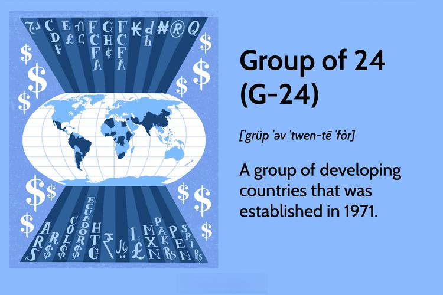

The modern financial landscape is characterized by its complexity and interconnected nature, where global finance, international economics, the role of the Group of 24 (G-24), and algorithmic trading play pivotal roles. This article explores these intertwined components, which have far-reaching implications for economies around the world. Global finance involves the movement and management of money on a worldwide scale, influencing economic policies and trade relations. It is a fundamental driver of international economics, affecting countries’ economic growth, employment rates, and overall stability.

International economics focuses on the economic interactions among countries, including trade, investment, and the effects of globalization. Major financial institutions, such as the International Monetary Fund (IMF) and the World Bank, are instrumental in shaping international economics by providing financial assistance, policy advice, and support for economic development. These institutions help facilitate the economic integration of nations, promote sustainable economic growth, and reduce poverty.



The Group of 24 (G-24) was established to ensure the representation of developing countries in international monetary discussions. This coalition advocates for the interests of these nations in the global financial system, seeking to influence policy decisions and promote a fairer economic order. The G-24’s efforts are crucial in addressing the financial challenges that developing countries face, including access to global markets and the impact of fiscal policies introduced by major economies.

Algorithmic trading has revolutionized global markets by using complex algorithms to automate trading decisions. This technology increases market efficiency and reduces trading costs, but it also presents challenges, such as market volatility and regulatory concerns. Algorithmic trading’s impact extends beyond developed economies, offering opportunities for G-24 countries to enhance their market presence and economic influence.

The interconnectedness of these topics is vital in today’s financial landscape. The flow of capital, the formulation of economic policies, and the adoption of cutting-edge technologies all contribute to a dynamic and constantly evolving global economy. Understanding these relationships is crucial for policymakers, financial institutions, and investors as they navigate current challenges and seize future opportunities.

This article is structured to provide a comprehensive examination of these topics. It begins by elucidating the fundamental principles of global finance and international economics. Next, it investigates into the role and influence of the G-24 in advocating for developing countries. The following section discusses how algorithmic trading operates in global markets, highlighting both its benefits and risks. The intersection of G-24 and algorithmic trading is analyzed to reveal how these economies can leverage technology to improve their market standing. Finally, emerging trends and future outlooks in global finance and international economics will be explored, providing insights into potential policy changes and advancements in financial technology.

## Table of Contents

## Understanding Global Finance and International Economics

Global finance refers to the system of financial institutions, regulations, and processes that underpin the global economy. It encompasses the exchange of capital and resources across international borders, influencing the economic health of nations and shaping global interactions. International economics, on the other hand, studies economic activities across countries, examining how financial systems, trade policies, and market operations affect economies worldwide.

One of the fundamental principles of global finance is the mobility of capital. Capital flows, arising from investments, loans, and deposits, facilitate economic growth and development but also introduce complexities such as exchange rate [volatility](/wiki/volatility-trading-strategies) and contingent liabilities. The impact of these capital movements on international economics is profound. They affect currency values, influence trade balances, and play a critical role in formulating monetary and fiscal policies.

Global finance significantly influences economic policymaking and trade relations. Countries engage in trade agreements and establish economic partnerships to foster economic growth and stability. For instance, global financial markets determine exchange rates, affecting export and import competitiveness. Trade policies thus need careful calibration against foreign exchange risk to maintain economic equilibrium. On a broader spectrum, the international financial environment can precipitate economic reforms, as seen in the 1997 Asian Financial Crisis, where nations implemented significant policy adjustments to stabilize their economies.

Major financial institutions, notably the International Monetary Fund (IMF) and the World Bank, are pivotal in shaping international economics. The IMF monitors global economic trends, provides policy advice, and offers financial assistance to countries facing balance of payment problems. Its influence helps maintain global financial stability, facilitating smoother international trade flows. Similarly, the World Bank's role in financing development projects supports infrastructure growth, poverty reduction, and sustainable development in emerging economies.

These institutions often guide nations through economically turbulent periods. For example, during financial crises, the IMF provides stabilizing loans requiring policy reforms to restore economic stability and investor confidence. The World Bank, with its focus on development, aids economic progress through projects aimed at improving education, health, and infrastructure, thereby enhancing economic outputs of the member countries.

In conclusion, global finance and international economics are intricately connected, with financial flows and policies shaping the global economic landscape. The collaboration and guidance provided by international financial institutions like the IMF and the World Bank are crucial for maintaining economic stability and facilitating growth worldwide, highlighting their indispensable role in the complexities of the global economic theatre.

## The Role and Influence of the G-24

The Group of 24 (G-24), officially known as the Intergovernmental Group of Twenty-Four on International Monetary Affairs and Development, was established in 1971 by developing countries that are members of the International Monetary Fund (IMF) and World Bank. The primary purpose of the G-24 is to coordinate the positions of developing countries on monetary and development issues within the Bretton Woods Institutions, ensuring that these nations have a collective voice in international financial discussions.

The G-24 plays a crucial role in advocating for the interests of developing countries, focusing on issues such as financial stability, sustainable development, and fair representation in international financial decision-making institutions. By acting as a united front, the G-24 aims to influence the international financial and economic system in a manner that considers the unique challenges and needs of developing countries.

**Benefits and Criticisms of the G-24**

The G-24's efforts in representing developing nations in the global financial arena come with both benefits and criticisms. One of the primary benefits is the enhanced collective negotiating power it provides to its member countries. This is vital in international negotiations, where developing nations often face significant bargaining asymmetries compared to developed countries. The G-24 also raises awareness of issues relevant to developing economies, such as debt sustainability and the need for equitable access to international financial resources.

However, criticisms of the G-24 include questions about its overall effectiveness and unity. With diverse economic interests and levels of development among its member countries, reaching consensus can sometimes be challenging. Detractors also argue that the G-24 lacks the financial and institutional power to effect substantial changes on its own. The group's ability to influence major policy decisions in the IMF and World Bank is sometimes limited by the voting structures of these institutions, which tend to favor wealthier nations.

**Key Outcomes and Challenges Faced by the G-24 Recently**

Recently, the G-24 has focused on several key outcomes and challenges, particularly around the global response to economic crises and the ongoing impacts of the COVID-19 pandemic. The group has called for a more inclusive global recovery, emphasizing the need for adequate financial support to developing countries, including debt relief and access to vaccines. The G-24 has also highlighted the need for reforms in the global financial architecture to better accommodate the evolving economic landscape and the interests of developing countries.

One of the main challenges faced by the G-24 is addressing the digital divide that affects many developing nations. As global finance becomes increasingly digital, with innovations such as fintech and digital currencies, the G-24 must find ways to ensure that its member countries are not left behind. This includes advocating for technology transfer and capacity-building initiatives.

In conclusion, while the G-24 provides an essential platform for developing countries to articulate their needs and coordinate their positions on global financial matters, it must continuously navigate the challenges of fragmentation, limited influence, and pressing global issues. As the international economic environment evolves, the G-24's role remains critical in advocating for a more equitable and inclusive global financial system.

## Algorithmic Trading in Global Markets

Algorithmic trading, also known as algo trading, refers to the use of computer algorithms to automatically execute trading orders in financial markets. These algorithms leverage mathematical models to determine the optimal timing, price, and quantity for trades. By automating the trading process, [algorithmic trading](/wiki/algorithmic-trading) reduces human error and allows for rapid execution of trades, often within milliseconds.

In global markets, algorithmic trading has become increasingly prevalent due to its ability to handle vast volumes of financial data and execute complex trading strategies at high speed. This approach to trading spans various asset classes, including stocks, bonds, commodities, and currencies. The algorithms use a mix of historical data, quantitative models, and [machine learning](/wiki/machine-learning) techniques to identify trading opportunities and execute trades.

The advantages of algorithmic trading are significant. First, it enhances efficiency by automating repetitive tasks and executing trades faster than human traders can manage. This speed advantage allows traders to capitalize on fleeting market opportunities and maintain a competitive edge in high-frequency trading environments. Second, algorithmic trading reduces trading costs by minimizing brokerage fees and the impact of market fluctuations on manually executed trades. This cost efficiency is exemplified by reduced bid-ask spreads and improved [liquidity](/wiki/liquidity-risk-premium).

However, algorithmic trading is not without its challenges and risks. One major challenge is market volatility. Algorithms can exacerbate market swings, as seen in flash crashes, where rapid sell-offs are intensified by automated trading systems. Additionally, the complexity of these algorithms can lead to unintended trading behaviors, which may destabilize markets.

Regulatory concerns also pose significant challenges. Financial regulators worldwide strive to keep pace with advancing technology. They implement rules to prevent market manipulation and ensure transparency. Stringent regulations, such as the European Union's Markets in Financial Instruments Directive II (MiFID II), aim to enhance the oversight of algorithmic trading activities and mitigate systemic risks.

Overall, algorithmic trading influences the dynamics of global markets by offering speed and efficiency while posing regulatory and market volatility challenges. As technology continues to evolve, the ongoing adaptation and oversight of algorithmic trading remain crucial to maintaining stable and fair financial markets.

## The Intersection of G-24 and Algo Trading

The Group of 24 (G-24), established to represent the interests of developing countries in international monetary discussions, stands at a unique juncture with the advent of algorithmic trading. This section explores how G-24 countries can harness algorithmic trading to enhance their market presence, assesses the economic impact of embracing advanced financial technologies, and examines specific case studies.

Algorithmic trading, the use of computer algorithms to automate trading decisions, provides several advantages that G-24 countries can exploit. With increased market efficiency and reduced trading costs, these nations can potentially strengthen their financial markets. Algorithms can execute trades at a speed and frequency inconceivable for human traders, thus ensuring better price accuracy and liquidity. Additionally, by adopting algorithmic trading strategies, G-24 countries can significantly enhance their competitiveness on the global stage.

For developing economies, integrating advanced financial technologies can stimulate economic growth. These technologies can improve transparency and regulatory oversight while also mitigating systemic risks. Financial technology fosters inclusive growth by enabling broader access to financial services, thus contributing to overall economic development.

#### Economic Impact of Algorithmic Trading in Developing Economies

The adoption of algorithmic trading in G-24 countries can facilitate capital inflows by showcasing enhanced market efficiency and liquidity. This could attract foreign investments, leading to economic growth and infrastructure development. Moreover, embracing algorithmic trading can help stabilize local markets by increasing their responsiveness to global economic shifts, which in turn can bolster investor confidence.

Developing economies can also leverage data-driven insights provided by trading algorithms to implement more informed and effective monetary policies. Enhanced data analysis capabilities allow for real-time economic assessments, enabling governments to swiftly address economic challenges.

#### Case Studies of G-24 Countries Using Algorithmic Trading

Several G-24 countries have already begun integrating algorithmic trading into their financial markets. For example, India has seen significant growth in algorithmic trading usage. With the Securities and Exchange Board of India (SEBI) establishing a framework for algorithmic trading in 2008, the country's financial markets have benefited from increased efficiency and reduced transaction costs. Algorithms now account for a substantial portion of the trading [volume](/wiki/volume-trading-strategy) on Indian stock exchanges, reflecting a transformative impact on market operations.

Similarly, South Africa has embraced algorithmic trading to improve both domestic and international investor participation in its markets. The Johannesburg Stock Exchange (JSE) has invested in technology to support high-frequency and algorithmic trading, thus attracting a broader range of investors and enhancing the exchange's global competitiveness.

In conclusion, the intersection of the G-24 and algorithmic trading presents a valuable opportunity for developing nations to boost their market presence and economic growth. By leveraging technological advances, these countries can effectively position themselves in the dynamic landscape of global finance. The success of case studies like India and South Africa serves as a testament to the potential benefits, encouraging further adoption and innovation in financial technologies across the G-24.

## Emerging Trends and Future Outlook

Emerging trends in global finance and international economics, particularly concerning the Group of 24 (G-24) countries, reflect significant shifts driven by digitalization, economic realignment, and shifting geopolitical priorities. With globalization advancing, these nations are actively leveraging financial technologies, including algorithmic trading, to bolster their economic positions and influence the global financial landscape.

One key trend is the integration of advanced financial technologies in developing economies, notably those of the G-24. Algorithmic trading, which involves the use of complex algorithms to automate and optimize trading strategies, offers these countries a path to enhance market efficiency and competitiveness. As algorithmic trading becomes more widespread, its predictive capabilities, capacity for processing large datasets, and ability to execute trades at optimal prices give countries adopting such technologies a competitive edge. Predictive modeling using machine learning algorithms can be particularly impactful, as demonstrated by the simple Python example below:

```python
import numpy as np
from sklearn.linear_model import LinearRegression

# Sample data: market factors and their resultant prices
X = np.array([[1, 2], [2, 3], [3, 4], [4, 5]])
y = np.array([3, 5, 7, 9])

# Linear regression model
model = LinearRegression().fit(X, y)

# Predict future prices given new market factors
new_factors = np.array([[5, 6]])
predicted_price = model.predict(new_factors)
print(predicted_price)
```

This code highlights the utility of algorithms in forecasting market trends, vital for G-24 countries focusing on augmenting their trading efficiency.

Additionally, developing countries are increasingly participating in global financial systems, necessitating adjustments in international economic policies. As these nations employ algorithmic trading, they pose potential risks associated with market volatility and the need for robust regulatory frameworks to mitigate systemic risks. Regulatory concerns emphasize the need for globally coherent policies to oversee the implementation and monitor the effects of such trading systems. The integration of blockchain technologies and cryptocurrencies, along with traditional trading systems, also demands an evolved regulatory landscape.

Future policy shifts are likely to focus on strengthening financial resilience against economic shocks, promoting sustainable development, and fostering equitable growth. Policies fostering digital infrastructure and capacity building will be vital for G-24 countries to harness potential economic benefits. Moreover, as algorithmic trading potentially reshapes international economic relations, policies must ensure fair competition and address information asymmetries, thereby contributing to stable and inclusive global financial systems.

Looking further ahead, algorithmic trading's role in shaping international economic relations is poised to grow as data analytics and [artificial intelligence](/wiki/ai-artificial-intelligence) continue to evolve. The G-24 can capitalize on these advancements to increase transparency, reduce transaction costs, and improve market liquidity. The adoption of such technologies could significantly impact their economic trajectories and standing in global finance.

In conclusion, G-24 countries are situated at a transformative juncture where embracing financial innovations like algorithmic trading can significantly enhance their economic influence. The need for coordinated policies and regulatory frameworks will be critical in navigating the complexities and opportunities presented by emerging financial technologies.

## Conclusion

The complex interplay between global finance, international economics, the G-24, and algorithmic trading reveals a sophisticated web of interactions that are shaping today's financial landscape. These interconnected areas are integral to understanding the mechanisms that govern our global economy. Global finance and international economics underpin trade relations and economic policymaking, with institutions like the International Monetary Fund (IMF) and the World Bank playing pivotal roles in fostering economic stability and development. The G-24, representing developing countries, strives to ensure these nations have a voice in global financial decisions, although it faces challenges and criticisms related to its efficacy and representation.

Algorithmic trading introduces a technological dimension to global finance, offering increased efficiency and reduced costs but also ushering challenges such as regulatory concerns and market volatility. The adoption of algorithmic trading by G-24 countries can potentially enhance their market presence and economic growth by leveraging these advanced technologies.

Understanding the dynamic relationship between these domains is crucial for navigating the future of international economics and finance. As emerging trends advance, exploring the influence of algorithmic trading on economic relations, alongside potential policy changes, can provide valuable insights. Continuous discussion and research are essential to adapt to and capitalize on these developments in a rapidly evolving financial environment.

## References & Further Reading

[1]: ["The Group of 24 (G-24)."](https://en.wikipedia.org/wiki/Group_of_24) International Monetary Fund (IMF).

[2]: Fernandez, Bernardo and Farias, Gustavo. ["Algorithmic Trading in Emerging Markets: A Case Study of Argentina."](https://ieeexplore.ieee.org/document/7397365) Journal of Financial Markets, Institutions & Instruments, 2018.

[3]: Varian, Hal R. (2014). ["Big Data: New Tricks for Econometrics."](https://www.aeaweb.org/articles?id=10.1257/jep.28.2.3) Journal of Economic Perspectives, 28(2), 3-28.

[4]: Dastidar, S. G., & Puskorius, G. L. ["Machine Learning Applications in Portfolio Management."](https://www.sciencedirect.com/science/article/pii/S1366554524000450) CFA Institute Research Foundation, 2020.

[5]: Basu, Anurag (2014). ["Algorithmic Trading: An Overview."](https://www.sciencedirect.com/topics/economics-econometrics-and-finance/algorithmic-trading) The Journal of Trading, Fall 2014, Vol. 9, No. 3: pp. 17-29.

[6]: ["Technology and the Global Economy."](https://cowles.yale.edu/sites/default/files/2024-03/d2385.pdf) National Bureau of Economic Research (NBER).

[7]: Schroeck, Michael and Shockley, Bob. ["Analytics: The Real-World Use of Big Data in Financial Services."](https://www.ciosummits.com/media/solution_spotlight/GBE03555USEN.pdf) IBM Global Survey. 

[8]: ["The Financial Crisis and Information Gaps."](https://www.imf.org/external/np/g20/pdf/102909.pdf) International Monetary Fund (IMF) and Financial Stability Board (FSB).