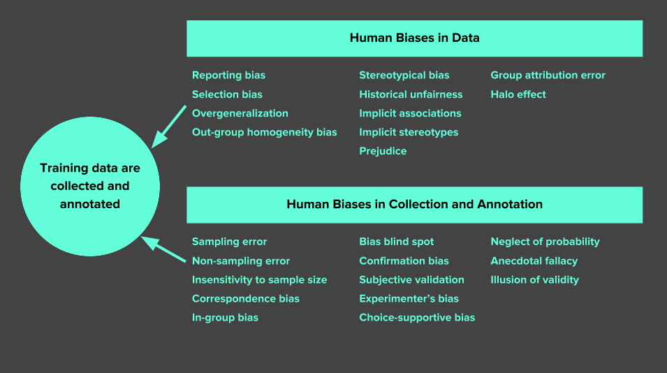

## Table of Contents

## What is Group Attribution Bias in the context of machine learning?

Group Attribution Bias in machine learning refers to a situation where a model incorrectly assumes that characteristics of a group apply to every individual within that group. This can happen when a model is trained on data that has certain patterns or biases related to different groups, like age, gender, or ethnicity. For example, if a model is trained mostly on data from one particular group, it might perform poorly or make unfair predictions for individuals from other groups.

This bias can lead to unfair or inaccurate outcomes in machine learning applications. For instance, if a model used for hiring predicts that all candidates from a certain educational background will perform poorly, it might overlook talented individuals from that group. To reduce Group Attribution Bias, it's important to use diverse and representative data when training models, and to regularly check and adjust the model to make sure it treats all groups fairly.

## How does Group Attribution Bias affect machine learning models?

Group Attribution Bias can make machine learning models treat people unfairly. When a model learns from data that mostly represents one group, it might think everyone in that group is the same. For example, if a model for loan approvals is trained mostly on data from older people, it might wrongly assume that all older people are good at paying back loans. This can lead to the model making bad decisions about younger people who might be just as good at paying back loans.

To fix this problem, it's important to use data that includes all kinds of people when training the model. This way, the model can learn about different groups and make fairer decisions. If a model is used for deciding who gets a job, using diverse data helps make sure it doesn't ignore good candidates just because they belong to a certain group. Regular checks and adjustments to the model can also help keep it fair for everyone.

## What are some common examples of Group Attribution Bias in machine learning applications?

One common example of Group Attribution Bias in [machine learning](/wiki/machine-learning) is in the hiring process. If a model is trained mostly on data from male candidates, it might assume that men are better suited for certain jobs than women. This can lead to the model unfairly rejecting female candidates, even if they are qualified. For instance, if the training data shows that men with certain degrees are often hired, the model might overlook women with the same qualifications, thinking they won't fit the job as well.

Another example is in credit scoring. If a model is trained on data where one ethnic group has a higher rate of loan repayment, it might assume that all members of that group are good at paying back loans. This can result in the model giving better loan terms to people from that group, while being stricter with others, even if their financial situations are similar. This kind of bias can make it harder for people from other groups to get loans, even if they are just as likely to repay them.

In healthcare, Group Attribution Bias can also appear. If a model is trained on data mostly from one age group, it might not work well for older or younger patients. For example, if the data used to train a model for diagnosing diseases comes mostly from middle-aged people, the model might miss important signs in older or younger patients. This can lead to wrong diagnoses or treatments, which can be harmful to patients who are not well represented in the training data.

## What are the potential consequences of Group Attribution Bias in machine learning systems?

Group Attribution Bias in machine learning can lead to unfair treatment of people. When a model learns from data that mostly represents one group, it might make wrong guesses about other groups. For example, if a model for hiring is trained mostly on data from men, it might think that men are better for certain jobs than women. This can cause the model to unfairly reject women who are just as qualified. This kind of bias can make it hard for people from certain groups to get jobs, loans, or healthcare, even if they deserve them.

In the long run, Group Attribution Bias can harm society. If people from certain groups are often treated unfairly by machine learning models, it can make inequality worse. For instance, if a model used for loan approvals always gives better terms to one ethnic group, people from other groups might have a harder time getting loans. This can affect their ability to buy homes or start businesses. To avoid these problems, it's important to use data that includes all kinds of people when training models and to check the models regularly to make sure they are fair to everyone.

## How can Group Attribution Bias be identified in machine learning models?

To identify Group Attribution Bias in machine learning models, you need to check how the model treats different groups of people. One way to do this is by looking at the model's performance across different groups. For example, if a model is used for loan approvals, you can compare how often it approves loans for people from different ethnic backgrounds. If the approval rates are very different for each group, it might mean the model has Group Attribution Bias. You can use tools like fairness metrics to measure this. These tools help you see if the model is treating all groups fairly or if it's making decisions based on group characteristics.

Another way to spot Group Attribution Bias is by testing the model with different kinds of data. You can create test sets that include equal numbers of people from different groups. Then, you run the model on these test sets and see if it makes the same kinds of predictions for everyone. If the model works well for one group but not for others, it's a sign of bias. It's also helpful to get feedback from people who use the model. If they notice that the model seems to treat certain groups unfairly, it's a good clue that Group Attribution Bias might be at work.

## What techniques can be used to mitigate Group Attribution Bias in machine learning?

One way to reduce Group Attribution Bias in machine learning is by using diverse and representative data when training the model. This means including data from all kinds of people, not just one group. When a model learns from a wide range of data, it can make better guesses about everyone, not just people from one group. For example, if a model for hiring is trained on data from both men and women, it can learn to make fair decisions about all candidates. You can also use techniques like resampling to balance the data, making sure no group is over- or under-represented. This helps the model treat everyone fairly.

Another technique is to use fairness metrics to check the model's performance across different groups. These metrics can show if the model is treating all groups the same way or if it's making decisions based on group characteristics. If the model is biased, you can adjust it by changing the training data or the model itself. For example, you can add more data from underrepresented groups or use algorithms that focus on fairness. Regular checks and adjustments help keep the model fair for everyone. By using these methods, you can make sure the model doesn't unfairly judge people based on their group.

## How does Group Attribution Bias relate to fairness and ethics in machine learning?

Group Attribution Bias in machine learning can lead to unfair treatment of people because it makes the model think that everyone in a certain group is the same. This can happen when the model is trained on data that mostly comes from one group, like men or people from a certain ethnic background. When the model only learns about one group, it might make wrong guesses about other groups. For example, if a model for hiring is trained mostly on data from men, it might think men are better for certain jobs than women. This can cause the model to unfairly reject women who are just as qualified. This kind of bias goes against fairness and can make it hard for people from certain groups to get jobs, loans, or healthcare.

To make machine learning models more fair and ethical, it's important to use data that includes all kinds of people when training the model. This way, the model can learn about different groups and make fair decisions about everyone. Regular checks and adjustments to the model can also help keep it fair. By using fairness metrics, you can see if the model is treating all groups the same way or if it's making decisions based on group characteristics. If the model is biased, you can fix it by adding more data from underrepresented groups or using algorithms that focus on fairness. This helps make sure the model doesn't unfairly judge people based on their group, which is important for treating everyone fairly and ethically.

## Can you explain a case study where Group Attribution Bias was successfully addressed in a machine learning project?

In a case study from a large tech company, Group Attribution Bias was successfully addressed in a machine learning project aimed at improving the fairness of their hiring algorithm. The company noticed that their model was unfairly rejecting female candidates for technical roles, even though many were highly qualified. To fix this, they first analyzed the training data and found that it was heavily skewed towards male candidates. They then worked to collect more data from female candidates and used resampling techniques to balance the dataset. By retraining the model with this more diverse data, the company was able to reduce the bias and ensure that the algorithm gave fair consideration to all applicants, regardless of gender.

The success of this project was measured using fairness metrics that compared the model's performance across different groups. Before the changes, the model had a significant difference in acceptance rates between male and female candidates. After retraining with the balanced dataset, these differences were minimized, showing that the model was now treating all candidates more equitably. This case study highlights the importance of using diverse data and regularly checking for bias to create machine learning models that are fair and ethical. By addressing Group Attribution Bias, the company not only improved the fairness of their hiring process but also set a standard for other organizations to follow in their machine learning practices.

## What are the challenges in measuring the impact of Group Attribution Bias in complex machine learning models?

Measuring the impact of Group Attribution Bias in complex machine learning models can be tough. One big challenge is that these models often have many layers and lots of data points, making it hard to see where the bias is coming from. When a model is very complicated, it's like trying to find a small needle in a huge haystack. You need to look at how the model treats different groups, but with so many parts to check, it can take a long time and needs careful work.

Another challenge is that the data used to train the model might not be perfect. Sometimes, the data itself has biases, which can make it hard to tell if the model's decisions are fair or not. For example, if the training data mostly comes from one group, the model might learn to make decisions based on that group's patterns. To measure the impact of Group Attribution Bias, you need to use fairness metrics, but these metrics can be tricky to apply correctly in very complex models. It's like trying to judge if a cake is evenly baked when you can only see a small piece of it.

## How do different machine learning algorithms vary in their susceptibility to Group Attribution Bias?

Different machine learning algorithms can be more or less likely to show Group Attribution Bias depending on how they learn from data. For example, simpler models like linear regression or decision trees might be easier to check for bias because you can see how they make decisions. These models use clear rules or equations to predict outcomes, so it's easier to spot if they're treating different groups unfairly. On the other hand, more complex models like deep neural networks can be harder to check for bias. These models have many layers and learn in ways that are hard to understand, making it tough to see where bias might be coming from.

Some algorithms are designed to be more fair from the start. For instance, algorithms that focus on fairness, like those using fairness constraints, try to make sure the model treats all groups the same way. These models might be less likely to show Group Attribution Bias because they are built to avoid it. But even with these special algorithms, it's still important to use good data and check the model often to make sure it's working fairly. No matter what kind of algorithm you use, the key to reducing Group Attribution Bias is to use diverse data and keep an eye on how the model treats different groups.

## What role does data collection and preprocessing play in reducing Group Attribution Bias?

Data collection and preprocessing are super important for reducing Group Attribution Bias in machine learning models. When you collect data, you need to make sure it includes people from all kinds of groups, not just one. If your data mostly comes from one group, like men or people from a certain place, the model might learn to make decisions based on that group's patterns. This can lead to unfair guesses about other groups. By collecting data that represents everyone, you help the model learn about different people and make fair decisions. For example, if you're making a model for hiring, you should gather data from both men and women to make sure the model doesn't unfairly favor one group.

Preprocessing the data is also key to reducing bias. This means cleaning and balancing the data before you use it to train the model. Sometimes, the data you collect has biases in it, like if one group is over-represented. You can use techniques like resampling to fix this. Resampling helps you balance the data so that no group is over- or under-represented. This makes the model learn from a fair sample of everyone. By carefully collecting and preprocessing your data, you can help make sure the model treats all groups the same way, reducing Group Attribution Bias and making your machine learning project more fair and ethical.

## How can ongoing monitoring and updating of machine learning models help in managing Group Attribution Bias?

Ongoing monitoring and updating of machine learning models are key to managing Group Attribution Bias. By regularly checking how the model is doing, you can spot if it's treating different groups unfairly. For example, if a model for loan approvals starts giving better terms to one group over another, you can catch this early. You can use fairness metrics to see if the model is making the same kinds of decisions for everyone. If you find bias, you can fix it by retraining the model with more balanced data or by tweaking the model itself to be fairer.

Updating the model often helps keep it fair over time. As new data comes in, the world changes, and the model needs to keep up. If you don't update the model, it might keep using old patterns that are no longer fair. By adding new, diverse data and retraining the model, you make sure it learns about current trends and treats everyone the same. This way, the model stays accurate and fair, reducing Group Attribution Bias and helping to make sure everyone gets a fair shot.