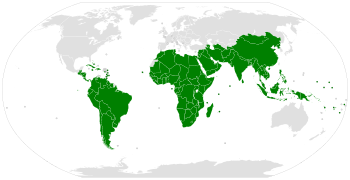

## Table of Contents

## What is the Group of 77?

The Group of 77 (G77) is a group of developing countries that work together to promote their common economic interests and improve their negotiating power in the United Nations. It was formed in 1964 by 77 countries, and today it has more than 130 member countries. The G77 helps its members to speak with one voice on important issues like trade, development, and the environment.

The G77 meets regularly to discuss and coordinate their positions on global issues. They also work together to support each other in areas like technology transfer, financial assistance, and capacity building. By working together, the G77 helps its member countries to have a stronger say in global economic discussions and to push for policies that benefit developing nations.

## When was the Group of 77 established?

The Group of 77 was established in 1964. At that time, 77 developing countries came together to form this group. They wanted to have more power when talking about economic issues in the United Nations.

Today, the Group of 77 has more than 130 member countries. They work together to help each other and to make sure their voices are heard in global discussions about trade, development, and the environment. By working as a team, they can push for policies that help developing countries.

## What is the primary objective of the Group of 77?

The main goal of the Group of 77 is to help developing countries work together to improve their economic situation. They want to have a stronger voice when talking about important issues like trade and development in the United Nations. By working together, the countries in the G77 can support each other and make sure their needs are heard on the global stage.

The G77 helps its members by sharing technology, giving financial help, and building their skills. This group started with 77 countries in 1964, but now it has more than 130 members. They meet often to talk about their common problems and to plan how they can work together to solve them. By sticking together, the G77 helps its members to have more power in global economic discussions and to push for policies that help developing nations.

## How is the Group of 77 structured?

The Group of 77 is made up of more than 130 countries that work together. They have a leader called the Chairperson, who changes every year. The Chairperson comes from a different country each year. This helps make sure that all countries get a chance to lead. The Chairperson speaks for the group and helps plan their meetings.

The G77 also has smaller groups inside it. These smaller groups are called chapters. Each chapter focuses on different parts of the world, like Africa, Latin America, or Asia. The chapters help the countries in their area talk about their specific problems and work together to solve them. By having these smaller groups, the G77 can better help all its members.

The G77 meets often to talk about important issues. They plan how to work together on things like trade, development, and the environment. By working as a team, the G77 helps its members have a stronger voice in the United Nations and other global talks. This helps them push for policies that help developing countries.

## Who are the current member nations of the Group of 77?

The Group of 77 has more than 130 member countries. Some of these countries are Afghanistan, Algeria, Angola, Antigua and Barbuda, Argentina, Bahamas, Bahrain, Bangladesh, Barbados, Belize, Benin, Bhutan, Bolivia, Botswana, Brazil, Brunei Darussalam, Burkina Faso, Burundi, Cambodia, Cameroon, Cape Verde, Central African Republic, Chad, Chile, China, Colombia, Comoros, Congo, Costa Rica, Cuba, Democratic People's Republic of Korea, Democratic Republic of the Congo, Djibouti, Dominica, Dominican Republic, Ecuador, Egypt, El Salvador, Equatorial Guinea, Eritrea, Eswatini, Ethiopia, Fiji, Gabon, Gambia, Ghana, Grenada, Guatemala, Guinea, Guinea-Bissau, Guyana, Haiti, Honduras, India, Indonesia, Iran, Iraq, Ivory Coast, Jamaica, Jordan, Kenya, Kiribati, Kuwait, Laos, Lebanon, Lesotho, Liberia, Libya, Madagascar, Malawi, Malaysia, Maldives, Mali, Marshall Islands, Mauritania, Mauritius, Mexico, Micronesia, Mongolia, Morocco, Mozambique, Myanmar, Namibia, Nauru, Nepal, Nicaragua, Niger, Nigeria, Oman, Pakistan, Palau, Panama, Papua New Guinea, Paraguay, Peru, Philippines, Qatar, Rwanda, Saint Kitts and Nevis, Saint Lucia, Saint Vincent and the Grenadines, Samoa, Sao Tome and Principe, Saudi Arabia, Senegal, Seychelles, Sierra Leone, Singapore, Solomon Islands, Somalia, South Africa, South Sudan, Sri Lanka, Sudan, Suriname, Syria, Tanzania, Thailand, Timor-Leste, Togo, Tonga, Trinidad and Tobago, Tunisia, Turkmenistan, Tuvalu, Uganda, United Arab Emirates, Uruguay, Vanuatu, Venezuela, Vietnam, Yemen, Zambia, and Zimbabwe.

These countries work together to help each other and to have a stronger voice in the United Nations. They talk about important issues like trade, development, and the environment. By working as a team, they can push for policies that help developing countries. The Group of 77 was started in 1964 with 77 countries, but now it has grown to include many more.

The Group of 77 has a leader called the Chairperson, who changes every year. This helps make sure that all countries get a chance to lead. The Chairperson speaks for the group and helps plan their meetings. The G77 also has smaller groups inside it called chapters, which focus on different parts of the world like Africa, Latin America, or Asia. These chapters help the countries in their area talk about their specific problems and work together to solve them. By having these smaller groups, the G77 can better help all its members.

## How does the Group of 77 function within the United Nations?

The Group of 77 works inside the United Nations to help developing countries. They want to make sure that the needs of these countries are heard and that they have more power when talking about important issues like trade and development. The G77 helps its members work together to make their voices stronger. They meet often to talk about what they want and how they can support each other. By working as a team, they can push for policies that help developing countries.

The G77 has a leader called the Chairperson who changes every year. This helps make sure that all countries get a chance to lead. The Chairperson speaks for the group and helps plan their meetings. Inside the G77, there are also smaller groups called chapters. These chapters focus on different parts of the world like Africa, Latin America, or Asia. They help the countries in their area talk about their specific problems and work together to solve them. By having these smaller groups, the G77 can better help all its members within the United Nations.

## What is the role of the Chair of the Group of 77?

The Chair of the Group of 77 is very important. They are the leader of the group and help all the countries work together. The Chair changes every year, which means a different country gets to lead each year. This helps make sure everyone has a chance to be in charge. The Chair speaks for the whole group and helps plan their meetings. They make sure that everyone's voice is heard and that the group can work well together.

The Chair also helps the Group of 77 talk to other countries and groups inside the United Nations. They try to make sure that the needs of developing countries are understood and that they can have more power in global talks. By leading the group, the Chair helps push for policies that help developing countries. They work hard to make sure the Group of 77 can do its job well and help its members.

## How does the Group of 77 coordinate its activities and policies?

The Group of 77 works together by meeting often to talk about what they want and how they can help each other. They have a leader called the Chairperson who changes every year. This leader helps plan the meetings and speaks for the whole group. The Chairperson makes sure everyone's voice is heard and that the group can work well together. They also help the Group of 77 talk to other countries and groups inside the United Nations. By doing this, they try to make sure the needs of developing countries are understood and that they can have more power in global talks.

The Group of 77 also has smaller groups inside it called chapters. These chapters focus on different parts of the world like Africa, Latin America, or Asia. They help the countries in their area talk about their specific problems and work together to solve them. By having these smaller groups, the G77 can better help all its members. The chapters meet and plan how they can support each other. This way, the Group of 77 can work together more effectively and push for policies that help developing countries.

## What are some significant achievements of the Group of 77?

The Group of 77 has made many important achievements since it started. One big success is that they have helped developing countries have a stronger voice in the United Nations. By working together, they can talk about their needs and push for policies that help them. The G77 has also helped its members share technology and give financial help to each other. This has made it easier for developing countries to grow and improve their economies.

Another important achievement is that the G77 has worked to make global trade fairer for developing countries. They have pushed for rules that help these countries sell their goods and services around the world. The group has also helped with projects that focus on things like health, education, and the environment. By working together, the G77 has made a big difference in the lives of people in developing countries.

## How does the Group of 77 influence global economic policies?

The Group of 77 helps shape global economic policies by working together to make sure the needs of developing countries are heard. They meet often to talk about what they want and how they can help each other. By working as a team, they can push for rules and policies that help developing countries grow and improve their economies. The G77 talks to other countries and groups inside the United Nations to make sure their voices are strong. This helps them influence global talks about trade, development, and the environment.

One way the G77 influences global economic policies is by pushing for fairer trade rules. They want to make sure that developing countries can sell their goods and services around the world without too many problems. The group also works on projects that help with things like health, education, and the environment. By doing this, they help make the world a better place for people in developing countries. Overall, the G77's work helps make global economic policies more fair and helpful for all countries.

## What challenges does the Group of 77 face in achieving its goals?

The Group of 77 faces many challenges in trying to reach its goals. One big problem is that the member countries are very different from each other. They have different needs and problems, so it can be hard for them to agree on what to do. This makes it difficult for the G77 to speak with one voice when talking to other countries and groups in the United Nations. Another challenge is that the world is always changing. New problems come up all the time, and the G77 has to keep up with these changes to stay relevant.

Another challenge is that developing countries often don't have as much power or money as richer countries. This can make it hard for the G77 to push for the policies they want. They have to work hard to get other countries to listen to them and to make sure their needs are taken seriously. Despite these challenges, the G77 keeps working together to help its members and to make the world a better place for developing countries.

## How has the Group of 77 evolved since its inception?

Since it started in 1964, the Group of 77 has grown a lot. At first, it had just 77 countries, but now it has more than 130 members. This shows that more and more countries want to work together to help developing nations. The group has also changed how it works. It now has a leader called the Chairperson who changes every year. This helps make sure that all countries get a chance to lead and that the group can keep working well together.

The Group of 77 has also become better at talking to other countries and groups inside the United Nations. They meet often to talk about what they want and how they can help each other. By working as a team, they can push for policies that help developing countries. The group has also started smaller groups called chapters, which focus on different parts of the world. This helps them deal with specific problems in different areas. Overall, the Group of 77 has become stronger and more organized over time, which helps them do their job better.

## References & Further Reading

[1]: UNCTAD (2021). ["The Group of 77 and China - History and Evolution."](https://unctad.org/meeting/fifteenth-ministerial-meeting-group-77-and-china) United Nations Conference on Trade and Development.

[2]: Lopez de Prado, M. (2018). ["Advances in Financial Machine Learning."](https://www.amazon.com/Advances-Financial-Machine-Learning-Marcos/dp/1119482089) Wiley.

[3]: Aronson, D.R. (2007). ["Evidence-Based Technical Analysis: Applying the Scientific Method and Statistical Inference to Trading Signals."](https://www.amazon.com/Evidence-Based-Technical-Analysis-Scientific-Statistical/dp/0470008741) Wiley.

[4]: Chan, E.P. (2009). ["Quantitative Trading: How to Build Your Own Algorithmic Trading Business."](https://github.com/ftvision/quant_trading_echan_book) Wiley.

[5]: Jansen, S. (2020). ["Machine Learning for Algorithmic Trading."](https://github.com/stefan-jansen/machine-learning-for-trading) Packt Publishing.

[6]: Basu, K., & Stiglitz, J.E. (Eds.). (2016). ["Inequality and Growth: Patterns and Policy."](https://link.springer.com/book/10.1057/9781137554543) Palgrave Macmillan.

[7]: Gantz, J. & Reinsel, D. (2011). ["Extracting Value from Chaos."](https://www.sciepub.com/reference/140415) IDC iView.