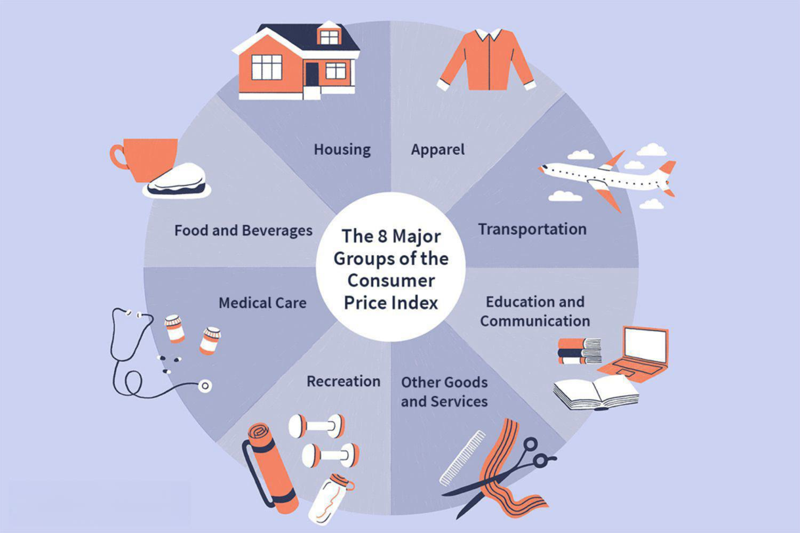

The Group of Eight (G8) was formed as a consortium of the world’s leading industrialized nations, primarily to foster economic growth, stabilize financial systems, and address critical global challenges through cooperation and dialogue. Comprised initially of the United States, United Kingdom, Canada, Germany, Japan, Italy, France, and Russia, the G8 represented a significant portion of the global economy and wielded considerable influence in international economic policies. Central to its mission was the promotion of open markets and economic sustainability, which necessitated diplomatic engagement among member states to synchronize policies and initiatives that address global economic and monetary issues.

The importance of international relations in the context of global economics cannot be overstated. As economic interdependencies continue to deepen, collective efforts by multinational groups like the G8 are crucial for addressing issues such as trade imbalances, financial instability, and sustainable development. These interdependencies require nations to collaborate across borders to achieve macroeconomic stability, thereby fostering an interconnected world where policies in one region can have profound impacts globally.



In 2014, the G8 experienced a pivotal transformation when Russia was excluded due to geopolitical tensions over Ukraine, subsequently evolving into the Group of Seven (G7). This shift underscored the political dimensions entwined with economic collaborations within such international forums, highlighting the delicate balance between economic objectives and geopolitical realities.

In tandem with these geopolitical shifts, technology has increasingly played a pivotal role in shaping international financial markets, with algorithmic trading, or algo trading, emerging as a transformative force. Algorithmic trading involves the use of sophisticated algorithms and advanced computational methods to execute trades at speeds and volumes that far surpass human capabilities. Its ability to process vast amounts of data and execute trades in milliseconds has not only revolutionized traditional trading methods but has also made financial markets more dynamic and complex.

The intersection of global policymaking and algo trading sets the stage for a multifaceted discussion on how international regulations and cooperative frameworks can adapt to technological advancements that are reshaping financial landscapes. As policymakers grapple with the implications of algorithmic trading, considerations surrounding market stability, transparency, and ethical standards become crucial. Therein lies the ongoing challenge for groups like the G7 to adapt policy frameworks that foster technological innovation while ensuring the orderly functioning of global financial markets.

## Table of Contents

## Understanding the G8/G7

The Group of Eight (G8) was an informal forum of the world's major industrialized economies, originally comprising the United States, the United Kingdom, Canada, Germany, Japan, Italy, and France, with Russia joining in 1998. Established in response to global economic challenges, the group's objectives centered around coordinating economic policy and addressing international monetary issues to foster economic stability. 

The history of the G8 traces back to the early 1970s when leading industrial democracies faced significant economic turbulence, including the collapse of the Bretton Woods monetary system and the 1973 oil crisis. This led to the formation of the "Library Group" of finance ministers, which evolved into the G7 following a summit in France in 1975. The G7 was formalized to provide a platform for discussion and coordination among the world's most advanced economies, addressing issues such as inflation, trade, and economic development. In 1998, the inclusion of Russia signaled a post-Cold War strategic shift and the desire to integrate Russia into the global economic system, forming the G8.

The presence of member countries like the United States and the United Kingdom provides significant influence due to their large economies and political power. Germany, as Europe's largest economy, alongside France and Italy, ensures robust European representation. Japan's inclusion as the largest Asian economy reinforces the group's global scope, and Canada's role, as a stable and resource-rich economy, rounds out the geographic diversity. Together, these nations accounted for a substantial portion of the world's GDP, providing the G8 with considerable sway in global economic policymaking.

The dynamics of the group shifted notably following Russia's suspension in 2014, which was a response to its annexation of Crimea. This geopolitical tension underscored the importance of abiding by international laws and norms, reflecting the group's commitment to a rules-based global order. The suspension effectively transformed the G8 back into the G7, emphasizing unity among its remaining members in promoting democratic governance and economic cooperation. This shift brought to fore discussions about the inclusivity and adaptability of the group in an evolving global landscape.

## The Role of the G8/G7 in Global Economic Policies

The Group of Seven (G7) has played a pivotal role in shaping global economic policies since its establishment. Comprised of seven of the world's largest advanced economies—Canada, France, Germany, Italy, Japan, the United Kingdom, and the United States—the G7 wields significant influence in addressing international economic challenges. The group's collective efforts aim to promote economic stability, sustainable growth, and collective prosperity.

Historically, the G7 has been instrumental in navigating numerous economic crises. During the 2008 global financial crisis, for instance, the G7 coordinated economic stimulus packages to rejuvenate their economies and stabilize global markets. The group emphasized fiscal stimulus, accommodating monetary policies, and international cooperation to mitigate the crisis's impact. Another notable instance is the G7's response to the European sovereign debt crisis in the early 2010s. The group supported measures to strengthen the Eurozone’s financial system and encouraged structural reforms within the affected countries.

Despite its significant influence, the G7 operates through non-legislative means. It functions primarily through cooperation, dialogue, and consensus among member nations. The decisions made in G7 meetings lack legal binding, relying instead on the collective will and commitment of its members to uphold the agreed recommendations. This approach allows for flexible and adaptive policymaking but also highlights the group's dependency on member compliance and mutual interest in the suggested policies.

The exclusivity of the G7—limited to seven of the wealthiest nations—has attracted criticisms, particularly concerning its representation of the global economic landscape. Critics argue that the G7's composition does not reflect the contemporary global economy, which includes emerging markets that play increasingly vital roles. This has led to calls for broader representation, advocating for the inclusion of nations from diverse economic backgrounds to ensure more comprehensive and inclusive decision-making processes.

In summary, while the G7 exerts considerable influence over global economic policy through collaboration and consensus, its non-binding nature and limited membership present challenges. To maintain its relevancy and effectiveness, the G7 may need to consider reforms that address its exclusivity and accommodate a broader spectrum of global economic voices.

## Algo Trading: An Overview

Algorithmic trading, commonly known as algo trading, involves the use of computer algorithms to automate trading decisions on financial markets. These algorithms execute pre-defined trading instructions at speeds and frequencies impossible for human traders, thus significantly enhancing trading efficiency. The main advantage of [algorithmic trading](/wiki/algorithmic-trading) lies in its ability to process vast amounts of data quickly, leading to increased market [liquidity](/wiki/liquidity-risk-premium) and reduced transaction costs.

Traditionally, trading required human intervention, relying on traders' instincts and experience to execute buy or sell orders based on market conditions. Algo trading has revolutionized this process by eliminating the need for human judgment in trade execution. It allows for precise order handling, including timing, price, and quantity, which optimizes trading strategies and potentially improves profitability.

One prominent aspect of algorithmic trading is high-frequency trading ([HFT](/wiki/high-frequency-trading-strategies)), which involves executing a large number of orders at extremely high speeds. HFT algorithms capitalize on very short-lived market trends and price discrepancies that would be unnoticeable to human traders. Machine learning and automated decision-making are integral to algorithmic trading, enabling systems to analyze market patterns, learn from data, and adapt strategies without human intervention. 

For instance, [machine learning](/wiki/machine-learning) models can predict potential price movements by analyzing historical market data. Here is a basic example in Python, illustrating a simple moving average crossover strategy using historical price data:

```python
import numpy as np
import pandas as pd

# Generate a mock dataset
np.random.seed(0)
dates = pd.date_range('20210101', periods=100)
prices = pd.Series(np.random.rand(100) * 100, index=dates)

# Calculate moving averages
short_window = 20
long_window = 50

signals = pd.DataFrame(index=prices.index)
signals['price'] = prices
signals['short_mavg'] = prices.rolling(window=short_window, min_periods=1).mean()
signals['long_mavg'] = prices.rolling(window=long_window, min_periods=1).mean()

# Create signals
signals['signal'] = 0.0
signals['signal'][short_window:] = np.where(signals['short_mavg'][short_window:] > signals['long_mavg'][short_window:], 1.0, 0.0) 

# Generate trading orders
signals['positions'] = signals['signal'].diff()

print(signals.tail())
```

Technological advancements have significantly propelled the evolution of algo trading. The development of low-latency trading systems enables algorithms to respond to market changes in milliseconds, or even microseconds. Furthermore, the integration of [artificial intelligence](/wiki/ai-artificial-intelligence) and machine learning into trading systems allows for the continuous enhancement of trading algorithms through self-learning capabilities.

Overall, algo trading has profoundly transformed the financial markets by enhancing trading efficiency and introducing new complexities related to speed, data analysis, and market behavior. As technology continues to evolve, its role in shaping the future of financial markets and trading strategies will likely remain substantial.

## The Intersection of G8/G7 Policies and Algo Trading

The Group of Seven (G7) plays a pivotal role in shaping global financial markets, thereby influencing the practices of algorithmic trading, commonly known as algo trading. G7 policies, rooted in their collective economic influence, often set the tone for global economic strategies and affect market conditions where algo trading is prevalent.

### Influence on Global Financial Markets

G7 policies significantly impact global financial markets by fostering stability and promoting economic growth. Decisions made during G7 summits can affect macroeconomic variables, such as interest rates and foreign exchange rates, which are critical inputs for algo trading algorithms. For instance, changes in interest rates decided by G7 members can influence the cost of borrowing and investment returns, triggering algorithmic adjustments in trading strategies across global markets.

### Regulations and Standards

Although the G7 itself does not enact binding regulations, it promotes standards and guidelines that member countries often adopt and implement nationally. These guidelines can significantly affect algo trading. For example, the G7 has stressed the importance of transparency and risk management in financial operations, which align with the regulatory frameworks such as the European Union's Markets in Financial Instruments Directive II (MiFID II). MiFID II imposes stringent reporting and operational requirements on algorithmic trading to prevent market abuse and enhance transparency. Consequently, such standards, while not directly legislated by the G7, reflect the group's influence on enhancing the ethical landscape of algo trading.

### Ethical and Transparent Practices

The G7's role in fostering cooperation among its members indirectly ensures ethical and transparent algo trading practices. By encouraging collaborative efforts to combat financial fraud and enhance cybersecurity, the G7 contributes to creating a safer trading environment. Member nations, through forums facilitated by the G7, share best practices and technological advancements that mitigate risks associated with algorithmic trading, such as erroneous trades and market manipulation. This cooperation is crucial in maintaining confidence in global financial systems, where algorithmic trading plays an increasingly central role.

In conclusion, G7 policies and their dissemination through member states have a profound effect on global financial markets. By promoting stability, setting standards, and ensuring cooperation, the G7 indirectly shapes the practices and ethical considerations within algorithmic trading landscapes, influencing both current operations and future regulatory developments.

## Challenges and Criticisms

The Group of Seven (G7) faces significant challenges in overseeing global markets impacted by algorithmic trading (algo trading), largely due to its non-legislative nature and reliance on cooperation and guidelines rather than enforceable mandates. Algo trading, which relies on complex algorithms to execute trades at high speeds, has transformed global financial markets, offering both benefits and complications. This transformation poses unique challenges for the G7 in terms of market regulation, [volatility](/wiki/volatility-trading-strategies), and fairness.

Algo trading introduces a level of complexity and speed in market operations that traditional regulatory bodies, including the G7 countries, find difficult to monitor effectively. The rapid transactions facilitated by algorithms can result in significant market volatility. Events such as the "Flash Crash" of 2010, where the U.S. stock market dropped and rebounded rapidly within minutes, highlight the potential for algorithms to destabilize markets. The challenge for the G7 is to recommend regulatory practices that can adequately predict and mitigate such rapid fluctuations, without stifling technological innovation.

Furthermore, algo trading has been criticized for creating an uneven playing field. Large financial institutions with advanced technological resources can execute trades faster and more efficiently than smaller firms or individual investors. This disparity raises concerns about fairness, as those with greater access to technological infrastructure have a distinct advantage. The G7 must address these criticisms by promoting recommendations that encourage transparency and equal access within financial markets.

The inclusion of emerging markets in global economic discussions is another area of ongoing debate. As emerging economies grow and become more integrated into global finance, their participation in forums like the G7 gains importance. Emerging markets face different challenges, such as less developed financial infrastructures and regulatory frameworks, which may not be fully addressed by the G7's existing discussions. Incorporating these economies more fully would not only enhance the legitimacy of the G7's recommendations but also ensure a more comprehensive approach to global financial stability.

In summary, while the G7 plays a pivotal role in shaping international economic policy, its ability to police algo trading effectively is hampered by the complex and rapidly evolving nature of global financial markets. Addressing issues of market volatility, fairness, and inclusivity remain critical as the G7 seeks to maintain its relevance in a changing world economy.

## Future Outlook and Opportunities

The future role of the G7 and similar economic groups in regulating algorithmic trading is poised to evolve as both technology and financial markets advance. Currently, the G7 serves as a platform for discussing global economic policies, but its influence in direct regulation is limited to fostering cooperation and setting non-legislative guidelines. As the importance of algorithmic trading continues to grow, the G7 may take on a more active role by promoting internationally coordinated regulatory standards that address the unique challenges posed by this method of trading. These standards could include guidelines on transparency, fairness, and risk management, ensuring that markets function efficiently and fairly on a global scale.

Algorithmic trading, characterized by the use of computer algorithms to automate trading decisions, is constantly advancing with emerging technologies such as machine learning and artificial intelligence. The implementation of these technologies has profound implications for market dynamics, including increased speed and [volume](/wiki/volume-trading-strategy) of trading, which can exacerbate market volatility. To mitigate these risks, the G7 can facilitate dialogue among its members to develop best practices and technologies that detect and prevent potential market disruptions caused by erratic trading algorithms.

Additionally, with the globalizing economy, there is a growing recognition of the need to include emerging economies in discussions traditionally dominated by developed nations. Integrating emerging economies into G7 discussions represents a strategic opportunity to create a more inclusive and representative framework for addressing global economic issues, including the regulation of algorithmic trading. This inclusion can lead to a broader consensus on dealing with the strategic aspects of algorithmic trading, considering the diverse perspectives and stages of market development in emerging economies.

In terms of future trends in algorithmic trading, one can anticipate advancements in predictive analytics, which promise to refine trading strategies and enhance decision-making processes. The G7 and other economic groups can play a pivotal role by encouraging research and development in these areas, ensuring that new technologies are aligned with global economic stability objectives. Furthermore, innovative technologies like blockchain could be explored for their potential to improve transparency and reduce fraud in algorithmic trading systems.

To sum up, the G7 and similar economic groups are positioned to significantly impact the future of algorithmic trading regulation by championing coordinated policy-making efforts and integrating the voices of emerging economies. If leveraged adequately, these efforts not only enhance global economic governance but also ensure that advancements in algorithmic trading contribute positively to international finance.

## Conclusion

In an ever-evolving global landscape, the integration of international policy and technological innovation remains a crucial component in maintaining stability and fostering growth. The Group of Seven (G7), through its collective economic might and diplomatic influence, continues to play a vital role in shaping global economic policies. This consortium of advanced economies provides a platform for dialogue and decision-making that addresses not only economic challenges but also technological advancements, such as algorithmic trading.

Algorithmic trading, emblematic of modern financial markets, demands that international policies keep pace with technological progress to ensure a fair and efficient trading environment. The G7's efforts in setting global standards and fostering cooperation among nations are essential in regulating the rapid expansion of algorithmic trading practices. Furthermore, as algorithmic trading increasingly becomes a staple of international finance, appropriate governance frameworks must be developed to address associated challenges such as market volatility and transparency.

Encouraging an ongoing dialogue around ethical standards in algorithmic trading is paramount. This conversation should involve a diverse set of stakeholders, including policymakers, financial institutions, and technology experts. By facilitating such discussions, the G7 can help create an inclusive framework that anticipates and mitigates potential risks, ensuring the responsible use of technology in financial markets.

In summary, the intertwined nature of international policy and technological innovation necessitates a balanced approach, one that leverages the continuing relevance of the G7 in global economic governance while promoting ethical and responsible practices in algorithmic trading. This balanced approach is crucial for sustaining economic growth and stability in an increasingly interconnected and technologically advanced world.

## References & Further Reading

[1]: ["G7 and G20."](https://home.treasury.gov/policy-issues/international/g-7-and-g-20) Council on Foreign Relations.

[2]: ["Algo Trading: 101 Beginner’s Guide and Strategy Document."](https://algotrading101.com/) Nasdaq.

[3]: ["High-Frequency Trading and the Flash Crash: Systemic Fragility in Financial Markets."](https://www.jstor.org/stable/26652722) Brookings Institution Report, 2011.

[4]: Petit, Florence. ["What Is the G7?"](https://www.ump-lycees.fr/en/what-is-the-g7) Investopedia.

[5]: ["MiFID II: Algorithmic Trading."](https://www.esma.europa.eu/publications-and-data/interactive-single-rulebook/mifid-ii/article-17-algorithmic-trading) European Securities and Markets Authority.