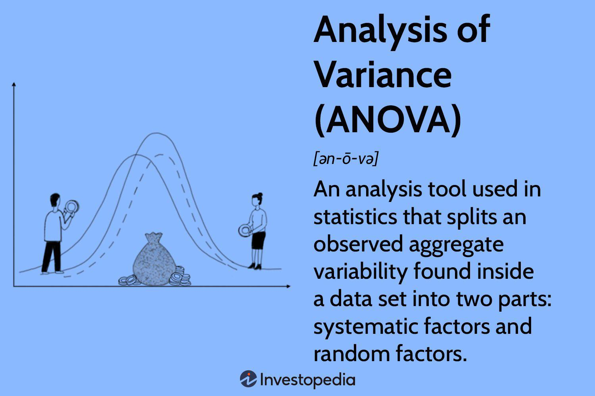

The rapidly evolving world of trading has witnessed significant technological advancements in recent years. One of the most notable advancements is algorithmic trading. This innovation merges financial markets with sophisticated computer algorithms to automate and streamline trading strategies. By leveraging algorithms, traders can execute orders with increased speed and precision, effectively reducing the likelihood of human error and enhancing overall market efficiency.

Amidst these technological strides, the Group of Eleven (G11) has emerged as a symbol of international cooperation in algorithmic trading. Established to address economic disparities and promote collective growth, the G11 epitomizes how countries can work together to harness these cutting-edge technologies for shared economic benefits. Through algorithmic trading, G11 member nations can optimize their engagement in global financial markets, benefiting from enhanced market access and improved trading methods.



This article investigates into the formation of the G11, investigating its influence on global trading practices and assessing how member countries utilize shared resources and expertise to advance their economic objectives. By understanding the mechanisms behind the G11’s cooperative efforts, we gain insight into the potential for international collaboration to drive technological and economic progress in the field of trading.

## Table of Contents

## What is the Group of Eleven (G11)?

The Group of Eleven, commonly referred to as the G11, represents a coalition of developing nations united by a shared goal of addressing economic disparities and harnessing collective resources for mutual growth. The genesis of the G11 can be traced back to an initiative by King Abdullah of Jordan, who initially conceptualized this alliance. Officially established in 2006, the G11 is comprised of lower-middle-income countries. These nations prioritize reducing their debt burdens and bolstering economic development through collaborative frameworks and strategies.

The member countries of the G11 engage in collective efforts to navigate challenges commonly faced by developing economies. These challenges include securing sustainable economic growth, reducing poverty, and enhancing access to global markets. By forming this coalition, member nations aim to leverage their collective bargaining power to negotiate better terms in international forums and to attract foreign investment by presenting a united front.

The strategic focus of the G11 incorporates a combination of policy coordination, advocacy for equitable economic policies, and the implementation of joint development projects, all directed toward achieving economic stability and prosperity. Moreover, the G11 espouses principles of sustainable development, with a particular emphasis on inclusive economic growth that benefits all sections of society within the member states.

In summary, the Group of Eleven serves as an influential platform for developing countries to join forces in overcoming economic challenges, enhancing their development prospects, and integrating more seamlessly into the global economy. By doing so, the G11 strives to create an environment where its member countries can achieve shared prosperity and sustainable economic advancement.

## The Role of Algorithmic Trading in G11

Algorithmic trading serves as a pivotal element within the Group of Eleven (G11) as it seeks to revamp financial systems across its member countries. By employing complex algorithms—strategies characterized by a set of rules—trading operations are automated, significantly enhancing the efficiency of financial transactions. This process aims to capitalize on speed and data-driven decisions, properties that are achievable due to the computational power leveraged in [algorithmic trading](/wiki/algorithmic-trading).

One of the primary advantages algorithmic trading offers to the G11 nations is the optimization of trading efficiency. Through automation, trading algorithms can process vast amounts of market data, allowing for instantaneous trade execution. This capacity ensures that trades occur at the most optimal prices, reducing the latency and slippage often associated with manual trading. For instance, algorithms can be programmed to execute trades when certain market conditions are met, like price thresholds or [volume](/wiki/volume-trading-strategy) spikes, ensuring that trades are executed at the most opportune times.

Moreover, algorithmic trading significantly decreases human error, a common drawback in manual trading. By eliminating the need for human intervention in the trading process, algorithms reduce the risk of errors caused by emotional decision-making or miscalculations. This precision aids in maintaining consistency in trading patterns, aligning with predefined strategies and risk management protocols.

Another critical benefit is the enhancement of market [liquidity](/wiki/liquidity-risk-premium). With algorithms facilitating a higher frequency of trades, the liquidity of the markets within G11 countries improves, ensuring that assets can be bought or sold with minimal impact on their price. Increased liquidity also makes the markets more attractive to international investors, further integrating G11 countries into the global financial system.

The G11's emphasis on algorithmic trading also provides member countries with the ability to access global markets with greater precision and timing. By leveraging sophisticated algorithms, these nations can synchronize their trades across diverse financial markets, tapping into a broader spectrum of investment opportunities. This capability allows for the diversification of portfolios, reducing country-specific risks and propelling economic growth.

In summary, algorithmic trading is a cornerstone of the G11's efforts to modernize its financial systems. By optimizing trading efficiency, reducing human error, and enhancing market liquidity, G11 nations are better positioned to participate effectively in global markets. The strategic use of algorithmic trading not only offers immediate improvements in trading activities but also fosters long-term economic development within the member countries.

## International Collaboration and Knowledge Sharing

The collaborative nature of the Group of Eleven (G11) facilitates a rich exchange of knowledge and expertise among its member countries, particularly in algorithmic trading. This collaboration is instrumental in equipping these nations with advanced trading capabilities and strategies, by providing platforms that encourage continuous learning and adaptation.

Through a variety of avenues such as workshops, conferences, and structured knowledge exchange programs, G11 members actively engage in the development and refinement of new trading strategies and technologies. These initiatives create an environment where financial experts and technologists from different countries can come together to discuss recent advancements, share insights, and brainstorm solutions to common challenges in algorithmic trading.

For instance, workshops might focus on the application of [machine learning](/wiki/machine-learning) algorithms to improve trading predictions, emphasizing the importance of data-driven strategies. A typical agenda could include presentations on recent research findings, collaborative coding sessions, and discussions on how to implement these strategies in different market contexts. Similarly, conferences provide broader forums where a diverse audience of policy-makers, industry leaders, and academic researchers can contribute to setting future directions for trading technology development.

Knowledge exchange programs take this a step further by enabling more structured and prolonged interactions among member nations. These programs can involve extended joint research projects, employee exchange programs among financial institutions, and cross-training sessions where professionals from one country learn about the trading environments and techniques used in another.

The cumulative effect of these collaborative efforts is a significant enhancement in trading capabilities across all participating G11 countries. By leveraging shared expertise and resources, countries are better able to optimize trading algorithms for efficiency, leading to improved market predictions, reduced transaction costs, and enhanced market liquidity. These enhancements directly boost economic growth prospects as countries are able to participate more effectively in global financial markets, attracting foreign investment and creating new economic opportunities.

Moreover, this international collaboration fosters a culture of innovation, encouraging member states to continuously explore the incorporation of emerging technologies such as [artificial intelligence](/wiki/ai-artificial-intelligence) and blockchain into their trading systems. By remaining at the forefront of technological advancements, G11 countries ensure their trading strategies remain robust and competitive, paving the way for sustained economic development.

## Market Accessibility and Economic Development

The Group of Eleven (G11) aims to enhance market accessibility for its member countries by addressing entry barriers and streamlining regulatory frameworks. These efforts are crucial for integrating G11 nations into the global financial ecosystem, thereby unlocking new avenues for economic growth and development.

Regulatory frameworks play a vital role in determining the ease with which countries can participate in international markets. By harmonizing regulations, the G11 seeks to create a more favorable environment for cross-border trade and investment. This, in turn, increases foreign capital inflow, which is essential for funding domestic projects, boosting economic development, and creating job opportunities within member countries.

The application of algorithmic trading further bolsters market accessibility. With algorithmic trading, G11 countries can achieve higher efficiency in executing trade orders, minimizing the latency and transaction costs associated with manual trading processes. This technological approach also improves market liquidity, making it easier for investors to buy and sell financial instruments without causing significant price fluctuations.

Moreover, algorithmic trading enables G11 members to process vast amounts of market data in real-time, which enhances decision-making capabilities. The ability to swiftly analyze market trends and investor behavior allows these nations to better position themselves within global financial markets. For instance, an algorithm that employs machine learning can predict price movements and execute trades at optimal times, potentially leading to higher returns.

Here's an example of a simple algorithm that could be used for predicting and executing trades based on historical data patterns:

```python
import numpy as np
import pandas as pd
from sklearn.ensemble import RandomForestClassifier
from sklearn.model_selection import train_test_split
from sklearn.metrics import accuracy_score

# Load historical market data
data = pd.read_csv('market_data.csv')

# Feature engineering (e.g., moving averages, volatility)
data['MA_10'] = data['Close'].rolling(window=10).mean()
data['Volatility'] = data['Close'].rolling(window=10).std()

# Define target variable (e.g., 1 if price increases, 0 otherwise)
data['Target'] = np.where(data['Close'].shift(-1) > data['Close'], 1, 0)

# Prepare feature and target arrays
X = data[['MA_10', 'Volatility']].dropna()
y = data['Target'].dropna()

# Split data into training and testing sets
X_train, X_test, y_train, y_test = train_test_split(X, y, test_size=0.2, random_state=42)

# Train Random Forest model
model = RandomForestClassifier(n_estimators=100, random_state=42)
model.fit(X_train, y_train)

# Predict and evaluate model performance
predictions = model.predict(X_test)
print(f"Accuracy: {accuracy_score(y_test, predictions)}")
```

Through such implementations, G11 nations not only increase their attractiveness to international investors but also accelerate their economic development objectives by leveraging cutting-edge financial technologies. Enhanced market accessibility thus serves as a cornerstone for the G11's strategy to promote sustainable economic growth and prosperity among its members.

## Challenges and Future Prospects

The Group of Eleven (G11) dynamic character, which has facilitated substantial advancements in algorithmic trading among developing nations, also faces several notable challenges that could impact its trajectory. Chief among these is regulatory compliance. As algorithmic trading becomes integral to financial operations, aligning with international regulatory standards becomes crucial to prevent market manipulation and ensure investor protection. Each G11 member operates under distinct regulatory environments, which poses a challenge in establishing a uniform compliance framework. Harmonizing these regulations demands concerted efforts to understand and integrate different national policies, which may involve complex negotiations and substantial administrative resources.

In addition to regulatory hurdles, the continuous technological advancement required to maintain a competitive edge in algorithmic trading presents a challenge. The trading algorithms used must constantly evolve to adapt to changing market conditions and leverage emerging technologies such as machine learning and artificial intelligence. These technologies promise enhanced predictive accuracy and decision-making efficiency, but integrating them into existing systems necessitates ongoing investments in both software and hardware infrastructure. These upgrades ensure that the trading systems remain competitive and resilient against cyber threats, which are increasingly sophisticated.

Addressing these challenges requires a multi-faceted approach. Substantial investments in infrastructure development are imperative to support advanced computing systems capable of handling complex algorithmic operations. Furthermore, capacity-building initiatives, including training programs and workshops, are essential to develop the human capital needed to leverage these technological tools effectively. By doing so, member countries can cultivate a workforce adept at managing and innovating within Algorithmic trading environments.

Looking forward, the G11 aims to expand its membership, potentially broadening the coalition's influence and resource base. Further integration of emerging technologies is anticipated, with artificial intelligence being at the forefront. AI methodologies, such as natural language processing (NLP) and [reinforcement learning](/wiki/reinforcement-learning), can revolutionize trading strategies by providing deeper insights and automating decision-making processes more effectively. For instance, reinforcement learning algorithms could optimize trading strategies based on past data in a continually adaptive manner:

```python
import numpy as np

class TradingEnv:
    def __init__(self, initial_balance, data):
        self.balance = initial_balance
        self.data = data
        self.current_step = 0

    def step(self, action):
        # Placeholder for the logic to execute a trading action (buy/sell).
        pass

    def reset(self):
        self.balance = initial_balance
        self.current_step = 0
        return self.balance

# Reinforcement Learning model mock-up
def train_model(environment, iterations):
    for _ in range(iterations):
        state = environment.reset()
        done = False
        while not done:
            # Placeholder for model prediction and update logic
            pass
```

Such technologies could enable G11 nations to participate more effectively in global markets by making trade decisions faster and with higher precision. In conclusion, while the G11 faces challenges, the prospects of expanding its influence through technological advancement and increased membership signify a positive potential trajectory, enhancing not only trade efficacy but also global economic integration.

## Conclusion

The Group of Eleven (G11) serves as a compelling example of how international collaboration fosters innovation and economic advancement in algorithmic trading. By uniting their resources and expertise, G11 member countries have effectively positioned themselves to take advantage of the opportunities enabled by contemporary trading technologies. This alliance not only enhances the technical capabilities of individual nations but also improves their collective standing in global markets.

As these countries continue to adapt to rapidly changing technological landscapes, the G11's influence on global trade is expected to strengthen. This ongoing evolution underscores the potential for international cooperation to drive progress in financial markets. The success of the G11 in leveraging algorithmic trading for economic growth provides a valuable template that other regions could consider adopting. By exemplifying effective collaboration, the G11 highlights the importance and benefits of shared resources and mutual support in achieving significant strides in trading efficiency and market accessibility.

Through sustained commitment and innovative practices, the G11 demonstrates how aligned goals and joint efforts can lead to meaningful advancements. As they further develop and integrate emerging technologies such as artificial intelligence, the member nations are likely to enhance their competitive edge, setting a standard for future collaborative endeavors in the financial sector.

## References & Further Reading

[1]: Bergstra, J., Bardenet, R., Bengio, Y., & Kégl, B. (2011). ["Algorithms for Hyper-Parameter Optimization."](https://dl.acm.org/doi/10.5555/2986459.2986743) Advances in Neural Information Processing Systems 24.

[2]: ["Advances in Financial Machine Learning"](https://www.amazon.com/Advances-Financial-Machine-Learning-Marcos/dp/1119482089) by Marcos Lopez de Prado

[3]: ["Evidence-Based Technical Analysis: Applying the Scientific Method and Statistical Inference to Trading Signals"](https://www.amazon.com/Evidence-Based-Technical-Analysis-Scientific-Statistical/dp/0470008741) by David Aronson

[4]: ["Machine Learning for Algorithmic Trading"](https://github.com/stefan-jansen/machine-learning-for-trading) by Stefan Jansen

[5]: ["Quantitative Trading: How to Build Your Own Algorithmic Trading Business"](https://www.amazon.com/Quantitative-Trading-Build-Algorithmic-Business/dp/1119800064) by Ernest P. Chan