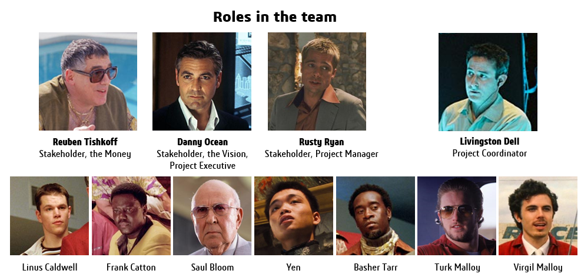

## Table of Contents

## What is the Group of Eleven (G11)?

The Group of Eleven, or G11, is a group of countries that work together on economic issues. These countries are mostly from Africa and the Middle East. They meet to talk about how to improve their economies and work on projects together.

The G11 was formed to help these countries share ideas and support each other. By working together, they hope to grow their economies faster and solve common problems. The group focuses on things like trade, investment, and development.

## How was the Group of Eleven formed?

The Group of Eleven was formed because some countries wanted to work together to make their economies better. These countries are mostly from Africa and the Middle East. They thought that by talking and working together, they could help each other grow faster and solve problems they all had.

The group started when leaders from these countries met and decided to form a group. They chose the name Group of Eleven because there were eleven countries in the group at the start. Since then, they have been meeting regularly to discuss trade, investment, and other ways to improve their economies.

## Which countries are members of the G11?

The Group of Eleven, or G11, has eleven countries in it. These countries are from Africa and the Middle East. They are Algeria, Egypt, Ethiopia, Iran, Iraq, Libya, Nigeria, Saudi Arabia, South Africa, Sudan, and the United Arab Emirates.

These countries decided to work together to make their economies better. They talk about trade, investment, and other ways to grow their economies. By working together, they hope to help each other and solve common problems.

## What are the main objectives of the G11?

The main goal of the Group of Eleven, or G11, is to help the member countries grow their economies. They do this by talking about ways to improve trade and investment. The countries in the group are from Africa and the Middle East, and they want to work together to solve problems that they all face. By sharing ideas and working on projects together, they hope to make their economies stronger.

Another important objective of the G11 is to increase cooperation among the member countries. They meet regularly to discuss how they can help each other. This cooperation can lead to new business opportunities and better ways to develop their economies. The group focuses on finding solutions that will benefit all the countries involved, making it easier for them to grow and prosper together.

## How does the G11 function and make decisions?

The Group of Eleven, or G11, functions by having regular meetings where leaders from the member countries come together. They talk about ways to improve their economies and solve common problems. During these meetings, each country can share ideas and suggest projects that could help everyone. The leaders discuss these ideas and decide what to do next. They try to find solutions that will benefit all the countries in the group.

Decisions in the G11 are made through discussions and agreements among the member countries. They work to reach a consensus, which means everyone agrees on what to do. Sometimes, they might vote if they can't agree right away. The decisions they make can lead to new projects or policies that help the group's goals. By working together and making decisions as a team, the G11 hopes to make their economies stronger and solve problems more effectively.

## What are some significant achievements of the G11?

The Group of Eleven, or G11, has made some important achievements. One big achievement is that they have worked together to increase trade between the member countries. By talking and agreeing on how to trade more easily, they have helped each other's economies grow. This has led to more business and jobs in the countries of the G11.

Another achievement of the G11 is that they have started projects to help with development. These projects focus on things like building roads and improving education. By working on these projects together, the countries have been able to make their economies stronger and improve the lives of their people. This cooperation has shown that when countries work together, they can achieve more than they could alone.

## How does the G11 influence global economic policies?

The Group of Eleven, or G11, influences global economic policies by working together to improve trade and investment among its member countries. When these countries from Africa and the Middle East trade more with each other, it can affect the global economy. For example, if the G11 countries agree to lower trade barriers, it can lead to more trade not just within the group but also with other countries. This can encourage other countries to do the same, making global trade easier and helping the world economy grow.

The G11 also influences global economic policies by starting projects that help with development. These projects, like building roads or improving education, can show other countries how working together can lead to better economic growth. When the G11 countries share their success stories, it can inspire other countries to work together on similar projects. This can lead to new ideas and policies that help the global economy. By showing the benefits of cooperation, the G11 helps shape how countries around the world think about economic policies.

## What role does the G11 play in international trade negotiations?

The Group of Eleven, or G11, plays an important role in international trade negotiations by working together to make trade easier among its member countries. These countries from Africa and the Middle East talk about how to lower trade barriers and increase trade. When they agree on these things, it can help their economies grow. Other countries see this and might want to trade more with the G11 countries too. This can lead to more international trade agreements and help the global economy.

The G11 also helps its members have a stronger voice in international trade talks. When the countries work together, they can speak up for what they need in big meetings with other countries. This can help them get better trade deals. By showing how working together helps them, the G11 can encourage other countries to join in trade negotiations too. This cooperation can lead to more fair and helpful trade rules around the world.

## How does the G11 address global issues like climate change?

The Group of Eleven, or G11, works together to tackle big problems like climate change. They know that climate change affects everyone, so they talk about ways to make their countries greener. The G11 countries share ideas on how to use less energy and make less pollution. They might start projects to use more solar or wind power, which is good for the environment. By working together, they can help each other find better ways to fight climate change.

The G11 also tries to get other countries to join in fighting climate change. When the G11 countries show that they are working together to make their air and water cleaner, it can inspire other countries to do the same. They might talk about climate change in big meetings with other countries and try to make new rules that help the planet. By showing that working together can make a difference, the G11 helps the world take better care of the environment.

## What are the challenges faced by the G11 in achieving its goals?

The Group of Eleven, or G11, faces some big challenges in trying to reach its goals. One challenge is that the countries in the group are different from each other. They have different economies and problems, so it can be hard to agree on what to do. Sometimes, what is good for one country might not be good for another. This makes it tough to make decisions that everyone likes. Another challenge is money. Starting big projects to help the economy or fight climate change can cost a lot. The G11 countries need to find enough money to do these things, and that can be hard.

Another challenge is working with other countries outside the G11. The group wants to trade more and work on projects with other countries, but this can be tricky. Other countries might not want to do what the G11 wants, or they might have different goals. This can slow down the G11's plans. Also, the world is always changing, and new problems can come up. The G11 has to keep up with these changes and find new ways to solve them. It's not easy, but the G11 keeps trying to work together to make things better.

## How does the G11 interact with other international organizations like the G7 or G20?

The Group of Eleven, or G11, works with other big groups like the G7 and G20 to talk about important things like trade and the economy. The G11 wants to make sure its voice is heard in these big meetings. They share their ideas and try to work together with the G7 and G20 countries to make better rules for everyone. Sometimes, the G11 countries might join in talks with the G7 or G20 to help make decisions that can help their economies grow.

It can be hard for the G11 to work with the G7 and G20 because these groups have different goals and members. The G7 and G20 are made up of some of the richest countries in the world, and they might not always agree with what the G11 wants. But the G11 keeps trying to find ways to work together. By talking and working with these big groups, the G11 hopes to make the world's economy better for everyone, including its own member countries.

## What future developments are anticipated for the G11?

The Group of Eleven, or G11, is expected to keep working together to make their economies better. They will likely keep talking about how to trade more and start new projects that help their countries grow. The G11 might also try to get more countries to join them, so they can be even stronger. By working together, they hope to solve big problems like climate change and make life better for their people.

In the future, the G11 might also focus more on working with big groups like the G7 and G20. They want to have a bigger say in global talks about the economy and trade. By sharing their ideas and working with these groups, the G11 hopes to help make rules that are fair for everyone. This could lead to more trade and better projects that help the whole world.

## References & Further Reading

[1]: Bergstra, J., Bardenet, R., Bengio, Y., & Kégl, B. (2011). ["Algorithms for Hyper-Parameter Optimization."](https://dl.acm.org/doi/10.5555/2986459.2986743) Advances in Neural Information Processing Systems 24.

[2]: ["Advances in Financial Machine Learning"](https://www.amazon.com/Advances-Financial-Machine-Learning-Marcos/dp/1119482089) by Marcos Lopez de Prado

[3]: ["Evidence-Based Technical Analysis: Applying the Scientific Method and Statistical Inference to Trading Signals"](https://www.amazon.com/Evidence-Based-Technical-Analysis-Scientific-Statistical/dp/0470008741) by David Aronson

[4]: ["Machine Learning for Algorithmic Trading"](https://github.com/stefan-jansen/machine-learning-for-trading) by Stefan Jansen

[5]: ["Quantitative Trading: How to Build Your Own Algorithmic Trading Business"](https://www.amazon.com/Quantitative-Trading-Build-Algorithmic-Business/dp/1119800064) by Ernest P. Chan