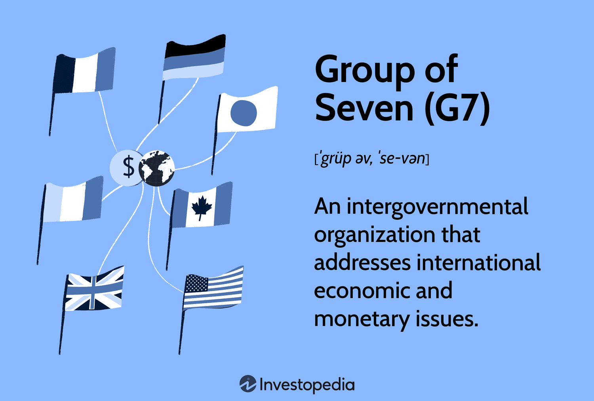

## Table of Contents

## What is the Group of Seven (G7)?

The Group of Seven, or G7, is a group of seven rich countries that work together on big world problems. The countries in the G7 are Canada, France, Germany, Italy, Japan, the United Kingdom, and the United States. They meet every year to talk about things like the economy, climate change, and helping poorer countries.

The G7 started in 1975 when the leaders of six countries met in France. They wanted to talk about the world's economy because it was having problems. Later, Canada joined to make it seven countries. Even though the G7 is small, it has a big influence because these countries have strong economies and work together to make the world a better place.

## Which countries are members of the G7?

The G7 is made up of seven countries. These countries are Canada, France, Germany, Italy, Japan, the United Kingdom, and the United States.

These countries work together to solve big world problems. They meet every year to talk about things like the economy, climate change, and helping poorer countries.

## When was the G7 established?

The G7 was established in 1975. It started when the leaders of six countries met in France. They wanted to talk about the world's economy because it was having problems. The six countries were France, Germany, Italy, Japan, the United Kingdom, and the United States.

Later, Canada joined the group in 1976, making it seven countries. That's why it's called the Group of Seven, or G7. These countries work together to solve big world problems. They meet every year to discuss things like the economy, climate change, and helping poorer countries.

## What is the primary purpose of the G7?

The main goal of the G7 is to work together to solve big world problems. The group was made because these countries wanted to help fix the world's economy when it was having troubles. Now, they meet every year to talk about many important issues.

These issues include the economy, climate change, and helping poorer countries. Even though the G7 is a small group, it has a big influence because these countries have strong economies. By working together, they try to make the world a better place for everyone.

## How often do G7 leaders meet?

The leaders of the G7 countries meet every year. This meeting is called the G7 summit. They come together to talk about important world issues and try to find solutions.

During these meetings, they discuss things like the economy, climate change, and how to help poorer countries. The G7 summit gives these leaders a chance to work together and make decisions that can help the whole world.

## What are the main topics discussed at G7 summits?

At G7 summits, the leaders talk about many important topics. One big topic is the world's economy. They discuss how to make it stronger and help it grow. They also talk about trade and how countries can work together to make trade easier and fairer.

Another important topic is climate change. The G7 leaders want to find ways to stop the Earth from getting too warm. They talk about using less energy that comes from oil and coal, and using more energy from the sun and wind. They also discuss how to help countries that are being hurt by climate change.

The G7 also focuses on helping poorer countries. They talk about ways to give these countries money and support to help them grow and improve. The leaders want to make sure that everyone in the world can have a better life. By discussing these topics, the G7 tries to make the world a better place for everyone.

## How does the G7 influence global economic policies?

The G7 influences global economic policies because it is made up of some of the richest and most powerful countries in the world. When the leaders of these countries meet, they talk about how to make the world's economy stronger. They share ideas about how to help the economy grow and what rules should be followed to make trade easier and fairer. Because these countries have big economies, what they decide can affect the whole world. For example, if they agree to lower taxes or change trade rules, other countries might follow their lead.

The G7 also has a big say in helping poorer countries. They talk about giving money and support to these countries to help them grow and improve. This can include things like loans, aid, and advice on how to build better economies. When the G7 makes these decisions, it can change how money moves around the world and how different countries work together. By working together, the G7 tries to make the global economy better for everyone.

## What role does the G7 play in international security?

The G7 plays an important role in international security by working together to keep the world safe. The leaders of the G7 countries talk about ways to stop wars and terrorism. They share information and make plans to help keep peace around the world. Because these countries are powerful, what they decide can affect many other countries and help make the world a safer place.

The G7 also works on issues like nuclear weapons and cyber security. They want to make sure that dangerous weapons don't fall into the wrong hands. They also talk about how to protect computers and the internet from attacks. By discussing these topics and coming up with solutions, the G7 helps to protect everyone from different kinds of threats.

## How does the G7 address global environmental issues?

The G7 works hard to solve big environmental problems like climate change. They talk about ways to use less energy from oil and coal, which make the Earth warmer. Instead, they want to use more clean energy like the sun and wind. By making these changes, the G7 tries to slow down climate change and keep the Earth from getting too hot. They also share ideas about how to protect nature and wildlife, so that the world stays a good place for everyone to live.

Another way the G7 helps the environment is by giving money and support to poorer countries. These countries often have a harder time dealing with climate change. The G7 wants to help them build better systems to use clean energy and protect their environment. By working together, the G7 hopes to make the whole world a safer and healthier place for everyone.

## What is the difference between the G7 and G8?

The G7 and G8 are groups of countries that work together to solve big world problems. The G7 has seven countries: Canada, France, Germany, Italy, Japan, the United Kingdom, and the United States. The G8 is almost the same, but it includes one more country: Russia. The G8 started when Russia joined the G7 in 1998, making it eight countries instead of seven.

The main difference is that the G7 does not include Russia, while the G8 does. The G8 was formed to include Russia because it was seen as an important country to work with on big issues like the economy and security. However, in 2014, Russia was removed from the group because of problems with Ukraine. Since then, the group has gone back to being called the G7.

## How does the G7 coordinate with other international organizations?

The G7 works with other international groups to solve big world problems. One way they do this is by talking with the United Nations (UN). The G7 shares ideas and plans with the UN to help with things like the economy, climate change, and helping poorer countries. By working together, they can make bigger changes and help more people around the world.

The G7 also works with groups like the World Bank and the International Monetary Fund (IMF). These groups help countries with money and advice to grow their economies. The G7 talks with them about how to give this help in the best way. By doing this, they can make sure that the help goes to the places that need it the most and that it makes a real difference.

## What criticisms and challenges does the G7 face in the modern global context?

The G7 faces many criticisms and challenges today. One big problem is that the G7 only includes seven rich countries. Some people say it is not fair because many other countries, especially poorer ones, are not included. They think the G7 should listen to more voices from around the world, not just the rich countries. Another criticism is that the G7 does not always do what it says it will do. For example, they talk a lot about helping the environment and fighting climate change, but sometimes they do not take strong enough actions to make a real difference.

Another challenge for the G7 is that the world is changing fast. New countries, like China and India, are becoming more powerful and important in the world. Some people think the G7 should include these countries to be more effective. The G7 also faces problems because it is hard for the seven countries to always agree on what to do. Different countries have different ideas and goals, so it can be hard to make decisions and take action together. Despite these challenges, the G7 keeps trying to work together to make the world a better place.

## References & Further Reading

[1]: Consiglio, Andrea, et al. (2018). ["A Review of Algorithmic Trading"](https://www.researchgate.net/publication/378548435_Algorithmic_Trading_and_AI_A_Review_of_Strategies_and_Market_Impact). European Journal of Operational Research.

[2]: Domowitz, Ian, & Steil, Benn. (1999). ["Automation, Trading Costs, and the Structure of the Securities Trading Industry."](https://www.nomurafoundation.or.jp/en/wordpress/wp-content/uploads/2014/09/19971011_Ian_Domowitz_-_Benn_Steil.pdf) The Journal of Finance.

[3]: Hendershott, Terrence, Jones, Charles M., & Menkveld, Albert J. (2011). ["Does Algorithmic Trading Improve Liquidity?"](https://onlinelibrary.wiley.com/doi/full/10.1111/j.1540-6261.2010.01624.x) The Review of Financial Studies.

[4]: Gomber, Peter, et al. (2011). ["High-frequency Trading."](https://papers.ssrn.com/sol3/papers.cfm?abstract_id=1858626) Electronic Markets.

[5]: Lopez de Prado, Marcos. (2018). ["Advances in Financial Machine Learning."](https://www.amazon.com/Advances-Financial-Machine-Learning-Marcos/dp/1119482089) Wiley.

[6]: Chan, Ernest P. (2009). ["Quantitative Trading: How to Build Your Own Algorithmic Trading Business."](https://github.com/ftvision/quant_trading_echan_book) Wiley Trading.