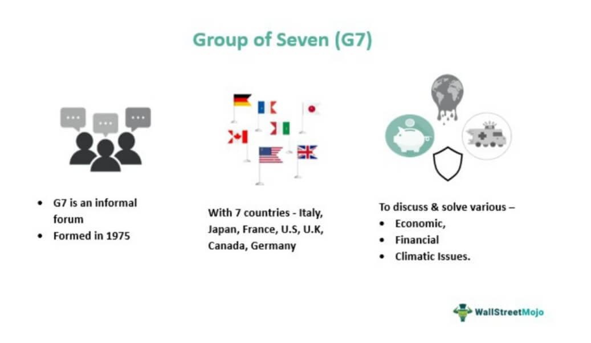

The Group of Seven (G7) is a key intergovernmental organization formed by some of the world's most influential industrialized democracies: the United States, Canada, France, Germany, Italy, Japan, and the United Kingdom. Established to address critical global issues, the G7 plays an instrumental role in global governance, tackling major economic, political, and security challenges that impact international relations and economic stability. In recent years, with the advancement of technology, the G7 has increasingly focused on issues that intersect international cooperation with technological innovations. A noteworthy area within this intersection is algorithmic trading, which involves using computer algorithms to execute trading strategies at high speeds and efficiencies. This technological progression represents both an opportunity and a challenge that necessitates coordinated international efforts, regulation, and innovation. This article examines how the G7 is addressing these technological advancements, particularly how member countries collaborate to manage algorithmic trading's implications for global markets. This focus underscores the G7's commitment to fostering a stable and transparent international economic environment.

## Table of Contents

## The Evolution of the G7

The Group of Seven (G7) emerged in the 1970s as a response to the economic challenges of that era. Originally, it was an informal assembly of finance ministers and central bank governors from the world's preeminent Western economies. The primary objective of these initial gatherings was to address the economic turbulence caused by events such as the collapse of the Bretton Woods system and the oil crisis of 1973. These foundational meetings set the stage for what would become a crucial platform for economic coordination and policy formulation among the world's leading industrialized democracies.

The group's membership expanded to include Canada, thus forming the Group of Seven. This expansion marked the formalization of the G7 as an entity comprising seven global economic powerhouses: the United States, Canada, France, Germany, Italy, Japan, and the United Kingdom. The inclusion of Canada not only reinforced North American participation but also provided a broader perspective on global economic issues due to its unique geopolitical position.

Over time, the G7's mandate broadened significantly beyond its initial focus on economic stabilization and monetary policy. Confronted with a rapidly changing global landscape, the G7 began to address a myriad of other pressing issues. These included climate change, driven by the undeniable impacts of global warming; international security, highlighted by geopolitical tensions; and global health crises, such as the HIV/AIDS epidemic and more recently, the COVID-19 pandemic. By expanding its focus, the G7 has sought to remain relevant in addressing the multifaceted challenges that transcend national boundaries.

Despite its informal structure, which facilitates unhindered dialogue and flexible decision-making, the G7 wields considerable influence over international economic and monetary policies. The group's summits and ministerial meetings drive consensus on key global challenges, which often shape the policies of international institutions like the International Monetary Fund (IMF) and the World Bank. The G7's ability to align its members on common goals enables it to act as a catalyst for broader international cooperation, borrowing its power from the collective economic and political clout of its constituent nations.

## Algorithmic Trading: An Overview

Algorithmic trading, often termed algo trading, involves using computer algorithms to automate financial trading strategies, facilitating a more efficient and swift execution of trades. This approach has dramatically transformed financial markets by replacing traditional, manual trading methods with systematic, data-driven processes. By employing sophisticated algorithms, traders can analyze a vast array of market variables at lightning speed and execute orders that maximize trading outcomes.

The advent of advanced technologies such as [machine learning](/wiki/machine-learning) and [artificial intelligence](/wiki/ai-artificial-intelligence) (AI) has significantly broadened the scope and capabilities of [algorithmic trading](/wiki/algorithmic-trading). Machine learning algorithms can detect complex patterns and trends within financial data, enabling traders to anticipate market movements with higher accuracy. AI further allows for adaptive algorithms that can learn from past data, optimizing strategies dynamically in real-time.

Algorithmic trading enables the execution of large orders with minimal market impact, contributing to greater market [liquidity](/wiki/liquidity-risk-premium) and tighter bid-ask spreads. This is achieved through strategies like [market making](/wiki/market-making), [arbitrage](/wiki/arbitrage), and trend-following, each designed to exploit different aspects of market dynamics.

However, amid these advancements lie challenges and opportunities. One major challenge is ensuring the stability and fairness of markets, as high-frequency trading — a subset of algorithmic trading — can sometimes exacerbate market [volatility](/wiki/volatility-trading-strategies) and deviate liquidity temporarily. Additionally, the reliance on complex algorithms raises concerns over transparency and regulatory oversight.

Opportunities abound in the potential for algo trading to enhance market efficiency and enable more informed decision-making in monetary policies. The automation of trading reduces human error, improves execution times, and enables more sophisticated risk management techniques. As financial markets continue to evolve in complexity, algorithmic trading will likely remain at the forefront, acting as a catalyst for innovation and economic growth on a global scale.

## G7's Approach to International Cooperation in Algo Trading

The G7 countries recognize the transformative impact of algorithmic trading on global financial systems. Algorithmic trading, characterized by its use of computer algorithms to automate trading decisions, has revolutionized financial markets by enhancing trading speed and efficiency. However, this transformation brings with it both opportunities and challenges that the G7 seeks to address through international cooperation.

The G7's approach in this context involves initiating discussions aimed at creating regulatory frameworks that promote ethical and transparent practices within algorithmic trading. These frameworks are essential for safeguarding market integrity and stability while ensuring that the rapid advancements in trading technology do not compromise security. The member countries of the G7 are acutely aware of the dual necessity to leverage the benefits of algorithmic trading and mitigate its associated risks, such as market manipulation and systemic instability.

Collaboration is emphasized among G7 members to achieve harmonization of regulations governing algorithmic trading. Standardizing these regulations can help reduce discrepancies and conflicts in cross-border financial activities, which is increasingly important in the era of globalization. By working together, G7 countries aim to implement universal practices and guidelines that will enhance market stability. Moreover, such cooperation has the potential to provide a protective framework for investors, minimizing exposure to unscrupulous trading strategies that could lead to financial losses.

In addressing these objectives, the G7 also underscores the importance of continuous dialogue and information sharing among its members. Open communication facilitates the exchange of best practices and fosters a learning environment where countries can benefit from each other's experiences and insights into algorithmic trading. By doing so, they can adapt their regulatory measures more effectively to the fast-evolving landscape of global financial markets.

This multilayered approach by the G7 exemplifies its commitment to crafting a balanced global trading environment that maximizes the positive impacts of technology while diligently working to neutralize potential threats. These efforts reflect the G7's broader role in fostering not only economic cooperation but also the creation of resilient financial systems that underpin global economic stability.

## Challenges and Opportunities

Algorithmic trading presents both significant challenges and opportunities for the G7 nations as they navigate the complexities of rapidly advancing technology in global financial markets. One of the primary challenges lies in ensuring market fairness and stability. The increasing speed and efficiency of algo trading can lead to phenomena such as "flash crashes," where rapid trades cause drastic price fluctuations within a very short period. For instance, the United States experienced such an event on May 6, 2010, which highlighted the potential for significant market disruptions.

Moreover, the G7 countries face the delicate task of balancing technological innovation with the need for security and transparency. As financial algorithms become more sophisticated, there is a heightened risk of market manipulation and systemic risks, which require robust regulatory frameworks. A vital aspect of this challenge is ensuring that these frameworks do not stifle innovation but rather allow for continuous technological advancement. Ensuring compliance with regulations and maintaining investor trust are central to addressing these challenges.

On the opportunities front, algorithmic trading offers significant potential to enhance market liquidity and efficiency. By automating trading processes, algo trading algorithms can execute trades with precision and at speeds unmatched by human traders. This increased liquidity can reduce transaction costs and create a more dynamic trading environment, benefiting both institutional and retail investors.

Properly regulated algorithmic trading can also lead to more informed and effective monetary policies across G7 economies. For example, the ability to analyze vast amounts of data in real-time can offer insights into market trends and economic conditions, informing policy decisions. This data-driven approach can aid central banks in making timely interventions and adjustments to monetary policies to stabilize economies during volatile periods.

In summary, while algorithmic trading introduces various challenges related to market stability, security, and transparency, it also holds considerable promise for enhancing liquidity, efficiency, and data-driven policy making. The G7 nations must collaborate to establish regulatory environments that ensure fairness and innovation coexist, thereby unlocking the full potential of algorithmic trading while safeguarding the integrity of global financial markets.

## The Future of G7 Cooperation in Algo Trading

As technology continues to evolve, the G7 is uniquely positioned to shape the future of global financial markets, specifically through algorithmic trading. This assembly of industrialized democracies understands that sustained international cooperation is vital to address the multifaceted aspects of algo trading, including ethical considerations, economic impacts, and technical challenges. By fostering collaboration, the G7 can create a roadmap for ethical algorithmic trading practices that promote market stability and investor protection.

The establishment of global forums is a key strategy for facilitating dialogue and exchanging best practices among G7 nations. These platforms can serve as a hub for G7 countries to share insights on regulatory experiences, successful strategy implementation, and technological innovations in algorithmic trading. By doing so, the G7 can work towards establishing standardized protocols and practices that can be adopted internationally, ensuring a cohesive approach to managing algorithmic trading activities.

Furthermore, the G7's concerted efforts in fostering innovation and regulation in algorithmic trading are indicative of its dedication to pioneering solutions for contemporary challenges. This includes addressing issues such as market manipulation and systemic risks associated with high-frequency trading, a form of algorithmic trading that has raised significant regulatory concerns over the past decade.

As these countries collaborate on regulating and enhancing algorithmic trading systems, they will focus on ensuring that technological advancements are used to bolster transparency and fairness in the markets. This not only aids in preserving market integrity but also enhances investor confidence, instigating a cycle of sustainable market growth. 

Moreover, as fintech startups and institutional investors increasingly adopt machine learning and artificial intelligence in their trading algorithms, the role of the G7 becomes even more critical. By encouraging responsible innovation, the G7 can balance the benefits of enhanced liquidity and market insights with potential risks like data privacy concerns and algorithmic biases. 

In conclusion, the G7’s engagement in algo trading will centralize ethical oversight, encourage productive innovation, and ensure global market stability. By taking proactive measures, the G7 can continue to set benchmarks in international financial cooperation, aiding in the evolution of a more resilient and transparent global financial landscape.

## Conclusion

The G7's involvement in algorithmic trading highlights its commitment to enhancing international economic cooperation and securing financial stability. By integrating collaborative regulation and fostering innovation, the organization aims to adeptly respond to the intricate dynamics of contemporary financial markets. This strategy is poised to help streamline operations and alleviate potential market disruptions.

Unified measures among the G7 nations present a compelling opportunity for capitalizing on technological advancements to fuel global economic growth. By collectively establishing comprehensive frameworks and adopting standardized practices, these countries can effectively mitigate risks associated with algorithmic trading, such as market manipulation and systemic failures.

As the G7 remains vigilant and adaptable to emerging technological trends, its leadership becomes increasingly pivotal in shaping the trajectory of algorithmic trading in global finance. Initiatives to facilitate dialogue and share best practices among member countries will be instrumental. Through these efforts, the G7 underscores its role as a pioneering force in steering the evolution of modern financial markets, ensuring that technological progress translates into robust economic benefits globally.

## References & Further Reading

[1]: Consiglio, Andrea, et al. (2018). ["A Review of Algorithmic Trading"](https://www.researchgate.net/publication/378548435_Algorithmic_Trading_and_AI_A_Review_of_Strategies_and_Market_Impact). European Journal of Operational Research.

[2]: Domowitz, Ian, & Steil, Benn. (1999). ["Automation, Trading Costs, and the Structure of the Securities Trading Industry."](https://www.nomurafoundation.or.jp/en/wordpress/wp-content/uploads/2014/09/19971011_Ian_Domowitz_-_Benn_Steil.pdf) The Journal of Finance.

[3]: Hendershott, Terrence, Jones, Charles M., & Menkveld, Albert J. (2011). ["Does Algorithmic Trading Improve Liquidity?"](https://onlinelibrary.wiley.com/doi/full/10.1111/j.1540-6261.2010.01624.x) The Review of Financial Studies.

[4]: Gomber, Peter, et al. (2011). ["High-frequency Trading."](https://papers.ssrn.com/sol3/papers.cfm?abstract_id=1858626) Electronic Markets.

[5]: Lopez de Prado, Marcos. (2018). ["Advances in Financial Machine Learning."](https://www.amazon.com/Advances-Financial-Machine-Learning-Marcos/dp/1119482089) Wiley.

[6]: Chan, Ernest P. (2009). ["Quantitative Trading: How to Build Your Own Algorithmic Trading Business."](https://github.com/ftvision/quant_trading_echan_book) Wiley Trading.