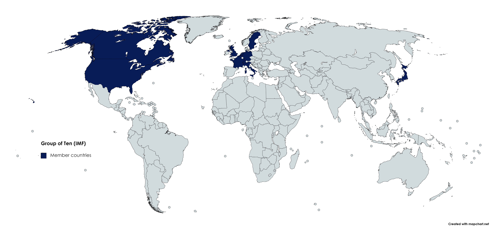

## Table of Contents

## What is the Group of Ten?

The Group of Ten, often called the G10, is a group of eleven countries that work together on financial matters. The countries are Belgium, Canada, France, Germany, Italy, Japan, the Netherlands, Sweden, Switzerland, the United Kingdom, and the United States. Even though it's called the Group of Ten, there are actually eleven members because Switzerland joined later.

The G10 was created in 1962 to help manage the world's money system. They meet regularly to talk about important financial issues and try to solve problems together. The group is known for setting up the General Arrangements to Borrow, which is a way for countries to borrow money from each other when they need it. This helps keep the world's economy stable.

## Which countries are members of the Group of Ten?

The Group of Ten, or G10, is a group of eleven countries that work together on money matters. The countries in the G10 are Belgium, Canada, France, Germany, Italy, Japan, the Netherlands, Sweden, Switzerland, the United Kingdom, and the United States. Even though it's called the Group of Ten, there are actually eleven members because Switzerland joined later.

The G10 was started in 1962 to help manage the world's money system. They meet often to talk about important money issues and work together to solve problems. One big thing they did was set up the General Arrangements to Borrow, which lets countries borrow money from each other when they need it. This helps keep the world's money stable.

## When was the Group of Ten established?

The Group of Ten, or G10, was established in 1962. It is a group of eleven countries that work together on money matters. The countries in the G10 are Belgium, Canada, France, Germany, Italy, Japan, the Netherlands, Sweden, Switzerland, the United Kingdom, and the United States. Even though it's called the Group of Ten, there are actually eleven members because Switzerland joined later.

The G10 was created to help manage the world's money system. They meet often to talk about important money issues and work together to solve problems. One big thing they did was set up the General Arrangements to Borrow, which lets countries borrow money from each other when they need it. This helps keep the world's money stable.

## What is the primary purpose of the Group of Ten?

The Group of Ten, or G10, was created to help manage the world's money system. It started in 1962 and has eleven countries working together. These countries are Belgium, Canada, France, Germany, Italy, Japan, the Netherlands, Sweden, Switzerland, the United Kingdom, and the United States. Even though it's called the Group of Ten, there are actually eleven members because Switzerland joined later.

The main goal of the G10 is to talk about and solve important money problems. They meet often to discuss these issues and work together to keep the world's money stable. One big thing they did was set up the General Arrangements to Borrow. This lets countries borrow money from each other when they need it, which helps keep the world's economy strong.

## How does the Group of Ten influence global financial stability?

The Group of Ten, or G10, helps keep the world's money stable by working together on important money problems. They started in 1962 and have eleven countries, even though it's called the Group of Ten. These countries are Belgium, Canada, France, Germany, Italy, Japan, the Netherlands, Sweden, Switzerland, the United Kingdom, and the United States. They meet often to talk about money issues and find ways to solve them together.

One big way the G10 influences global financial stability is by setting up the General Arrangements to Borrow. This system lets countries borrow money from each other when they need it. This helps countries in tough times and keeps the world's economy strong. By working together and sharing resources, the G10 helps make sure that money problems in one country don't cause big problems everywhere.

## What are some key achievements of the Group of Ten?

One key achievement of the Group of Ten, or G10, is setting up the General Arrangements to Borrow. This was made in 1962 and lets countries borrow money from each other when they need it. It helps keep the world's money stable by giving countries a way to get help during tough times. This system shows how the G10 works together to solve money problems and keep the world's economy strong.

Another important achievement is how the G10 has helped improve global money rules. By meeting often and talking about money issues, the G10 has helped create better rules for how countries handle their money. This has made the world's money system more stable and fair. The G10's work has been important in making sure money problems in one country don't cause big problems everywhere.

## How often do the members of the Group of Ten meet?

The members of the Group of Ten, or G10, meet often to talk about money issues. They don't have a set schedule for how often they meet, but they come together whenever there are important money problems to discuss. This helps them stay on top of things and work together to keep the world's money stable.

When they meet, the G10 countries share ideas and make plans to solve money problems. They might meet more often if there's a big issue that needs quick action. By meeting regularly, the G10 can keep an eye on the world's money system and make sure it stays strong.

## What role does the Group of Ten play in the International Monetary Fund (IMF)?

The Group of Ten, or G10, works closely with the International Monetary Fund (IMF) to help keep the world's money stable. The G10 was set up in 1962, and it includes eleven countries: Belgium, Canada, France, Germany, Italy, Japan, the Netherlands, Sweden, Switzerland, the United Kingdom, and the United States. Even though it's called the Group of Ten, there are actually eleven members because Switzerland joined later. The G10's main job is to talk about and solve money problems, and they do this by working with the IMF.

One big way the G10 helps the IMF is by setting up the General Arrangements to Borrow. This system lets countries borrow money from each other when they need it, and it's managed through the IMF. By doing this, the G10 helps the IMF give money to countries that are in trouble, which keeps the world's economy strong. The G10's work with the IMF is important because it helps make sure money problems in one country don't cause big problems everywhere.

## How has the Group of Ten's role evolved over time?

When the Group of Ten, or G10, started in 1962, its main job was to help manage the world's money system. The G10 was made up of ten countries at first, but later Switzerland joined, making it eleven countries. These countries are Belgium, Canada, France, Germany, Italy, Japan, the Netherlands, Sweden, Switzerland, the United Kingdom, and the United States. The G10 set up the General Arrangements to Borrow, which lets countries borrow money from each other when they need it. This was a big help in keeping the world's money stable.

Over time, the G10's role has grown. It now works closely with the International Monetary Fund (IMF) to help solve money problems around the world. The G10 meets often to talk about money issues and make plans to keep the world's economy strong. They've helped improve global money rules and make sure that money problems in one country don't cause big problems everywhere. By working together and sharing resources, the G10 has become an important part of keeping the world's money system stable.

## What are the criticisms or challenges faced by the Group of Ten?

One big challenge for the Group of Ten, or G10, is that it doesn't include all countries. The G10 only has eleven countries, like Belgium, Canada, France, Germany, Italy, Japan, the Netherlands, Sweden, Switzerland, the United Kingdom, and the United States. This means that many other countries are left out. Some people say this is not fair because the G10 makes big decisions about the world's money, but not everyone gets a say. They think the G10 should include more countries to make things more equal.

Another criticism is that the G10 can be slow to act. When there are big money problems, the G10 needs to meet and talk about what to do. This can take time, and some people worry that the G10 might not be quick enough to help when countries really need it. They think the G10 should find ways to make decisions faster so they can help keep the world's money stable more effectively.

## How does the Group of Ten coordinate with other international organizations?

The Group of Ten, or G10, works closely with other big groups like the International Monetary Fund (IMF) to help keep the world's money stable. The G10 was set up in 1962 and has eleven countries: Belgium, Canada, France, Germany, Italy, Japan, the Netherlands, Sweden, Switzerland, the United Kingdom, and the United States. They meet often to talk about money problems and share ideas. One big way they work with the IMF is through the General Arrangements to Borrow. This system lets countries borrow money from each other when they need it, and it's managed through the IMF. By doing this, the G10 helps the IMF give money to countries that are in trouble.

The G10 also talks with other groups like the Bank for International Settlements (BIS) to help make better money rules around the world. The BIS is a place where central banks from different countries meet to talk about money issues. By working with the BIS, the G10 can help set up rules that make the world's money system more stable and fair. Even though the G10 only has eleven countries, they try to work with other groups to make sure everyone's money problems are solved together.

## What future developments can be expected for the Group of Ten?

In the future, the Group of Ten, or G10, might grow to include more countries. Right now, it has eleven countries like Belgium, Canada, France, Germany, Italy, Japan, the Netherlands, Sweden, Switzerland, the United Kingdom, and the United States. Some people think it's not fair that only these countries get to make big decisions about the world's money. So, the G10 might change to let more countries join and have a say. This could make things more equal and help solve money problems better.

The G10 might also find ways to work faster. Right now, they need to meet and talk a lot before they can make decisions. This can take time, and when there are big money problems, countries need help quickly. So, the G10 could try to make decisions faster in the future. They might use new technology or change how they meet to help the world's money stay stable. By doing this, the G10 can keep helping countries and working with groups like the International Monetary Fund (IMF) and the Bank for International Settlements (BIS) to make the world's money system strong.

## References & Further Reading

[1]: ["Group of Ten - G10"](https://www.investopedia.com/terms/g/groupoften.asp) by Investopedia.

[2]: ["Liquidity Risk and Asset Price Dynamics"](https://pages.stern.nyu.edu/~lpederse/papers/LiquidityAssetPricing.pdf) by Dimitri Vayanos and Pierre-Olivier Weill, published in NBER Macroeconomics Annual 2008, Volume 23.

[3]: ["Algorithmic Trading and High-Frequency Trading"](https://assets.cambridge.org/97811070/91146/frontmatter/9781107091146_frontmatter.pdf) by the International Organization of Securities Commissions (IOSCO), 2011.

[4]: ["Flash Boys: A Wall Street Revolt"](https://en.wikipedia.org/wiki/Flash_Boys) by Michael Lewis

[5]: ["Algorithmic Trading: Winning Strategies and Their Rationale"](https://www.wiley.com/en-us/Algorithmic+Trading%3A+Winning+Strategies+and+Their+Rationale-p-9781118460146) by Ernest P. Chan