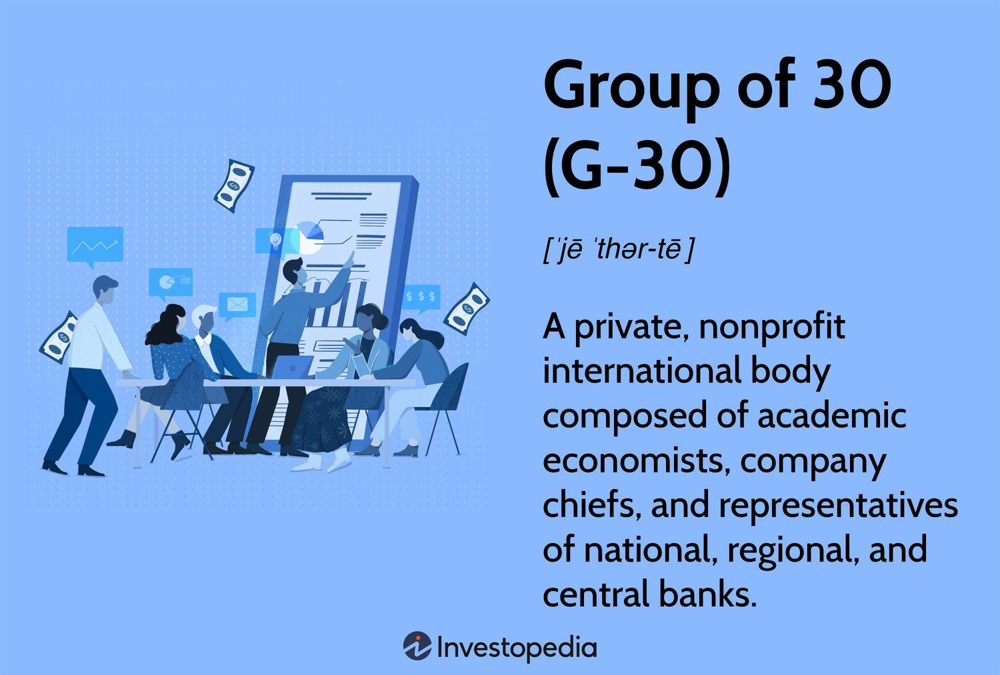

## Table of Contents

## What is the Group of Thirty?

The Group of Thirty, often called the G30, is a group of very important people from around the world. They come from places like banks, governments, and universities. The G30 was started in 1978 to help talk about and solve big money problems that affect many countries.

The group meets a few times each year to discuss things like how to make the world's money systems better and safer. They also write reports and give advice to people who make decisions about money and laws. The G30 wants to help make the world's economy stronger and more stable.

## When was the Group of Thirty founded?

The Group of Thirty was founded in 1978. It is a group made up of important people from different countries who work in banks, governments, and universities.

The main goal of the Group of Thirty is to talk about and solve big money problems that affect many countries. They meet a few times each year to discuss how to make the world's money systems better and safer. They also write reports and give advice to help make the world's economy stronger and more stable.

## Who can become a member of the Group of Thirty?

Membership in the Group of Thirty is by invitation only. The group looks for people who have a lot of experience and knowledge in areas like banking, finance, and government. These people usually have important jobs in big banks, central banks, or universities, and they come from many different countries around the world.

The Group of Thirty wants members who can help them understand and solve big money problems that affect many countries. They choose people who can give good advice and help make the world's money systems better and safer. Members are expected to meet a few times each year to discuss these issues and work together on reports and recommendations.

## What are the primary objectives of the Group of Thirty?

The Group of Thirty, or G30, aims to help solve big money problems that affect many countries. They want to make the world's money systems better and safer. The group talks about how to do this by meeting a few times each year. They invite people who have a lot of experience in banking, finance, and government to join them.

During these meetings, the G30 discusses important issues and tries to find good solutions. They also write reports and give advice to people who make decisions about money and laws. Their main goal is to help make the world's economy stronger and more stable. By working together, they hope to improve how money works around the world.

## How does the Group of Thirty influence global financial policies?

The Group of Thirty, or G30, influences global financial policies by bringing together experts from around the world to discuss and solve big money problems. These experts come from banks, governments, and universities, and they work together to come up with good ideas and solutions. When the G30 writes reports and gives advice, people who make decisions about money and laws often listen to them. This is because the G30 members have a lot of experience and knowledge about how money works around the world.

By meeting a few times each year, the G30 can keep up with what's happening in the world's money systems. They talk about how to make these systems better and safer. When they share their ideas and advice, it can help change the way countries handle their money. This can lead to new laws and rules that make the world's economy stronger and more stable. So, the G30 has a big impact on how money is managed globally.

## Can you list some notable members of the Group of Thirty?

The Group of Thirty has many important members who come from different countries and have big jobs in banking, finance, and government. Some well-known members include Paul Volcker, who was once the head of the U.S. Federal Reserve. Another member is Jean-Claude Trichet, who used to lead the European Central Bank. These people have a lot of experience and knowledge about money and help the G30 with their advice.

Other notable members are Tharman Shanmugaratnam, who is a big leader in Singapore's government, and Mario Draghi, who was the head of the European Central Bank after Jean-Claude Trichet. The G30 also includes people like Jacob A. Frenkel, who has worked at the International Monetary Fund and the Bank of Israel. These members work together to make the world's money systems better and safer.

The G30 also has members like Christine Lagarde, who is now the President of the European Central Bank, and Mark Carney, who used to be the Governor of the Bank of England. These leaders help the G30 come up with good ideas and solutions to big money problems. By working together, they try to make the world's economy stronger and more stable.

## What types of publications does the Group of Thirty produce?

The Group of Thirty produces different kinds of reports and studies. They write about big money problems that affect many countries. These reports help people who make decisions about money and laws understand what is happening and what they can do to make things better. The G30's publications often talk about how to make the world's money systems safer and more stable.

These publications can include long studies on specific topics, like how banks can avoid big problems or how countries can work together on money issues. The G30 also puts out shorter papers that give quick advice on important issues. All of these writings come from the ideas and talks that happen when the G30 members meet a few times each year. By sharing their knowledge and experience, the G30 helps make the world's economy stronger.

## How is the Group of Thirty structured?

The Group of Thirty, or G30, is a group of important people who work together to solve big money problems. They come from different countries and have jobs in banks, governments, and universities. The G30 is led by a Chairman, who is chosen from the members. The Chairman helps guide the group and makes sure they stay focused on their goals. There is also a small group of people called the Steering Committee, who help the Chairman plan meetings and decide what to talk about.

The members of the G30 meet a few times each year to discuss important money issues. They talk about how to make the world's money systems better and safer. When they meet, they share their ideas and experiences to come up with good solutions. The G30 also has a small staff that helps with the meetings and writing reports. These reports are important because they give advice to people who make decisions about money and laws. By working together, the G30 tries to make the world's economy stronger and more stable.

## What is the role of the Group of Thirty in financial crises?

The Group of Thirty, or G30, plays an important role during financial crises. When there are big money problems that affect many countries, the G30 members meet to talk about what is happening and what can be done to fix it. They use their experience and knowledge to come up with good ideas and solutions. The G30 writes reports and gives advice to people who make decisions about money and laws. This can help countries handle the crisis better and make their money systems safer.

During a financial crisis, the G30's work is very important. They help everyone understand what is going on and what needs to be done. Their advice can lead to new rules and laws that stop the crisis from getting worse. By working together, the G30 helps make the world's economy stronger and more stable, even during tough times.

## How does the Group of Thirty engage with other international organizations?

The Group of Thirty, or G30, works with other big groups around the world to help solve money problems. They talk to groups like the International Monetary Fund (IMF) and the World Bank. These groups have a lot of power in deciding how countries handle their money. The G30 shares its ideas and advice with these groups to help them make good choices. By working together, they can come up with better plans to keep the world's money safe and strong.

The G30 also meets with leaders from central banks and other important money organizations. They share what they know and learn from each other. This helps everyone understand big money problems better and find good solutions. When the G30 talks to these other groups, it helps make the world's economy more stable. They all work together to make sure that money systems around the world are safe and can handle problems well.

## What are some major reports or recommendations issued by the Group of Thirty?

The Group of Thirty, or G30, has put out many important reports over the years. One big report they wrote is called "The Structure of Financial Supervision: Approaches and Challenges in a Global Marketplace." This report talks about how countries can watch over their banks and money systems better. It gives advice on how to make sure banks are safe and how to stop big money problems from happening. Another important report is "Banking Conduct and Culture: A Call for Sustained and Comprehensive Reform." This report looks at how banks act and what they need to do to be more honest and fair. It suggests ways to change how banks work so they can be trusted more by people.

Another key report from the G30 is "Fundamentals of Central Banking: Lessons from the Crisis." This report explains what central banks learned from past money crises and how they can do a better job in the future. It gives ideas on how central banks can help keep the economy stable. The G30 also wrote a report called "Toward Effective Governance of Financial Institutions." This report talks about how banks and other money places should be run so they can be safe and strong. It suggests rules and ways to make sure people in charge of these places do a good job. These reports show how the G30 tries to help make the world's money systems better and safer.

## How has the Group of Thirty evolved since its inception?

Since it started in 1978, the Group of Thirty, or G30, has grown and changed a lot. At first, it was a small group of experts who wanted to talk about big money problems. Over the years, the G30 has gotten bigger and now includes more people from different countries. They have also started to focus on new issues like how to make banks safer and how to stop money crises from happening. The group has become more important in the world of money because they give good advice and write reports that help people make better decisions.

The way the G30 works has also changed. They used to meet just a few times a year, but now they have more meetings and talk to more people. The G30 now works closely with other big groups like the International Monetary Fund and the World Bank. They share their ideas and learn from each other to come up with better plans. The G30 also uses new technology to share their reports and advice with more people around the world. This helps them have a bigger impact on how money is managed everywhere.

## References & Further Reading

[1]: [Medley, George. "Geoffrey Bell, founder of Group of Thirty"](https://www.swimmingworldmagazine.com/news/budapest-2024-day-2-finals-neutral-athletes-set-european-record-in-mixed-200-medley-relay) Central Banking, 2006.

[2]: ["The Group of Thirty: Consultative Group on International Economic and Monetary Affairs."](https://www.group30.org/) Group of Thirty Official Website

[3]: Carney, Mark. ["Value(s): Building a Better World for All"](https://www.amazon.com/Value-Building-Better-World-All/dp/1541768701) PublicAffairs, 2021.

[4]: Krugman, Paul. ["The Return of Depression Economics and the Crisis of 2008"](https://archive.org/details/returnofdepressi0000krug) W. W. Norton & Company, 2009.

[5]: Summers, Lawrence H. ["The Next Economic Disaster"](https://archive.org/details/nexteconomicdisa0000vagu) by Richard Vague Public Affairs, 2014.

[6]: [Johnson, Simon. "Algorithmic Trading and Its Implications for Financial Markets."](https://recentlybooked.com/LA/Ouachita/SIMON-JOHNSON~831_2024-00009640) The Journal of Economic Perspectives, Vol. 27, No. 2, Spring 2013.

[7]: [Kirilenko, Andrei A., Kyle, Albert S., Samadi, Mehrdad, & Tuzun, Tugkan. "The Flash Crash: The Impact of High Frequency Trading on an Electronic Market."](https://www.jstor.org/stable/26652722) Review of Financial Studies, Volume 30, Issue 7, July 2017.

[8]: [Avellaneda, Marco, and Stoikov, Sasha. "High-frequency trading in a limit order book"](https://people.orie.cornell.edu/sfs33/LimitOrderBook.pdf), Quantitative Finance, Volume 8, 2008.