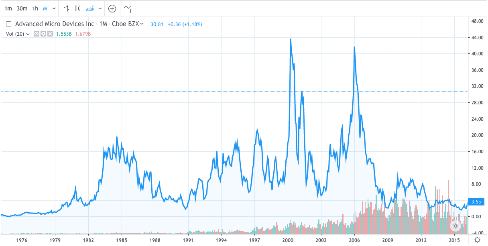

The Group of Thirty (G-30) is an esteemed global advisory entity known for its significant contribution to understanding economic and financial matters on a worldwide scale. Comprised of prominent figures in finance, economics, and central banking, the G-30 offers substantial insights into the complexities of the global economic landscape. This article will discuss the G-30's influence, particularly focusing on their role in financial advisory and algorithmic trading. Established in 1978, this organization has been instrumental in shaping discussions and policies concerning vital economic issues, thus impacting the approaches to financial stability and market regulation. By examining the group's origins and mission, we aim to highlight the influence their analyses and reports have had on global economic policies, illustrating the G-30's enduring relevance in addressing contemporary financial challenges.

## Table of Contents

## What is the Group of Thirty (G-30)?

The Group of Thirty, often referred to as the G-30, is a private, nonprofit international organization that brings together a distinguished cadre of leading financiers, economists, and central bank officials. The group was established in 1978 and has since been instrumental in fostering a deeper understanding of pressing economic and financial issues on a global level. Its founding was motivated by the need to address complex economic challenges and facilitate intellectual exchange among top professionals in the field.

The organization’s membership is composed of individuals recognized for their substantial expertise and contributions to finance and economics. This includes senior figures from central banks, major financial institutions, and academia. By pooling their collective knowledge, the G-30 aims to provide insights that transcend national and sectoral boundaries, fostering a more interconnected understanding of global finance.

A core activity of the G-30 is its biannual meetings, where members gather to discuss and analyze significant economic topics. These meetings serve as a platform for exchanging ideas on a wide array of issues, including foreign exchange, capital markets, financial stability, and economic policy. By focusing on these themes, the group seeks to identify emerging trends and address potential challenges facing the international financial system.

The G-30’s work is not constrained to discussions alone. It actively engages in research and publishes reports that often serve as influential resources for policymakers, academics, and financial professionals. Through these activities, the G-30 has positioned itself as a key player in shaping the global financial landscape, driving dialogue and innovation in economic thought and policy.

## History and Mission of the G-30

The Group of Thirty (G-30) was established in 1978, primarily funded by the Rockefeller Foundation, under the vision of Geoffrey Bell. Bell, an accomplished British economist, sought to create a forum where leading figures from the financial world could assemble to discuss and respond to significant economic and financial challenges. This initiative came at a time when the complexity and interconnectedness of global markets were beginning to demand more coordinated and nuanced approaches to financial policy and decision-making.

The mission of the G-30 is to explore the international repercussions of financial decisions across both public and private sectors. This objective underscores the group's dedication to fostering a deeper understanding of how financial policies influence global economies and, consequently, shape the financial landscape. By providing a platform for influential policymakers, financiers, and academics to exchange ideas and insights, the G-30 aims to enhance the quality of economic discourse and improve policy outcomes internationally.

Over the years, the G-30 has played a prominent role in shaping key economic reforms. The group's insights have been particularly influential during periods of financial crisis, where their expert analyses and recommendations have guided policymakers in formulating effective responses. For instance, the financial turmoil of the late 20th and early 21st centuries underscored the necessity for robust mechanisms to manage systemic risk, and the G-30's contributions were critical in addressing these challenges. 

The group's ability to attract eminent members who possess substantial expertise in financial markets and policy-making has ensured that its recommendations hold considerable weight in global discussions. The ongoing impact of the G-30's work reflects its significant role in influencing reforms that seek to stabilize and fortify the global financial system against future disruptions.

## Key Members and Their Influence

Current and past members of the Group of Thirty (G-30) include distinguished individuals such as Mark Carney, Paul Krugman, and Lawrence H. Summers. These figures have made substantial contributions to the field of economics and finance, leveraging their extensive expertise gained from various roles within central banks, academia, and international finance organizations.

Mark Carney, a former Governor of the Bank of England and the Bank of Canada, is known for his insights into monetary policy and climate-change-related financial risks. His participation in the G-30 underscores the group's engagement with contemporary economic issues, including sustainability in finance.

Paul Krugman, a Nobel laureate in Economic Sciences, is renowned for his work on international economics, [liquidity](/wiki/liquidity-risk-premium) traps, and currency crises. His contributions to the G-30 bring a robust analytical perspective on these critical areas, impacting discussions on global economic frameworks and stability.

Lawrence H. Summers, a former U.S. Treasury Secretary and Chief Economist of the World Bank, offers a wealth of experience in economic policy formulation and public finance. His involvement with the G-30 provides insights into fiscal policy challenges and global economic governance.

Members of the G-30, drawing from their diverse backgrounds, help shape major policy decisions that influence global markets. Their collective intelligence provides a unique and invaluable resource for governments, central banks, and international financial institutions. By pooling their varied expertise, they deliver well-rounded perspectives on economic issues, thereby shaping contemporary economic discourse and ultimately guiding significant reforms in international financial systems.

## G-30's Role in Financial Advisory

The Group of Thirty (G-30) plays a critical role in financial advisory, providing thorough analyses and recommendations that shape global financial policies and reforms. The group conducts comprehensive studies on a range of pressing financial issues, such as liquidity crises, banking failures, and financial stability, which have been especially pertinent in times of economic uncertainty.

One of the primary functions of the G-30 is to produce reports that synthesize complex financial data and trends into actionable insights. These reports are instrumental for policymakers and financial institutions as they navigate intricate financial landscapes. For instance, during liquidity crises, the G-30's analyses assist in identifying the root causes and propose strategic interventions to restore market confidence and functionality. Their work often highlights the interconnectedness of global financial systems and the ripple effects that localized financial disruptions can have on the broader economy.

Banking failures represent another critical area addressed by the G-30. By examining historical case studies and current banking trends, the G-30 provides frameworks for improving banking sector resilience. This includes recommendations for better risk management practices, more robust regulatory environments, and the establishment of financial safeguards to prevent systemic collapses.

Financial stability, a cornerstone of the G-30's focus, is essential for sustained economic growth. Their reports often elucidate the complex interplay between regulatory frameworks, market practices, and economic policies. Recommendations from the G-30 frequently guide central banks and governments in crafting policies that bolster financial stability while accommodating economic growth.

The respect afforded to G-30 reports stems from the group's reputation for rigor and neutrality. Governments and financial institutions worldwide utilize these reports as a benchmark for policy formulation and implementation. The evidence-based approach adopted by the G-30 ensures that their recommendations are grounded in empirical data and expert analysis, making them indispensable resources for decision-makers. 

Overall, the G-30's involvement in financial advisory underscores their commitment to enhancing the agility and robustness of financial systems globally, thereby contributing to the sustainability and adaptability of economies in an ever-changing financial landscape.

## Algorithmic Trading and the G-30

Algorithmic trading, a substantial element of contemporary financial markets, has been a focal point of examination by the Group of Thirty (G-30). This form of trading, which utilizes complex algorithms to execute orders at high speed, has significantly altered the landscape of market operations. The G-30 has scrutinized this development to understand its implications on market stability and the regulatory frameworks governing financial systems globally.

One of the primary concerns addressed by the G-30 is the impact of [algorithmic trading](/wiki/algorithmic-trading) on market stability. The rapid execution capabilities inherent in algorithmic trading can lead to increased [volatility](/wiki/volatility-trading-strategies), as algorithms may react to market movements in milliseconds, leading to herding behavior among automated systems. To illustrate, the "Flash Crash" of May 6, 2010, revealed vulnerabilities in market structures due to automated trading, where the Dow Jones Industrial Average plunged about 1,000 points within minutes before recovering almost as quickly. The G-30's assessments focus on how such events can be mitigated through sound policy and regulatory measures.

The G-30's work extends to guiding institutions on managing risks associated with high-frequency trading ([HFT](/wiki/high-frequency-trading-strategies)), a subset of algorithmic trading distinguished by extremely high turnover rates and the ability to influence market pricing. The organization studies various risk factors, including latency [arbitrage](/wiki/arbitrage) and liquidity fragmentation, which can exacerbate systemic risks. By analyzing these phenomena, the G-30 provides recommendations that aid in refining market surveillance and implementing safeguards.

Moreover, the G-30's research contributes to the development of regulatory frameworks that ensure fair and efficient markets. Their studies advocate for transparency in algorithmic strategies and the implementation of circuit breakers and kill switches that can halt trading in times of extreme volatility. These measures are intended to diminish the likelihood of market disruptions and protect the integrity of financial systems.

In conclusion, the Group of Thirty's examination of algorithmic trading is vital for crafting strategies that balance innovation with stability. By offering insights into how high-frequency trading affects global markets, the G-30 plays a significant role in shaping policies that safeguard financial systems against inherent risks.

## Publications and Impact

The Group of Thirty (G-30) is known for its comprehensive publications that address key financial issues, serving as instrumental resources for understanding complex economic phenomena. These documents are publicly accessible, facilitating widespread dissemination of their findings to a broad audience of policymakers, financial experts, and academics.

One significant area of exploration in G-30 publications is derivatives. The group has meticulously examined the role and impact of derivatives on financial markets, shedding light on both their utility and potential risks. Given the complexity of these financial instruments, the group's analyses have been critical in elucidating their implications for market stability and economic growth.

Central banking is another core topic frequently addressed in G-30 reports. The intricacies of central banking, including monetary policy implementation and regulatory frameworks, are dissected to provide in-depth understanding and strategic recommendations. These evaluations help central banks worldwide navigate the challenges of maintaining economic stability amidst fluctuating global conditions.

The G-30 also focuses on macroeconomic challenges, providing insights into issues like economic growth, inflation, and international trade dynamics. Their publications outline the potential impacts of global economic trends and policy decisions, offering guidance to stakeholders in developing strategies that ensure economic resilience.

The impact of these publications is substantial, as evidenced by their widespread use among decision-makers in both public and private sectors. Policymakers leverage G-30 insights to shape economic policies that address current and future challenges effectively. Financial experts utilize these reports to gain a nuanced understanding of emerging financial trends and reassess risk management practices accordingly.

In summary, the Group of Thirty's publications play a pivotal role in the discourse on financial systems and economic policy. By providing thoroughly researched and insightful analyses, they continue to influence and inform policy and decision-making globally.

## Conclusion

The Group of Thirty (G-30) serves as an essential global think-tank, providing influential insights into the intricate web of global economic and financial systems. With its focus on financial advisory and algorithmic trading, the G-30's contributions significantly shape policy frameworks and decision-making processes across the world. The organization’s in-depth analyses and reports are pivotal in addressing complex issues such as financial stability, liquidity crises, and the evolving dynamics of high-frequency trading. These reports are widely respected and utilized by governments and financial institutions, guiding policymakers on pressing economic matters.

The G-30's ongoing exploration of algorithmic trading's impact on market stability and regulatory environments exemplifies their proactive stance in addressing contemporary economic challenges. By scrutinizing the implications of algorithmic mechanisms, the group offers crucial guidance for institutions seeking to manage risks associated with high-speed trading technologies. This work not only facilitates safer trading environments but also enhances the understanding of how technological advancements can be integrated into existing market structures.

Looking to the future, the G-30 is poised to continue its influential role in navigating the complexities of global economies. As financial landscapes evolve with technological innovations and emerging market dynamics, the G-30’s insights and recommendations will be invaluable in shaping adaptive and resilient economic policies. By fostering a deeper understanding of the interconnectedness of financial systems and promoting responsible financial practices, the G-30 remains a cornerstone of global economic strategy and reform.

## References & Further Reading

[1]: [Medley, George. "Geoffrey Bell, founder of Group of Thirty"](https://www.swimmingworldmagazine.com/news/budapest-2024-day-2-finals-neutral-athletes-set-european-record-in-mixed-200-medley-relay) Central Banking, 2006.

[2]: ["The Group of Thirty: Consultative Group on International Economic and Monetary Affairs."](https://www.group30.org/) Group of Thirty Official Website

[3]: Carney, Mark. ["Value(s): Building a Better World for All"](https://www.amazon.com/Value-Building-Better-World-All/dp/1541768701) PublicAffairs, 2021.

[4]: Krugman, Paul. ["The Return of Depression Economics and the Crisis of 2008"](https://archive.org/details/returnofdepressi0000krug) W. W. Norton & Company, 2009.

[5]: Summers, Lawrence H. ["The Next Economic Disaster"](https://archive.org/details/nexteconomicdisa0000vagu) by Richard Vague Public Affairs, 2014.

[6]: [Johnson, Simon. "Algorithmic Trading and Its Implications for Financial Markets."](https://recentlybooked.com/LA/Ouachita/SIMON-JOHNSON~831_2024-00009640) The Journal of Economic Perspectives, Vol. 27, No. 2, Spring 2013.

[7]: [Kirilenko, Andrei A., Kyle, Albert S., Samadi, Mehrdad, & Tuzun, Tugkan. "The Flash Crash: The Impact of High Frequency Trading on an Electronic Market."](https://www.jstor.org/stable/26652722) Review of Financial Studies, Volume 30, Issue 7, July 2017.

[8]: [Avellaneda, Marco, and Stoikov, Sasha. "High-frequency trading in a limit order book"](https://people.orie.cornell.edu/sfs33/LimitOrderBook.pdf), Quantitative Finance, Volume 8, 2008.