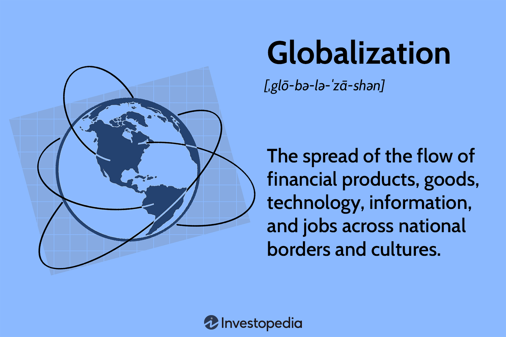

The Group of Three (G3) was an international alliance formed between Mexico, Colombia, and Venezuela with the primary aim of establishing a robust free trade agreement. This pact, effective from 1995, was initially designed to last for ten years and foster economic integration and cooperation among the member countries. Although this agreement was eventually dissolved, its initial intent and subsequent impacts on international trade remain significant topics of study.

The origins and eventual dissolution of the G3 agreement reflect the complexities involved in international trade partnerships. The agreement aimed not only at reducing tariffs but also at enhancing trade flows by addressing broader issues like intellectual property rights and public-sector investments. These efforts were part of Mexico's strategic initiative to extend free trade throughout Central America, linking it with prominent agreements such as NAFTA (North American Free Trade Agreement).

As we evaluate the historical context and significance of the G3 in Latin American economic dynamics, it provides insights into regional economic policies and trade practices that these nations experimented with during the late 20th century. The foundation laid by the G3 agreement influenced the evolution of subsequent trade policies and economic frameworks within the involved countries.

Meanwhile, the field of finance and trading has been undergoing transformative changes, especially with the advent of algorithmic trading. Known as algo trading, this methodology has significantly reshaped traditional trading practices by leveraging advanced algorithms to execute trades. These algorithms enhance efficiency and minimize transaction costs, mirroring the objectives of free trade agreements like G3 aimed at optimizing economic transactions. The convergence of technology with trading strategies has prompted a re-examination of how international trade agreements adapt to digital advancements.

This exploration will cover the history and economic impacts of the G3, together with contemporary developments in trading, underlining the continuously evolving landscape of international relations and financial markets. Such an understanding offers valuable lessons for future trade and economic strategies across global markets.

## Table of Contents

## The Formation of the Group of Three

The Group of Three (G3) agreement was a strategic free trade pact devised to bolster economic relationships among Mexico, Colombia, and Venezuela by establishing a substantial free trade area. This initiative was formalized with the aim of enhancing mutual trade flows among the three nations by systematically diminishing tariffs and dismantling trade barriers. A notable facet of the agreement was its incorporation of intellectual property rights, illustrating the intention to create a comprehensive platform for trade cooperation.

Crucially, the G3 agreement aligned with Mexico's broader economic strategy to expand free trade throughout Central America. This strategy was part of Mexico's efforts to solidify its position within the increasingly globalized economy, following the country's involvement in the North American Free Trade Agreement (NAFTA). The creation of the G3 aimed to complement these efforts by establishing stronger regional ties in Latin America, serving as a pathway to deeper economic integration.

However, from its inception, the G3 agreement encountered various political and economic challenges that ultimately contributed to its brevity. Political shifts within member countries, most notably in Venezuela, posed significant hurdles. The economic stability required to sustain the agreement was undermined by fluctuating political ideologies and policies, particularly in the early 2000s when Venezuela, under President Hugo Chávez, began to adopt policies that increasingly diverged from the agreement's foundational principles. This divergence eventually led to Venezuela's withdrawal from the G3 in 2006, marking a critical turning point and signaling the decline of the alliance.

Economic [volatility](/wiki/volatility-trading-strategies) and differing national priorities further strained the efficacy and longevity of the agreement, demonstrating the difficulties inherent in maintaining such multilateral economic pacts. Despite these challenges, the inception of the G3 marked a significant effort in the history of Latin American trade agreements, underscoring the complexities of fostering international trade collaborations in a region marked by diverse political landscapes and economic objectives.

## Understanding the G3 Agreement

The G3 agreement was a multifaceted trade accord that extended beyond mere trade liberalization to encompass a wide array of economic integration areas. It aimed to foster a collaborative economic environment between Mexico, Colombia, and Venezuela, reducing trade barriers and enhancing public sector investments. A key component of the agreement was its provisions regarding intellectual property rights, which sought to align economic practices and protect innovations across member nations.

This agreement was part of Mexico's strategic approach to expanding its international economic engagements, aligning closely with other significant trade initiatives, such as the North American Free Trade Agreement (NAFTA). NAFTA had already established a framework for broadening trade relations across the continent, and the G3 aimed to further these goals by incorporating Latin American partners.

Adjustments within the G3 aimed to facilitate free trade across different industries, which included reducing tariffs and addressing non-tariff barriers. These modifications were crucial in promoting diversified trade by widening the range of products covered and enabling more seamless cross-border economic activity.

However, the departure of Venezuela in 2006 under Hugo Chavez's leadership marked a pivotal moment for the agreement. Chavez's administration adopted a stance that was increasingly nationalistic and skeptical of traditional trade alliances, which led to Venezuela's [exit](/wiki/exit-strategy) and significantly altered the agreement's dynamics. This departure highlighted the political volatility that can affect such international accords and underscored the challenges faced in maintaining cohesive trade relationships amidst shifting political landscapes.

## Legacy and Impact of the Group of Three

The Group of Three (G3) agreement, although short-lived, significantly impacted the trading landscape in Latin America. This alliance between Mexico, Colombia, and Venezuela laid the groundwork for modern trading practices and regional economic cooperation. By fostering enhanced bilateral trade relations, particularly between Mexico and Colombia, the G3 agreement helped establish a robust economic link that persisted despite Venezuela's withdrawal in 2006.

One of the notable legacies of the G3 was the advancement of infrastructure projects, crucial for bolstering economic and trade ties. Among these were initiatives aimed at integrating power grids and developing shared energy pipelines, which facilitated not only the flow of goods but also energy resources across borders. These projects had a lasting impact on regional cooperation, highlighting the potential for infrastructure as a tool for economic integration.

Furthermore, Mexico's strategy of engaging concurrently in the G3 and the North American Free Trade Agreement (NAFTA) enabled it to emerge as a pivotal trading partner in Central America. The synergistic approach augmented Mexico's influence in the region and underscored its role in shaping Latin America's trade dynamics. By participating in both agreements, Mexico enhanced its economic stature, leveraging the G3 to expand its reach in Latin America while benefiting from NAFTA's access to North American markets.

Overall, the G3 agreement, despite its dissolution, left an indelible mark on Latin America's trade policies and infrastructure development, setting a precedent for subsequent collaborations and economic strategies.

## Recent Trends in Trading: Algorithmic Trading

Algorithmic trading has significantly transformed the financial landscape by incorporating complex algorithms into trading strategies. These algorithms execute predefined instructions, such as timing, price, and quantity, allowing for the rapid execution of trades without the need for human intervention. This shift towards automation has been marked by a move away from traditional manual trading methods, where decisions were often based on intuition and slower-paced analysis.

The evolution of algo trading can be traced back to advancements in computational technology and the increasing availability of high-frequency trading systems. These systems capitalize on price discrepancies and market movements, executing numerous trades in fractions of a second. Traditional manual trading, which relied heavily on human analysis and decision-making, has been overshadowed by the speed and precision offered by algorithmic systems.

The principles of free trade agreements, such as the Group of Three (G3), resonate in modern algo trading strategies. These trade agreements aim to enhance efficiency and reduce trade barriers, similar to how [algorithmic trading](/wiki/algorithmic-trading) seeks to minimize transaction costs and optimize trading outcomes. By employing algorithms, traders can take advantage of favorable market conditions and execute trades with minimal costs, reflecting the same efficiencies pursued in international trade agreements.

Moreover, as technology continues to advance, digital and automated financial practices are increasingly influencing international trade policies. The integration of algorithmic trading in global markets emphasizes the need for regulatory frameworks that can accommodate these advancements while ensuring fair and transparent trading environments. As such, policymakers are considering the implications of digital automation on international trade, much like how past agreements like the G3 aimed to address the evolving needs of trade and economic integration.

In conclusion, algorithmic trading represents a pivotal evolution in trading practices, mirroring the efficiency and cost reduction goals of historical trade agreements. Its development highlights the growing role of technology in shaping the future of financial markets and international trade policies.

## Conclusion

The Group of Three (G3) was a significant, albeit temporary, initiative aimed at enhancing trade and economic integration within Latin America. Despite the dissolution of the G3 agreement, its impact reverberated through regional trade policies, contributing valuable lessons in the pursuit of economic collaboration. The G3 laid foundational frameworks that influenced subsequent trade agreements and shaped economic partnerships between Latin American countries, most notably between Mexico and Colombia. These countries have continued to benefit from the trade infrastructure and legal frameworks established during the agreement's tenure.

The advent of algorithmic trading marks a considerable transformation in trade methodologies, with technology assuming an increasingly pivotal role in the execution of financial transactions. This evolution mirrors the past objectives of agreements like the G3 by striving for enhanced efficiency and reduced transaction costs. Algorithmic trading relies on computer algorithms to make speedy, data-driven trading decisions. This method surpasses traditional manual trading methods by minimizing human error and optimizing execution speed. As a result, algorithmic trading aligns with the foundational principles behind free trade agreements: maximizing trade [volume](/wiki/volume-trading-strategy) and minimizing friction.

Understanding historical agreements like the G3 offers valuable insights into the complexities and potential trajectories of future trade and economic strategies. Examining both the successes and challenges of past initiatives can inform the design of contemporary trade agreements that are adaptable to modern technological advancements and geopolitical shifts. The interplay between historical trade frameworks and modern digital practices exemplifies the dynamic and evolving nature of international relations and global markets.

In sum, the legacy of the Group of Three and the rise of algorithmic trading together underscore the ever-changing landscape of global trade. The lessons learned from G3's implementation and demise, juxtaposed with the innovations in trading technology, highlight the need for adaptive and forward-thinking approaches in navigating the intricate web of international commerce.

## References & Further Reading

[1]: Bulmer-Thomas, V. (2006). ["The Economic History of Latin America since Independence"](https://www.cambridge.org/core/books/economic-history-of-latin-america-since-independence/849AA61529EC2D8C272411A722A93B04). Cambridge University Press.

[2]: Wise, C., & Quiliconi, C. (2007). ["The Political Economy of a Free Trade Agreement: US Strategy, Chilean Strategy, and the Agreement's Impact"](https://www.scribd.com/document/808655059/deciancio2016). Latin American Politics and Society, 49(2), 1-25.

[3]: Krugman, P. R., & Obstfeld, M. (2009). ["International Economics: Theory and Policy."](https://archive.org/details/internationaleco0008krug) Pearson Education.

[4]: Kose, M. A., Rebucci, A., & Sherlock, H. (2006). ["Latin America’s Global Integration and Opportunities for Growth"](https://papers.ssrn.com/sol3/papers.cfm?abstract_id=3407714). International Monetary Fund Working Paper.

[5]: Iñiguez-Montiel, J. A., & Ibarra-Yunez, A. (2006). ["Deepening NAFTA and Trade Policy Reforms in Mexico"](https://latinaer.springeropen.com/articles/10.1186/s40503-018-0058-9) Latin American Policy, Volume 7, Issue 3, pages 486-506.

[6]: Aldunate, R., & Wiesner, S. (1998). ["The Group of Three and the Process of Economic Integration"](https://pmc.ncbi.nlm.nih.gov/articles/PMC4305093/). The World Economy, 21(9), 1227-1243.