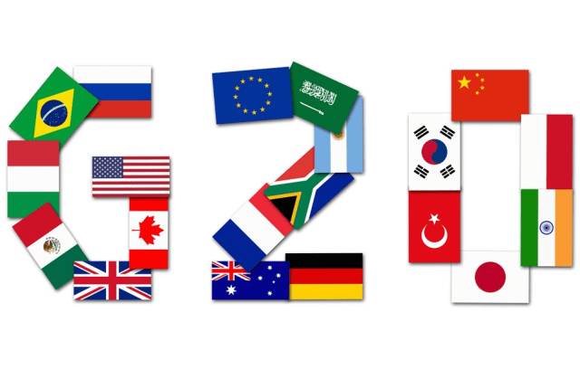

## Table of Contents

## What is the Group of Twenty (G20)?

The Group of Twenty, or G20, is a group of the world's major economies that meet regularly to discuss global economic issues. It includes 19 countries and the European Union. Some of the countries in the G20 are the United States, China, and Germany. The G20 was created in 1999 after a series of financial crises. Its goal is to promote international financial stability and to make and strengthen global economic rules.

The G20 leaders meet once a year at a summit. At these meetings, they talk about important topics like trade, climate change, and global health. The G20 does not have its own money or army, but it can influence global policies because its members are powerful. The decisions made at G20 meetings can affect the whole world, so many people pay close attention to what happens at these summits.

## Which countries are members of the G20?

The G20 is made up of 19 countries and the European Union. The countries are Argentina, Australia, Brazil, Canada, China, France, Germany, India, Indonesia, Italy, Japan, Mexico, Russia, Saudi Arabia, South Africa, South Korea, Turkey, the United Kingdom, and the United States.

These countries come from all over the world. Some are in North and South America, like the United States, Canada, and Brazil. Others are in Europe, like France, Germany, Italy, and the United Kingdom. There are also countries from Asia, such as China, India, Japan, and South Korea. Africa is represented by South Africa, and the Middle East by Saudi Arabia. Australia is the only member from Oceania.

The European Union is a special member because it is not a country but a group of countries working together. This makes the G20 a very diverse group, covering many different parts of the world and economies.

## How does the G20 differ from other international forums like the G7?

The G20 and the G7 are both groups of countries that meet to talk about global issues, but they are different in some important ways. The G20 includes 19 countries and the European Union, making it a much bigger group than the G7, which only has 7 countries. Because the G20 has more members from different parts of the world, it represents a wider range of economies and cultures. This makes the G20 a more diverse group that can better address global problems that affect many different countries.

The G7, on the other hand, includes only the richest countries in the world: Canada, France, Germany, Italy, Japan, the United Kingdom, and the United States. These countries are all very wealthy and have strong economies. The G7 focuses more on the issues that are important to these rich countries, like trade and security. While the G20 also talks about these topics, it spends more time on issues that affect developing countries too, like poverty and climate change. So, the G20 tries to find solutions that work for more countries around the world.

## What are the main objectives of the G20?

The main goal of the G20 is to make the world's economy strong and stable. They do this by talking about and trying to solve big economic problems that affect many countries. This includes things like making trade easier, helping countries grow their economies, and stopping financial crises from happening. The G20 works to make sure that the global economy is healthy and that everyone can benefit from it.

Another important objective of the G20 is to help with global issues that go beyond just money. They talk about important topics like climate change, health, and helping poor countries develop. The G20 tries to find ways for countries to work together on these issues so that the whole world can be a better place. By including many different countries, the G20 can make plans that help a lot of people around the world.

## How does the G20 influence global economic policies?

The G20 influences global economic policies by bringing together leaders from many of the world's biggest economies to talk about important issues. When these leaders meet, they share ideas and make plans that can affect how countries around the world handle their economies. For example, they might agree on ways to make trade easier between countries, which can help businesses grow and create jobs. They also talk about how to prevent financial crises, which can protect people's savings and keep the economy stable.

Another way the G20 influences global economic policies is by setting goals and making recommendations that countries can follow. Even though the G20 does not have the power to force countries to do things, its members are powerful and influential. When the G20 makes a recommendation, many countries listen and might change their own policies to match. This can lead to big changes in how the global economy works, like setting new rules for banks or agreeing to fight climate change together. By working together, the G20 can help make the world's economy stronger and fairer for everyone.

## What role does the G20 play in addressing global financial crises?

The G20 plays a big role in addressing global financial crises by bringing together leaders from the world's major economies to discuss and coordinate their responses. When a financial crisis happens, it can affect many countries at once. The G20 helps these countries work together to stop the crisis from getting worse. They talk about what caused the crisis and what can be done to fix it. By sharing information and making plans together, the G20 can help prevent the crisis from spreading and causing more harm.

One way the G20 helps during a financial crisis is by making recommendations on how countries should respond. These recommendations can include things like changing rules for banks to make them safer, or providing financial help to countries that are struggling. Even though the G20 can't force countries to follow these recommendations, many countries listen because the G20 members are powerful. By working together, the G20 can help stabilize the global economy and make sure that financial crises don't happen as often or become as bad.

## How are decisions made within the G20?

Decisions in the G20 are made by talking and working together. The leaders from all the G20 countries meet once a year at a big meeting called the summit. At the summit, they discuss important topics like the economy, trade, and climate change. They try to find solutions that everyone can agree on. The leaders share their ideas and listen to each other. If they can agree on something, they write it down in a document called a communiqué. This document shows what they have decided and what they plan to do next.

Even though the G20 leaders talk a lot, they don't always agree on everything. Sometimes, they have different ideas about what should be done. When this happens, they might not be able to make a decision right away. Instead, they might keep talking until they can find a solution that works for everyone. The G20 doesn't have the power to force countries to do things, so any decision they make is a suggestion that countries can choose to follow. By working together and trying to reach agreements, the G20 helps make the world a better place.

## What are some key achievements of the G20 in recent years?

In recent years, the G20 has made important progress in many areas. One big achievement is helping countries work together to fight climate change. The G20 countries agreed to reduce their use of fossil fuels and to invest more in clean energy. This is important because climate change affects everyone, and the G20's actions can help make the world a safer place. They also set up a plan to help developing countries deal with climate change, which can help these countries grow without harming the environment.

Another key achievement is making the global economy stronger. The G20 has worked to make trade easier between countries. This helps businesses sell their products in more places, which can create jobs and help the economy grow. They also made new rules for banks to make them safer and less likely to cause financial problems. This helps protect people's money and keeps the economy stable. By working together, the G20 has made big steps to help the world's economy be healthier and fairer for everyone.

## How does the G20 address issues like climate change and sustainable development?

The G20 helps fight climate change by getting big countries to work together. They have agreed to use less fossil fuel and to put more money into clean energy like wind and solar power. This is important because climate change is a big problem that affects everyone. The G20 also helps developing countries deal with climate change. They give these countries money and advice so they can grow their economies without hurting the environment. By doing this, the G20 is trying to make the world a better place for everyone.

The G20 also works on sustainable development, which means helping countries grow in a way that is good for the environment and people. They talk about how to make sure everyone has enough food, clean water, and good health care. The G20 tries to find ways to help poor countries develop without using up all their resources. They also talk about how to make sure that everyone can have a good job and live well. By working together, the G20 helps make the world a fairer and more sustainable place.

## What criticisms have been leveled against the G20 regarding its effectiveness and inclusivity?

Some people say the G20 is not as effective as it could be. They think that because the G20 can't make countries do things, it's hard for them to make big changes. Sometimes, the G20 leaders can't agree on important issues, so they don't do as much as people want them to. Also, some people think the G20 focuses too much on the big, rich countries and doesn't do enough to help smaller or poorer countries. They say the G20 should do more to make sure everyone benefits from their decisions.

Another criticism is about inclusivity. Some people think the G20 doesn't include enough voices from around the world. They say that because the G20 only has 19 countries and the European Union, it leaves out a lot of other countries that could have important ideas. Some also think the G20 doesn't listen enough to groups like environmentalists, workers, and people from poor communities. They want the G20 to be more open and to include more people in their discussions so that everyone's needs are considered.

## How do the agendas of G20 summits evolve over time, and what factors influence these changes?

The agendas of G20 summits change over time because the world keeps facing new problems. At first, the G20 focused a lot on fixing financial crises and making the economy strong. But as time went on, they started talking more about other big issues like climate change, health, and helping poor countries develop. This is because these problems became more important and people wanted the G20 to help solve them. The G20 tries to talk about things that matter to many countries, so their agenda changes to match what's happening in the world.

Several things influence what the G20 talks about at their summits. One big [factor](/wiki/factor-investing) is what's happening in the news and what people are worried about. If there's a big financial crisis or a new health problem like a pandemic, the G20 will focus on those things. Another factor is what the country hosting the summit wants to talk about. Each year, a different country hosts the summit, and they can choose some of the topics. Also, the leaders of the G20 countries talk to each other and share their ideas, so what they think is important can change the agenda too. By looking at all these things, the G20 decides what to focus on each year.

## What future challenges and opportunities does the G20 face in maintaining its relevance and impact on global governance?

The G20 faces several future challenges in staying relevant and impactful. One big challenge is keeping everyone working together. Sometimes, countries have different ideas and can't agree on what to do. This makes it hard for the G20 to make big changes. Another challenge is making sure they include everyone's voices. Some people think the G20 focuses too much on big, rich countries and doesn't listen enough to smaller or poorer countries. They want the G20 to be more open and include more people in their discussions. Also, the world is changing fast with new problems like climate change and new technology, so the G20 needs to keep up and talk about these new issues.

Despite these challenges, the G20 also has opportunities to make a difference. One opportunity is to help fight climate change. By getting big countries to work together on clean energy and helping poor countries develop without hurting the environment, the G20 can make the world a better place. Another opportunity is to use new technology to solve problems. The G20 can talk about how to use technology to make trade easier and help people live better lives. If the G20 can keep working together and focus on these important issues, they can stay relevant and have a big impact on global governance.

## References & Further Reading

[1]: Bergstra, J., Bardenet, R., Bengio, Y., & Kégl, B. (2011). ["Algorithms for Hyper-Parameter Optimization."](https://dl.acm.org/doi/10.5555/2986459.2986743) Advances in Neural Information Processing Systems 24.

[2]: ["Advances in Financial Machine Learning"](https://www.amazon.com/Advances-Financial-Machine-Learning-Marcos/dp/1119482089) by Marcos Lopez de Prado

[3]: ["Evidence-Based Technical Analysis: Applying the Scientific Method and Statistical Inference to Trading Signals"](https://www.amazon.com/Evidence-Based-Technical-Analysis-Scientific-Statistical/dp/0470008741) by David Aronson

[4]: ["Machine Learning for Algorithmic Trading"](https://github.com/stefan-jansen/machine-learning-for-trading) by Stefan Jansen

[5]: ["Quantitative Trading: How to Build Your Own Algorithmic Trading Business"](https://www.amazon.com/Quantitative-Trading-Build-Algorithmic-Business/dp/1119800064) by Ernest P. Chan