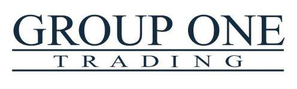

## Table of Contents

## What is Group One Trading?

Group One Trading is a company that helps people buy and sell things like stocks and options. They work with big financial markets around the world, like the New York Stock Exchange and the Chicago Board Options Exchange. Their main job is to make sure that buying and selling happens smoothly and fairly for everyone.

The company started in 1989 and has grown a lot since then. They have offices in different places like Chicago, New York, and San Francisco. Group One Trading is known for using new technology and smart ideas to help their clients make good choices when trading. They also focus on teaching their clients about the markets so they can understand how everything works.

## How did Group One Trading start?

Group One Trading began in 1989. A few people who knew a lot about trading wanted to start their own company. They saw that the world of trading was changing fast and thought they could do things differently. They started small, but they had big ideas about using new technology to help people trade better.

At first, Group One Trading focused on options trading. This means they helped people buy and sell options, which are special kinds of investments. They worked hard to make their services better and to understand what their clients needed. Over time, they grew bigger and opened offices in different cities. They became known for being smart about trading and for helping their clients learn more about the markets.

## What types of financial products does Group One Trading deal with?

Group One Trading deals with different kinds of financial products, mostly focusing on options. Options are special contracts that give people the right to buy or sell something at a certain price before a certain date. They help people trade these options on big markets like the New York Stock Exchange and the Chicago Board Options Exchange.

Besides options, Group One Trading also works with stocks. Stocks are pieces of ownership in a company that people can buy and sell. By dealing with both options and stocks, Group One Trading helps their clients make smart choices in the financial world. They use technology and their knowledge to make trading easier and more fair for everyone.

## Who are the key figures involved in Group One Trading?

Group One Trading was started by a few smart people who knew a lot about trading. One of the key figures is Sean O'Connor, who helped start the company in 1989. He has been a big part of making Group One Trading grow and do well. Another important person is Robert J. Hawryluk, who also helped start the company and has been very important in how it runs.

These founders have been joined by other important people over the years. For example, Patrick Healy is the President and CEO now. He helps lead the company and make sure it keeps doing well. There are also many other people who work at Group One Trading and help make it a success. They all work together to make trading easier and better for everyone.

## What is the business model of Group One Trading?

Group One Trading makes money by helping people buy and sell things like options and stocks. They charge a small fee for each trade they help with. This is their main way of making money. They work with big markets around the world, so they can help a lot of people trade. By using new technology and smart ideas, they try to make trading easier and better for everyone.

They also focus on teaching their clients about the markets. By helping people understand how trading works, Group One Trading hopes to keep their clients happy and coming back. This is another important part of their business model. By combining good service, smart technology, and education, Group One Trading tries to be a leader in the trading world.

## How does Group One Trading impact the financial market?

Group One Trading helps make the financial market work better. They do this by making it easier for people to buy and sell options and stocks. They use new technology to help trades happen quickly and fairly. This means that the markets can be more efficient, and people can trust that their trades will be handled well. By working with big markets around the world, Group One Trading helps keep the whole financial system running smoothly.

They also teach people about trading. When people understand more about how the markets work, they can make better choices. This can lead to more people trading, which makes the markets more active and lively. Group One Trading's focus on education and technology helps make the financial market a better place for everyone.

## What are some notable achievements of Group One Trading?

Group One Trading has done many great things since it started in 1989. They have grown a lot and now have offices in big cities like Chicago, New York, and San Francisco. They are known for using new technology to help people trade options and stocks better. This has made them a leader in the trading world. They also work with big markets like the New York Stock Exchange and the Chicago Board Options Exchange, which shows how important they are in the financial world.

Another big achievement is how they help teach people about trading. Group One Trading focuses on making sure their clients understand the markets. This has helped more people feel confident when they trade. By combining smart technology with good education, Group One Trading has made the financial market work better for everyone. Their work has helped make trading easier, fairer, and more active.

## What challenges has Group One Trading faced?

Group One Trading has faced some tough challenges over the years. One big challenge is the fast changes in technology. They need to keep up with new tools and ways of trading to stay ahead. If they don't, other companies might do better. Another challenge is the rules and laws about trading. These rules can change and Group One Trading has to make sure they follow them all the time. This can be hard work and take a lot of time.

Another challenge is competition. There are many other companies that want to help people trade options and stocks. Group One Trading has to work hard to be the best and keep their clients happy. They also have to deal with times when the market is not doing well. When the market goes down, people might trade less, which can make it harder for Group One Trading to make money. Despite these challenges, Group One Trading has kept growing and helping people trade better.

## How does Group One Trading comply with financial regulations?

Group One Trading works hard to follow all the rules about trading. They have special people who know a lot about the laws and make sure the company does everything right. These people watch the rules all the time and change how the company works if the rules change. This helps Group One Trading stay out of trouble and keep trading smoothly.

They also use technology to help them follow the rules. Special computer programs check every trade to make sure it follows the law. This helps catch any mistakes quickly. By using smart people and smart technology, Group One Trading makes sure they do everything the right way and keep their clients safe.

## What technologies does Group One Trading use to enhance its operations?

Group One Trading uses a lot of new technology to help people trade better. They have special computer programs that make trading faster and easier. These programs can check trades quickly to make sure everything is done right. They also use technology to watch the markets all the time, so they can give their clients the best advice.

Another important technology they use is for teaching people about trading. They have online tools and classes that help people learn how to trade well. By using technology to teach and to trade, Group One Trading makes sure they can help their clients in the best way possible.

## What are the future plans or strategies of Group One Trading?

Group One Trading wants to keep getting better at helping people trade. They plan to use even more new technology to make trading faster and easier. They also want to keep teaching people about trading so more people can understand how it works. By doing this, they hope to help more people trade and make the markets better for everyone.

Another big plan for Group One Trading is to grow even more. They want to open new offices in other places and work with more big markets around the world. This will help them help more people and make trading even smoother. By focusing on technology, education, and growing, Group One Trading aims to stay a leader in the trading world.

## How does Group One Trading compare to its competitors in the industry?

Group One Trading is known for being good at using new technology to help people trade options and stocks. They work hard to make trading fast and easy, and they also focus on teaching people about the markets. This makes them different from some of their competitors who might not use as much technology or focus on education. Group One Trading also works with big markets like the New York Stock Exchange and the Chicago Board Options Exchange, which shows they are important in the trading world.

Compared to other companies, Group One Trading has a strong focus on making sure trading is fair and smooth for everyone. They use special computer programs to check trades and make sure everything follows the rules. This helps them stand out because it makes people trust them more. While other companies might also do these things, Group One Trading's mix of technology, education, and working with big markets makes them a strong player in the industry.

## References & Further Reading

[1]: ["Algorithmic Trading: Winning Strategies and Their Rationale"](https://books.google.com/books/about/Algorithmic_Trading.html?id=WAlFDwAAQBAJ) by Ernie Chan

[2]: ["Automated Trading with R: Quantitative Research and Platform Development"](https://link.springer.com/book/10.1007/978-1-4842-2178-5) by Chris Conlan

[3]: ["The Role of Big Data, Artificial Intelligence, and Machine Learning in Algorithmic Trading"](https://www.mdpi.com/2079-9292/13/24/4983) available on ResearchGate

[4]: ["Overview of Algorithmic Trading"](https://www.investopedia.com/articles/active-trading/101014/basics-algorithmic-trading-concepts-and-examples.asp) available on Investopedia

[5]: Coursera: ["Machine Learning for Trading"](https://www.coursera.org/specializations/machine-learning-trading) offered by the Georgia Institute of Technology

[6]: edX: ["Algorithmic Trading and Finance Models with Python, R, and Stata Essential Training"](https://www.linkedin.com/learning/algorithmic-trading-and-finance-models-with-python-r-and-stata-essential-training-2019)