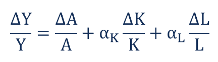

## Table of Contents

## What is growth accounting and why is it important?

Growth accounting is a way to figure out why an economy grows over time. It breaks down the growth of a country's total output, or GDP, into different parts. These parts include how much workers contribute, how much new technology helps, and how well businesses use their resources. By looking at these parts, economists can see what is making the economy grow faster or slower.

Understanding growth accounting is important because it helps policymakers and business leaders make better decisions. If they know that growth is coming from more workers, they might focus on creating jobs. If growth is coming from new technology, they might invest more in research and development. By knowing where growth comes from, leaders can plan for the future and help their country's economy do well.

## What are the basic components of growth accounting?

Growth accounting has a few main parts that help us understand why an economy grows. The first part is the contribution from labor. This means how much the number of workers and how hard they work affects the economy's growth. When more people have jobs or work longer hours, the economy usually grows more. The second part is capital, which includes things like machines, buildings, and tools that businesses use to make goods and services. When businesses invest in more or better capital, it can lead to more growth.

Another important part of growth accounting is total factor productivity (TFP). TFP is a bit trickier because it measures how efficiently labor and capital are used together. It includes things like new technology, better ways of managing businesses, and even how well laws and rules help the economy work. When TFP goes up, it means the economy is getting more out of its workers and machines, which can lead to faster growth.

These three parts—labor, capital, and total factor productivity—work together to explain economic growth. By looking at how each part contributes, economists can see what's driving the economy and what might help it grow even more in the future.

## How does the Solow residual fit into growth accounting?

The Solow residual is a key part of growth accounting. It's another name for total factor productivity (TFP). When economists look at how an economy grows, they see how much of that growth comes from more workers and more machines. But there's always some growth that can't be explained just by workers and machines. That extra growth is the Solow residual. It shows how well an economy is using its workers and machines together.

The Solow residual is important because it tells us about things like new technology and better ways of doing business. For example, if a new computer makes workers much more productive, that would show up in the Solow residual. It's like a measure of how smart and efficient an economy is. By looking at the Solow residual, economists can see if growth is coming from new ideas and better ways of working, not just from having more workers or machines.

## What is the difference between total factor productivity (TFP) and labor productivity?

Total factor productivity (TFP) and labor productivity both measure how well an economy is doing, but they look at different things. TFP measures how well an economy uses all its resources together, like workers, machines, and technology. It's like a score for how smart and efficient the whole economy is. When TFP goes up, it means the economy is getting more out of everything it has, not just from having more workers or machines.

Labor productivity, on the other hand, focuses only on workers. It measures how much each worker can produce in a certain amount of time. If labor productivity goes up, it means workers are making more stuff or providing more services than before. This can happen because workers are working harder, have better tools, or are using new technology. So while TFP looks at the whole picture, labor productivity zooms in on just the workers.

## How do you calculate economic growth using the Cobb-Douglas production function?

The Cobb-Douglas production function is a simple way to understand how an economy grows. It says that the total output of an economy depends on two main things: how many workers there are and how much capital, like machines and buildings, the economy has. The formula for the Cobb-Douglas production function is Y = A * K^α * L^(1-α), where Y is the total output, A is a measure of how well the economy uses its resources (total factor productivity), K is capital, L is labor, and α is a number between 0 and 1 that shows how important capital is compared to labor.

To calculate economic growth using this function, you look at how much each part of the formula changes over time. If you have more workers or more capital, the total output will usually go up. But the part that often matters a lot is A, the total factor productivity. If A goes up because of new technology or better ways of doing things, the economy can grow even if the number of workers and the amount of capital stay the same. By plugging in the numbers for K, L, and A at different times, you can see how much each part contributes to the growth of the economy.

## What role do capital and labor inputs play in growth accounting?

In growth accounting, capital and labor inputs are like the building blocks of an economy's growth. Capital includes things like machines, buildings, and tools that businesses use to make stuff. When businesses buy more or better capital, it can help the economy grow because workers can make more things with better tools. Labor is all about the workers in the economy. If there are more workers or if they work harder or longer, the economy can grow too. Both capital and labor are important because they directly affect how much an economy can produce.

But it's not just about having more capital and labor. How well these inputs are used together also matters a lot. That's where total factor productivity comes in, which looks at how smart and efficient the economy is. Even if the amount of capital and labor stays the same, the economy can still grow if businesses find better ways to use them. So, while capital and labor are key parts of growth accounting, it's the combination of these inputs and how well they're used that really drives economic growth.

## How can growth accounting be used to analyze economic development over time?

Growth accounting helps us see how an economy has changed over time by breaking down why it grew. It looks at things like the number of workers, the tools and machines they use, and how well everything works together. By comparing these parts from one year to the next, we can see what made the economy grow faster or slower. For example, if there were more workers but the economy didn't grow much, it might mean the new workers weren't using good tools or didn't have the right skills. On the other hand, if the economy grew a lot even with the same number of workers, it could be because of new technology or better ways of doing things.

Using growth accounting, we can also spot trends and plan for the future. If we see that growth has mostly come from having more workers, but now the number of workers is not growing as fast, we might need to focus on other things like new technology or better machines to keep the economy growing. It's like a roadmap that shows us where we've been and where we might need to go next. By understanding these patterns, leaders can make smarter choices about where to invest money and time to help the economy keep developing.

## What are the limitations of traditional growth accounting methods?

Traditional growth accounting methods have some problems that can make it hard to understand the real story of an economy's growth. One big issue is that these methods often don't account for things that are hard to measure, like improvements in the quality of goods and services or changes in how people work together. For example, if a new phone is much better than the old one, traditional growth accounting might not show that because it just counts the number of phones made, not how much better they are. This can make it look like the economy isn't growing as fast as it really is.

Another limitation is that traditional growth accounting can miss out on important changes in the economy, like shifts in industries or new ways of doing business. If a country starts making more high-tech products instead of simple ones, the growth accounting might not capture this change well because it focuses on the total output rather than what kind of output is being produced. Also, these methods often assume that the way capital and labor are used stays the same over time, which isn't always true. As businesses find new ways to work smarter, the old ways of measuring growth might not keep up with these changes.

## How do you adjust growth accounting models for technological change?

To adjust growth accounting models for technological change, economists need to focus on total factor productivity (TFP), which is the part of growth that comes from using resources more efficiently. When new technology comes along, like better computers or new ways of organizing work, it can make workers and machines more productive. To see this in growth accounting, economists need to measure how much TFP changes over time. They do this by looking at how much output grows compared to how much labor and capital grow. If output grows more than expected just from more workers and machines, the difference is likely due to new technology.

Another way to adjust for technological change is to update the data and methods used in growth accounting. Traditional models might not catch all the ways technology improves things, like making products better or services faster. Economists can use new data to see how technology affects different parts of the economy. They might also use new methods that look at specific industries or types of technology to get a clearer picture. By doing this, they can better understand how technology drives growth and make more accurate predictions about the future of the economy.

## What advanced techniques exist for decomposing growth into its sources?

To understand where growth comes from, economists use advanced techniques to break it down into different parts. One method is called "growth regression analysis." This technique uses math to see how much different things, like the number of workers, the amount of machines, and new technology, affect how fast the economy grows. By looking at data over many years, economists can figure out which parts matter the most. Another way is to use "structural decomposition analysis." This method looks at how different parts of the economy, like industries or regions, contribute to growth. It helps to see if growth is coming from one place more than others, or if it's spread out.

Another advanced technique is called "shift-share analysis." This method helps to see how changes in different industries affect overall growth. It breaks down growth into parts that come from having more workers or machines in an industry, and parts that come from that industry becoming more productive. By doing this, economists can see if growth is because certain industries are doing well, or if it's because the whole economy is getting better. These techniques help to give a clearer picture of what's driving growth, so leaders can make better plans for the future.

## How can growth accounting be applied to cross-country comparisons?

Growth accounting can help us compare how different countries' economies grow by looking at what makes them grow. It breaks down growth into parts like the number of workers, the machines and tools they use, and how well everything works together. By looking at these parts in different countries, we can see if one country grows more because it has more workers, better machines, or smarter ways of doing things. For example, if one country has a lot of growth from new technology, while another grows more from having more workers, growth accounting can show these differences clearly.

Using growth accounting for cross-country comparisons can also help us understand why some countries grow faster than others. If we see that one country's growth comes mostly from having more workers, but another country's growth comes from using machines and technology better, we can learn from these differences. This can help policymakers in different countries see what they might need to focus on to help their economy grow. By comparing these parts across countries, we get a better picture of what drives growth around the world and how different strategies can lead to different results.

## What are the latest research developments in growth accounting methodologies?

Recent research in growth accounting has focused on making the methods more accurate and detailed. One big change is the use of better data. Economists are now using more detailed information about how workers and machines are used in different parts of the economy. This helps them see how growth happens in different industries and regions. They're also using new ways to measure things like technology and how well resources are used. This means they can better understand how new inventions and smarter ways of working help the economy grow.

Another important development is the use of advanced math and computer models. These new tools help economists break down growth into even smaller parts. For example, they can now look at how different types of technology affect growth, not just technology in general. They're also using these models to see how changes in one part of the economy can affect other parts. This helps them get a clearer picture of what's really driving growth and how different things work together to make the economy bigger.

## What is Growth Accounting?

Growth accounting is a pivotal analytical framework in economics, allowing for the attribution of economic growth to distinct contributing factors: labor, capital, and technology. This method was introduced by economist Robert Solow in 1957 as part of his groundbreaking work on the Solow-Swan growth model. It is sometimes referred to as the Solow residual, highlighting its capacity to quantify the portion of economic growth not directly attributable to labor or capital but to technological progress or productivity improvements.

At its core, growth accounting decomposes the total growth of an economy's output, often measured by Gross Domestic Product (GDP), into portions that can be attributed to input factors. By dissecting GDP growth, researchers and policymakers can better understand the dynamics driving an economy's expansion. Specifically, growth accounting involves the following equation:

$$

\text{GDP Growth} = (\text{Contribution of Capital}\times \text{Weight of Capital}) + (\text{Contribution of Labor}\times \text{Weight of Labor}) + \text{Residual Growth (Technology)}
$$

Where:
- **Contribution of Capital** and **Contribution of Labor** are derived from the growth rates of capital stock and labor force, respectively.
- **Weight of Capital** and **Weight of Labor** are the respective shares of capital and labor in total income.
- **Residual Growth**, identified through growth accounting, captures the effects of technological advancement, which is not directly observed through traditional inputs.

The technique highlights the importance of technological progress as a driver of economic growth, acknowledging that improvements in the efficiency of production processes contribute significantly to output changes. This insight has essential implications for economic policy and strategic planning, emphasizing the need for investments in research and development, education, and infrastructure to sustain long-term economic development.

## What are the methods for calculating growth accounting?

Growth accounting is a fundamental approach employed to discern how different contributors, namely labor, capital, and technological innovation, drive economic expansion. The essence of this method is encapsulated in a primary equation that quantifies the proportionate impact of each [factor](/wiki/factor-investing) on the gross domestic product (GDP) growth. This essential equation is formulated as follows:

$$
\text{GDP Growth} = (\text{Capital Growth} \times \text{Weight of Capital}) + (\text{Labor Growth} \times \text{Weight of Labor}) + \text{Technological Progress}
$$

In this framework, each component holds specific significance. Capital Growth represents the increase in assets used in production, while Labor Growth corresponds to the growth in human resource inputs. The Weight of Capital and Weight of Labor denote the respective contribution shares of capital and labor to GDP, reflecting their economic importance. These weights are often derived from econometric analyses or historical data on factor shares in national accounts.

Technological progress, known as "the Solow residual" named after economist Robert Solow, signifies the portion of GDP growth not accountable by measured labor and capital inputs. It symbolizes efficiency improvements or innovations that enhance productivity beyond what capital and labor can explain. This component is calculated residually, often considered a reflection of advancements in technology or improvements in processes that boost productivity.

To further elucidate the computation, consider the potential use of Python for modeling purposes. One could use regression analysis to estimate the weights and compute the residual technological progress. For instance, using a simplified dataset with variables of GDP growth, capital growth, and labor growth, a regression might be set up as follows:

```python
import numpy as np
import pandas as pd
from sklearn.linear_model import LinearRegression

# Example dataset
data = pd.DataFrame({
    'GDP_Growth': [0.03, 0.04, 0.02, 0.05, 0.03],
    'Capital_Growth': [0.02, 0.03, 0.01, 0.04, 0.02],
    'Labor_Growth': [0.01, 0.01, 0.005, 0.01, 0.01]
})

# Features and target variable
X = data[['Capital_Growth', 'Labor_Growth']]
y = data['GDP_Growth']

# Linear regression model
model = LinearRegression().fit(X, y)

# Resultant weights
weight_capital = model.coef_[0]
weight_labor = model.coef_[1]

# Calculating technological progress for each entry
data['Technological_Progress'] = data['GDP_Growth'] - (data['Capital_Growth'] * weight_capital + data['Labor_Growth'] * weight_labor)
```

In this script, `LinearRegression` is used to determine the weights for capital and labor. The technological progress is then deduced by computing the difference between the observed GDP growth and the growth contributions from capital and labor as predicted by the regression model.

By understanding the calculation methods of growth accounting, economists can effectively separate the measurable inputs, capital and labor, from the elusive gains attributed to innovation and efficiency, hence illuminating the pivotal role of technological progress in economic growth.

## What is an Example of Growth Accounting?

To illustrate the principles of growth accounting, consider a hypothetical nation, Investopedialand. Assume that the GDP of Investopedialand is $20.5 trillion. Growth accounting breaks down the GDP growth into contributions from various factors such as labor, capital, and technological progress. This can be represented by the equation:

$$
\text{GDP Growth} = (\text{Capital Growth} \times \text{Weight of Capital}) + (\text{Labor Growth} \times \text{Weight of Labor}) + \text{Technological Progress}
$$

For Investopedialand, suppose the specific growth rates for labor and capital are 2% and 3%, respectively. Further, let us assume that the weights assigned to labor and capital in this economy are 0.6 and 0.4, respectively. Applying this, the contribution of labor and capital to GDP growth can be calculated as follows:

1. **Contribution of Capital:** 
   \[ 0.03 \times 0.4 = 0.012 \text{ or } 1.2\%
$$

2. **Contribution of Labor:** 
   \[ 0.02 \times 0.6 = 0.012 \text{ or } 1.2\%
$$

The cumulative growth from labor and capital is thereby 2.4%. However, if the recorded GDP growth is 4%, the remainder of growth would be attributed to technological progress. In this case, technological progress can be computed as:

$$
\text{Technological Progress} = \text{Total GDP Growth} - (\text{Capital Contribution} + \text{Labor Contribution})
$$

$$
\text{Technological Progress} = 0.04 - (0.012 + 0.012)
$$

$$
\text{Technological Progress} = 0.016 \text{ or } 1.6\%
$$

This example effectively demonstrates how growth accounting isolates the effect of technology as the residual, the growth in GDP that cannot be explained by labor and capital inputs alone. This methodology underscores the significance of technological advancement as a driver of economic growth beyond traditional capital and labor factors in Investopedialand.

## What are the Analytical Tools used in Growth Accounting?

Various analytical tools underpin growth accounting analysis, enabling economists to dissect and interpret the intricate relationships between different economic variables. A key technique is regression analysis, which statistically models and quantifies the relationships among variables, specifically how the dependent variable changes when any one of the independent variables is varied while the others are held fixed. This method is instrumental in determining the impact of labor, capital, and technology on economic output.

Regression analysis facilitates the estimation of the coefficients in the primary growth accounting equation:

$$
\text{GDP Growth} = \beta_{\text{capital}} \times \text{Capital Growth} + \beta_{\text{labor}} \times \text{Labor Growth} + \text{Technological Progress}
$$

In this context, $\beta_{\text{capital}}$ and $\beta_{\text{labor}}$ represent the weights or contribution of capital and labor to GDP growth, respectively.

Another essential tool is time-series analysis, which evaluates the data points collected or recorded at successive, evenly-spaced intervals of time. This analysis captures trends, cycles, and seasonal variations in economic indicators, thereby helping analysts forecast future economic conditions. 

Panel data analysis offers additional depth, merging time-series and cross-sectional data to examine multiple entities over time. This method accounts for differences across entities and time periods, providing a more nuanced understanding of economic variables' dynamics. It is particularly useful in capturing the fixed and random effects that might be present in different economies or sectors.

Econometric models, which incorporate economic theories and statistical techniques, are also pivotal in growth accounting. These models are designed to capture the complex interplay between economic forces, employing large datasets to simulate potential scenarios and predict economic outcomes. Econometric modeling often involves sophisticated software and computational tools, such as R or Python, to manage and analyze data efficiently.

For instance, a simple Python script using the `statsmodels` library could set up a regression analysis as follows:

```python
import pandas as pd
import statsmodels.api as sm

# Example data
data = {'GDP_Growth': [3.0, 2.5, 3.5],
        'Capital_Growth': [1.5, 2.0, 1.8],
        'Labor_Growth': [0.8, 1.0, 1.2]}

df = pd.DataFrame(data)

# Define independent variables and add a constant
X = df[['Capital_Growth', 'Labor_Growth']]
X = sm.add_constant(X)

# Define dependent variable
y = df['GDP_Growth']

# Fit the regression model
model = sm.OLS(y, X).fit()

# Display the model summary
print(model.summary())
```

In summary, the analytical tools in growth accounting, including regression analysis, time-series analysis, panel data analysis, and econometric models, provide economists with the methodologies to systematically evaluate how labor, capital, and technological progress influence economic growth. These tools are pivotal for constructing accurate economic models and forecasts, ultimately facilitating more informed decision-making in policy and investment.

## References & Further Reading

[1]: Robert M. Solow (1956). ["A Contribution to the Theory of Economic Growth."](https://pages.nyu.edu/debraj/Courses/Readings/Solow.pdf) The Quarterly Journal of Economics, 70(1), 65-94.

[2]: Barro, Robert J. and Sala-i-Martin, Xavier (2004). ["Economic Growth."](http://piketty.pse.ens.fr/files/BarroSalaIMartin2004.pdf) MIT Press - Second Edition.

[3]: Jorgenson, Dale W., Ho, Mun S., & Stiroh, Kevin J. (2005). ["Information Technology and the American Growth Resurgence."](https://scholar.harvard.edu/files/jorgenson/files/retrosprctivelookusprodgrowthresurg_journaleconperspectives.pdf) MIT Press.

[4]: Brynjolfsson, Erik, & Hitt, Lorin (2000). ["Beyond Computation: Information Technology, Organizational Transformation and Business Performance."](https://www.aeaweb.org/articles?id=10.1257/jep.14.4.23) Journal of Economic Perspectives, 14(4), 23–48.

[5]: Greff, Klaus, et al. (2017). ["LSTM: A Search Space Odyssey."](https://arxiv.org/abs/1503.04069) IEEE Transactions on Neural Networks and Learning Systems, 28(10), 2222-2232.

[6]: Barro, Robert J. (1991). ["Economic Growth in a Cross Section of Countries."](http://piketty.pse.ens.fr/files/Barro91.pdf) The Quarterly Journal of Economics, 106(2), 407-443.