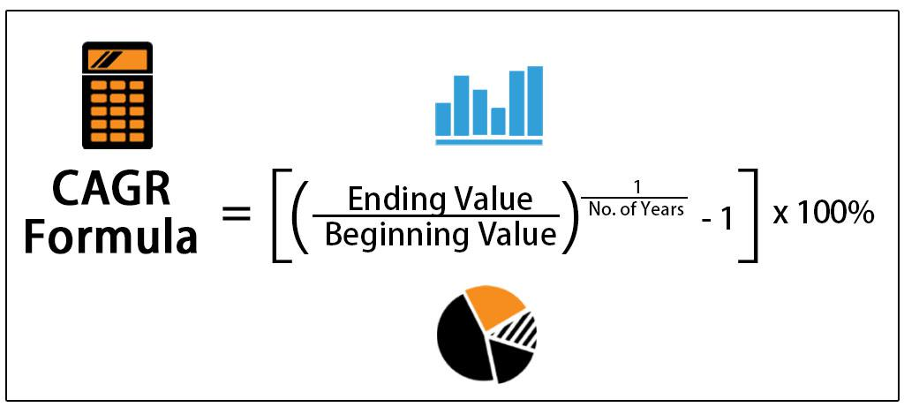

The economic landscape is continually shaped by a variety of local and global factors influencing the growth trajectories of nations. Economists and analysts frequently turn to key metrics such as Gross Domestic Product (GDP) to assess and understand economic performance. GDP serves as a crucial indicator of an economy's overall health, reflecting the total value of goods and services produced over a specific time period. Within GDP analysis, two distinct measures—Nominal GDP and Real GDP—are indispensable. Nominal GDP gauges the total economic output within current prices, providing a raw quantification of output sans adjustments for inflation. Conversely, Real GDP gives a clearer picture of an economy's size and how it’s growing over time by adjusting for inflation, offering a more realistic assessment of economic performance by measuring the value of goods and services at constant prices.

In the contemporary financial market, algorithmic trading systems have increasingly relied on these GDP metrics to inform and optimize trading decisions. Algorithmic trading, characterized by the efficient use of computer algorithms to execute trading strategies, benefits from the accurate predictions made possible by GDP insights. By integrating GDP metrics, these algorithms can better anticipate economic trends and adjust strategies accordingly, thereby enhancing decision-making processes. 



This article discusses the growth accounting methods that underpin this economic analysis, examines the calculation techniques involved, and explores the specific applications these principles have in the context of algorithmic trading. Through understanding these components, analysts can improve economic forecasting and investment decisions.

## Table of Contents

## What is Growth Accounting?

Growth accounting is a pivotal analytical framework in economics, allowing for the attribution of economic growth to distinct contributing factors: labor, capital, and technology. This method was introduced by economist Robert Solow in 1957 as part of his groundbreaking work on the Solow-Swan growth model. It is sometimes referred to as the Solow residual, highlighting its capacity to quantify the portion of economic growth not directly attributable to labor or capital but to technological progress or productivity improvements.

At its core, growth accounting decomposes the total growth of an economy's output, often measured by Gross Domestic Product (GDP), into portions that can be attributed to input factors. By dissecting GDP growth, researchers and policymakers can better understand the dynamics driving an economy's expansion. Specifically, growth accounting involves the following equation:

$$

\text{GDP Growth} = (\text{Contribution of Capital}\times \text{Weight of Capital}) + (\text{Contribution of Labor}\times \text{Weight of Labor}) + \text{Residual Growth (Technology)}
$$

Where:
- **Contribution of Capital** and **Contribution of Labor** are derived from the growth rates of capital stock and labor force, respectively.
- **Weight of Capital** and **Weight of Labor** are the respective shares of capital and labor in total income.
- **Residual Growth**, identified through growth accounting, captures the effects of technological advancement, which is not directly observed through traditional inputs.

The technique highlights the importance of technological progress as a driver of economic growth, acknowledging that improvements in the efficiency of production processes contribute significantly to output changes. This insight has essential implications for economic policy and strategic planning, emphasizing the need for investments in research and development, education, and infrastructure to sustain long-term economic development.

## Understanding Growth Accounting Calculation Methods

Growth accounting is a fundamental approach employed to discern how different contributors, namely labor, capital, and technological innovation, drive economic expansion. The essence of this method is encapsulated in a primary equation that quantifies the proportionate impact of each [factor](/wiki/factor-investing) on the gross domestic product (GDP) growth. This essential equation is formulated as follows:

$$
\text{GDP Growth} = (\text{Capital Growth} \times \text{Weight of Capital}) + (\text{Labor Growth} \times \text{Weight of Labor}) + \text{Technological Progress}
$$

In this framework, each component holds specific significance. Capital Growth represents the increase in assets used in production, while Labor Growth corresponds to the growth in human resource inputs. The Weight of Capital and Weight of Labor denote the respective contribution shares of capital and labor to GDP, reflecting their economic importance. These weights are often derived from econometric analyses or historical data on factor shares in national accounts.

Technological progress, known as "the Solow residual" named after economist Robert Solow, signifies the portion of GDP growth not accountable by measured labor and capital inputs. It symbolizes efficiency improvements or innovations that enhance productivity beyond what capital and labor can explain. This component is calculated residually, often considered a reflection of advancements in technology or improvements in processes that boost productivity.

To further elucidate the computation, consider the potential use of Python for modeling purposes. One could use regression analysis to estimate the weights and compute the residual technological progress. For instance, using a simplified dataset with variables of GDP growth, capital growth, and labor growth, a regression might be set up as follows:

```python
import numpy as np
import pandas as pd
from sklearn.linear_model import LinearRegression

# Example dataset
data = pd.DataFrame({
    'GDP_Growth': [0.03, 0.04, 0.02, 0.05, 0.03],
    'Capital_Growth': [0.02, 0.03, 0.01, 0.04, 0.02],
    'Labor_Growth': [0.01, 0.01, 0.005, 0.01, 0.01]
})

# Features and target variable
X = data[['Capital_Growth', 'Labor_Growth']]
y = data['GDP_Growth']

# Linear regression model
model = LinearRegression().fit(X, y)

# Resultant weights
weight_capital = model.coef_[0]
weight_labor = model.coef_[1]

# Calculating technological progress for each entry
data['Technological_Progress'] = data['GDP_Growth'] - (data['Capital_Growth'] * weight_capital + data['Labor_Growth'] * weight_labor)
```

In this script, `LinearRegression` is used to determine the weights for capital and labor. The technological progress is then deduced by computing the difference between the observed GDP growth and the growth contributions from capital and labor as predicted by the regression model.

By understanding the calculation methods of growth accounting, economists can effectively separate the measurable inputs, capital and labor, from the elusive gains attributed to innovation and efficiency, hence illuminating the pivotal role of technological progress in economic growth.

## Example of Growth Accounting

To illustrate the principles of growth accounting, consider a hypothetical nation, Investopedialand. Assume that the GDP of Investopedialand is $20.5 trillion. Growth accounting breaks down the GDP growth into contributions from various factors such as labor, capital, and technological progress. This can be represented by the equation:

$$
\text{GDP Growth} = (\text{Capital Growth} \times \text{Weight of Capital}) + (\text{Labor Growth} \times \text{Weight of Labor}) + \text{Technological Progress}
$$

For Investopedialand, suppose the specific growth rates for labor and capital are 2% and 3%, respectively. Further, let us assume that the weights assigned to labor and capital in this economy are 0.6 and 0.4, respectively. Applying this, the contribution of labor and capital to GDP growth can be calculated as follows:

1. **Contribution of Capital:** 
   \[ 0.03 \times 0.4 = 0.012 \text{ or } 1.2\%
$$

2. **Contribution of Labor:** 
   \[ 0.02 \times 0.6 = 0.012 \text{ or } 1.2\%
$$

The cumulative growth from labor and capital is thereby 2.4%. However, if the recorded GDP growth is 4%, the remainder of growth would be attributed to technological progress. In this case, technological progress can be computed as:

$$
\text{Technological Progress} = \text{Total GDP Growth} - (\text{Capital Contribution} + \text{Labor Contribution})
$$

$$
\text{Technological Progress} = 0.04 - (0.012 + 0.012)
$$

$$
\text{Technological Progress} = 0.016 \text{ or } 1.6\%
$$

This example effectively demonstrates how growth accounting isolates the effect of technology as the residual, the growth in GDP that cannot be explained by labor and capital inputs alone. This methodology underscores the significance of technological advancement as a driver of economic growth beyond traditional capital and labor factors in Investopedialand.

## Growth Accounting in Algorithmic Trading

Algorithmic trading systems have transformed financial markets by employing complex algorithms to automate trading strategies. These systems utilize growth accounting data as a fundamental component for strategic decision-making. Growth accounting, which distinguishes the contributions of capital, labor, and technological progress to economic growth, provides traders with valuable insights into macroeconomic trends that can impact financial markets.

Nominal and real GDP data are crucial inputs in these algorithms. Nominal GDP measures the output of an economy using current prices, capturing the influence of inflation, whereas real GDP adjusts for inflation and reflects the true growth in economic output. By analyzing both nominal and real GDP, [algorithmic trading](/wiki/algorithmic-trading) models can forecast economic trends with greater accuracy.

Incorporating growth accounting metrics into algorithmic trading enhances prediction accuracy. For instance, by understanding the growth rates of capital and labor, along with technological improvement, trading algorithms can identify periods of economic expansion or contraction. This macroeconomic foresight allows for more informed decisions on asset allocation, risk management, and timing of trades.

Algorithmic trading strategies benefit from precise forecasts of GDP growth, which involve employing mathematical models to process growth accounting data. A simple Python model to simulate an aspect of this might include:

```python
def gdp_growth(capital_growth, labor_growth, tech_progress, weight_capital, weight_labor):
    return (capital_growth * weight_capital) + (labor_growth * weight_labor) + tech_progress

# Example parameters
capital_growth = 0.03  # 3%
labor_growth = 0.02    # 2%
tech_progress = 0.01   # 1%
weight_capital = 0.4   # 40%
weight_labor = 0.6     # 60%

gdp_growth_rate = gdp_growth(capital_growth, labor_growth, tech_progress, weight_capital, weight_labor)
print(f"Forecasted GDP Growth Rate: {gdp_growth_rate:.2%}")
```

This simplified model calculates the forecasted GDP growth rate by assigning weights to capital and labor growth and adding technological progress, which forms the residual factor. More sophisticated models used in real-world trading incorporate additional variables and historical data analysis to refine predictions further.

In conclusion, by systematically incorporating growth accounting metrics, algorithmic trading systems achieve higher levels of accuracy in economic trend forecasts, leading to informed trading strategies and potentially greater returns.

## Real-World Applications

Growth accounting is instrumental in analyzing real-world economic growth across various sectors, providing valuable insights into specific areas such as labor productivity, capital investment, and technological advancement. A prime example of its application is by the Bureau of Labor Statistics (BLS), where it plays a crucial role in assessing the output growth of the private business sector. The BLS utilizes growth accounting to separate the contributions of different production factors, helping to paint a clearer picture of economic health.

In particular, growth accounting offers essential data for determining how different sectors contribute to overall economic productivity. By decomposing GDP growth into components attributable to capital, labor, and technological progress, economists can pinpoint which sectors are driving or hindering economic performance. This breakdown aids in identifying productivity trends, guiding policies, and making informed investment decisions.

For traders and investors, growth accounting provides insights into economic conditions that can impact market dynamics. By understanding which sectors are experiencing robust growth due to technological advances or increased capital investment, traders can adjust their strategies accordingly. Algorithmic trading systems, for instance, can incorporate growth accounting metrics, allowing for more nuanced economic forecasts and enhancing the precision of trading models.

In various industries, from manufacturing to services, growth accounting informs assessments of operational efficiency and competitiveness. Companies can use these insights to benchmark their productivity against industry standards, identifying areas for improvement and potential for innovation. This analysis not only helps firms streamline operations but also fosters a broader understanding of industry health.

Overall, growth accounting serves a multifaceted role in real-world applications, offering essential insights to economists, policymakers, businesses, and traders. By providing a detailed view of how labor, capital, and technology drive growth, it supports strategic decision-making essential for advancing economic objectives.

## Analytical Tools in Growth Accounting

Various analytical tools underpin growth accounting analysis, enabling economists to dissect and interpret the intricate relationships between different economic variables. A key technique is regression analysis, which statistically models and quantifies the relationships among variables, specifically how the dependent variable changes when any one of the independent variables is varied while the others are held fixed. This method is instrumental in determining the impact of labor, capital, and technology on economic output.

Regression analysis facilitates the estimation of the coefficients in the primary growth accounting equation:

$$
\text{GDP Growth} = \beta_{\text{capital}} \times \text{Capital Growth} + \beta_{\text{labor}} \times \text{Labor Growth} + \text{Technological Progress}
$$

In this context, $\beta_{\text{capital}}$ and $\beta_{\text{labor}}$ represent the weights or contribution of capital and labor to GDP growth, respectively.

Another essential tool is time-series analysis, which evaluates the data points collected or recorded at successive, evenly-spaced intervals of time. This analysis captures trends, cycles, and seasonal variations in economic indicators, thereby helping analysts forecast future economic conditions. 

Panel data analysis offers additional depth, merging time-series and cross-sectional data to examine multiple entities over time. This method accounts for differences across entities and time periods, providing a more nuanced understanding of economic variables' dynamics. It is particularly useful in capturing the fixed and random effects that might be present in different economies or sectors.

Econometric models, which incorporate economic theories and statistical techniques, are also pivotal in growth accounting. These models are designed to capture the complex interplay between economic forces, employing large datasets to simulate potential scenarios and predict economic outcomes. Econometric modeling often involves sophisticated software and computational tools, such as R or Python, to manage and analyze data efficiently.

For instance, a simple Python script using the `statsmodels` library could set up a regression analysis as follows:

```python
import pandas as pd
import statsmodels.api as sm

# Example data
data = {'GDP_Growth': [3.0, 2.5, 3.5],
        'Capital_Growth': [1.5, 2.0, 1.8],
        'Labor_Growth': [0.8, 1.0, 1.2]}

df = pd.DataFrame(data)

# Define independent variables and add a constant
X = df[['Capital_Growth', 'Labor_Growth']]
X = sm.add_constant(X)

# Define dependent variable
y = df['GDP_Growth']

# Fit the regression model
model = sm.OLS(y, X).fit()

# Display the model summary
print(model.summary())
```

In summary, the analytical tools in growth accounting, including regression analysis, time-series analysis, panel data analysis, and econometric models, provide economists with the methodologies to systematically evaluate how labor, capital, and technological progress influence economic growth. These tools are pivotal for constructing accurate economic models and forecasts, ultimately facilitating more informed decision-making in policy and investment.

## Limitations and Criticisms

Growth accounting, despite its utility in assessing economic growth, faces multiple limitations and criticisms that challenge its effectiveness and accuracy. A primary concern is the potential endogeneity between the variables involved, particularly capital, labor, and technology. Endogeneity issues arise when explanatory variables are correlated with the error term, which can bias estimates and affect the reliability of conclusions drawn from growth accounting models. This is especially pertinent in growth accounting due to the interdependence between these factors and economic outputs.

Data limitations also pose significant challenges. Accurate measurement of inputs like labor and capital is often hampered by data quality issues, inconsistencies across different data sources, and changes over time in how these inputs are defined and quantified. Moreover, non-market activities, such as home production and volunteer work, are typically excluded from growth accounting models, leading to an incomplete picture of total economic activity. These activities, while not captured by traditional GDP metrics, contribute to overall economic well-being and productivity.

Measuring technological progress, often represented by the Solow residual, presents a particularly difficult challenge. The rapid pace of technological advancements and their broad, diffuse impacts make it hard to quantify their exact contribution to economic growth. As technology rapidly evolves, growth accounting models may lag in capturing new developments, leading to underestimated or misallocated productivity gains.

The dynamic nature of labor and capital further complicates their measurement. Labor inputs are subject to changes in workforce quality, demographics, and participation rates, which can alter productivity independent of sheer labor quantity. Similarly, capital can vary in quality, and shifts in investment types and technological upgrades can impact its effectiveness. Such dynamic characteristics necessitate frequent data updates and nuanced analysis, adding complexity to growth accounting exercises.

These challenges highlight the complexities inherent in growth accounting and underscore the need for continuous improvement in data collection and statistical methodologies to maintain the relevance and accuracy of these analyses in economic policy and decision-making.

## The Bottom Line

Growth accounting serves as a pivotal tool for dissecting the factors driving economic growth, namely capital, labor, and technology. These components form the backbone of economic analysis, offering vital insights into how economies expand and evolve. By quantifying each factor's contribution to growth, policymakers can craft informed strategies to bolster economic performance. Traders also benefit as they can use this information to refine investment decisions and anticipate market movements.

Policymakers find growth accounting indispensable when formulating economic strategies. By assessing the relative contributions of labor, capital, and technology, they can pinpoint areas requiring policy intervention. For instance, if technological progress emerges as a minor contributor compared to capital and labor, efforts to stimulate innovation through research and development incentives might be justified.

For traders, understanding these metrics can enhance economic forecasting and investment strategies. Real and nominal GDP data serve as crucial inputs in trading algorithms, allowing for more accurate predictions of market trends. A well-grounded understanding of how these growth components interact enables traders to better assess economic health and make astute investment choices.

Ultimately, mastery of growth accounting principles equips both policymakers and traders with the analytical prowess necessary for effective decision-making in economic strategy and investment. This understanding aligns with the overarching goal of driving sustainable economic growth and optimizing resource allocation across sectors.

## References & Further Reading

[1]: Robert M. Solow (1956). ["A Contribution to the Theory of Economic Growth."](https://pages.nyu.edu/debraj/Courses/Readings/Solow.pdf) The Quarterly Journal of Economics, 70(1), 65-94.

[2]: Barro, Robert J. and Sala-i-Martin, Xavier (2004). ["Economic Growth."](http://piketty.pse.ens.fr/files/BarroSalaIMartin2004.pdf) MIT Press - Second Edition.

[3]: Jorgenson, Dale W., Ho, Mun S., & Stiroh, Kevin J. (2005). ["Information Technology and the American Growth Resurgence."](https://scholar.harvard.edu/files/jorgenson/files/retrosprctivelookusprodgrowthresurg_journaleconperspectives.pdf) MIT Press.

[4]: Brynjolfsson, Erik, & Hitt, Lorin (2000). ["Beyond Computation: Information Technology, Organizational Transformation and Business Performance."](https://www.aeaweb.org/articles?id=10.1257/jep.14.4.23) Journal of Economic Perspectives, 14(4), 23–48.

[5]: Greff, Klaus, et al. (2017). ["LSTM: A Search Space Odyssey."](https://arxiv.org/abs/1503.04069) IEEE Transactions on Neural Networks and Learning Systems, 28(10), 2222-2232.

[6]: Barro, Robert J. (1991). ["Economic Growth in a Cross Section of Countries."](http://piketty.pse.ens.fr/files/Barro91.pdf) The Quarterly Journal of Economics, 106(2), 407-443.