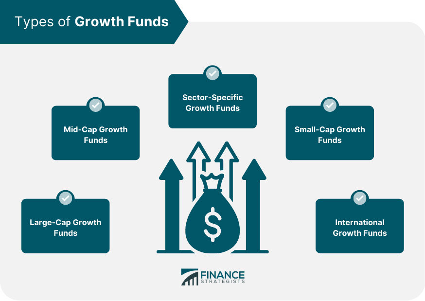

In finance, investors have myriad options for growing their wealth. Among these options, growth funds and algorithmic trading (algo trading) represent two pivotal strategies that have transformed the landscape of investments. Modern investors strive to achieve higher returns, and understanding these concepts is crucial for navigating today's financial markets effectively.

Growth funds are a type of investment vehicle, such as mutual funds or exchange-traded funds (ETFs), that concentrate on capital appreciation. These funds predominantly invest in stocks of companies anticipated to achieve above-average growth in earnings compared to their peers. By focusing on companies with robust growth potential, growth funds aim to deliver substantial returns over the long term. Investors often favor these funds for their potential to outperform broader market averages, although this potential typically comes at the expense of regular dividend payouts. Consequently, growth funds are attractive to those prioritizing long-term capital gains over short-term income.



Algorithmic trading, on the other hand, employs advanced computer algorithms to execute trades at speeds and efficiencies unattainable by human traders alone. This form of trading automates the decision-making process using pre-programmed instructions based on time, price, and volume, among other variables. Algorithmic trading has revolutionized asset management by minimizing human errors, reducing transaction costs, and enhancing the precision and effectiveness of trade executions. It is increasingly adopted by institutional investors, including hedge funds and other asset managers, who are eager to leverage the advantages of technology-driven investment strategies.

This article explores the intersection of these investment types, focusing on how growth funds can benefit from algo trading techniques to optimize performance. It examines the different kinds of growth funds, evaluates performance metrics, and explains the integration of algorithmic strategies in fund management. By understanding these elements, investors can harness the potential of both growth funds and algorithmic trading to pursue higher returns, while remaining mindful of associated risks. With this foundation, the article aims to equip investors with the knowledge required to make informed decisions that align with their financial objectives in an ever-evolving market.

## Table of Contents

## Understanding Growth Funds

A growth fund is a category of mutual funds or exchange-traded funds (ETFs) specifically created to expand capital over an extended period. These funds predominantly invest in the stocks of companies poised for above-average earnings growth compared to other entities in the market. Such an approach prioritizes capital appreciation, often opting to reinvest earnings rather than disburse dividends to the investors. This reinvestment strategy aims to yield substantial returns in the long run.

Growth funds typically focus on firms that exhibit higher-than-average growth rates, often characterized by innovation, strong market presence, or other competitive advantages. These companies may reinvest profits into business expansions, research and development, or other ventures designed to fuel further growth. Consequently, growth funds frequently display high P/E (Price-to-Earnings) and P/S (Price-to-Sales) ratios, reflecting their growth-oriented investment approach.

Investors often opt for growth funds across different market capitalizations—large-cap, mid-cap, and small-cap—each offering unique risk-return profiles:

1. **Large-Cap Growth Funds**: These funds invest in well-established companies with a larger market capitalization. While they might offer lower growth potential than smaller companies, they are considered relatively less risky. Investors look to these funds for stability combined with moderate growth potential.

2. **Mid-Cap Growth Funds**: Positioned between large-cap and small-cap funds, mid-cap growth funds provide a balanced approach, offering more growth potential than large-cap funds but less volatility than small-cap ones. These funds invest in medium-sized companies that are in the growth phase, which might eventually become large-cap entities.

3. **Small-Cap Growth Funds**: Small-cap funds target companies with smaller market capitalizations, characterized by higher growth potential but increased volatility. These companies are typically in the early stages of development or market penetration, offering significant upside potential along with greater risk.

Investors are drawn to growth funds for their potential to achieve significant returns over time. The reinvestment strategy, focusing on companies with strong growth prospects, positions these funds as suitable options for individuals looking to maximize capital gain instead of receiving dividend income. Understanding the characteristics and strategic implications of large-cap, mid-cap, and small-cap growth funds helps investors tailor their portfolios to align with their risk tolerance and financial goals.

## Types of Growth Funds

Growth funds are categorized primarily by the market capitalization of the companies they invest in, which can significantly influence their risk and return profiles. Three primary types of growth funds are small-cap, mid-cap, and large-cap growth funds. Each type offers distinct characteristics and serves different roles within an investment portfolio.

**Small-cap growth funds** target investments in smaller companies that typically have a market capitalization between $300 million and $2 billion. These funds are known for their high growth potential due to the companies' capacity for rapid expansion. However, this potential comes with increased volatility and risk, as smaller companies may be more susceptible to economic downturns and competitive pressures. Investors considering small-cap growth funds should be prepared for a dynamic investment experience with significant price fluctuations. Despite these risks, the reward can be substantial for those who enter at the right time and hold onto their investments as the companies grow.

**Mid-cap growth funds** focus on companies with a market capitalization ranging from $2 billion to $10 billion. These funds strike a balance between the higher growth potential seen in small-cap funds and the relative stability of large-cap funds. Mid-cap companies often have a well-defined market presence and business strategy but still possess considerable room for expansion. Investors may favor mid-cap growth funds when seeking a balance between risk and potential returns. These funds can provide a combination of moderate growth and volatility, which might appeal to investors with a medium-term perspective.

**Large-cap growth funds** invest in substantial companies with a market capitalization generally exceeding $10 billion. These companies are typically leaders in their industries, offering reliable growth prospects with lower risk compared to smaller companies. Large-cap funds are often appealing to investors seeking a more stable investment option with consistent returns. The downside may be slower growth compared to small- and mid-cap options, but these funds provide less volatility and are typically more resilient during economic fluctuations.

Incorporating growth funds into an investment portfolio requires strategic consideration of an investor's financial goals, risk tolerance, and investment horizon. Small-cap funds might suit risk-tolerant investors seeking significant capital appreciation. Mid-cap funds offer a compromise for those wanting moderate risk with solid growth. Large-cap funds cater to more risk-averse investors who prioritize stability and consistent returns.

When assessing the suitability of these funds for a portfolio, investors must weigh the risk-return trade-offs. Volatile investments like small-caps could lead to substantial losses if the companies fail to grow as anticipated, while large-caps, despite their stability, might not offer the same lofty returns potential. An optimal strategy often involves a diversified approach, blending small-, mid-, and large-cap growth funds to achieve a balanced investment profile.

## Performance Metrics of Growth Funds

Growth funds are investment vehicles that target companies with the potential for significant capital appreciation. These funds typically exhibit high Price-to-Earnings (P/E) and Price-to-Sales (P/S) ratios. P/E ratio is calculated as the market value per share divided by earnings per share (EPS), and it indicates how much investors are willing to pay for a dollar of earnings. Conversely, the P/S ratio, calculated by dividing the company's market capitalization by its total sales, shows how much investors are ready to pay for revenue. Both ratios are crucial in signaling a company's growth prospects, although higher values may suggest overvaluation.

When assessing the performance of growth funds, there are several key metrics and considerations:

1. **Historical Returns**: Evaluating a fund's past performance gives insights into how it has performed under various market conditions. While historical performance is not indicative of future results, consistent returns may suggest effective fund management and strategic stock selection.

2. **Volatility**: Growth funds are known for their volatility, often resulting from investing in high-growth sectors like technology, biotechnology, or consumer goods. The standard deviation of returns, beta (a measure of a fund’s volatility relative to the market), and maximum drawdown are commonly used metrics to assess this risk.

3. **Investment Strategy Fit**: Growth funds should align with the investor’s broader strategy. Investors with a higher risk appetite and a long-term investment horizon might find growth funds suitable due to their potential for significant returns despite short-term volatility.

To contextualize these concepts, consider a case study of a top-performing growth fund. For instance, the Fidelity Growth Company Fund (FDGRX) might offer valuable insights. As of recent years, this fund has maintained high annual returns, well above industry benchmarks. Its strategic focus on large-cap [growth stocks](/wiki/growth-stocks) in thriving sectors such as technology has been instrumental in its success. By analyzing its P/E and P/S ratios, investors can observe how the fund benefits from investments in high-[earning](/wiki/earning-announcement) and revenue-generating firms, while still managing [volatility](/wiki/volatility-trading-strategies) through a diversified portfolio.

These insights underscore the appeal and potential risks of growth funds. When evaluating such funds for inclusion in an investment portfolio, careful consideration of these performance metrics is essential to align with individual financial goals and risk tolerance.

 to Algorithmic Trading

Algorithmic trading, often abbreviated as algo trading, utilizes sophisticated computer algorithms to execute trades at speeds and frequencies that are beyond human capabilities. These algorithms are designed to follow specific sets of instructions that can incorporate variables such as timing, price, and [volume](/wiki/volume-trading-strategy). By executing trades based on pre-determined criteria, algo trading minimizes human intervention and human error, thus increasing the efficiency and effectiveness of trading.

The core advantage of [algorithmic trading](/wiki/algorithmic-trading) lies in its speed and precision. Unlike manual trading, which can be slow and prone to emotional decision-making, algorithms can process vast amounts of data in milliseconds, identifying profitable opportunities and executing trades almost instantaneously. This rapid execution is particularly advantageous in markets where prices can fluctuate in fractions of a second, allowing traders to capitalize on short-lived trends.

Algorithmic trading is increasingly being adopted by institutional investors, including hedge funds and asset management firms. Its deployment allows these entities to handle large volumes of trades, optimizing transaction costs and achieving better execution quality—a [factor](/wiki/factor-investing) known as best execution. For institutional investors, algo trading offers a strategic advantage in managing large portfolios by employing complex trading strategies that are virtually impossible to execute manually.

Moreover, the growing market significance of algorithmic trading can be attributed to its ability to assimilate various market data sources, apply complex mathematical models, and adjust positions in real-time. Python, a popular programming language in finance, is often used to develop algorithmic trading strategies. For instance, the following Python snippet illustrates a simple example of a moving average crossover strategy:

```python
import pandas as pd

def moving_average_crossover(data, short_window, long_window):
    data['Short_MA'] = data['Close'].rolling(window=short_window, min_periods=1).mean()
    data['Long_MA'] = data['Close'].rolling(window=long_window, min_periods=1).mean()
    data['Signal'] = 0
    data['Signal'][short_window:] = np.where(data['Short_MA'][short_window:] > data['Long_MA'][short_window:], 1, 0)
    data['Position'] = data['Signal'].diff()
    return data

# Sample usage
# Assume 'df' is a DataFrame containing historical stock prices with a 'Close' column
# df = moving_average_crossover(df, short_window=40, long_window=100)
```

In this example, the algorithm calculates short-term and long-term moving averages and generates signals based on their crossover, a common strategy used in algo trading.

As the capabilities of technology continue to evolve, so does the role of algorithms in the financial markets. The growing complexity and accessibility of algo trading tools enable a more leveled playing field among market participants. However, it also underscores the need for robust risk management systems to mitigate potential technical and systemic risks associated with this high-speed trading environment.

## Impact of Algorithmic Trading on Fund Performance

Algorithmic trading, commonly referred to as algo trading, plays an increasingly pivotal role in enhancing fund performance, particularly for growth funds. By employing sophisticated algorithms, fund managers can optimize trade execution and minimize costs related to human errors, thereby potentially boosting returns.

At its core, algorithmic trading involves the use of computers programmed to execute trades based on a predefined set of instructions. These instructions can include parameters such as timing, price, and volume. The primary advantage of such a system is its ability to process vast amounts of market data and execute trades at speeds and frequencies beyond human capability. This can lead to better prices for buying and selling securities and reduced transaction costs.

One of the key benefits of algorithmic trading is its capacity to analyze market data in real-time, allowing for the execution of trades at the most opportune moments. Algorithms can be designed to recognize patterns and trends from historical data, forecasting potential future movements, and adjusting the trading strategy accordingly. This capability can be particularly advantageous for growth funds, where market conditions can be volatile and rapid adjustments are necessary to maintain [momentum](/wiki/momentum).

Consider the following Python snippet illustrating a basic algorithmic trading strategy that buys a stock when its short-term moving average crosses above the long-term moving average, and sells when the opposite occurs:

```python
import pandas as pd

def moving_average_cross_strategy(df, short_window=40, long_window=100):
    df['short_mavg'] = df['Close'].rolling(window=short_window, min_periods=1).mean()
    df['long_mavg'] = df['Close'].rolling(window=long_window, min_periods=1).mean()
    df['signal'] = 0
    df['signal'][short_window:] = np.where(df['short_mavg'][short_window:] > df['long_mavg'][short_window:], 1, 0)
    df['positions'] = df['signal'].diff()
    return df

# Example application:
# df is a DataFrame containing stock data with a 'Close' column
# adjusted_df = moving_average_cross_strategy(df)
```

This simple strategy demonstrates how algorithms can systematically apply statistical methods to optimize trading decisions. In practice, algorithms are far more complex and incorporate a multitude of variables and risk management techniques.

The impact of algorithmic trading extends beyond mere execution efficiency. By leveraging these strategies, growth funds can access improved [liquidity](/wiki/liquidity-risk-premium), decrease the bid-ask spread, and ultimately enhance portfolio performance. An illustrative case study could be a growth fund that adopted an algorithmic trading framework to systematically rebalance its portfolio based on market conditions. Over time, such a fund may outperform its peers who rely solely on traditional trading methods, showcasing a measurable increase in performance.

Moreover, algorithmic trading helps mitigate non-systematic risks—such as human emotional and cognitive biases—that can adversely affect trading decisions. By standardizing the trading process, funds can maintain consistency and discipline, crucial aspects for achieving superior long-term performance.

In summary, algorithmic trading represents a transformative approach to trading within growth funds, contributing to enhanced fund performance through improved trade execution, reduced operational risks, and the elimination of human error. As technology advances, the integration of even more sophisticated algorithms promises to further refine fund management practices, offering dynamically adaptive strategies in an ever-evolving market landscape.

## Risks and Considerations in Using Algo Trading

Algorithmic trading, despite its numerous advantages, poses specific risks that investors must consider meticulously. One of the most pressing concerns is the potential for technology failures. These failures can include software bugs, hardware malfunctions, or network connectivity issues, all of which can lead to erroneous orders. Such issues may cause significant financial losses and market disruptions, especially when trading decisions rely heavily on high-speed transactions.

Another challenge associated with algorithmic trading is the potential for market disruption. Algorithms executing large volumes of trades in milliseconds can lead to flash crashes, where there is a rapid, deep plunge in security prices and a quick recovery. These events can undermine market confidence and lead to substantial financial instability. One notable example is the "Flash Crash" of May 6, 2010, when major U.S. stock indices experienced a sudden and severe dip.

Investors and fund managers must employ robust risk management techniques to mitigate these risks. These techniques include implementing kill switches, which are mechanisms that automatically halt trading when market volatility exceeds certain thresholds. Additionally, employing redundancy in trading systems, such as backup servers and alternative internet connections, can minimize downtime during hardware or network failures.

Moreover, algorithmic trading demands a thorough understanding of the regulatory environment designed to maintain market order and fairness. Regulatory bodies, like the U.S. Securities and Exchange Commission (SEC) and the European Securities and Markets Authority (ESMA), have set guidelines and rules to oversee algorithmic trading activities. Compliance with regulations such as the SEC's Rule 15c3-5, which requires brokers to establish risk management controls, is crucial for safeguarding market integrity. Investors and fund managers need to ensure that their algorithmic trading strategies adhere to these regulations to avoid potential legal liabilities and penalties.

In summary, while algorithmic trading offers the advantages of speed and precision, it comes with significant risks that require effective risk management strategies and a thorough understanding of the regulatory landscape. Balancing these considerations is essential for investors aiming to leverage algorithmic trading to enhance fund performance while maintaining market stability and compliance.

## Conclusion

Growth funds and algorithmic trading represent compelling opportunities for investors targeting high returns. Each avenue, however, comes with its inherent risks. Growth funds emphasize capital appreciation and involve investing in companies with significant potential for earnings growth. Despite their long-term potential, these funds require a keen understanding of market dynamics and the ability to withstand market volatility. Algorithmic trading, on the other hand, leverages computational power to execute trades with precision and speed. While this method enhances efficiency and reduces the probability of human error, it also introduces risks related to technology dependencies and possible market disruptions.

To optimize portfolio performance, investors should consider a balanced strategy that integrates the robust growth potential of growth funds with the precision and efficiency afforded by algorithmic trading. Such a strategy necessitates continual assessment and adaptation to market conditions, ensuring that investment portfolios remain aligned with financial goals and risk tolerance levels.

Investors should engage in thorough research and seek insights from financial professionals to navigate the complexities of both growth funds and algorithmic trading. Regularly reviewing and adjusting investment strategies is essential for staying responsive to the evolving financial landscape. By understanding the nuances of these strategies and maintaining a proactive approach to investment management, investors can effectively harness the benefits while mitigating the associated risks.

## References & Further Reading

[1]: ["Advances in Financial Machine Learning"](https://www.amazon.com/Advances-Financial-Machine-Learning-Marcos/dp/1119482089) by Marcos Lopez de Prado

[2]: ["Machine Learning for Algorithmic Trading"](https://www.amazon.com/Machine-Learning-Algorithmic-Trading-alternative/dp/1839217715) by Stefan Jansen

[3]: ["Quantitative Trading: How to Build Your Own Algorithmic Trading Business"](https://www.amazon.com/Quantitative-Trading-Build-Algorithmic-Business/dp/1119800064) by Ernest P. Chan

[4]: Cartea, Á., Jaimungal, S., & Penalva, J. (2015). ["Algorithmic and High-Frequency Trading."](https://assets.cambridge.org/97811070/91146/frontmatter/9781107091146_frontmatter.pdf) Cambridge University Press.

[5]: Chan, E. (2017). ["Algorithmic Trading: Winning Strategies and Their Rationale."](https://github.com/ftvision/quant_trading_echan_book) Wiley.

[6]: ["Evidence-Based Technical Analysis: Applying the Scientific Method and Statistical Inference to Trading Signals"](https://www.amazon.com/Evidence-Based-Technical-Analysis-Scientific-Statistical/dp/0470008741) by David Aronson