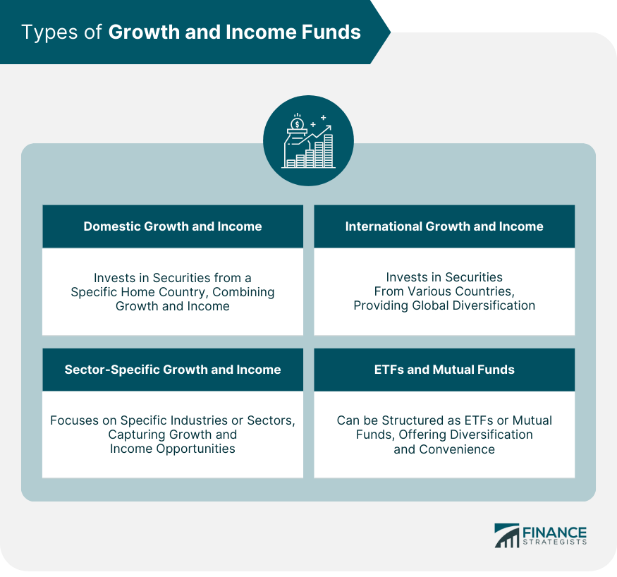

## Table of Contents

## What is a Growth and Income Fund?

A Growth and Income Fund is a type of mutual fund that aims to give investors both growth and regular income. This fund invests in a mix of stocks and bonds. The growth part comes from stocks that are expected to increase in value over time. The income part comes from bonds and dividend-paying stocks, which provide regular payments to investors.

These funds are popular among people who want to grow their money but also need some regular income. They are a good choice for someone who wants to balance the risk of losing money with the chance to earn more. By mixing growth and income investments, the fund tries to offer a safer way to invest while still aiming for some growth.

## How does a Growth and Income Fund differ from other types of funds?

A Growth and Income Fund is different from other types of funds because it tries to do two things at once: grow your money and give you regular income. Other funds might focus only on one of these goals. For example, a Growth Fund aims to increase the value of your investment by investing mostly in stocks that are expected to go up in price. On the other hand, an Income Fund focuses on giving you regular payments, often by investing in bonds and stocks that pay dividends.

Compared to a Balanced Fund, which also mixes growth and income investments, a Growth and Income Fund might have a different mix of stocks and bonds. A Balanced Fund usually keeps a steady split, like 60% stocks and 40% bonds, to keep things balanced. A Growth and Income Fund might change its mix based on what the fund manager thinks will work best to achieve both growth and income. This makes it a bit more flexible but also means it might be managed more actively.

In contrast to a Sector Fund, which focuses on a specific industry like technology or healthcare, a Growth and Income Fund spreads its investments across different types of companies and bonds. This diversification can make it less risky than a Sector Fund, which can be more volatile because it's tied to the ups and downs of one industry. So, if you want a mix of growth and income with a bit less risk, a Growth and Income Fund could be a good choice.

## What are the primary goals of investing in a Growth and Income Fund?

The main goal of investing in a Growth and Income Fund is to grow your money over time while also getting regular payments. This fund tries to balance the risk of losing money with the chance to earn more. It does this by investing in a mix of stocks that are expected to increase in value and bonds or dividend-paying stocks that provide income.

Another goal is to offer a safer way to invest compared to funds that focus only on growth. By mixing different types of investments, the fund aims to reduce the ups and downs that can come with investing in just stocks. This can be a good choice for someone who wants to see their money grow but also needs some regular income to use or save.

## Who should consider investing in a Growth and Income Fund?

People who are looking to grow their money over time but also need some regular income should think about investing in a Growth and Income Fund. This type of fund is good for someone who wants to balance the risk of losing money with the chance to earn more. It's a smart choice for someone who is not just looking to grow their money but also needs some money to use or save regularly.

For example, people who are getting close to retiring might like a Growth and Income Fund. They might want their money to keep growing, but they also need some income to live on. Also, people who are already retired but want to keep some of their money growing might find this fund helpful. It gives them a way to have both growth and income without taking on too much risk.

## What types of assets are typically included in a Growth and Income Fund?

A Growth and Income Fund usually includes a mix of stocks and bonds. The stocks in the fund are often from companies that are expected to grow over time. These are called [growth stocks](/wiki/growth-stocks). The fund might also include stocks from companies that pay regular dividends, which are payments made to shareholders. These dividend-paying stocks help provide the income part of the fund.

The fund also invests in bonds. Bonds are like loans that you give to a company or government, and they pay you back with interest over time. This interest is another way the fund can give you income. By mixing growth stocks, dividend-paying stocks, and bonds, the fund tries to grow your money while also giving you regular payments.

## How is the investment mix determined in a Growth and Income Fund?

The investment mix in a Growth and Income Fund is decided by the fund manager. They look at the goals of the fund, which are to grow your money and give you regular income. To do this, they choose a mix of stocks and bonds. The stocks can be from companies that are expected to grow, called growth stocks, and from companies that pay regular dividends. The bonds are like loans to companies or governments that pay back interest over time. The fund manager decides how much to put into each type of investment based on what they think will work best to meet the fund's goals.

The mix can change over time. If the fund manager thinks the market is going to do well, they might put more money into stocks to try to get more growth. If they think the market might go down, they might put more money into bonds to keep the fund safer. This flexibility lets the fund try to do well in different situations. By changing the mix, the fund manager tries to balance the risk of losing money with the chance to earn more, always keeping in mind the goal of giving both growth and income to investors.

## What are the risks associated with Growth and Income Funds?

Investing in a Growth and Income Fund comes with some risks. One big risk is that the value of the stocks in the fund can go down. If the companies the fund invests in don't do well, the price of their stocks might drop, and that can lower the value of your investment. Even though the fund tries to balance this by also investing in bonds, the stock market can still be unpredictable and cause losses.

Another risk is that the income part of the fund might not be as steady as you expect. The dividends from stocks and the interest from bonds can change. If a company decides to pay less in dividends or if interest rates go down, the income you get from the fund could be less than you planned for. This can be a problem if you are relying on that income to live on or save.

Also, because the fund manager can change the mix of investments, there's a risk that they might make choices that don't work out well. If they put too much money into stocks when the market goes down, or if they don't adjust the mix right, the fund might not meet its goals of growth and income. This means you need to trust that the fund manager knows what they're doing, but there's always a chance they might make mistakes.

## How do Growth and Income Funds perform during different market conditions?

Growth and Income Funds can do differently depending on what's happening in the market. When the stock market is doing well, the growth part of the fund, which comes from stocks, can go up a lot. This can help the fund grow more than usual. But the income part, from bonds and dividend-paying stocks, might not change much. So, in good times, the fund can grow, but the income stays pretty steady.

When the market is not doing well, the growth part of the fund might go down. Stocks can lose value, and that can make the whole fund worth less. But the income part can help. Bonds and dividend-paying stocks can still give you money even when the market is down. This can make the fund safer than one that only has stocks. So, in bad times, the fund might not lose as much as a pure growth fund, but it might not grow either.

Overall, Growth and Income Funds try to balance things out. They aim to grow your money when the market is good and protect it when the market is bad. But they can't stop all losses, and the income might change a bit. It's all about finding a middle ground between growing and keeping your money safe.

## What are the tax implications of investing in a Growth and Income Fund?

When you invest in a Growth and Income Fund, you need to think about taxes. The income part of the fund, which comes from dividends and interest from bonds, is usually taxed every year. Dividends from stocks are often taxed at a lower rate than regular income, but the exact rate depends on your income and the tax laws. Interest from bonds is usually taxed as regular income, which can be higher. So, the income you get from the fund can add to your tax bill each year.

The growth part of the fund, which comes from the value of stocks going up, is a bit different. You don't pay taxes on this growth until you sell your shares in the fund. If you sell your shares for more than you paid for them, you have a capital gain. Capital gains can be taxed at a lower rate than regular income, but again, it depends on how long you held the shares and your income level. If you sell your shares for less than you paid, you have a capital loss, which you can use to lower your taxes.

Overall, the tax you pay on a Growth and Income Fund depends on both the income you get each year and any gains or losses when you sell your shares. It's a good idea to talk to a tax advisor to understand how these taxes will affect you, because tax laws can change and everyone's situation is different.

## How can one evaluate the performance of a Growth and Income Fund?

To evaluate the performance of a Growth and Income Fund, you need to look at both how much the fund has grown and how much income it has given you. One way to do this is by checking the fund's total return, which shows how much the fund has grown in value plus any income it has paid out. You can compare the total return of the fund to other similar funds or to a benchmark, like a stock market index, to see if it's doing well. Another thing to look at is the fund's expense ratio, which is how much it costs to run the fund. A lower expense ratio means more of your money stays in the fund, which can help it perform better over time.

You should also think about how the fund does in different market conditions. A good Growth and Income Fund should grow when the market is doing well and not lose too much when the market is down. Look at the fund's historical performance to see how it has done in the past. Remember, past performance doesn't tell you exactly what will happen in the future, but it can give you an idea. Also, consider the fund's risk level. Some funds might grow more but also lose more when the market goes down. A fund with less risk might not grow as much but can be safer. By looking at all these things, you can get a good picture of how well a Growth and Income Fund is performing.

## What are some strategies for maximizing returns from a Growth and Income Fund?

To get the most out of a Growth and Income Fund, you need to think about when to buy and sell the fund. One good strategy is to buy more shares when the market is down. This can help you get more shares for less money, which can lead to bigger gains when the market goes back up. Also, if you don't need the income right away, you can choose to reinvest the dividends and interest back into the fund. This means you buy more shares with the money you get, which can help your investment grow faster over time.

Another important thing to do is to keep an eye on how the fund is doing. Check the fund's performance regularly to see if it's meeting your goals. If the fund isn't doing well compared to other similar funds or if its costs are too high, you might want to switch to a different fund. Also, think about balancing your overall investment portfolio. Having a mix of different types of investments can help you manage risk and get the best returns. By staying informed and making smart choices, you can work towards getting the most out of your Growth and Income Fund.

## How do regulatory changes impact the management and performance of Growth and Income Funds?

Regulatory changes can have a big effect on how Growth and Income Funds are managed and how well they do. When rules change, fund managers have to make sure they follow the new rules. This might mean they need to change what they invest in or how much they invest in certain things. For example, if new rules say they can't invest in certain types of bonds anymore, they might have to sell those bonds and buy different ones. This can change the mix of the fund and might affect how much money it makes or how safe it is.

Also, regulatory changes can change how much it costs to run the fund. If new rules make it more expensive to manage the fund, the fund's expense ratio might go up. A higher expense ratio means less of your money stays in the fund to grow, which can lower your returns. On the other hand, if new rules help make things cheaper or easier for fund managers, it could help the fund do better. So, keeping an eye on regulatory changes is important because they can really impact how a Growth and Income Fund performs over time.

## How can you evaluate the performance of your investment strategy?

Evaluating the performance of an investment strategy is crucial to ensure the strategy's effectiveness and alignment with investor goals. This evaluation should be comprehensive, encompassing various financial metrics and comparative analyses.

A key aspect of performance evaluation is analyzing the total return of the investment mix, which includes both capital gains and income received. The total return provides a straightforward metric to assess the overall effectiveness of growth and income funds. Additionally, the yield, which measures the income generated by the portfolio as a percentage of its value, is vital for understanding the income component of the investment.

Expense ratios are another critical [factor](/wiki/factor-investing), representing the cost of managing the investment portfolio. These ratios help investors understand how much of their return is eroded by management fees and other expenses. Lower expense ratios generally suggest a more cost-efficient investment strategy, enhancing net returns.

Risk-adjusted results, such as the Sharpe Ratio, are indispensable for evaluating whether the returns compensate adequately for the risks incurred. The Sharpe Ratio is calculated as follows:

$$

\text{Sharpe Ratio} = \frac{R_p - R_f}{\sigma_p} 
$$

Where $R_p$ is the portfolio return, $R_f$ is the risk-free rate, and $\sigma_p$ is the standard deviation of the portfolio's excess return. A higher Sharpe Ratio indicates better risk-adjusted performance.

Algorithmic trading should be scrutinized for its ability to meet trading objectives and enhance portfolio returns. This involves assessing the algorithm's accuracy in executing trades at desired price points, as well as evaluating its impact on reducing transaction costs and minimizing human error.

To gain a broader perspective on strategy effectiveness, investors should compare their performance against relevant benchmarks and peer funds. This comparison can highlight whether the strategy is outperforming, underperforming, or on par with market trends.

Ongoing evaluation is necessary to adapt to evolving market conditions and maintain alignment with financial objectives. Regular assessment helps investors identify performance deviations early and implement necessary adjustments, ensuring the investment strategy remains effective and aligned with long-term goals.

## References & Further Reading

[1]: Bergstra, J., Bardenet, R., Bengio, Y., & Kégl, B. (2011). ["Algorithms for Hyper-Parameter Optimization."](https://papers.nips.cc/paper/4443-algorithms-for-hyper-parameter-optimization) Advances in Neural Information Processing Systems 24.

[2]: ["Advances in Financial Machine Learning"](https://www.amazon.com/Advances-Financial-Machine-Learning-Marcos/dp/1119482089) by Marcos Lopez de Prado

[3]: ["Evidence-Based Technical Analysis: Applying the Scientific Method and Statistical Inference to Trading Signals"](https://www.amazon.com/Evidence-Based-Technical-Analysis-Scientific-Statistical/dp/0470008741) by David Aronson

[4]: ["Machine Learning for Algorithmic Trading"](https://github.com/stefan-jansen/machine-learning-for-trading) by Stefan Jansen

[5]: ["Quantitative Trading: How to Build Your Own Algorithmic Trading Business"](https://www.amazon.com/Quantitative-Trading-Build-Algorithmic-Business/dp/1119800064) by Ernest P. Chan