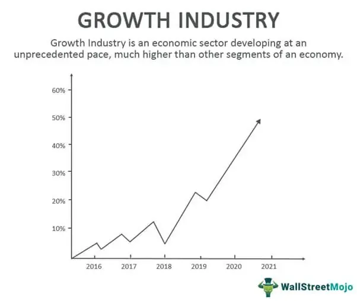

The evolving landscape of global economics is intrinsically linked to the progress of various industries that are designated as growth industries, characterized by their rapid development and expansive market reach. A prominent example of these is the finance sector, where algorithmic trading has emerged as a crucial force in shaping economic development. Algorithmic trading, utilizing complex computer programs, is known for executing trades on predefined criteria, thereby revolutionizing the speed, efficiency, and cost structure of trading within financial markets.

This article seeks to investigate the dynamic relationship between economic growth and industry-specific characteristics, using algorithmic trading as a central case study. Growth industries typically exhibit extraordinary developments influenced by technological innovation, regulatory shifts, and changes in consumer behavior, which are also pertinent in understanding how algorithms impact trading and financial landscapes.

By analyzing these elements, insights are provided on how these sectors not only contribute to economic expansion but also invoke substantial transformations across financial systems. The study of algorithmic trading enables us to comprehend how technology facilitates improvements in market structures, thereby boosting economic activities and fostering development. Such an exploration will highlight the importance of balancing innovation with risk management to fully leverage the growth potential these industries present.

## Table of Contents

## Understanding Growth Industries

Growth industries are sectors that are experiencing a rate of expansion significantly higher than that of the broader economy. These sectors are often at the forefront of introducing new technologies, adapting to regulatory changes, and responding to shifts in consumer preferences. As a result, they attract significant investment interest, promising above-average returns despite inherent risks.

One of the key drivers of growth in these industries is technological innovation. Advancements in technology can rapidly alter market landscapes by introducing new products, services, or business models, creating opportunities for substantial economic expansion. This was notably witnessed in the technology sector, where the advent of smartphones, cloud computing, and e-commerce platforms transformed consumer behavior and business operations worldwide. 

Regulatory changes also play a crucial role in shaping growth industries. Governments may introduce new regulations to encourage development in certain sectors, such as renewable energy or biotechnology, providing incentives for businesses to innovate and expand. Conversely, deregulation can also spur growth by reducing barriers to entry and increasing competition, thereby stimulating industry dynamism.

Shifts in consumer preferences are another catalyst for growth. Changes in demographics, lifestyle choices, and increasing awareness about sustainability and health can lead to burgeoning demand for specific products or services. For instance, the increasing consumer focus on sustainability has driven growth in the electric vehicle sector, as people seek more environmentally friendly transportation options.

However, a notable characteristic of growth industries is their inherent [volatility](/wiki/volatility-trading-strategies). Rapid technological changes and high market expectations can lead to fluctuating valuations and unpredictable market behavior. This volatility is both a risk and an opportunity for investors. While the potential for high returns is appealing, the unpredictability of such industries necessitates meticulous analysis and risk management.

Investors are often attracted to growth industries because of the potential for significant returns. The promise of tapping into burgeoning markets or innovative technologies can be alluring, especially in environments with abundant capital seeking higher yields. That said, the risks involved—such as cash flow instability, competitive pressures, and technological obsolescence—require investors to maintain a balanced approach. 

In summary, growth industries are pivotal to driving economic expansion, fueled by technological advancements, regulatory shifts, and evolving consumer preferences. Despite their volatility and associated risks, these industries continue to capture the interest of investors looking to capitalize on their potential for substantial returns.

## Characteristics of Growth Industries

Growth industries are notable for their consistent and rapid sales growth, often capturing the attention of both substantial investment and media. This growth trajectory is driven by factors such as technological innovation, evolving consumer preferences, and regulatory developments. However, along with the promise of growth, these industries encounter significant risks, including high cash burn rates and technological challenges that can impede profitability.

One of the critical tools for understanding and valuing the potential of growth industries is the compound annual growth rate (CAGR). This metric offers a long-term perspective on growth by measuring the mean annual growth rate of investments over a specified period longer than one year. The formula for calculating CAGR is as follows:

$$
\text{CAGR} = \left( \frac{\text{Ending Value}}{\text{Beginning Value}} \right)^{\frac{1}{n}} - 1
$$

In this formula, $\text{Ending Value}$ represents the final market value of the investment, $\text{Beginning Value}$ is the initial market value, and $n$ denotes the number of years. Investors and analysts utilize CAGR to assess an industry's ability to maintain its growth trajectory over time, providing insights into its potential for sustained expansion.

Despite the allure of potentially high returns, growth industries are characterized by inherent volatility. Rapid changes in market dynamics, technological advancements, and investor sentiment contribute to this volatility, prompting investors to approach these sectors with caution. While the promise of high returns can be enticing, the associated risks necessitate thorough risk assessment and strategic foresight.

Investors are therefore advised to diversify their portfolios when venturing into growth industries, balancing the pursuit of high returns with the management of potential risks. This prudent approach ensures that they can capitalize on opportunities while safeguarding their investments against the sector's unpredictable nature.

## Algorithmic Trading: A Case Study

Algorithmic trading, commonly referred to as algo trading, involves the utilization of computer programs and algorithms to execute trading orders automatically, based on pre-set criteria such as timing, price, and [volume](/wiki/volume-trading-strategy). This innovative approach has fundamentally transformed financial markets.

One of the primary advantages of [algorithmic trading](/wiki/algorithmic-trading) is the remarkable increase in trading speed and efficiency. Algorithms can process a vast amount of market data and execute orders at speeds beyond human capability, typically in milliseconds. By doing so, they reduce latency, thereby enhancing market [liquidity](/wiki/liquidity-risk-premium) and narrowing bid-ask spreads. Consequently, this increases cost efficiency for traders by minimizing transaction costs and potentially maximizing trading profits.

The driving factors behind the surge in algorithmic trading include advances in big data analytics, [machine learning](/wiki/machine-learning), and enhanced computing power. Big data analytics allows traders to analyze extensive datasets to identify trading opportunities. Machine learning algorithms further contribute by adapting to market changes and learning from data patterns, providing models that can anticipate market movements. The advent of high-performance computing systems ensures the smooth execution of complex trading strategies and calculations at unprecedented speeds.

Algorithmic trading is a quintessential growth industry within the financial sector due to its significant impact on market dynamics. It accounts for a substantial portion of market turnover, particularly in equities and commodities. According to a report by the Aite Group, algorithmic trading is expected to continue expanding as more financial institutions adopt automated trading systems.

Despite its profound benefits, algorithmic trading also poses certain risks that require careful management. One key risk is the potential lack of proper risk valuation. Unlike human traders, algorithms may not react appropriately to unforeseen events or market anomalies, potentially leading to significant losses. Furthermore, algorithmic trading can contribute to increased systemic risks. For example, an algorithm malfunction or erroneous strategy could trigger a cascading effect, amplifying market volatility and leading to flash crashes, as seen in the Flash Crash of 2010.

In conclusion, while algorithmic trading has revolutionized the financial markets by enhancing trading efficiency and cost-effectiveness, it also necessitates comprehensive risk management and regulatory oversight to mitigate its inherent risks. Balancing innovation with appropriate precautions ensures that algo trading continues to be a robust growth industry in the financial landscape.

## Impact of Algorithmic Trading on Economic Growth

Algorithmic trading, also known as algo trading, significantly contributes to economic growth by improving trading efficiency within financial markets. The implementation of algorithms streamlines trading processes by utilizing computer programs to execute trades based on predefined criteria. This leads to faster execution speeds, reduced transaction costs, and minimized human error, resulting in increased market activity.

The transformation of trading infrastructure through the adoption of algorithmic trading by financial institutions marks a shift towards more robust and cost-effective systems. Algorithms are capable of processing vast amounts of data to identify trading opportunities swiftly, which enhances the liquidity and sustainability of financial markets. This transformation facilitates greater participation by reducing entry barriers for traders, thereby amplifying market volume and liquidity.

Furthermore, the integration of algorithmic trading with advanced technologies like [artificial intelligence](/wiki/ai-artificial-intelligence) (AI) and machine learning (ML) unlocks potential for data-driven investments and the creation of personalized financial products. AI and ML enable more accurate forecasting models and risk assessments, optimizing trade execution and portfolio management. Such integrations allow market participants to leverage large datasets to develop more informed and strategic investment decisions.

The global market for algorithmic trading is projected to expand significantly, with growth estimates reflecting an increasing reliance on technology-driven strategies. By 2032, the algorithmic trading market is anticipated to witness substantial growth, driven by continuous innovation and the advent of new trading technologies.

Despite its promising growth trajectory, algorithmic trading faces challenges that could impede its potential. Regulatory constraints and market volatility are critical issues that need careful management. Financial regulators are concerned with the systemic risks posed by high-frequency trading and the need for transparent and fair trading practices. Additionally, the inherent volatility of financial markets necessitates sophisticated risk management protocols to safeguard against drastic market fluctuations.

In conclusion, while algorithmic trading exhibits substantial potential to boost economic growth through enhanced efficiency and technological integration, tackling regulatory and volatility challenges is essential to ensure its sustainable development.

## Industry Challenges and Future Outlook

Growth industries, such as algorithmic trading, navigate complex challenges predominantly due to the rapid pace of technological advancement. Such technological progress often outpaces the development of regulatory frameworks, leaving a gap that can exacerbate systemic risks. Algorithmic trading specifically involves high-frequency trading ([HFT](/wiki/high-frequency-trading-strategies)), which requires significant computational resources and sophisticated algorithms to execute trades within milliseconds. This high-speed trading, while enhancing market efficiency, also introduces substantial risks, such as market manipulation and flash crashes [[1](https://www.investopedia.com/articles/active-trading/121914/pros-and-cons-highfrequency-trading.asp)].

Addressing these challenges necessitates robust risk management strategies. One method involves the implementation of advanced predictive analytics to monitor market conditions in real-time and adjust trading strategies accordingly. Techniques such as stress testing and incorporating machine learning algorithms for risk assessment can be valuable. For instance, machine learning can be used to predict potential market anomalies by analyzing large data sets, thereby mitigating the risks associated with HFT.

Looking to the future, the prospects for algorithmic trading are promising, driven by technological innovations and increasing adoption across global financial systems. Notably, the integration of generative AI could further enhance the efficiency and effectiveness of algorithmic trading systems. Generative AI could optimize trading strategies by generating new data models that more accurately reflect current market conditions, thus providing traders with deeper insights.

To leverage these advancements sustainably, industries must strike a balance between fostering innovation and ensuring compliance with regulatory standards. This involves engaging in dialogue with regulators to update legal frameworks that encompass the latest technological developments. Additionally, the implementation of ethical guidelines for AI application in trading is crucial to safeguard against unintended consequences that could arise from overly autonomous trading systems.

Moreover, advancements in blockchain technology could play a vital role in improving transparency and reducing the risks associated with algorithmic trading. Blockchain's decentralized ledger can offer a secure and transparent record of trades, providing an auditable trail to mitigate fraud and enhance trust in automated trading systems.

In conclusion, while growth industries such as algorithmic trading offer significant opportunities for economic advancement, they must navigate numerous challenges associated with technological innovation and regulatory compliance. By adopting comprehensive risk management strategies and engaging in proactive regulatory discussions, these industries can achieve sustainable growth and optimize their contributions to the economy.

---

References:
1. Investopedia, "Pros and Cons of High-Frequency Trading", available at: https://www.investopedia.com/articles/active-trading/121914/pros-and-cons-highfrequency-trading.asp

## Conclusion and Final Thoughts

Growth industries, such as algorithmic trading, play a vital role in driving economic development by offering both substantial investment opportunities and complex challenges. These industries are characterized by rapid technological advancements, attracting significant capital due to their potential for high returns. However, investors and businesses must carefully manage the associated risks to ensure sustainable growth.

Algorithmic trading serves as a prime example of how technology can fundamentally alter market structures. By automating trading processes, algorithmic trading enhances market efficiency and reduces transaction costs, thereby stimulating economic activity. The rapid execution of trades and the ability to process vast amounts of data allow algorithmic trading to optimize market performance, making financial markets more accessible and dynamic.

To maximize the potential of growth industries like algorithmic trading, stakeholders need to remain vigilant in monitoring market trends and adapting to technological innovations. As these industries evolve, it is crucial for investors and businesses to develop robust risk management strategies to address volatility and regulatory challenges. This proactive approach enables them to capitalize on growth opportunities while mitigating potential downsides.

A comprehensive understanding of the dynamics affecting growth industries equips investors and businesses with the tools to strategically align their operations with the shifting economic landscape. This alignment not only fosters individual organizational growth but also contributes to the broader economic development, positioning growth industries as cornerstone elements in the future economic framework.

## References & Further Reading

[1]: Bergstra, J., Bardenet, R., Bengio, Y., & Kégl, B. (2011). ["Algorithms for Hyper-Parameter Optimization."](https://papers.nips.cc/paper/4443-algorithms-for-hyper-parameter-optimization) Advances in Neural Information Processing Systems 24.

[2]: ["Advances in Financial Machine Learning"](https://www.amazon.com/Advances-Financial-Machine-Learning-Marcos/dp/1119482089) by Marcos Lopez de Prado

[3]: ["Evidence-Based Technical Analysis: Applying the Scientific Method and Statistical Inference to Trading Signals"](https://onlinelibrary.wiley.com/doi/book/10.1002/9781118268315) by David Aronson

[4]: ["Machine Learning for Algorithmic Trading"](https://github.com/stefan-jansen/machine-learning-for-trading) by Stefan Jansen

[5]: ["Quantitative Trading: How to Build Your Own Algorithmic Trading Business"](https://www.amazon.com/Quantitative-Trading-Build-Algorithmic-Business/dp/1119800064) by Ernest P. Chan