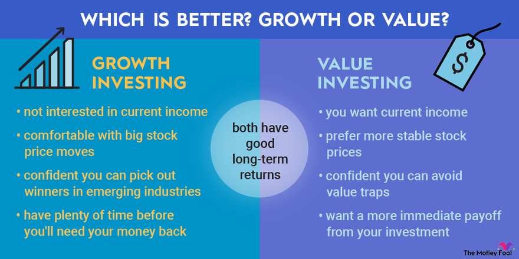

## Table of Contents

## What is growth investing?

Growth investing is a way of picking stocks that focuses on companies expected to grow their earnings and revenues faster than other companies. Investors who use this strategy are looking for businesses that are doing well and are likely to keep doing well in the future. These companies might not pay big dividends because they are using their money to grow even more. Instead, investors hope the stock price will go up as the company gets bigger and more successful.

This type of investing can be exciting because it can lead to big gains if you pick the right companies. However, it can also be riskier than other types of investing. The stock prices of growth companies can go up and down a lot, especially if the market changes or if the company doesn't grow as fast as expected. So, while growth investing can be rewarding, it's important for investors to do their homework and be ready for some ups and downs.

## How does growth investing differ from other investment strategies?

Growth investing is different from other investment strategies because it focuses on companies that are expected to grow quickly. People who do growth investing look for businesses that are doing well and are likely to keep getting bigger. They don't usually care about getting money from dividends. Instead, they hope the stock price will go up as the company grows. This is different from value investing, where people look for companies that they think are underpriced and might be a good deal.

Another way growth investing differs is in the level of risk and reward. Growth stocks can go up a lot in price if the company does well, but they can also go down a lot if things don't go as planned. This makes growth investing riskier than strategies like income investing, where people focus on getting regular payments from dividends. Income investing is usually less risky because it's more about steady income than big price changes. So, growth investing is about betting on future growth, while other strategies might focus on current value or steady income.

## What are the key characteristics of growth stocks?

Growth stocks are companies that are expected to grow their earnings and sales faster than other companies. These companies usually spend a lot of money on things like research and development, marketing, or expanding their business. They don't pay out much in dividends because they want to use that money to grow even more. Investors who buy growth stocks are hoping that the stock price will go up a lot as the company gets bigger and more successful.

These stocks can be exciting because they have the potential for big gains. But they can also be risky. The stock prices of growth companies can go up and down a lot, especially if the market changes or if the company doesn't grow as fast as expected. So, while growth stocks can be a good way to make money, they are not for everyone. People who invest in growth stocks need to be okay with some ups and downs and be ready to do a lot of research to pick the right companies.

## What are the potential benefits of growth investing?

Growth investing can be a great way to make money. When you invest in growth stocks, you are betting on companies that are doing well and are likely to keep growing. If you pick the right companies, the value of your investment can go up a lot. This means you could make more money than if you had put your money into other types of investments. For example, if a company you invest in grows a lot, the price of its stock can go up, making your investment worth more.

But growth investing is not just about the money you can make. It's also exciting because you get to be part of a company's journey as it grows. You might invest in a small company that becomes a big name, and that can be really rewarding. Plus, by investing in growth stocks, you are helping these companies get the money they need to keep growing and creating new things. So, while growth investing can be risky, it also has the potential to be very rewarding, both financially and in terms of being part of something big.

## What are the risks associated with growth investing?

Growth investing can be risky because the stock prices of growth companies can go up and down a lot. If the market changes or if the company doesn't grow as fast as people thought it would, the stock price can drop a lot. This means you could lose money if you have to sell your shares when the price is low. Also, growth companies often don't pay dividends, so you won't get any regular income from your investment. You have to wait for the stock price to go up to make money, and that can take a long time.

Another risk is that growth companies usually spend a lot of money to grow, like on research and development or marketing. If they don't make good use of that money, or if they can't keep growing as fast as they need to, the company might not do well. This can make the stock price go down. So, while growth investing can be exciting and potentially make you a lot of money, it's important to understand these risks and be ready for some ups and downs.

## How can one identify growth stocks?

To identify growth stocks, you need to look for companies that are doing well and are expected to keep growing. These companies often have strong earnings and sales growth. You can check their financial reports to see if their earnings are going up every year. Also, look at what the company is doing to grow. Are they spending money on new products, expanding to new markets, or improving their business in some way? If a company is doing these things and their earnings are growing, it might be a good growth stock.

Another way to find growth stocks is to look at what other people are saying about the company. Analysts and investors often talk about which companies they think will grow a lot in the future. You can read reports and articles to see which companies are getting a lot of attention. But remember, just because a lot of people are excited about a company doesn't mean it will definitely grow. You still need to do your own research and make sure the company's plans make sense and that they are doing well financially.

## What financial metrics should be considered when evaluating growth stocks?

When you're looking at growth stocks, one of the most important things to check is the company's earnings growth. This means you want to see if the company is making more money every year. You can find this information in the company's financial reports. Look at the earnings per share (EPS) to see how much money the company is making for each share of stock. If the EPS is going up every year, that's a good sign that the company is growing.

Another thing to look at is the company's revenue growth. This tells you if the company is selling more products or services over time. You can find this in the company's income statement. Also, pay attention to the price-to-earnings (P/E) ratio. This tells you how much you're paying for the company's earnings. Growth stocks often have higher P/E ratios because people are willing to pay more for the chance of future growth. But if the P/E ratio is too high, it might mean the stock is overvalued. So, it's important to compare the P/E ratio with other companies in the same industry to see if it makes sense.

## How do market conditions affect growth investing strategies?

Market conditions can really change how well growth investing works. When the economy is doing well and people feel good about the future, they are more likely to buy growth stocks. This is because they think these companies will keep growing and make them a lot of money. But if the economy is not doing so well, or if there's a lot of uncertainty, people might be scared to buy growth stocks. They might think it's too risky and choose to put their money into safer investments instead. So, the overall mood of the market can make growth stocks go up or down a lot.

Interest rates are another big thing that can affect growth investing. When interest rates are low, it's cheaper for companies to borrow money to grow their business. This can be good for growth stocks because it means they can spend more on things like research and development or expanding to new markets. But if interest rates go up, it can make it harder for these companies to borrow money. This might slow down their growth and make their stock prices go down. So, keeping an eye on interest rates and the overall economy can help you understand how growth investing might do in different market conditions.

## What are some common pitfalls to avoid in growth investing?

One common mistake in growth investing is not doing enough research. It's easy to get excited about a company that everyone is talking about, but you need to make sure they are actually doing well. Check their financial reports to see if their earnings and sales are really growing. Also, think about if their plans for the future make sense. If you don't do your homework, you might end up buying a stock that looks good but doesn't actually grow like you hoped.

Another pitfall is paying too much for a growth stock. Sometimes, people get so excited about a company's future that they are willing to pay a lot more for the stock than it's really worth. This can be risky because if the company doesn't grow as fast as expected, the stock price can drop a lot. So, it's important to look at the price-to-earnings ratio and compare it with other companies in the same industry to make sure you're not overpaying.

Lastly, it's important not to put all your money into just one or two growth stocks. Growth stocks can be risky because their prices can go up and down a lot. If you spread your money out over different companies and types of investments, you can lower your risk. This way, if one stock doesn't do well, you won't lose all your money. So, always think about diversifying your investments when you're doing growth investing.

## How should one diversify a growth investment portfolio?

Diversifying a growth investment portfolio means spreading your money across different types of growth stocks and other investments. This can help lower your risk. Instead of putting all your money into just one or two companies, you can invest in several growth companies in different industries. For example, you might invest in a tech company, a healthcare company, and a consumer goods company. This way, if one industry doesn't do well, you still have other investments that might do better.

Another way to diversify is by mixing growth stocks with other types of investments. You could add some value stocks, which are companies that are underpriced and might be a good deal, or some income stocks that pay dividends. You might also want to include bonds or real estate investment trusts (REITs) in your portfolio. These types of investments can give you some steady income and help balance out the ups and downs of growth stocks. By mixing different kinds of investments, you can create a more stable portfolio that still has the potential for growth.

## What are advanced techniques for analyzing growth stocks?

One advanced technique for analyzing growth stocks is to use technical analysis. This means looking at charts and patterns to see how the stock price has moved in the past. By studying these patterns, you can try to guess where the stock price might go next. For example, you might see that the stock price often goes up after it reaches a certain low point. This can help you decide when to buy or sell the stock. But remember, technical analysis is not always right, and it's just one tool to help you make decisions.

Another advanced technique is to use [fundamental analysis](/wiki/fundamental-analysis), but in a deeper way. This means looking closely at the company's financial statements and understanding things like their cash flow, profit margins, and return on equity. You can also look at the company's competitive advantage and see if they have something special that makes them better than other companies. For example, do they have a new technology that no one else has? By digging into these details, you can get a better idea of whether the company can keep growing in the future. This kind of analysis takes time and effort, but it can give you a more complete picture of the company's potential.

## How can growth investing be integrated into a long-term investment plan?

Growth investing can be a big part of a long-term investment plan if you want to make your money grow over time. To do this, you can put some of your money into growth stocks, but it's important not to put all your money into them. Growth stocks can go up a lot, but they can also go down a lot. So, you should mix them with other types of investments like value stocks, which are companies that might be underpriced, or income stocks, which pay dividends. This way, you can balance the risk and still have a chance to make your money grow.

When you're making a long-term plan with growth investing, think about how long you want to keep your money invested. Growth stocks might take a while to really pay off, so you need to be patient and ready to hold onto them for a long time. Also, keep checking on your investments every now and then to make sure the companies are still growing like you thought they would. If something changes, you might need to sell some stocks and buy others. By being patient and keeping an eye on your investments, you can use growth investing to help reach your long-term goals.

## What are Financial Growth Investment Strategies?

Investment strategies for financial growth typically encompass a mix of both growth and value investing approaches, each catering to different investor profiles and market conditions. Growth investing targets companies anticipated to expand at an above-average pace, prioritizing capital appreciation over income generation such as dividends. These companies are often characterized by high earnings growth, innovation, and market expansion, and are typically in sectors like technology and biotechnology.

Growth stocks have the potential to yield substantial returns, but come with an inherent high risk due to their market [volatility](/wiki/volatility-trading-strategies). This volatility arises because growth companies reinvest earnings back into the business rather than paying dividends, making their stocks more susceptible to market fluctuations and economic downturns. For example, the Price-to-Earnings (P/E) ratio is often elevated for these stocks, reflecting high investor expectations. Mathematically, the P/E ratio is formulated as:

$$
P/E = \frac{\text{Market Value per Share}}{\text{Earnings per Share (EPS)}}
$$

Investors seeking growth must be willing to endure short-term market fluctuations for the potential of long-term gains. The decision to invest in [growth stocks](/wiki/growth-stocks) should align with an investor's risk tolerance and time horizon. A long-term perspective enables investors to capitalize on the full potential of growth stocks, as it allows time for the companies to achieve their anticipated growth.

Value investing, on the other hand, involves selecting stocks that appear to be undervalued by the market. These companies typically have stable earnings and dividends, and are likely undervalued due to temporary setbacks or market sentiments. The strategy focuses on buying and holding these undervalued stocks, with the anticipation that they will appreciate over time once the market corrects its valuation.

One effective way to balance the risk inherent in investing is through portfolio diversification. A diversified portfolio contains a mix of growth and value stocks across various sectors to spread risk and improve the potential for returns. Diversification can be achieved by investing in different asset classes such as equities, bonds, and real estate, each offering different risk and return profiles.

Python can be used to simulate and analyze diversified portfolios. The following Python code snippet demonstrates a basic approach to calculating a diversified portfolio's expected return and risk, using historical return data:

```python
import numpy as np

# Example returns for a diversified portfolio
returns = np.array([[0.1, 0.2, 0.15], [0.08, 0.12, 0.1]])  # [growth, value] for stocks A, B, C
weights = np.array([0.4, 0.4, 0.2])  # Assigning portfolio weights to the stocks

# Calculate expected portfolio return
expected_return = np.dot(weights, returns.mean(axis=1))

# Calculate portfolio variance
covariance_matrix = np.cov(returns)
portfolio_variance = np.dot(weights.T, np.dot(covariance_matrix, weights))

print(f"Expected Portfolio Return: {expected_return}")
print(f"Portfolio Risk (Standard Deviation): {np.sqrt(portfolio_variance)}")
```

By employing both growth and value investing strategies, investors can mitigate risks and enhance returns. A diverse portfolio tailored to the investor's risk appetite and investment horizon is a prudent strategy for financial growth.

## References & Further Reading

[1]: Bergstra, J., Bardenet, R., Bengio, Y., & Kégl, B. (2011). ["Algorithms for Hyper-Parameter Optimization."](https://dl.acm.org/doi/10.5555/2986459.2986743) Advances in Neural Information Processing Systems 24.

[2]: ["Advances in Financial Machine Learning"](https://www.amazon.com/Advances-Financial-Machine-Learning-Marcos/dp/1119482089) by Marcos Lopez de Prado

[3]: ["Evidence-Based Technical Analysis: Applying the Scientific Method and Statistical Inference to Trading Signals"](https://www.amazon.com/Evidence-Based-Technical-Analysis-Scientific-Statistical/dp/0470008741) by David Aronson

[4]: ["Machine Learning for Algorithmic Trading"](https://github.com/stefan-jansen/machine-learning-for-trading) by Stefan Jansen

[5]: ["Quantitative Trading: How to Build Your Own Algorithmic Trading Business"](https://github.com/LucindaYa/quant-resources/blob/master/Quantitative%20Trading%20How%20to%20Build%20Your%20Own%20Algorithmic%20Trading%20Business.pdf) by Ernest P. Chan