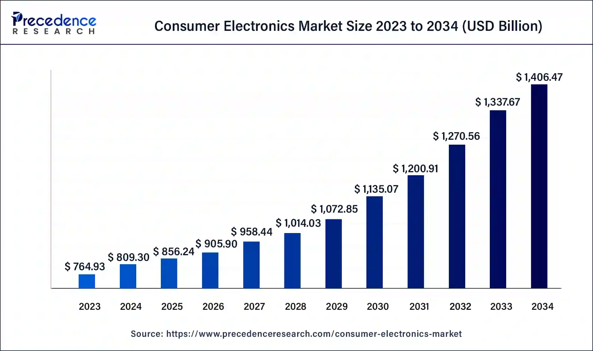

## Table of Contents

## What is the electronics sector?

The electronics sector includes companies that make and sell electronic devices and parts. This includes things like smartphones, computers, TVs, and the small parts inside them. The sector is important because it helps make our lives easier and more connected. It is always changing because new technology comes out all the time.

This sector is a big part of the world's economy. Many countries have companies that make electronic products, and these companies create jobs and help their countries make money. The electronics sector also pushes other industries to grow, like the ones that make materials needed for electronics. It is a key part of modern life and will keep growing as technology gets better.

## How is the growth rate of the electronics sector measured?

The growth rate of the electronics sector is measured by looking at different things. One way is to check how much money companies in the sector are making, which is called revenue. If the revenue goes up over time, it means the sector is growing. Another way is to count how many electronic products are being sold. If more products are sold each year, it shows that the sector is growing.

Another important measure is the value of the whole electronics market. This is the total worth of all the electronic products sold in a year. If this number gets bigger, it means the sector is growing. Also, looking at how many people are working in the electronics sector can tell us about its growth. If more jobs are created, it's a sign that the sector is doing well and expanding.

Lastly, experts also look at new technology and inventions in the electronics sector. If there are more new products and ideas coming out, it can mean the sector is growing. All these measures help us understand how fast the electronics sector is growing and changing.

## What are the key factors driving the growth of the electronics sector?

The electronics sector is growing because of new technology and inventions. Companies are always working on new gadgets and devices that make our lives easier. For example, smartphones and smart home devices are becoming more popular. These new products make people want to buy more electronics, which helps the sector grow. Also, technology is getting better and smaller, so companies can make more advanced products that people want.

Another big reason for the growth of the electronics sector is the demand from around the world. More and more people in different countries are using electronic devices. This means companies can sell their products in many places, not just one country. The internet also helps because it lets companies sell their products online to people all over the world. As more people get connected and use electronics, the demand keeps going up, which drives the growth of the sector.

Lastly, government policies and investments play a role too. Some countries help the electronics sector by giving money or tax breaks to companies. This support can help companies grow and make new products. Also, as the world focuses more on technology, governments are investing in research and development. This leads to more innovation and growth in the electronics sector.

## Can you provide recent statistics on the growth rate of the electronics sector?

The electronics sector has been growing steadily in recent years. According to a report by Statista, the global electronics market was valued at about 3.2 trillion U.S. dollars in 2022 and is expected to grow to around 3.6 trillion U.S. dollars by 2025. This shows an average annual growth rate of about 4% from 2022 to 2025. The growth is driven by increasing demand for consumer electronics, especially smartphones and smart home devices, as well as advancements in technology.

Another important [factor](/wiki/factor-investing) contributing to the growth of the electronics sector is the rise in demand from emerging markets. Countries like China, India, and Brazil are seeing more people buying electronic devices. For example, the India Brand Equity Foundation reported that the Indian electronics market grew by 12.8% in 2021. This growth is expected to continue as more people in these countries become connected and have more money to spend on electronics. Overall, the electronics sector is on a strong growth path, supported by global demand and technological advancements.

## How does the growth rate of the electronics sector compare to other industries?

The electronics sector is growing faster than many other industries. For example, the global electronics market is expected to grow at about 4% each year from 2022 to 2025. This is higher than the growth rate of many traditional industries like manufacturing or agriculture. The electronics sector is doing well because new technology keeps coming out, and more people around the world want to buy electronic devices.

Compared to the tech industry as a whole, which includes software and services, the electronics sector might grow a bit slower. The tech industry is growing at around 5% to 6% per year. But the electronics sector is still doing better than industries like automotive or retail, which are growing at about 2% to 3% per year. The electronics sector's strong growth is because it's at the heart of many new technologies that are changing how we live and work.

## What are the major trends influencing the growth of the electronics sector?

One major trend driving the growth of the electronics sector is the rise of smart devices and the Internet of Things (IoT). More and more everyday objects, like fridges, lights, and thermostats, are getting connected to the internet. This means they can talk to each other and make our lives easier. For example, you can control your home's temperature from your phone. As more people want these smart devices, companies are making more of them, which helps the electronics sector grow.

Another trend is the push towards smaller and more powerful electronics. Companies are always working on making devices like smartphones and laptops smaller but with better technology inside. This means we can do more with our devices, like taking better photos or running faster apps. This trend keeps people buying new electronics, which helps the sector grow. Also, the demand for eco-friendly electronics is growing. People want devices that use less energy and are easier to recycle, so companies are working on making greener products, which is another way the electronics sector is growing.

## How have technological advancements affected the growth rate of the electronics sector?

Technological advancements have played a big role in making the electronics sector grow faster. New inventions and better technology mean companies can make smaller, more powerful devices. For example, smartphones today can do a lot more than they could a few years ago. They have better cameras, faster processors, and more features. This makes people want to buy new devices more often, which helps the electronics sector grow. Also, new technology like 5G and [artificial intelligence](/wiki/ai-artificial-intelligence) is being added to more devices, making them even more useful and popular.

Another way technology helps the electronics sector grow is by making it easier to connect everything. The Internet of Things (IoT) lets everyday things like lights and fridges talk to each other and to us. This means we can control our homes from our phones or have our devices work together to make our lives easier. As more people want these smart devices, the demand for electronics goes up. Plus, technology is getting greener, with devices that use less energy and are easier to recycle. This makes people feel better about buying new electronics, which also helps the sector grow.

## What role do government policies play in the growth of the electronics sector?

Government policies can really help the electronics sector grow. Some countries give money or tax breaks to electronics companies. This helps these companies spend more on making new products or hiring more people. When governments do this, it can make the electronics sector bigger and stronger. Also, governments might make rules that encourage people to buy eco-friendly electronics. This makes companies focus on making greener products, which can also help the sector grow.

Another way governments help is by investing in research and development. They might give money to universities or companies to work on new technology. This can lead to new inventions and better electronics, which makes the sector grow. Governments can also make it easier for electronics companies to sell their products in other countries by making trade deals. This can open up new markets for these companies and help them grow even more.

## How does global economic climate impact the growth rate of the electronics sector?

The global economic climate can have a big impact on the growth of the electronics sector. When the world's economy is doing well, people have more money to spend on things like smartphones and computers. This means more sales for electronics companies, which helps the sector grow. Also, when the economy is good, businesses and governments might invest more in new technology. This can lead to new inventions and more jobs in the electronics sector, making it grow even faster.

On the other hand, when the economy is not doing well, people might not have as much money to spend on electronics. This can slow down the growth of the sector because fewer products are sold. Also, during tough economic times, companies might cut back on spending for research and development. This means fewer new products and slower growth for the electronics sector. So, the global economic climate is really important for how fast the electronics sector can grow.

## What are the challenges and barriers to growth in the electronics sector?

One big challenge for the electronics sector is keeping up with how fast technology changes. Companies need to keep making new and better products all the time. This can be hard because it costs a lot of money to do research and develop new things. Also, if a company doesn't come up with something new and exciting, people might not want to buy their products anymore. This makes it tough for the electronics sector to keep growing.

Another challenge is competition. There are a lot of companies in the electronics sector, and they are all trying to sell their products to the same people. This means companies have to work hard to make their products stand out. They need to find ways to make their devices cheaper or better than what other companies are selling. Also, some companies are based in countries where it's cheaper to make electronics. This can make it hard for companies in other places to compete and grow.

Lastly, there are barriers like rules and regulations. Different countries have different laws about what can go into electronics and how they can be made. These rules can make it harder for companies to sell their products in some places. Also, there's a growing focus on making electronics that are good for the environment. Companies need to find ways to make their products greener, which can be a challenge but is important for the sector's long-term growth.

## How do different regions of the world vary in terms of electronics sector growth?

Different regions of the world have different levels of growth in the electronics sector. In Asia, especially countries like China and South Korea, the electronics sector is growing very fast. These countries make a lot of electronic products and have many big companies like Samsung and Huawei. People in these countries are also buying more electronics, which helps the sector grow even more. In Europe, the growth is steady but not as fast as in Asia. European countries like Germany and the Netherlands have strong electronics industries, but they focus more on making high-quality and eco-friendly products.

In North America, the electronics sector is also growing, but it's different from Asia and Europe. The United States has many big electronics companies like Apple and Microsoft, and people there spend a lot of money on new gadgets. However, a lot of the products are made in other countries, so the growth in North America is more about selling and using electronics than making them. In regions like Africa and Latin America, the electronics sector is growing, but it's slower than in other places. These regions are still catching up, and more people are starting to use electronics as they get more money and better internet.

## What are the future projections for the growth rate of the electronics sector?

The electronics sector is expected to keep growing in the future. Experts think that by 2025, the global electronics market will be worth around 3.6 trillion U.S. dollars. This means it will grow at about 4% each year from 2022 to 2025. The main reason for this growth is that more people around the world will want to buy electronics. New technology, like 5G and artificial intelligence, will also help the sector grow because it will make devices even better and more useful.

In the long term, the electronics sector could grow even faster. This is because of trends like the Internet of Things (IoT), where more everyday objects will be connected to the internet. Also, as countries like India and Brazil get richer, more people there will be able to buy electronics. But, the sector will also face challenges like competition and the need to make greener products. Overall, the future looks bright for the electronics sector, but companies will need to keep innovating and adapting to keep growing.

## References & Further Reading

[1]: Cognitive Market Research. ["Electronics Market Growth Projections."](https://www.cognitivemarketresearch.com/electronics-market-report)

[2]: Gartner. ["Global Semiconductor Revenue Forecast."](https://www.gartner.com/en/newsroom/press-releases/2024-10-28-gartner-forecasts-worldwide-semiconductor-revenue-to-grow-14-percent-in-2025)

[3]: Lopez de Prado, M. ["Advances in Financial Machine Learning."](https://www.amazon.com/Advances-Financial-Machine-Learning-Marcos/dp/1119482089)

[4]: Jansen, S. ["Machine Learning for Algorithmic Trading."](https://github.com/stefan-jansen/machine-learning-for-trading)

[5]: Chan, E. P. ["Quantitative Trading: How to Build Your Own Algorithmic Trading Business."](https://github.com/ftvision/quant_trading_echan_book)