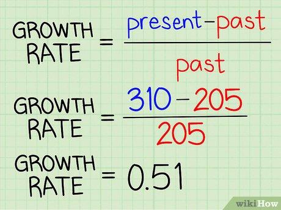

## Table of Contents

## What is a growth rate?

A growth rate is a measure that shows how fast something is growing or increasing over time. It can be used for many things, like how fast a plant grows, how much a company's sales increase, or how a population expands. To find the growth rate, you usually compare the size or amount of something at two different times and see how much it has changed.

For example, if a company had sales of $100 last year and $110 this year, the growth rate would show how much the sales increased from last year to this year. Growth rates are often shown as percentages, which makes it easy to understand and compare different things. A high growth rate means something is growing quickly, while a low growth rate means it's growing slowly.

## Why are growth rates important in economics and business?

Growth rates are very important in economics and business because they help people understand how fast things are changing. In economics, growth rates tell us how quickly a country's economy is getting bigger. This is important because a growing economy usually means more jobs and better living conditions for people. Businesses also use growth rates to see how well they are doing. If a company's sales are growing fast, it might mean they are doing a good job and people like their products. If the growth rate is slow or negative, it might mean the company needs to change something.

In business, growth rates are used to make plans for the future. If a company knows its sales are growing at a certain rate, it can predict how much money it will make next year. This helps the company decide how much to spend on new projects or how many new workers to hire. Growth rates also help investors decide which companies to invest in. If a company has a high growth rate, investors might think it's a good place to put their money because the company is likely to keep growing and making more profit.

## How do you calculate a simple growth rate?

To calculate a simple growth rate, you need to know the starting value and the ending value of whatever you're measuring. The formula is pretty easy. You take the ending value and subtract the starting value from it. Then, you divide that number by the starting value. After that, you multiply the result by 100 to turn it into a percentage. So, the formula looks like this: ((Ending Value - Starting Value) / Starting Value) * 100.

For example, let's say you want to find out the growth rate of a company's sales. Last year, the company made $50,000 in sales, and this year, they made $60,000. To find the growth rate, you subtract $50,000 from $60,000 to get $10,000. Then, you divide $10,000 by $50,000, which gives you 0.2. Finally, you multiply 0.2 by 100 to get a growth rate of 20%. This means the company's sales grew by 20% from last year to this year.

## What is the difference between nominal and real growth rates?

Nominal growth rate is the increase in something without taking away the effect of inflation. For example, if a company's sales went up by 5% last year, that's the nominal growth rate. It shows how much more money the company made, but it doesn't tell you if that increase is because the company sold more stuff or just because prices went up due to inflation.

Real growth rate, on the other hand, takes inflation into account. It shows the true increase in something after removing the effect of rising prices. To find the real growth rate, you start with the nominal growth rate and then subtract the inflation rate. For example, if the nominal growth rate of sales was 5% and inflation was 2%, the real growth rate would be 3%. This gives a better idea of how much the company actually grew, not just because prices went up.

## Can you explain compound annual growth rate (CAGR)?

Compound Annual Growth Rate, or CAGR, is a way to measure how much something grows over time, but it makes it easy to understand by showing the growth as if it happened at a steady rate each year. Imagine you have a plant that grows a lot over five years. Instead of looking at how it grew each year, CAGR tells you what the average growth rate per year would be if it grew the same amount every year. You can use CAGR to compare how different things grow over time, like how much money you make from an investment or how a company's sales increase.

To calculate CAGR, you need to know the starting value, the ending value, and how many years you're looking at. The formula is a bit tricky, but it's (Ending Value / Starting Value)^(1/Number of Years) - 1. Once you do the math, you multiply the result by 100 to get a percentage. For example, if you invested $1,000 and it grew to $1,200 over two years, the CAGR would show you the average yearly growth rate. It's a useful tool because it helps you see the big picture of growth without getting lost in the ups and downs that might happen along the way.

## How do you calculate CAGR?

To calculate the Compound Annual Growth Rate, or CAGR, you need to know the starting value, the ending value, and how many years you're looking at. The formula to find CAGR is a bit tricky, but it goes like this: you take the ending value and divide it by the starting value. Then, you raise that number to the power of one over the number of years. After that, you subtract one from the result and multiply by 100 to get the percentage. So, the formula looks like this: (Ending Value / Starting Value)^(1/Number of Years) - 1, then times 100.

For example, let's say you invested $1,000 and after three years, your investment grew to $1,500. To find the CAGR, you divide $1,500 by $1,000, which gives you 1.5. Then, you raise 1.5 to the power of one over three, which is about 1.16. Subtract one from 1.16 to get 0.16, and then multiply by 100 to get a CAGR of 16%. This means your investment grew at an average rate of 16% per year over those three years.

## What are some common applications of growth rates in financial analysis?

Growth rates are used a lot in financial analysis to understand how things are changing over time. One common use is to look at a company's revenue growth rate. This shows how fast a company's sales are increasing, which can tell investors if the company is doing well. For example, if a company's sales are growing quickly, it might mean that more people are buying their products or services. Investors like to see high growth rates because it suggests the company might keep growing and making more money in the future.

Another way growth rates are used is to look at how an investment is doing. People use the compound annual growth rate (CAGR) to see how much their money has grown each year on average. This helps them compare different investments to see which one is growing faster. For example, if you invested in two different stocks, you could use CAGR to see which stock gave you a better return over time. This can help people decide where to put their money to get the best growth.

Growth rates are also important for planning and making decisions. Companies use them to set goals and make budgets. If a company knows its sales are growing at a certain rate, it can predict how much money it will make next year. This helps the company decide how much to spend on new projects or how many new workers to hire. By understanding growth rates, companies can plan for the future and make sure they are ready for changes.

## How can growth rates be used to compare the performance of different investments?

Growth rates help people compare how well different investments are doing. When you want to see which investment is growing faster, you can look at their growth rates. For example, if you have money in two different stocks, you can find out the growth rate for each stock over a certain time. The stock with the higher growth rate is the one that's growing faster. This can help you decide which stock might be a better place to put your money if you want to see your money grow.

Another way to use growth rates is to look at the compound annual growth rate, or CAGR. This shows you the average yearly growth rate of an investment over a long time. It's useful because it smooths out the ups and downs that can happen from year to year. If you compare the CAGR of different investments, you can see which one has been growing at a steadier and faster rate over time. This can help you pick the investment that's likely to keep growing well in the future.

## What are the limitations of using growth rates for forecasting?

Using growth rates for forecasting can be tricky because they don't always tell the whole story. Growth rates are based on past numbers, and the future might not follow the same pattern. For example, if a company's sales grew a lot last year, that doesn't mean they will grow the same amount next year. Things like changes in the market, new competitors, or even bad weather can make a big difference. So, if you only look at growth rates, you might miss important things that could affect the future.

Also, growth rates can be affected by things like inflation. If you don't take inflation into account, you might think something is growing more than it really is. For example, if prices go up because of inflation, a company's sales might look like they're growing a lot, but it might just be because things cost more, not because they're selling more stuff. It's important to think about these things when using growth rates to make guesses about the future.

## How do external factors influence growth rates?

External factors can have a big impact on growth rates. Things like the economy, new laws, and even the weather can change how fast something grows. For example, if the economy is doing well, people might have more money to spend, which can help a company's sales grow faster. But if the economy is bad, people might not buy as much, and the company's growth rate could slow down or even go down. Also, new laws can affect businesses. If a new law makes it harder for a company to do what it does, its growth rate might suffer.

Another way external factors influence growth rates is through competition and technology. If a new competitor comes into the market and starts taking away customers, a company's growth rate might drop. On the other hand, if a company uses new technology to make its products better or cheaper, it might see its growth rate go up. Things like natural disasters or changes in the weather can also play a role. For example, if a big storm hits, it could slow down a company's growth by disrupting its supply chain or making it hard for people to get to stores. So, it's important to think about these external factors when looking at growth rates.

## What advanced statistical methods can be used to analyze growth rates?

One advanced statistical method to analyze growth rates is regression analysis. This method helps you see how different things affect growth rates. For example, you can use regression to find out how changes in the economy, like inflation or interest rates, impact a company's sales growth. It can also help you predict future growth rates by looking at past data. Regression analysis can be simple or very complex, depending on how many factors you want to look at. It's like trying to guess how fast a plant will grow by looking at how much sun it gets, how much water it has, and what kind of soil it's in.

Another method is time series analysis. This method is good for looking at how growth rates change over time. It helps you see patterns, like if growth rates go up and down in a certain way every year. Time series analysis can help you make better guesses about future growth rates by understanding these patterns. For example, if you see that a company's sales always grow a lot in the summer, you can use that information to predict how much they might grow next summer. This method can also help you see if growth rates are affected by things like seasonal changes or economic cycles.

## How can growth rates be integrated into more complex economic models?

Growth rates can be used in big economic models to help understand how an economy works and predict what might happen next. These models try to show how different parts of the economy, like how much people spend, how much companies produce, and how much money is in the economy, all fit together. By putting growth rates into these models, economists can see how fast different parts are growing and how that affects the whole economy. For example, if they see that people's spending is growing slowly, they might predict that the economy will grow slowly too. This helps them make better guesses about the future and give advice to people in charge of the economy.

Another way growth rates are used in economic models is to test different ideas and see what might happen if things change. For example, if a new law is passed that might make companies grow faster, economists can change the growth rates in their models to see what effect this might have. They can also look at how growth rates in different countries affect each other. If one country's economy starts growing really fast, it might help other countries grow faster too. By using growth rates in these big models, economists can get a better picture of how the world economy works and what might happen next.

## What is the importance of understanding financial metrics in algo trading?

Financial metrics serve as critical tools for evaluating the performance, health, and viability of companies or investments. In algorithmic trading, these metrics are indispensable for formulating strategies and assessing their success. Key performance indicators (KPIs) provide quantifiable evidence used in measuring trading efficacy and inform the required adjustments to trading models.

Among the vital financial metrics applied in algorithmic trading are the compound annual growth rate (CAGR), the Sharpe Ratio, and the Sortino Ratio. Each of these metrics provides unique insights into both the returns and risks associated with a trading strategy.

CAGR measures the mean annual growth rate of an investment over a specific time period longer than one year. This metric is crucial for comparing the historical performance of different investment strategies over time. The formula for CAGR is:

$$
\text{CAGR} = \left(\frac{\text{Ending Value}}{\text{Beginning Value}}\right)^{\frac{1}{\text{Number of Years}}} - 1
$$

In [algorithmic trading](/wiki/algorithmic-trading), CAGR helps in evaluating the consistent growth of an implemented strategy, regardless of the year-to-year [volatility](/wiki/volatility-trading-strategies).

The Sharpe Ratio offers a way to understand risk-adjusted returns. It is calculated by subtracting the risk-free rate from the portfolio's return and dividing the result by the standard deviation of the portfolio’s excess return. The formula is:

$$
\text{Sharpe Ratio} = \frac{\bar{R} - R_f}{\sigma}
$$

where $\bar{R}$ is the average return of the investment, $R_f$ is the risk-free return, and $\sigma$ is the standard deviation of the excess return. A higher Sharpe Ratio indicates that a strategy has provided more returns for each unit of risk, thus enabling traders to better evaluate the desirability of riskier investments.

The Sortino Ratio is a variation of the Sharpe Ratio, differing by using the standard deviation of only the negative asset returns, called the downside deviation, as the denominator. It is more sensitive to downside risk and is preferred when assessing investments that do not have symmetrical return distributions. Its formula is:

$$
\text{Sortino Ratio} = \frac{\bar{R} - R_f}{\text{Downside Deviation}}
$$

These metrics enable traders to quantify both the potential returns and the risks in trading algorithms. By analyzing metrics such as CAGR, Sharpe, and Sortino Ratios, traders can significantly enhance their decision-making process, allowing for a more structured approach to crafting, evaluating, and optimizing trading strategies.

## What are the growth rates in financial calculations?

Growth rates are an essential tool in financial analysis, providing insight into the rate of change in the value or performance of investments over specified time periods. This measure is pivotal for assessing market trends and forecasting potential returns. Among the various methods to assess growth, the Compound Annual Growth Rate (CAGR) is prominently used for its ability to determine the annualized return of an investment over time.

**Compound Annual Growth Rate (CAGR)**

CAGR is a useful metric that represents the mean annual growth rate of an investment over a specified period longer than one year. It is widely favored among investors as it smooths out the effects of volatility and provides a clearer picture of an investment's performance. The formula for calculating CAGR is as follows:

$$

\text{CAGR} = \left(\frac{\text{Ending Value}}{\text{Beginning Value}}\right)^{\frac{1}{\text{Number of Years}}} - 1 
$$

This formula calculates the constant annual growth rate required for the investment's value to grow from the beginning value to the ending value, assuming the investment compounds annually. 

**Understanding and Calculating Growth Rates**

Growth rates, including CAGR, empower investors to estimate the future prospects of investments. By understanding these metrics, investors can forecast potential returns and subsequently make informed decisions. Consider an investment that is valued at $10,000 initially and grows to $20,000 over five years. Using the CAGR formula, one computes:

$$

\text{CAGR} = \left(\frac{20,000}{10,000}\right)^{\frac{1}{5}} - 1 = 0.1487 \text{ or } 14.87\% 
$$

This indicates that the investment grew at an approximate rate of 14.87% annually over the period.

In practical scenarios, the use of software tools like Python can simplify and automate these calculations, particularly for extensive datasets. Here is a simple Python function to calculate CAGR:

```python
def calculate_cagr(beginning_value, ending_value, years):
    return (ending_value / beginning_value) ** (1 / years) - 1

# Example usage:
begin_val = 10000
end_val = 20000
period = 5
cagr = calculate_cagr(begin_val, end_val, period)
print(f"CAGR: {cagr:.2%}")
```

With this approach, investors and analysts can efficiently evaluate various investment opportunities, enabling better strategic planning and risk assessment. Understanding growth rates not only aids in recognizing trends but also in comparing the performance across different investments or sectors, enhancing the decision-making process in the financial landscape.

## What are the Formulae for Calculating Financial Metrics?

To effectively evaluate financial metrics, it is crucial to understand the formulas used in their calculation. The Compound Annual Growth Rate (CAGR) is a widely recognized metric that determines the mean annual growth rate of an investment over a specified time period longer than one year. The formula for CAGR is as follows:

$$
\text{CAGR} = \left( \frac{\text{Ending Value}}{\text{Beginning Value}} \right)^{\frac{1}{\text{Number of Years}}} - 1
$$

CAGR accounts for the effect of compounding, which can provide a more accurate depiction of an investment's growth over time compared to simple average returns.

Another critical financial metric is the Sharpe Ratio, which assesses the return of an investment relative to its risk. It is calculated by subtracting the risk-free return from the mean return of an investment and then dividing by the standard deviation of excess return. The formula can be expressed as:

$$
\text{Sharpe Ratio} = \frac{R - R_f}{\sigma}
$$

where $R$ is the average return of the investment, $R_f$ is the risk-free rate of return, and $\sigma$ is the standard deviation of the excess return. The Sharpe Ratio helps investors understand how much additional return they are receiving for the extra volatility endured by holding a riskier asset.

Although these calculations can be performed manually, tools like Microsoft Excel and programming languages like Python offer built-in functions and libraries to automate and simplify them for better accuracy and efficiency. For instance, in Excel, the `RATE` function can calculate CAGR, while Python's `numpy` library can handle such calculations using functions like `np.log` and `np.std` for logarithmic returns and standard deviation, respectively. Below is a sample Python code snippet to calculate both CAGR and the Sharpe Ratio:

```python
import numpy as np

def calculate_cagr(beginning_value, ending_value, years):
    return (ending_value / beginning_value)**(1 / years) - 1

def calculate_sharpe_ratio(returns, risk_free_rate):
    excess_returns = returns - risk_free_rate
    return np.mean(excess_returns) / np.std(excess_returns, ddof=1)

# Example values
beginning_value = 1000
ending_value = 1500
years = 3
returns = np.array([0.10, 0.12, 0.08])  # Example annual return rates
risk_free_rate = 0.03

cagr = calculate_cagr(beginning_value, ending_value, years)
sharpe_ratio = calculate_sharpe_ratio(returns, risk_free_rate)

print("CAGR:", cagr)
print("Sharpe Ratio:", sharpe_ratio)
```

By using such tools and functions, traders and analysts can efficiently incorporate these financial metrics into their assessments and decision-making processes.

## How can financial metrics be applied to algorithmic trading?

Algorithmic trading utilizes financial metrics extensively to evaluate and adjust trading strategies. Key performance indicators (KPIs) such as win rate, average trade return, and maximum drawdown are crucial in offering insights into the strategy's effectiveness and the risks involved.

The win rate represents the proportion of trades that are profitable compared to the total number of trades. It quantifies the percentage success of a trading strategy. A higher win rate often indicates a more reliable trading approach, though it should be considered alongside other metrics to account for the full risk-return profile.

The average trade return provides a measure of the mean profit or loss achieved per trade over a specified period. This metric helps traders assess the profitability of their trading strategies by combining both winning and losing trades. It is calculated by dividing the total profit or loss by the number of trades:

$$
\text{Average Trade Return} = \frac{\text{Total Profit or Loss}}{\text{Number of Trades}}
$$

Maximum drawdown reflects the largest peak-to-trough decline in a portfolio or trading strategy, serving as an indicator of downside risk. It represents the maximum observed loss from a historical portfolio compared to its previous peak, which is key to understanding the risk involved in a strategy.

To refine trading algorithms and enhance future performance, [backtesting](/wiki/backtesting) using these metrics is imperative. Backtesting involves running trading strategies using historical data to evaluate their effectiveness. This process allows traders to identify which strategies perform best in different market conditions and to make necessary adjustments to optimize returns and manage risk.

Python is a commonly used tool for backtesting and evaluating trading strategies, given its extensive libraries and frameworks dedicated to quantitative finance. For example, libraries such as Backtrader or PyAlgoTrade offer functionalities to implement and backtest strategies efficiently. Here is an illustrative Python snippet that showcases basic backtesting logic using a rolling strategy:

```python
import pandas as pd

# Load historical data
data = pd.read_csv('historical_data.csv')
data['returns'] = data['close'].pct_change()

# Defining a sample strategy: Buy if return of previous day is positive
data['signal'] = data['returns'].shift(1) > 0
data['strategy_returns'] = data['returns'] * data['signal']

# Calculate Cumulative Returns
cumulative_returns = (1 + data['strategy_returns']).cumprod() - 1

# Evaluate strategy metrics
win_rate = data['strategy_returns'][data['strategy_returns'] > 0].count() / data['strategy_returns'].count()
average_trade_return = data['strategy_returns'].mean()
maximum_drawdown = -(cumulative_returns.cummax() - cumulative_returns).max()

print(f"Win Rate: {win_rate:.2%}")
print(f"Average Trade Return: {average_trade_return:.4f}")
print(f"Maximum Drawdown: {maximum_drawdown:.2%}")
```

This example demonstrates how traders can implement strategies and analyze them through metrics such as win rate, average trade return, and maximum drawdown. Analyzing these parameters ensures the adaptability and robustness of trading strategies in achieving optimized performance with managed risks.

## References & Further Reading

[1]: ["Advances in Financial Machine Learning"](https://www.amazon.com/Advances-Financial-Machine-Learning-Marcos/dp/1119482089) by Marcos Lopez de Prado

[2]: ["Evidence-Based Technical Analysis: Applying the Scientific Method and Statistical Inference to Trading Signals"](https://www.amazon.com/Evidence-Based-Technical-Analysis-Scientific-Statistical/dp/0470008741) by David Aronson

[3]: ["Machine Learning for Algorithmic Trading"](https://github.com/PacktPublishing/Machine-Learning-for-Algorithmic-Trading-Second-Edition) by Stefan Jansen

[4]: ["Quantitative Trading: How to Build Your Own Algorithmic Trading Business"](https://books.google.com/books/about/Quantitative_Trading.html?id=j70yEAAAQBAJ) by Ernest P. Chan

[5]: Sharpe, W. F. (1994). ["The Sharpe Ratio."](https://web.stanford.edu/~wfsharpe/art/sr/SR.htm) Journal of Portfolio Management, 21(1), 49-58. 

[6]: Sortino, F. A., & Van der Meer, R. (1991). ["Downside Risk."](https://research.rug.nl/en/publications/downside-risk-capturing-whats-at-stake-in-investment-situations) The Journal of Portfolio Management, 17(4), 27-31. 

[7]: Alexander, C. (2008). ["Market Risk Analysis, Volume IV: Value at Risk Models."](https://www.wiley.com/en-us/Market+Risk+Analysis%2C+Volume+IV%2C+Value+at+Risk+Models-p-9780470997888) Wiley Finance.