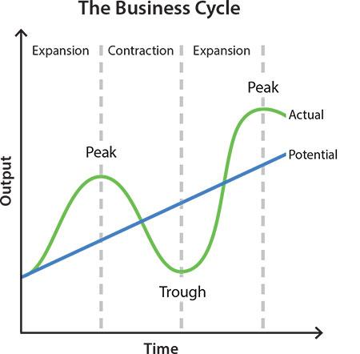

## Table of Contents

## What is a growth recession?

A growth recession is when an economy is still growing, but very slowly. It's not shrinking, but it's not doing well either. Usually, economists say a growth recession happens when the economy grows less than 2% a year. This slow growth can make people feel like the economy is not doing well, even though it's technically still growing.

During a growth recession, people might feel like their money isn't going as far as it used to. Businesses might not be hiring as much, and it can be harder to find a good job. Even though the economy is growing, it's not growing fast enough to make everyone feel confident about the future. This can lead to people spending less money, which can make the slow growth even worse.

## How does a growth recession differ from a traditional recession?

A growth recession and a traditional recession are different in a big way. A traditional recession is when the economy actually shrinks. This means that the total amount of money made by everyone in the country goes down. During a traditional recession, lots of people might lose their jobs, and businesses might close. It's a tough time where everyone feels the economy is doing badly.

On the other hand, a growth recession is when the economy is still growing, but very slowly. It's growing at less than 2% a year, which is not enough to make people feel good about the economy. Even though the economy is getting bigger, it's not growing fast enough to make a big difference in people's lives. People might still feel like the economy is struggling, but it's not as bad as when the economy is actually shrinking in a traditional recession.

## What are the key indicators of a growth recession?

Key indicators of a growth recession include a slow increase in the gross domestic product (GDP), which is the total value of everything produced in the country. When the GDP grows at less than 2% a year, it might mean the economy is in a growth recession. Another sign is when businesses are not hiring many new workers. Even though they are not laying people off like in a traditional recession, the job market is not growing much, which can make people feel like the economy is not doing well.

Another indicator is when people start saving more money instead of spending it. This can happen because they are worried about the slow growth of the economy. When people spend less, it can make the economy grow even slower. Also, if the stock market is not going up much, it can be a sign that investors are not confident in the economy's future. All these signs together can show that the economy is in a growth recession.

## What causes a growth recession?

A growth recession can happen for a few reasons. One big reason is when businesses and people start to feel less confident about the future. If they think the economy might get worse, they might spend less money and invest less. This can slow down the economy's growth because when people and businesses spend less, it means less money is moving around. Another reason can be problems in other countries. If big trading partners are having their own economic troubles, it can affect the economy at home because there might be fewer exports or less money coming in from abroad.

Another cause of a growth recession can be high levels of debt. When people or the government have a lot of debt, they might have to spend more money paying it back instead of spending it on new things. This can slow down the economy because there's less money to go around. Also, if interest rates go up, it can make borrowing money more expensive. This can make people and businesses less likely to take out loans to start new projects or buy new things, which can also slow down economic growth.

## How can a growth recession impact the economy?

A growth recession can make the economy feel stuck. Even though the economy is still growing a little bit, it's not growing fast enough to make people feel good about their money or their jobs. When the economy grows slowly, businesses might not hire as many new workers. This can make it harder for people to find good jobs, and they might feel worried about their future. People might also start saving more money instead of spending it, because they're not sure if the economy will get better. When people spend less, it can make the economy grow even slower, which can make the growth recession last longer.

Another way a growth recession can impact the economy is by making it harder for businesses to grow. When the economy is growing slowly, businesses might not want to take big risks or start new projects. They might wait to see if the economy gets better before they spend a lot of money. This can slow down innovation and make it harder for new businesses to start up. Also, if the stock market isn't doing well, it can make investors less likely to put money into new ideas or companies. All of these things can make the economy feel like it's not moving forward, even though it's not shrinking like in a traditional recession.

## What are the effects of a growth recession on businesses?

During a growth recession, businesses often feel the pinch because the economy is growing very slowly. They might not see as many customers coming through the door because people are spending less money. This can make it hard for businesses to make as much money as they used to. When businesses are not making enough money, they might not want to hire new workers or they might even have to let some workers go. This can make it tough for businesses to grow and expand, because they need to be careful with their money.

Another effect of a growth recession on businesses is that they might be less likely to take risks. When the economy is growing slowly, businesses might not want to start new projects or invest in new ideas. They might wait to see if the economy gets better before they spend a lot of money. This can slow down innovation and make it harder for new businesses to get started. If the stock market is not doing well, it can also make it harder for businesses to get the money they need to grow, because investors might be less willing to take a chance on new ideas or companies.

## How do growth recessions affect employment and wages?

During a growth recession, the economy is growing very slowly, which can make it hard for people to find good jobs. Businesses might not hire as many new workers because they are worried about making enough money. Even if they are not laying people off like in a traditional recession, they might not be growing their teams. This can make the job market feel tight, and it can be harder for people to move up in their careers or switch to new jobs.

Wages can also be affected during a growth recession. Because businesses are not growing quickly, they might not be able to give big raises to their workers. People might feel like their money is not going as far as it used to, especially if prices are going up. This can make workers feel stuck, because they are not seeing their pay go up even though they are working hard. Overall, a growth recession can make people feel less confident about their jobs and their future earnings.

## What are the global implications of a growth recession?

When a big country has a growth recession, it can affect other countries too. If that country is a big trading partner, other countries might sell fewer things to them because they are not buying as much. This can make the economies of those other countries grow more slowly too. Also, if investors in the country with the growth recession are not feeling good about their economy, they might take their money out and put it in other countries. This can make those other countries' economies grow faster, but it can also make the money in those countries worth less if too much money comes in at once.

A growth recession can also make people around the world feel less sure about the future. If a big economy is not doing well, it can make people in other countries worry that their own economy might slow down too. This can make them spend less money and save more, which can slow down the global economy. When countries are not feeling good about their economies, they might also not want to work together as much on big projects or trade deals. This can make it harder for the world to solve big problems like climate change or poverty.

## What strategies can governments use to mitigate the effects of a growth recession?

Governments can use different strategies to help their country during a growth recession. One way is by spending more money on things like building roads, schools, and hospitals. This is called fiscal policy. When the government spends more money, it can help businesses get more work and hire more people. Another way is by cutting taxes for people and businesses. When people have more money in their pockets, they might spend more, which can help the economy grow faster. Governments can also give money directly to people who need it, like unemployment benefits or other kinds of help, to make sure they keep spending money.

Another strategy is for the government to work with the central bank to make borrowing money easier. The central bank can lower interest rates, which means it costs less for people and businesses to borrow money. When it's cheaper to borrow, businesses might start new projects or expand, and people might buy new homes or cars. This can help the economy grow faster. Governments can also make it easier for businesses to start up or grow by making rules simpler or giving them special help. By using these strategies, governments can try to make the economy grow faster and help people feel better about the future.

## How can businesses prepare for and navigate through a growth recession?

Businesses can prepare for a growth recession by saving money and not spending too much. They should keep some money aside so they can still pay their bills even if they are making less money. It's also a good idea for businesses to look at their costs and see if they can save money by spending less on things they don't really need. They can also try to find new ways to make money, like selling new products or finding new customers. By being ready and flexible, businesses can handle a growth recession better.

When a growth recession happens, businesses need to be smart about how they spend their money. They might not be able to hire a lot of new workers, so they should focus on keeping the workers they have happy and working well. Businesses can also try to work with other companies or find new ways to grow without spending a lot of money. It's important for businesses to keep talking to their customers and understand what they need, so they can keep selling things even when the economy is growing slowly. By being careful and smart, businesses can make it through a growth recession and come out stronger on the other side.

## What historical examples illustrate growth recessions and their outcomes?

One example of a growth recession happened in the United States during the early 2000s. After the dot-com bubble burst in 2000, the economy grew very slowly for a few years. Even though it was still growing, it was not growing fast enough to make people feel good about their money or their jobs. Businesses were not hiring a lot of new workers, and people were spending less money. It took a while for the economy to start growing faster again, but eventually, things got better. This period showed how a growth recession can make people feel worried about the economy, even though it's not as bad as a traditional recession.

Another example of a growth recession happened in Japan during the 1990s. After a big economic bubble burst, Japan's economy grew very slowly for a long time. People called this period the "Lost Decade" because the economy did not grow much at all. Businesses were not starting new projects, and people were not spending a lot of money. It took Japan a long time to get out of this growth recession, and it showed how hard it can be to get the economy growing fast again once it starts growing slowly. These examples show that growth recessions can last a long time and make people feel unsure about the future, but with the right strategies, countries can eventually recover.

## What are the long-term economic consequences of a growth recession?

A growth recession can have big effects on the economy over a long time. When the economy grows very slowly for a while, it can make people feel less sure about their future. They might start saving more money instead of spending it, which can make the economy grow even slower. Businesses might not want to start new projects or hire new workers because they are worried about making enough money. This can make it hard for the economy to start growing faster again. If the growth recession lasts a long time, like in Japan's "Lost Decade," it can make people feel like the economy is stuck and not going anywhere.

Over time, a growth recession can also make it harder for people to find good jobs and get higher wages. When businesses are not growing quickly, they might not be able to give big raises to their workers. This can make people feel like their money is not going as far as it used to, especially if prices are going up. If the economy does not start growing faster again, it can make it hard for new businesses to start up and for old businesses to innovate. This can slow down the whole economy and make it harder for the country to solve big problems like poverty or climate change.

## What is the relationship between GDP and economic growth?

Gross Domestic Product (GDP) is a key measure of a nation's economic performance, representing the total monetary value of all final goods and services produced over a specific time period within a country's borders. GDP is crucial for assessing economic health, facilitating comparisons over time or across different economies, and guiding policy decisions.

### Components of GDP

GDP can be approached through three primary methods: the production approach, the income approach, and the expenditure approach. The most commonly utilized is the expenditure approach, which can be expressed with the formula:

$$
\text{GDP} = C + I + G + (X - M)
$$

where:
- $C$ is the total consumption expenditure by households.
- $I$ represents investment by businesses and households.
- $G$ stands for government spending.
- $X$ is exports, while $M$ is imports, thus $(X - M)$ reflects net exports.

These components collectively capture the economic activities contributing to a country's GDP.

### Significance of Strong GDP Growth

Robust GDP growth is often associated with a healthy economy and can lead to a virtuous cycle of benefits:
- **Higher Investment Returns**: Investors tend to experience better returns due to increased corporate profits and stock market performance.
- **Increased Consumer Confidence**: As GDP grows, consumer confidence typically rises, fueling further spending and contributing to further economic expansion.
- **Employment Opportunities**: Economic growth can lead to job creation, reducing unemployment rates and stimulating further economic activities.

### Implications of Slow GDP Growth

On the contrary, slow GDP growth can indicate underlying economic challenges and could potentially signal the onset of a slowdown or recession. Characteristics of declining or stagnant GDP growth include:
- **Reduced Economic Activity**: Slower growth often translates to lower levels of business and consumer activities.
- **Increasing Unemployment Rates**: Businesses may slow hiring or reduce staffing levels in response to decreased demand.
- **Weaker Investment Returns**: The market attractiveness tends to fade, impacting investment yields.

### Analyzing Historical Trends and Factors

Historic GDP trends offer critical insights into economic patterns and potential future trajectories. Analyzing past data helps identify influential factors, such as technological advancements, demographic changes, and geopolitical developments, which shape GDP growth. Policymakers and investors utilize these analyses to anticipate shifts and adjust strategies accordingly.

### Conclusion

Understanding GDP is essential for both economic analysis and policy-making. It provides a framework for interpreting the economic environment, identifying growth opportunities, and devising strategies to address economic challenges. Accurately assessing GDP dynamics allows investors and governments to make informed decisions that promote economic stability and growth.

## References & Further Reading

[1]: ["Advances in Financial Machine Learning"](https://www.amazon.com/Advances-Financial-Machine-Learning-Marcos/dp/1119482089) by Marcos Lopez de Prado

[2]: ["Evidence-Based Technical Analysis: Applying the Scientific Method and Statistical Inference to Trading Signals"](https://www.amazon.com/Evidence-Based-Technical-Analysis-Scientific-Statistical/dp/0470008741) by David Aronson

[3]: ["Machine Learning for Algorithmic Trading"](https://github.com/stefan-jansen/machine-learning-for-trading) by Stefan Jansen

[4]: ["Quantitative Trading: How to Build Your Own Algorithmic Trading Business"](https://www.amazon.com/Quantitative-Trading-Build-Algorithmic-Business/dp/1119800064) by Ernest P. Chan

[5]: Goldberg, M.D., & Vahekan, L. (2014). "The Role of Algorithmic Trading in Market Crises." *Journal of Trading*, 9(3), 25-37. 

[6]: Moskowitz, T. J., Ooi, Y. H., & Pedersen, L. H. (2012). "Time Series Momentum." *Journal of Financial Economics*, 104(2), 228-250.

[7]: Carver, R. (2017). ["Systematic Trading: A Unique New Method for Designing Trading and Investing Systems."](https://www.amazon.com/Systematic-Trading-designing-trading-investing/dp/0857194453) 

[8]: "Algorithmic Trading: Winning Strategies and Their Rationale" by Ernest P. Chan 

[9]: Challet, D., & Ayed, A. B. (2014). "Predictability in Economic and Algorithmic Trading: The Fisher Information Viewpoint." *Physica A: Statistical Mechanics and its Applications*, 402, 362-370.