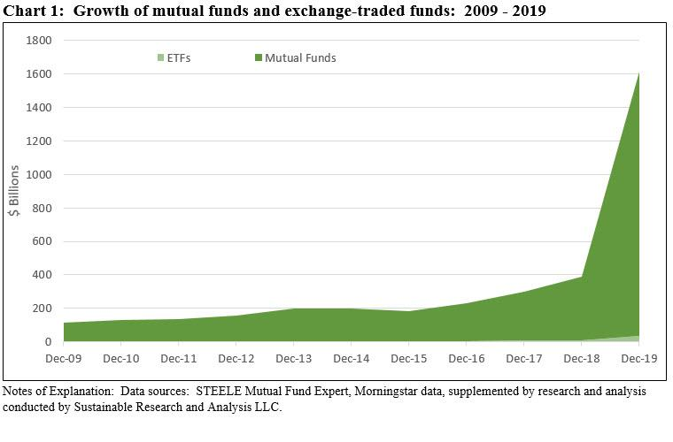

The financial world is experiencing a significant transformation, characterized by an increasing focus on sustainability and social responsibility. This shift is driven by growing awareness of the impact of corporate and financial practices on the environment and society. Investors and financial institutions are recognizing the importance of integrating environmental, social, and governance (ESG) criteria into investment strategies. The convergence of sustainable finance, socially responsible investing (SRI), and Exchange-Traded Funds (ETFs) is at the forefront of this evolution, presenting unique opportunities and challenges for investors.

Sustainable finance refers to financial services that integrate ESG criteria into business or investment decisions for long-term benefits. Socially responsible investing takes this a step further by actively selecting or excluding investments based on ethical guidelines and ESG considerations. ETFs, which are investment funds traded on stock exchanges, are increasingly being structured to reflect these responsible investing principles. This fusion allows investors to align their portfolios with their values, promoting long-term sustainability and social responsibility.

The role of algorithmic trading in augmenting SRI and sustainable finance practices cannot be understated. Algorithms, which automate trading decisions based on pre-defined criteria, are being adapted to include ESG metrics. This enables more efficient and scalable execution of investment strategies that prioritize sustainability, allowing for the optimization of portfolios according to both financial returns and ethical standards.

The motivations behind this paradigm shift towards responsible investing are multifaceted. They include increased regulatory pressures, heightened consumer awareness, and a growing body of evidence suggesting that ESG factors can significantly impact financial performance. Additionally, demographic changes, particularly the rise of millennial investors who prioritize values-driven decision-making, are accelerating this trend.

This article will examine the various components and impacts of sustainable finance ETFs, exploring their role in the broader context of responsible investing. By dissecting these elements, we aim to provide a comprehensive understanding of how sustainability is reshaping the financial landscape and what this means for investors seeking to balance financial returns with ethical considerations.

## Table of Contents

## Understanding Sustainable Finance

Sustainable finance has emerged as a critical paradigm in the modern economy, emphasizing the integration of environmental, social, and governance (ESG) considerations into financial decision-making. This approach not only seeks to generate financial returns but also aims to have a positive impact on the environment and society, hence contributing to overall sustainable development.

### Defining Sustainable Finance

Sustainable finance refers to the practice of considering [ESG](/wiki/esg-investing) factors when making investment decisions, with the goal of fostering sustainable economic growth. This involves channeling financial flows into projects and technologies that support sustainability, such as renewable energy, energy efficiency, and sustainable agriculture. It is a response to the growing recognition that financial stability and long-term economic prosperity are inextricably linked to sustainability challenges, such as climate change and social inequality.

### The Role of ESG Criteria

The Environmental, Social, and Governance (ESG) criteria are crucial to sustainable finance, providing a framework for assessing an investment's impact on the world. 

- **Environmental criteria** consider how a company performs as a steward of the natural environment. This includes their impact on climate change, energy use, waste management, and pollution.

- **Social criteria** examine how a company manages relationships with employees, suppliers, customers, and the communities where it operates. This covers labor practices, human rights, and community engagement.

- **Governance criteria** deal with a company’s leadership, executive pay, audits, internal controls, and shareholder rights. 

These criteria help investors identify risks and opportunities that traditional financial analyses might overlook, aligning their portfolios with sustainable practices.

### Benefits of Sustainable Finance

Integrating sustainability into financial strategies offers numerous benefits. It can lead to improved risk management by addressing ESG risks that could result in legal challenges, regulatory fines, or reputational harm. Moreover, sustainable finance encourages innovation and competitiveness, as companies that excel in ESG criteria often demonstrate superior operational performance and corporate stability. A growing body of evidence suggests that sustainable investments can outperform traditional investments, offering both ethical and financial value.

### Impact on Corporate Behavior and Society

The emphasis on sustainable finance promotes responsible corporate behavior and societal well-being. By prioritizing ESG factors, companies are incentivized to engage in practices that reduce environmental harm, promote social equity, and foster transparent and accountable governance. This can lead to significant societal benefits, such as reduced greenhouse gas emissions, improved labor standards, and enhanced economic inclusivity.

### Challenges and Approaches

Despite its advantages, sustainable finance faces several challenges. One major issue is greenwashing, where firms may exaggerate or falsely claim the sustainability of their products. Inconsistent ESG rating systems pose another problem, as they can lead to confusion and skepticism among investors. Furthermore, integrating ESG criteria requires robust data collection and analysis, which can be resource-intensive.

Addressing these challenges entails developing standardized metrics for ESG performance, enhancing transparency in sustainability reporting, and fostering collaboration between regulators, industry stakeholders, and investors to establish clear guidelines and principles for sustainable finance.

In conclusion, sustainable finance is reshaping the financial landscape by embedding ESG considerations into investment processes, thereby aligning economic activities with sustainable practices. By addressing its challenges and leveraging its benefits, sustainable finance has the potential to drive significant positive change in corporate behavior and societal outcomes.

## The Rise of Socially Responsible Investing (SRI)

Socially Responsible Investing (SRI) is an investment strategy that considers both financial return and social/environmental good to bring about a positive change. Historically, SRI has its roots in religious and ethical considerations. For instance, Quakers in the 18th century abstained from investing in the slave trade. The modern SRI movement gained [momentum](/wiki/momentum) in the 1960s amidst civil rights and anti-Vietnam War protests, encouraging investments that aligned with social responsibility values.

Several factors contribute to the recent surge in SRI's popularity. Firstly, there is an increased awareness of issues such as climate change, social inequality, and corporate governance. Investors are progressively inclined towards ensuring their portfolios align with their values, prompted by these global challenges. Secondly, there is growing evidence that SRI can yield competitive financial returns alongside social impact, dispelling previous notions that it may underperform financially.

Millennials are pivotal in driving the growth of SRI. According to various reports, this demographic is more inclined to prioritize sustainability and responsibility in their investment portfolios. In 2019, a Morgan Stanley survey found that 95% of millennials showed interest in sustainable investing. This generation views investment as a tool to influence corporate behavior and address pressing societal issues.

Successful SRI strategies often incorporate Environmental, Social, and Governance (ESG) criteria. One notable example is the Norwegian Government Pension Fund Global, which excludes companies that do not meet its ethical guidelines. Another example is the Domini Social Equity Fund, known for its strict adherence to ESG principles. Such funds have shown competitive performance, with many ESG-focused portfolios yielding returns comparable to, or surpassing, conventional investment strategies.

However, SRI is not without criticisms and potential drawbacks. One primary concern is the risk of "greenwashing," where companies may exaggerate their sustainable practices to attract investors without making substantial social or environmental changes. Additionally, there is debate over the consistency and reliability of ESG metrics used to evaluate companies. Critics argue that these metrics can be subjective and vary significantly across different rating organizations. Furthermore, skeptics question whether SRI limits the investment universe too stringently, potentially sacrificing diversification for ethics.

Despite these challenges, Socially Responsible Investing continues to gain traction as more investors seek to align their financial goals with their personal values. The commitment to ethical investment not only embodies a cultural shift towards greater corporate responsibility but also emphasizes the potential of finance as a force for good.

## ETFs: A Vehicle for Sustainable Investing

Exchange-Traded Funds (ETFs) have become an essential tool for investors seeking exposure to sustainable investing. ETFs are investment funds traded on stock exchanges, much like stocks. They hold assets such as stocks, bonds, or commodities, and typically aim to track a specific index. This structure offers [liquidity](/wiki/liquidity-risk-premium), diversification, and cost-effectiveness, appealing to a wide range of investors.

### Structuring ETFs for Sustainability

Sustainable ETFs are designed by incorporating Environmental, Social, and Governance (ESG) criteria into their selection process. Fund managers employ a methodology that screens or weights investment components based on ESG metrics. This may involve excluding companies involved in fossil fuels or tobacco or overweighting those demonstrating strong renewable energy practices or corporate responsibility.

### Benefits of Using ETFs for SRI

ETFs offer several benefits for socially responsible investing (SRI):

1. **Diversification**: Investors gain access to a broad range of companies aligning with ESG principles, reducing concentration risk.

2. **Transparency**: ETFs disclose holdings frequently, allowing investors to verify ESG claims easily.

3. **Liquidity**: As exchange-traded products, ETFs can be bought and sold throughout the trading day at market prices, offering flexibility.

4. **Cost Efficiency**: Most ETFs, including sustainable ones, have lower expense ratios compared to mutual funds, benefitting cost-conscious investors.

### Popular Sustainable ETFs

Several sustainable ETFs have gained popularity due to their focus areas and performance. Notable examples include:

- **iShares Global Clean Energy ETF (ICLN)**: Focuses on global companies involved in clean energy production.

- **Vanguard ESG U.S. Stock ETF (ESGV)**: Tracks an index of U.S. companies with strong ESG practices while excluding certain industries such as alcohol and nuclear power.

- **SPDR S&P 500 ESG ETF (EFIV)**: Provides exposure to companies within the S&P 500 with positive ESG rankings.

### Assessing Performance and Risks

The performance of sustainable ETFs generally aligns with the broader market, although the specific focus can lead to variations. For instance, ESG-focused funds might underperform or outperform traditional benchmarks depending on market conditions favoring or disfavorable towards ESG-centric sectors, such as technology or green energy.

Risks associated with sustainable ETFs include:

- **Sector Bias**: Overweighting certain sectors due to ESG considerations, potentially leading to under-diversification.

- **Greenwashing**: The risk that companies or funds falsely portray their investments as environmentally or socially responsible.

- **Regulatory Risks**: Potential changes in ESG disclosure requirements or standards could impact the underlying assets.

Despite these risks, sustainable ETFs continue to attract attention as investors increasingly prioritize alignment of their financial goals with ethical and environmental considerations.

## Algorithmic Trading and ESG Investing

Algorithmic trading, a method that employs computer systems to execute pre-programmed trading instructions, has transformed financial markets by enabling high-frequency trading, increased efficiency, and reduced human error. It leverages complex mathematical models and algorithms to make rapid trading decisions based on market data. This automation can analyze multiple markets simultaneously, execute trades at optimal prices, and reduce transaction costs, making it an essential tool for modern financial trading.

Integrating Environmental, Social, and Governance (ESG) criteria with [algorithmic trading](/wiki/algorithmic-trading) creates a powerful investment strategy focused on sustainable finance objectives. ESG criteria help investors evaluate a company’s sustainable and ethical impact by considering factors like environmental consciousness, social responsibility, and corporate governance. Algorithmic trading can enhance these evaluations by swiftly processing vast amounts of ESG data to identify investment opportunities that align with socially responsible goals. This synergy allows for the development of sustainable ETFs that balance financial returns with ethical considerations.

Algorithms can significantly enhance decision-making for sustainable ETFs by incorporating ESG indicators into their trading logic. For example, [machine learning](/wiki/machine-learning) algorithms can be trained to predict stock movement by factoring in ESG scores and news sentiment, thereby prioritizing companies that demonstrate strong sustainable practices. These systems can also dynamically adjust investment portfolios based on real-time ESG data, ensuring continuous alignment with sustainability targets.

An example of algorithms used in socially responsible investment (SRI)-focused trading strategies is the use of Natural Language Processing (NLP) to analyze news articles and reports for sentiment on ESG topics. By tagging and scoring these sentiments, algorithms can adjust their trading decisions to reflect changes in public perception or regulatory policies related to sustainability. Additionally, quantitative strategies like mean-variance optimization can integrate ESG criteria to construct optimized portfolios that aim to achieve both risk-adjusted returns and positive societal impact.

While algorithmic trading offers considerable advantages for ESG investing, it also raises potential ethical concerns. The reliance on algorithms could lead to unintended biases or overemphasis on readily quantifiable factors, potentially overlooking qualitative aspects of ESG. Furthermore, there is a risk that algorithmic traders might prioritize profits over ethical considerations, using ESG as a form of greenwashing to attract environmentally conscious investors without genuine commitment to sustainability. Therefore, it is crucial for traders and firms to maintain transparency, continuously review algorithmic criteria, and ensure that their strategies genuinely reflect socially responsible values. The responsibility lies with algorithmic traders to uphold ethical standards and contribute positively to the advancement of sustainable finance.

## Challenges and Criticisms of Sustainable Finance and SRI ETFs

The growing popularity of sustainable finance and socially responsible investing (SRI) through Exchange-Traded Funds (ETFs) has ushered in new challenges and criticisms. As these investment vehicles become more mainstream, several issues have come to light, challenging their effectiveness and integrity.

**Greenwashing Concerns**

Greenwashing is a significant issue within ESG and SRI domains. This practice involves companies or investment funds exaggerating their environmental and social responsibility credentials to attract ESG-conscious investors. The lack of standardized definitions and metrics often makes it difficult for investors to ascertain genuine sustainable investments, leading to concerns about the authenticity of proclaimed ESG attributes. Vigilant investors need to scrutinize ESG claims to ensure their credibility, often requiring deeper due diligence.

**ESG Rating Consistency and Validity**

The consistency and validity of ESG rating systems are often debated. ESG ratings play a crucial role in evaluating investments' sustainability impacts; however, methodologies can vary significantly between rating agencies. This lack of uniformity can lead to different ratings for the same entity, causing confusion among investors and undermining the reliability of ESG metrics. Researchers advocate for more standardized frameworks to improve comparability and investor confidence in these ratings.

**Performance of SRI ETFs vs. Traditional Funds**

Another area of focus is the performance comparison of SRI ETFs against traditional funds. While SRI ETFs aim to align investments with ethical values, there is ongoing debate about whether this approach compromises financial returns. Some studies suggest that integrating ESG criteria may enhance long-term performance by identifying firms with robust governance and risk management practices. Conversely, others argue that SRI ETFs might underperform due to constraints that limit investment universes.

**Transparency and Management Fees**

Criticism also stems from the perceived lack of transparency and the level of fund management fees associated with SRI ETFs. Investors often demand detailed disclosure regarding fund holdings and ESG assessment methodologies to ensure alignment with their values. Additionally, management fees for SRI funds can sometimes be higher compared to traditional ETFs, posing concerns about cost-effectiveness. Greater transparency and competitive fee structures are necessary to maintain investor trust and interest.

**Risk Mitigation in Sustainable Investing**

To mitigate risks in sustainable investing, investors can employ several strategies. Conducting thorough due diligence to verify ESG credentials, diversifying across various asset classes, and continuously monitoring ESG performance indicators are vital steps. Engaging with fund managers to ensure alignment with ESG principles and demanding accountability through shareholder advocacy can further strengthen investment resilience and impact.

In conclusion, while sustainable finance and SRI ETFs present promising opportunities aligned with ethical considerations, overcoming these challenges requires concerted efforts for standardization, transparency, and the development of robust evaluation metrics. By addressing these issues, the sustainable investment sector can enhance its credibility and efficacy, appealing to a broader investor base committed to both financial returns and positive societal impact.

## Future Trends in Sustainable Investing and ETFs

Predicted to experience substantial growth in the coming decade, sustainable finance and Exchange-Traded Funds (ETFs) are poised to become key components of the global financial landscape. The increasing demand for environmentally and socially conscious investment options originates from both institutional and individual investors, who are increasingly aware of the impact of their financial choices. As environmental concerns and corporate accountability gain prominence, the investment industry continues adapting to this shift and facilitating the integration of sustainability into traditional financial systems.

**Innovations in ESG Data Analytics**

The advancement of Environmental, Social, and Governance (ESG) data analytics is a crucial [factor](/wiki/factor-investing) driving the surge in sustainable investing. Innovative technologies such as [artificial intelligence](/wiki/ai-artificial-intelligence) (AI) and machine learning are being utilized to analyze ESG data more accurately, offering investors deeper insights into a company's sustainability performance. Automated data collection mechanisms and analytical models provide real-time ESG assessments, increasing transparency and aiding better investment decisions. These innovations enable investors to assess not just present metrics but also predict future ESG performance, thereby aligning investments with long-term sustainability goals.

**Evolving Regulations and Their Influence**

Regulatory developments significantly influence the trajectory of sustainable finance practices. Many governments and financial bodies around the world are instituting mandatory ESG disclosures and sustainability reporting for companies and financial institutions. This increased regulatory scrutiny ensures greater standardization in ESG metrics, enhancing comparability and reducing the risk of greenwashing. For instance, the European Union's Sustainable Finance Disclosure Regulation (SFDR) is setting a benchmark for integrating ESG considerations into financial practices, thereby encouraging other regions to adopt similar regulations.

**Technology's Role in Democratizing Sustainable Investments**

The rise of financial technology platforms and digital investment tools has democratized access to sustainable investment options. Technologies such as blockchain are being explored to enhance transparency in investment products, ensuring that the sustainability claims of ETFs are verifiable and trustworthy. Online platforms offer fractional shares of ETFs, making it easier for smaller investors to participate in sustainable investing. Furthermore, robo-advisors are now incorporating ESG parameters into their portfolio algorithms, providing automated, personalized, and sustainable investment strategies for retail investors.

**Future Opportunities for Investors in Sustainable ETFs**

The foreseeable expansion of sustainable ETFs presents numerous opportunities for investors seeking diversified exposure to responsible investment themes. New [ETF](/wiki/etf-trading-strategies) products focused on niche areas within the sustainability spectrum, such as clean energy, water conservation, or gender diversity, provide tailored options that align with specific investor values. Additionally, hybrid financial products that combine traditional indices with ESG criteria are set to proliferate, offering competitive returns alongside ethical investment. The growing availability of retirement savings plans that include sustainable investing options reflects a broader incorporation of ESG factors into long-term wealth planning.

As the financial industry evolves in response to these trends, investors who prioritize sustainability alongside financial returns are positioned to benefit from both ethical investment practices and the economic opportunities arising from the global shift towards more sustainable economies.

## Conclusion

Sustainable finance has emerged as a pivotal aspect of the modern economy. The focus on Environmental, Social, and Governance (ESG) criteria mirrors a global shift towards responsible resource management and ethical investment practices. As businesses and individuals increasingly acknowledge their roles in fostering a sustainable future, sustainable finance initiatives are integrating these principles into mainstream financial strategies. This shift not only promotes accountability and transparency but also encourages better decision-making that aligns with broader societal and environmental goals.

Exchange-Traded Funds (ETFs) and algorithmic trading have become integral tools in advancing ESG-focused strategies. ETFs facilitate access to diversified, socially responsible investments, enabling investors to support sustainable causes without sacrificing potential returns. Algorithmic trading enhances the precision and efficiency of these investment practices by leveraging advanced data analytics to optimize decision-making processes. Together, these tools provide a robust framework for aligning investment pursuits with ESG criteria, thereby promoting responsible investing at scale.

Investors are encouraged to consider the long-term benefits that Socially Responsible Investing (SRI) can offer. Beyond potential financial returns, SRI presents an opportunity to partake in transformative change that supports societal well-being and environmental preservation. As the momentum for sustainable finance accelerates, investors who participate in these strategies contribute to shaping a resilient future economy while potentially reaping the benefits of their foresight.

Balancing financial returns with ethical investments remains a critical endeavor. Transparency, due diligence, and informed decision-making are paramount to achieving this balance. Investors must weigh financial metrics alongside ethical considerations to ensure their portfolios reflect both personal values and market opportunities.

It is essential for individuals and institutions to engage in continuous education and dialogue on sustainable finance. Staying informed about emerging trends, evolving regulations, and technological advancements can empower investors to make informed decisions that align with their ethical standards and financial goals. Collaboration and knowledge-sharing within the financial community can further drive sustainable investment practices and contribute to a more equitable and sustainable global economy.

## References & Further Reading

[1]: Revelli, C., & Viviani, J. L. (2015). ["Financial Performance of Socially Responsible Investing (SRI): What Have We Learned? A Meta-Analysis."](https://onlinelibrary.wiley.com/doi/abs/10.1111/beer.12076) Business Ethics: A European Review, 24(2).

[2]: Nagy, Z., Cogan, D. G., & Sinnreich, D. (2013). ["Optimizing Environmental, Social and Governance Factors in Portfolio Construction: Analysis of Three ESG-tilted Strategies."](https://papers.ssrn.com/sol3/papers.cfm?abstract_id=2221524) Journal of Sustainable Finance & Investment, 3(4).

[3]: Sparkes, R. (2002). ["Socially Responsible Investment: A Global Revolution."](https://archive.org/details/sociallyresponsi0000spar) John Wiley & Sons.

[4]: Gasser, S., Rammerstorfer, M., & Weinmayer, K. (2017). ["Markowitz Revisited: Social Portfolio Engineering."](https://www.sciencedirect.com/science/article/pii/S0377221716308773) European Journal of Finance, 23(7).

[5]: Hale, J. (2020). ["The ESG and Sustainable Fund Universe: Rapid Growth Underpinned by Revisions."](https://medium.com/the-esg-advisor/esg-fund-universe-continues-to-expand-853fb19a2759) Morningstar Research Report.

[6]: Bauer, R., Koedijk, K., & Otten, R. (2005). ["International Evidence on Ethical Mutual Fund Performance and Investment Style."](https://www.sciencedirect.com/science/article/pii/S0378426604001372) Journal of Banking & Finance, 29(7).

[7]: Friede, G., Busch, T., & Bassen, A. (2015). ["ESG and Financial Performance: Aggregated Evidence from More than 2000 Empirical Studies."](https://www.tandfonline.com/doi/full/10.1080/20430795.2015.1118917) Journal of Sustainable Finance & Investment, 5(4).