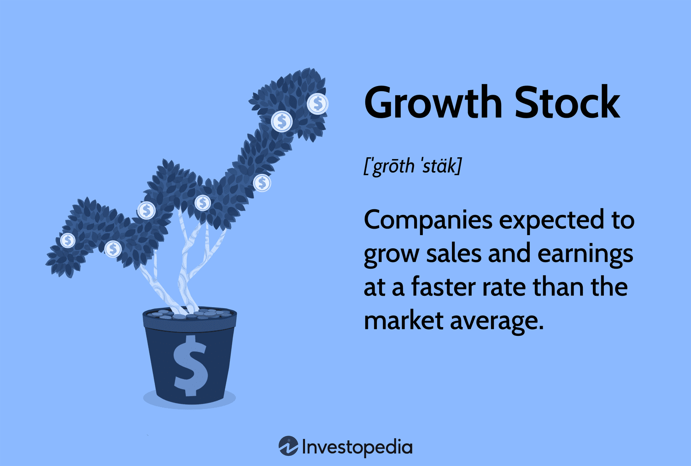

## Table of Contents

## What is a growth stock?

A growth stock is a type of stock that comes from a company expected to grow much faster than other companies. These companies usually put their money back into the business instead of paying it out to shareholders as dividends. They focus on expanding their business, developing new products, or entering new markets. Because of this potential for rapid growth, investors are often willing to pay more for these stocks, which can lead to higher stock prices.

However, investing in growth stocks can be risky. Since these companies are often in the early stages of their development, they might not have a long history of success. Their stock prices can be very volatile, meaning they can go up and down a lot. If the company doesn't grow as expected, the stock price can drop sharply. Despite these risks, many investors are attracted to growth stocks because of the possibility of earning big returns if the company does well.

## How do growth stocks differ from value stocks?

Growth stocks and value stocks are two different types of investments that people choose based on what they want from their money. Growth stocks come from companies that are expected to grow a lot and fast. These companies usually don't pay out much money to their shareholders as dividends because they want to use that money to make their business bigger. Investors buy growth stocks hoping that the price of the stock will go up a lot over time. This means they can sell the stock later for more money than they paid for it.

Value stocks, on the other hand, are from companies that might not be growing as fast but are thought to be a good deal. These companies often pay out more money to their shareholders as dividends. Investors who buy value stocks think the stock is cheaper than it should be. They hope that the stock price will go up once other people realize how good the company really is. Value stocks can be less risky than [growth stocks](/wiki/growth-stocks) because they are usually from more established companies, but they might not offer the same chance for big, quick profits.

In simple terms, growth stocks are about betting on a company's future growth and potential, while value stocks are about finding a good deal and getting steady returns. Both types of stocks have their own risks and rewards, and which one is better depends on what an investor is looking for.

## What are the characteristics of a growth stock?

Growth stocks come from companies that are expected to grow quickly. These companies usually don't pay out much money to their shareholders as dividends. Instead, they use that money to make their business bigger. This can mean they spend on new products, new markets, or expanding what they already do. Because people think these companies will grow a lot, they are often willing to pay more for their stocks. This can make the stock price go up.

These stocks can be risky because the companies are often new or in the early stages of their growth. If the company doesn't grow as fast as people thought it would, the stock price can drop a lot. This makes the price of growth stocks go up and down more than other stocks. But, if the company does well and grows a lot, people who own the stock can make a lot of money. Investors who like growth stocks are looking for big profits, even if it means taking more risk.

## What industries typically have growth stocks?

Growth stocks often come from industries that are new or changing quickly. Technology is a big one. Companies that make software, apps, or new gadgets can grow a lot because they are always coming up with new things. Another industry is healthcare, especially companies that work on new medicines or treatments. These companies can grow fast if they find something that works well.

Other industries that often have growth stocks are renewable energy and online businesses. Renewable energy companies, like those making solar panels or wind turbines, can grow as more people want to use clean energy. Online businesses, like e-commerce or streaming services, can also grow quickly as more people shop and watch things online. These industries can offer big opportunities for growth, but they can also be risky because things can change fast.

## How can you identify a growth stock?

To identify a growth stock, you should look at the company's earnings. Growth stocks usually have earnings that are growing faster than other companies in their industry. You can check this by looking at the company's financial reports. Another thing to look for is if the company is reinvesting its profits back into the business instead of paying them out as dividends. This shows they are trying to grow bigger and faster.

Also, pay attention to the company's industry and what it does. Growth stocks often come from industries that are new or changing quickly, like technology or healthcare. If a company is working on new products or entering new markets, it could be a good sign of a growth stock. But remember, growth stocks can be risky because their prices can go up and down a lot. So, it's important to do your research and understand the risks before you invest.

## What are the risks associated with investing in growth stocks?

Investing in growth stocks can be risky because these companies are often new or in the early stages of their growth. This means they might not have a long history of success, so it's hard to know if they will keep growing. If the company doesn't meet the high expectations that people have for it, the stock price can drop a lot. This can happen if the company has trouble making money, if it faces more competition, or if something else goes wrong. Because of these risks, the price of growth stocks can go up and down a lot, which can be scary for investors.

Another risk is that growth stocks often don't pay dividends. This means that investors don't get any regular money from the company while they wait for the stock price to go up. If the stock price doesn't go up as much as expected, investors might not make any money at all. Also, because people are willing to pay more for growth stocks, they can be very expensive. If the stock price goes down, investors could lose a lot of money. So, while growth stocks can offer big rewards, they also come with big risks that investors need to think about carefully.

## How do growth stocks perform during different economic cycles?

Growth stocks can do well when the economy is growing. During good economic times, people and businesses have more money to spend. This can help companies that are trying to grow quickly because they can sell more of their products or services. Investors might also feel more confident and be willing to take risks on these companies, which can push the stock prices up. But, growth stocks can be very sensitive to changes in the economy. If people start to worry about the economy slowing down, they might sell their growth stocks first because these stocks can be riskier.

During tough economic times, like a recession, growth stocks can struggle. When the economy is not doing well, people and businesses might cut back on spending. This can hurt companies that are trying to grow quickly because they might not be able to sell as much as they hoped. Also, investors might move their money to safer investments, like value stocks or bonds, which can make the prices of growth stocks go down. So, growth stocks can be a good choice when the economy is strong, but they can be risky when the economy is weak.

## What are some historical examples of successful growth stocks?

One famous example of a successful growth stock is Amazon. Amazon started as an online bookstore in 1994, but it grew very fast. They started selling more things like electronics and clothes, and then they even started offering services like Amazon Prime and Amazon Web Services. People who bought Amazon stock early on made a lot of money because the company kept growing and the stock price went up a lot.

Another example is Apple. Apple started making computers in the 1970s, but it really took off when it started making the iPod, iPhone, and iPad. These products made Apple very popular and helped the company grow a lot. People who invested in Apple stock when it was still growing made a lot of money as the stock price went up over time.

Netflix is also a good example. It began as a DVD rental service in 1997, but then it moved into streaming movies and TV shows online. This change helped Netflix grow very quickly. Investors who bought Netflix stock when it was just starting to grow made a lot of money as the company became more successful and the stock price went up.

## How should one approach valuation when analyzing growth stocks?

When you want to figure out if a growth stock is a good buy, you need to look at how much the company is expected to grow and how much you have to pay for that growth. One way to do this is by looking at the price-to-earnings (P/E) ratio. This tells you how much you are paying for each dollar of the company's earnings. Growth stocks often have high P/E ratios because people are willing to pay more for the chance that the company will grow a lot. But, you need to be careful because a high P/E ratio can also mean the stock is too expensive if the company doesn't grow as fast as expected.

Another way to value growth stocks is by looking at the price-to-sales (P/S) ratio. This tells you how much you are paying for each dollar of the company's sales. This can be useful for growth stocks that might not be making a lot of money yet but are selling a lot of their products or services. You can also use the discounted cash flow (DCF) model, which tries to guess how much money the company will make in the future and then figures out what that is worth today. All these methods can help you decide if a growth stock is a good deal, but remember, they are just guesses about the future, so there's always some risk involved.

## What role do growth stocks play in a diversified investment portfolio?

Growth stocks can be a good part of a diversified investment portfolio because they offer the chance for big profits. When you have different types of investments, like growth stocks, value stocks, and bonds, you spread out your risk. This means if one type of investment does badly, the others might do well and help balance things out. Growth stocks can help your portfolio grow faster than it would with just safer investments. But, because growth stocks can go up and down a lot, it's important not to put all your money in them. You should mix them with other types of investments to keep your portfolio balanced.

In a diversified portfolio, growth stocks can also help you take advantage of new trends and industries. For example, if you invest in growth stocks from the technology or healthcare sectors, you might benefit from new inventions or treatments that become popular. This can make your portfolio more exciting and potentially more rewarding. However, it's wise to keep an eye on how much of your money is in growth stocks. A good rule is to have a mix that fits your comfort with risk and your goals for the future. This way, you can enjoy the possible big gains from growth stocks while still feeling safe with your overall investment plan.

## How do growth stocks impact overall market trends and indices?

Growth stocks can have a big effect on the overall market and the way stock indices move. When people get excited about growth stocks, they might buy a lot of them, which can push the prices up. This can make the whole market seem like it's doing well because stock indices, like the S&P 500 or the Nasdaq, often include a lot of big growth companies. If these growth stocks go up a lot, they can pull the whole index up with them. But, if people start to worry about growth stocks, they might sell them, which can make the prices go down and drag the whole market down too.

The impact of growth stocks on market trends can also depend on what's happening in the economy. During good economic times, when people feel confident, they might be more willing to buy growth stocks because they think these companies will do well. This can make the market go up. But, during bad economic times, people might sell their growth stocks and move their money to safer investments. This can make the market go down. So, growth stocks can be a big part of what makes the market go up and down, and they can help show what people are thinking about the economy.

## What advanced metrics or ratios should be used to evaluate growth stocks?

When you want to figure out if a growth stock is a good investment, you can use some special numbers and ratios to help you. One useful number is the price-to-earnings growth (PEG) ratio. This ratio compares the stock's price-to-earnings (P/E) ratio with how fast the company's earnings are growing. A lower PEG ratio can mean the stock is a better deal because you're paying less for the growth you expect. Another number to look at is the return on equity (ROE), which tells you how well the company is using the money shareholders have put in to make more money. A high ROE can be a good sign that the company is doing well and might keep growing.

You can also look at the company's revenue growth rate to see if it's selling more stuff over time. This can give you an idea of how fast the company is growing. Another important ratio is the price-to-sales (P/S) ratio, which shows how much you're paying for each dollar of the company's sales. This can be helpful for growth stocks that might not be making a lot of profit yet but are selling a lot. Lastly, you might want to use the discounted cash flow (DCF) model, which tries to guess how much money the company will make in the future and what that's worth today. These numbers and ratios can help you decide if a growth stock is worth buying, but remember, they're just guesses about the future, so there's always some risk.

## References & Further Reading

1. **Books**:
   - "Algorithmic Trading and DMA: An Introduction to Direct Access Trading Strategies" by Barry Johnson. This book provides a comprehensive introduction to algorithmic trading strategies and their application in financial markets.
   - "Quantitative Trading: How to Build Your Own Algorithmic Trading Business" by Ernest P. Chan. A guide for individual traders wishing to employ algorithmic trading, with practical advice on building a trading business.
   - "Common Stocks and Uncommon Profits" by Philip A. Fisher. This classic investment book discusses fundamental analysis of growth stocks.

2. **Papers**:
   - "Do Stocks Outperform Treasury Bills?" by Hendrik Bessembinder. A landmark study that analyzes the performance of growth stocks in comparison to lower-risk alternatives.
   - "The Use of Algorithmic Trading to Optimize Portfolio Performance" published in the Journal of Financial Markets offers insights into algorithmic strategies used to manage portfolios of growth stocks.

3. **Online Courses**:
   - **Coursera**: "Machine Learning for Trading" by Georgia Tech provides insights into how machine learning algorithms can be applied to trading strategies.
   - **edX**: "Algorithmic Trading and Finance Models with Python, R, and Stata Essential Training" teaches the fundamentals of building trading models and executing them using Python.

4. **Datasets**:
   - **Kaggle**: Offers various financial datasets that are essential for backtesting trading algorithms. The 'NYSE Stock Data' or 'NASDAQ Historical Data' datasets are particularly relevant for growth stocks.
   - **Quandl**: A resource for obtaining comprehensive financial, economic, and alternative datasets useful for developing and testing algorithmic strategies.

5. **Academic Journals**:
   - The "Journal of Finance" frequently publishes articles on the methodologies and empirical results of growth stock investments.
   - "Quantitative Finance" provides in-depth analysis of quantitative methods in trading and underlying financial theories.

By exploring these resources, readers can gain a deeper understanding of the intersection of growth stocks and [algorithmic trading](/wiki/algorithmic-trading), enhance their strategies, and keep abreast of the latest developments in the field.

