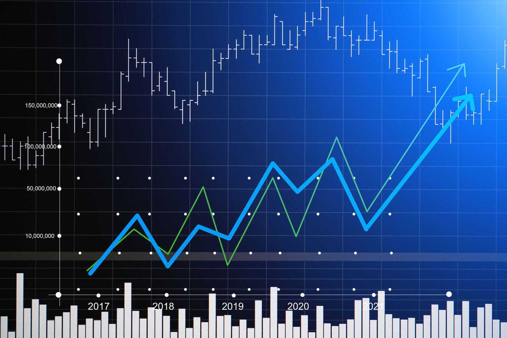

Value stocks and growth stocks are two foundational investment strategies, each offering unique approaches to capital allocation. Value stocks are typically characterized by their low price-to-earnings (P/E) ratios and solid fundamentals, suggesting they may be undervalued by the market. Investors adopting a value-focused strategy look to these stocks as opportunities for gains once the market adjusts to better reflect the stocks' intrinsic worth. Growth stocks, in contrast, are defined by their high revenue potential and aggressive reinvestment strategies. These stocks often trade at higher P/E ratios due to expectations of future growth and appeal to investors willing to accept greater risk for the potential of substantial returns.

Algorithmic trading, a prominent feature of contemporary finance, facilitates the automation of trading actions through computer algorithms. These algorithms can rapidly process vast datasets, execute transactions at high speeds, and aim to optimize trading strategies while reducing the influence of human biases. This modern approach allows for the efficient management of both value and growth stock portfolios by leveraging advanced technology to make informed trading decisions.

The purpose of comparing value stocks with growth stocks in the context of algorithmic trading is to understand how these strategies can be effectively employed and optimized via technological means. As investing becomes increasingly complex and technology-driven, understanding the dynamics between these stock types and algorithmic systems becomes crucial for maximizing portfolio performance.

Both individual and institutional investors can benefit significantly from grasping different investment strategies, as these insights enable informed decision-making aligned with specific risk tolerances and investment objectives. By comprehensively understanding the characteristics, benefits, and potential risks associated with value and growth stocks, investors can develop more robust strategies, tailored to their unique financial goals.

This article will provide an in-depth comparison of value and growth stocks, examining their defining characteristics, potential returns, and associated risks. It will also explore the transformative role of algorithmic trading in optimizing these investment strategies, setting the stage for a nuanced discussion of how technology is reshaping the landscape of stock investing.

## Table of Contents

## Understanding Value Stocks

Value stocks represent a category of equities that are typically undervalued in comparison to their intrinsic value or fundamental metrics. These stocks are generally characterized by low price-to-earnings (P/E) ratios, which signifies that the stock’s price is low relative to the company's earnings. Additionally, they often exhibit strong fundamentals, such as stable earnings, solid balance sheets, and consistent dividend payouts. Investors interested in value stocks typically seek to capitalize on market inefficiencies by purchasing stocks that are considered undervalued by the market, with the expectation that these stocks will appreciate in value over time.

Historically, value stocks have appealed to conservative investors due to their potential for stable performance and lower risk. Studies have demonstrated that, over the long term, value stocks tend to outperform [growth stocks](/wiki/growth-stocks). Value investing gained particular prominence from the work of Benjamin Graham and his protégé Warren Buffett, who successfully utilized this strategy, contributing to the long-term appeal of value stocks. The historical track record of value stocks gaining substantial appreciation as market corrections align stock prices closer to their intrinsic values has solidified their popularity.

Value stocks are often found in sectors that are considered mature or stable, such as utilities, financials, energy, and consumer goods. These industries usually experience slower growth compared to burgeoning fields like technology or biotechnology, but they offer steadier cash flows and more predictable earnings, which are attractive features for value investors.

Key metrics used to evaluate value stocks include, but are not limited to, price-to-book (P/B) ratio, price-to-earnings (P/E) ratio, dividend yield, and price-to-sales (P/S) ratio. These indicators help investors assess whether a stock is undervalued relative to its historical price, earnings, or book value. For example, a stock with a P/E ratio significantly lower than the industry average might be considered a value stock, assuming its fundamental health is strong.

Notable examples of successful value stocks include companies like Berkshire Hathaway, Johnson & Johnson, and Procter & Gamble. These firms have historically demonstrated robust financial performance and have rewarded investors with both dividends and capital appreciation. The impact of such stocks on investors' portfolios is significant, as they contribute to steady growth and reduced [volatility](/wiki/volatility-trading-strategies), aligning with the goals of income-focused and risk-averse investors. Such companies typically dominate their sectors, have a proven track record of profitability, and maintain a loyal customer base.

## Understanding Growth Stocks

Growth stocks are equities in companies anticipated to grow at an above-average rate compared to other firms in the market. These stocks are characterized by their high revenue potential and strategic reinvestment practices, which often prioritize expanding business operations over distributing dividends to shareholders. Typically, growth stocks exhibit robust earnings growth, a key indicator of their potential to outperform the broader market.

The attractiveness of growth stocks primarily lies in their potential for substantial capital appreciation. Investors are drawn to growth stocks with the expectation of high returns, believing that the rapid expansion and market disruption these companies often bring will eventually lead to significant profits. Unlike value stocks, growth stocks may trade at higher price-to-earnings (P/E) ratios, reflecting the market’s optimistic outlook on future earnings and growth prospects.

Key sectors and industries have emerged as fertile ground for growth stocks, notably the technology and healthcare sectors. Tech companies, particularly those involved in innovation and digital solutions, such as software development, e-commerce, and cloud computing, frequently present immense growth opportunities. Similarly, healthcare companies, especially those engaged in biotechnology and pharmaceutical advancements, offer promising growth due to the ongoing need for innovative health solutions.

However, investing in growth stocks carries inherent risks, most notably market volatility. Growth stocks are susceptible to significant price fluctuations driven by investor sentiment, technological shifts, and competitive pressures. Furthermore, the uncertainty surrounding future earnings, especially for companies in nascent stages or those with unproven business models, can contribute to volatile returns. Thus, while growth stocks can deliver significant rewards, they also entail a higher level of risk compared to more stable investment options.

Prominent examples of growth stocks include companies like Amazon, Tesla, and Netflix, which have made considerable contributions to capital appreciation over the past decade. These companies have not only revolutionized their respective industries but have also exemplified the potential returns achievable through strategic growth stock investments. As a result, they have become integral components of numerous investor portfolios, driving wealth creation and reshaping market dynamics.

Overall, growth stocks offer compelling opportunities for investors aiming for high returns through strategic risk-taking in sectors poised for rapid expansion and innovation. Careful consideration of market conditions, alongside thorough research and analysis, is essential for those looking to capitalize on these vibrant investment vehicles.

## What is Algorithmic Trading?

Algorithmic trading is a contemporary trading strategy that employs computer algorithms to execute trades. These algorithms are designed to follow a set of predefined parameters, allowing for automated decision-making in buying or selling financial instruments. This method represents a significant departure from traditional trading approaches that rely heavily on human decision-making.

One of the primary advantages of [algorithmic trading](/wiki/algorithmic-trading) is its speed. Algorithms can execute trades in fractions of a second, leveraging the ability to respond to market conditions far more rapidly than any human trader. This speed advantage is crucial in markets where prices can change dramatically in milliseconds. Additionally, algorithmic trading offers improved accuracy, as it minimizes human errors typically associated with manual trading activities.

The ability to process large datasets is another critical benefit of algorithmic trading. Algorithms can analyze vast amounts of historical and real-time data to identify patterns and make informed trading decisions. This capability is particularly beneficial in identifying subtle market trends that a human analyst might overlook.

Algorithmic trading is versatile and can be tailored to various investment strategies, including both value and growth stock investments. For value stocks, algorithms can identify undervalued companies based on financial metrics such as low price-to-earnings ratios. In contrast, for growth stocks, they can focus on companies with high potential for revenue growth, factoring in market trends and economic indicators.

One of the significant roles of algorithms is mitigating human biases and emotions in trading decisions. Human traders are often influenced by emotions such as fear and greed, leading to suboptimal trading decisions. Algorithms eliminate this emotional interference, thereby executing trades based solely on data-driven analysis and logic.

Despite its numerous advantages, algorithmic trading is not without challenges and risks. Technical glitches can occur, leading to unintended trading actions or failures to execute trades at the desired prices. Such malfunctions have occasionally led to substantial market disruptions, exemplified by incidents like the "Flash Crash" of 2010. Additionally, algorithmic trading faces regulatory challenges, as authorities scrutinize the fairness and transparency of these automated systems, often necessitating adherence to strict legal frameworks.

In summary, algorithmic trading represents a modern approach to executing trades with enhanced speed, accuracy, and data-processing capabilities. While it offers significant advantages in mitigating human biases, it also presents challenges that must be carefully managed, such as technical issues and regulatory compliance. As technology continues to advance, the evolution of algorithmic trading will likely remain a critical component of financial markets.

## Value Stocks vs. Growth Stocks: An Investment Comparison

Value and growth stocks represent two fundamental investment strategies that cater to different investor preferences and market dynamics. Historically, value stocks are characterized by their trading at prices lower than their intrinsic value, often identified through metrics such as low price-to-earnings (P/E) ratios, high dividend yields, and strong fundamentals. In contrast, growth stocks are associated with companies expected to grow at an above-average rate compared to their industry or the overall market, marked by high revenue growth and reinvestment of profits into expansion initiatives.

## Historical Performance and Metrics

Historically, value stocks have been favored during periods of economic recovery and stable growth, when investors seek safety and predictable returns. They have shown resilience in downturns, often outperforming growth stocks during recessions due to their stable income streams. The P/E ratio is a common evaluation metric, calculated as:

$$
\text{P/E Ratio} = \frac{\text{Market Value per Share}}{\text{Earnings per Share (EPS)}}
$$

Growth stocks, traditionally thriving in bull markets, often appeal to investors willing to accept higher volatility for potentially higher returns. They are commonly found in dynamic sectors such as technology and healthcare, where innovation drives exponential growth. However, their performance can be highly volatile, driven by market sentiment and future earnings expectations.

## Advantages of Each Strategy

The advantages of value investing lie in its focus on strong fundamentals and sustainable returns. Value stocks offer theoretical benefits such as a margin of safety, lower downside risk, and reliable dividends. Practically, they can provide stability and regular income, appealing to conservative investors.

Growth investing attracts those seeking capital appreciation and willing to endure short-term volatility for long-term gains. The potential for substantial returns is a significant draw, with growth stocks often leading markets during economic booms.

## Market Condition Suitability

Value stocks excel in market conditions favoring stability and income, such as rising interest rates or inflationary periods where investors prioritize tangible assets and earnings over speculative growth. Conversely, low-interest environments and economic optimism bolster growth stocks, as cheap capital fuels expansion and speculative investments.

## Investor Risk Profiles

Investors gravitating towards value stocks typically have lower risk tolerance, focusing on preservation of capital and steady returns. They are often long-term investors relying on income generation through dividends and gradual capital appreciation.

Growth investors, on the other hand, tend to accept higher risk, aiming for substantial long-term gains. They usually have a higher risk tolerance, understanding that such investments might lead to erratic short-term performance.

## Investment Horizons

Value stocks generally align with long-term investment horizons, as appreciating the fundamentals over time often pays off in the form of compounded returns. This strategy benefits from patience as market values eventually align with intrinsic values.

In contrast, growth stocks attract both short-term traders exploiting market cycles and long-term investors betting on sustained company growth. Short-term volatility makes them suitable for traders willing to navigate rapid price fluctuations, while long-term investors focus on potential exponential growth.

Overall, choosing between value and growth strategies requires understanding individual risk appetites and objectives, keeping in mind that both can be integral components of a diversified portfolio.

## Integrating Algorithmic Trading with Value and Growth Stocks

Algorithmic trading has profoundly impacted the strategies surrounding value and growth stock investments by leveraging computational power and sophisticated algorithms. These strategies offer several enhancements over traditional trading methods by employing [machine learning](/wiki/machine-learning) and [artificial intelligence](/wiki/ai-artificial-intelligence) (AI) to analyze market data and execute trades.

### Machine Learning and AI in Trading Strategies

Machine learning and AI can process vast amounts of data at incredible speeds, identifying trends and patterns that are imperceptible to human traders. They are used to develop models that predict stock price movements based on historical data, social media sentiment, macroeconomic indicators, and more. These advanced technologies enable traders to optimize their strategies by continuously learning and adapting to market conditions.

For instance, a common machine learning approach is using neural networks to predict stock prices or identify optimal buying/selling points. Algorithms can be designed to automatically adjust strategies based on volatility, providing an edge in high-frequency trading environments. Through such dynamic adaptations, algorithmic strategies can significantly enhance the performance of both value and growth stock investments by optimizing entry and [exit](/wiki/exit-strategy) points and minimizing risks.

### Case Studies and Examples

Several hedge funds and investment firms have successfully applied algorithmic trading to value and growth stocks. Notable examples include Renaissance Technologies and Two Sigma, which employ complex algorithms and quantitative techniques to navigate stock markets effectively. These firms have consistently outperformed benchmarks, showcasing the power of algorithmic interventions in traditional investment strategies.

Moreover, companies like BlackRock utilize AI-driven algorithms to manage and balance portfolios, illustrating how AI can be effectively integrated with human expertise to enhance decision-making processes across value and growth stocks.

### Future of Algorithmic Trading

The future of algorithmic trading is promising, with trends suggesting increased incorporation of AI and machine learning techniques. As computational power grows and data becomes more accessible, algorithms are expected to become more sophisticated, offering unparalleled precision in stock trading.

Developments in quantum computing could further revolutionize this field, potentially enabling simulations and calculations far beyond current capabilities. This may allow for even more accurate predictions and finely-tuned trading strategies.

### Ethical Implications and Regulatory Landscape

Despite its advantages, algorithmic trading raises significant ethical and regulatory concerns. Issues such as market manipulation, the opacity of algorithms, and the potential for exacerbating market volatility require scrutiny. The 2010 Flash Crash exemplifies potential ripple effects when rogue algorithms interact with each other unchecked.

Regulators continuously strive to keep pace with advancements. Regulatory frameworks aim to ensure market stability, transparency, and fairness, often mandating extensive testing and audit trails for algorithmic systems. The European Union's Markets in Financial Instruments Directive II (MiFID II) and the United States Securities and Exchange Commission (SEC) rules are efforts to mitigate risks inherent in algorithmic trading.

In conclusion, integrating algorithmic trading with value and growth stocks presents significant potential to optimize investment strategies. However, it is essential to balance innovation with ethical considerations and stringent regulatory oversight to safeguard market integrity. As technology evolves, so too will the tools and strategies available to investors, providing them with unparalleled opportunities to navigate complex financial landscapes effectively.

## Conclusion

Value and growth stocks represent two significant investment strategies, each with distinct characteristics and potential rewards. Value stocks, generally characterized by low price-to-earnings ratios and robust fundamentals, often appeal to conservative investors looking for stability and dividends. On the other hand, growth stocks, identified by their high revenue potential and substantial reinvestments, attract investors who are willing to embrace higher risk for the chance of significant capital appreciation.

Algorithmic trading has revolutionized the approach to investing in both value and growth stocks by leveraging computer algorithms to execute trades with speed and precision. This modern trading strategy not only facilitates the processing of vast datasets but also enhances decision-making by minimizing human biases and emotions. However, it requires careful management due to potential technical glitches and regulatory concerns.

When choosing between value and growth investment strategies, thorough research and due diligence are imperative. Investors must assess financial metrics, market conditions, and individual company prospects to make informed decisions. Understanding one's risk tolerance and aligning it with investment goals is crucial, as value stocks generally offer more stability, whereas growth stocks offer higher potential returns coupled with increased volatility.

Looking ahead, the integration of algorithmic trading with value and growth investments is likely to continue growing. Advances in machine learning and artificial intelligence may further refine these strategies, offering more personalized trading approaches. However, the ethical and regulatory aspects of algorithmic trading will require ongoing attention to ensure a fair and efficient investment landscape. As technology advances, investors must remain adaptable, staying informed and making decisions that align with their financial objectives and risk profiles.

## References & Further Reading

[1]: ["The Intelligent Investor"](https://en.wikipedia.org/wiki/The_Intelligent_Investor) by Benjamin Graham

[2]: ["Security Analysis"](https://www.amazon.com/Security-Analysis-Foreword-Buffett-Editions/dp/0071592539) by Benjamin Graham and David Dodd

[3]: Damodaran, A. (2002). ["Investment Valuation: Tools and Techniques for Determining the Value of Any Asset."](https://archive.org/details/investmentvaluat0000damo_n6k9) John Wiley & Sons.

[4]: Krugman, P. (2005). ["P/E Ratios a Tough Issue for Valuing Dotcoms."](https://scholar.google.com/citations?user=D_Rebd0AAAAJ&hl=en) The New York Times.

[5]: ["Flash Boys: A Wall Street Revolt"](https://en.wikipedia.org/wiki/Flash_Boys) by Michael Lewis

[6]: Lintner, J. (1965). ["The Valuation of Risk Assets and the Selection of Risky Investments in Stock Portfolios and Capital Budgets."](https://www.jstor.org/stable/1926735) The Review of Economics and Statistics, 47(1), 13-37. 

[7]: Fama, E. F., & French, K. R. (1992). ["The Cross-Section of Expected Stock Returns."](https://onlinelibrary.wiley.com/doi/full/10.1111/j.1540-6261.1992.tb04398.x) The Journal of Finance, 47(2), 427-465.

[8]: ["Reminiscences of a Stock Operator"](https://www.amazon.com/Reminiscences-Stock-Operator-Edwin-Lef%C3%A8vre/dp/0471770884) by Edwin Lefèvre

[9]: ["Quantitative Momentum: A Practitioner's Guide to Building a Momentum-Based Stock Selection System"](https://www.amazon.com/Quantitative-Momentum-Practitioners-Momentum-Based-Selection/dp/111923719X) by Wesley R. Gray and Jack R. Vogel