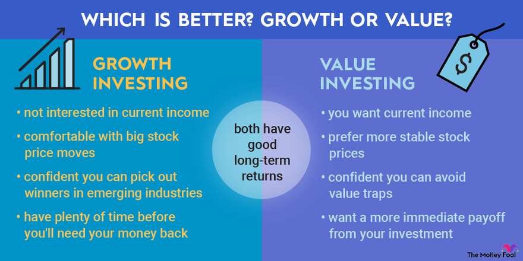

## Table of Contents

## What are growth stocks?

Growth stocks are shares in companies that are expected to grow at a faster rate than other companies. These companies usually reinvest their earnings back into the business to fuel more growth, instead of paying dividends to shareholders. They often operate in new or rapidly expanding industries, like technology or biotech. Because of their potential for high growth, investors are willing to pay more for these stocks, which can lead to higher stock prices.

However, growth stocks can be riskier than other types of stocks. Since investors are betting on future growth, if the company doesn't meet expectations, the stock price can drop sharply. This makes growth stocks more volatile. On the other hand, if the company does well and continues to grow, investors can see big returns on their investment. So, while growth stocks can offer great rewards, they also come with higher risks.

## What are value stocks?

Value stocks are shares in companies that are thought to be priced lower than they should be. Investors believe these stocks are a good deal because they are cheaper compared to what the company is really worth. These companies might be well-known and have been around for a long time. They often pay dividends to their shareholders, which is money paid out from the company's profits.

Even though value stocks can be a good buy, they come with risks too. Sometimes, a stock is cheap for a reason, like the company is not doing well or the industry is struggling. If the company doesn't improve, the stock price might stay low or even go down more. But if the company does get better, the stock price can go up a lot, giving investors a good return on their money. So, value stocks can be a smart choice if you're looking for bargains, but you need to do your homework to make sure you're [picking](/wiki/asset-class-picking) the right ones.

## How do growth stocks and value stocks differ?

Growth stocks and value stocks are two different types of stocks that investors can choose from. Growth stocks are from companies that are expected to grow a lot faster than other companies. These companies usually put their money back into the business to help it grow even more, instead of giving money to shareholders as dividends. They are often in new or quickly growing industries, like tech or biotech. Because people think these companies will do well in the future, they are willing to pay more for the stocks, which can make the stock prices go up a lot.

On the other hand, value stocks are from companies that people think are priced too low. Investors see these stocks as a good deal because they believe the company is worth more than the current stock price. These companies might be older and well-known, and they often pay dividends to their shareholders. The risk with value stocks is that they might be cheap for a reason, like the company is not doing well. But if the company does improve, the stock price can go up a lot, giving investors a good return.

In simple terms, [growth stocks](/wiki/growth-stocks) are about betting on a company's future growth, while value stocks are about finding bargains in the market. Both types of stocks can offer good returns, but they also come with different levels of risk. Growth stocks can be more volatile because their prices can change a lot based on whether the company meets its growth expectations. Value stocks might be less risky if you pick the right ones, but you need to do a lot of research to make sure the company will actually get better.

## What are the key characteristics of growth stocks?

Growth stocks come from companies that are expected to grow much faster than other companies. These companies usually put their money back into the business instead of paying it out as dividends. This helps the company grow even more. They are often in new or quickly growing industries, like technology or biotech. Because people think these companies will do well in the future, they are willing to pay more for the stocks, which can make the stock prices go up a lot.

However, growth stocks can be risky. Since people are betting on the company's future growth, if the company doesn't meet expectations, the stock price can drop a lot. This makes growth stocks more volatile than other types of stocks. But if the company does well and keeps growing, investors can make a lot of money. So, while growth stocks can offer big rewards, they also come with higher risks.

## What are the key characteristics of value stocks?

Value stocks are from companies that people think are priced too low. Investors see these stocks as a good deal because they believe the company is worth more than the current stock price. These companies might be older and well-known, and they often pay dividends to their shareholders. Dividends are like a bonus payment from the company's profits.

The risk with value stocks is that they might be cheap for a reason, like the company is not doing well or the industry is struggling. If the company doesn't get better, the stock price might stay low or even go down more. But if the company does improve, the stock price can go up a lot, giving investors a good return on their money. So, value stocks can be a smart choice if you're looking for bargains, but you need to do your homework to make sure you're picking the right ones.

## What are some examples of growth stocks?

Some examples of growth stocks are companies like Tesla and Amazon. Tesla is a car company that makes electric vehicles. They are growing fast because more and more people want to buy electric cars. Amazon is a big company that sells things online. They keep growing because they are always finding new ways to sell more stuff and make their services better.

Another example of a growth stock is Netflix. They are a company that lets you watch movies and TV shows online. Netflix is growing because they keep adding new shows and movies that people want to watch. They are also starting to make their own shows, which helps them grow even more. All these companies are examples of growth stocks because people think they will keep getting bigger and making more money in the future.

## What are some examples of value stocks?

Some examples of value stocks are companies like Ford and AT&T. Ford is a car company that has been around for a long time. People think Ford's stock is a good deal because it's cheaper than what the company is really worth. AT&T is a big phone and internet company. They pay dividends, which means they give some of their money to shareholders. People think AT&T's stock is a value stock because it's priced lower than what the company is worth.

Another example of a value stock is General Motors, also known as GM. Like Ford, GM is an older car company. People see GM's stock as a value stock because they think the company is worth more than the current stock price. These companies might not be growing as fast as growth stocks, but they can still be a good investment if you believe they will do better in the future.

## How can investors identify potential growth stocks?

Investors can identify potential growth stocks by looking at a company's earnings growth. If a company is making more money each year, it might be a good growth stock. Another way is to look at the company's industry. If the industry is growing fast, like technology or healthcare, the company might be a good growth stock too. Also, investors should check if the company is spending money on new projects or research. This can help the company grow even more in the future.

Another thing to look at is the company's stock price compared to its earnings. This is called the price-to-earnings (P/E) ratio. Growth stocks often have a high P/E ratio because people are willing to pay more for the stock, expecting the company to grow a lot. But investors should be careful. Just because a stock has a high P/E ratio doesn't mean it will definitely grow. It's important to look at all these things together to decide if a stock is a good growth stock.

## How can investors identify potential value stocks?

Investors can find potential value stocks by looking at a company's stock price compared to what the company is really worth. This is called the price-to-earnings (P/E) ratio. If a company's P/E ratio is lower than other companies in the same industry, it might be a value stock. Another way to find value stocks is to look at the company's book value, which is what the company would be worth if it sold all its assets and paid off all its debts. If the stock price is lower than the book value, it could be a good value stock.

Investors should also look at the company's history and how it's doing now. If the company has been around for a long time and is well-known, but its stock price is low, it might be a value stock. It's important to check if the company is making money and if it's paying dividends. Dividends are like a bonus payment from the company's profits. If a company pays dividends and its stock price is low, it could be a good value stock. But investors need to be careful and do their homework to make sure the company will get better in the future.

## What are the risks associated with investing in growth stocks?

Investing in growth stocks can be risky because these stocks are all about betting on a company's future growth. If the company doesn't grow as fast as people expected, the stock price can drop a lot. This is because growth stocks often have high price-to-earnings (P/E) ratios, meaning people are paying a lot for the stock based on the hope that the company will do well. If the company doesn't meet those high expectations, the stock price can fall sharply.

Another risk is that growth stocks can be more volatile than other types of stocks. This means their prices can go up and down a lot more. Since growth companies usually put their money back into the business instead of paying dividends, investors don't get any regular payments. If the stock price goes down, investors can lose money without getting anything back. So, while growth stocks can offer big rewards if the company does well, they also come with higher risks.

## What are the risks associated with investing in value stocks?

Investing in value stocks can be risky because sometimes a stock is cheap for a good reason. The company might not be doing well, or the whole industry might be struggling. If the company doesn't get better, the stock price might stay low or even go down more. This means investors can lose money if they pick the wrong value stock.

Another risk is that value stocks might take a long time to go up in price. Even if the company is worth more than its current stock price, it might take years for the stock price to catch up. During that time, the stock might not grow as fast as other types of stocks, like growth stocks. So, while value stocks can be a good deal if you pick the right ones, they also come with their own set of risks.

## How should an investor decide between growth and value stocks based on their investment strategy?

An investor should decide between growth and value stocks based on their investment strategy by thinking about what they want from their investments. If they want their money to grow a lot and they're okay with taking more risk, growth stocks might be a good choice. Growth stocks are from companies that are expected to grow fast, like tech or biotech companies. These stocks can make a lot of money if the company does well, but they can also lose a lot if the company doesn't meet expectations. So, if an investor is looking for big rewards and is willing to take the chance that the stock price might go down a lot, growth stocks could be the way to go.

On the other hand, if an investor is looking for a good deal and wants to take less risk, value stocks might be better. Value stocks are from companies that people think are priced too low. These companies might be older and well-known, and they often pay dividends, which is like getting a bonus from the company's profits. Value stocks can be a smart choice if an investor wants to buy stocks at a lower price and wait for them to go up. But they need to be careful because sometimes a stock is cheap for a reason, like the company is not doing well. So, if an investor is okay with waiting for the stock price to go up and wants to take less risk, value stocks could be the right choice.

## What is the Historical Performance and Metrics?

Historically, value stocks have been favored during periods of economic recovery and stable growth, when investors seek safety and predictable returns. They have shown resilience in downturns, often outperforming growth stocks during recessions due to their stable income streams. The P/E ratio is a common evaluation metric, calculated as:

$$
\text{P/E Ratio} = \frac{\text{Market Value per Share}}{\text{Earnings per Share (EPS)}}
$$

Growth stocks, traditionally thriving in bull markets, often appeal to investors willing to accept higher [volatility](/wiki/volatility-trading-strategies) for potentially higher returns. They are commonly found in dynamic sectors such as technology and healthcare, where innovation drives exponential growth. However, their performance can be highly volatile, driven by market sentiment and future earnings expectations.

## References & Further Reading

[1]: ["The Intelligent Investor"](https://en.wikipedia.org/wiki/The_Intelligent_Investor) by Benjamin Graham

[2]: ["Security Analysis"](https://www.amazon.com/Security-Analysis-Foreword-Buffett-Editions/dp/0071592539) by Benjamin Graham and David Dodd

[3]: Damodaran, A. (2002). ["Investment Valuation: Tools and Techniques for Determining the Value of Any Asset."](https://archive.org/details/investmentvaluat0000damo_n6k9) John Wiley & Sons.

[4]: Krugman, P. (2005). ["P/E Ratios a Tough Issue for Valuing Dotcoms."](https://scholar.google.com/citations?user=D_Rebd0AAAAJ&hl=en) The New York Times.

[5]: ["Flash Boys: A Wall Street Revolt"](https://en.wikipedia.org/wiki/Flash_Boys) by Michael Lewis

[6]: Lintner, J. (1965). ["The Valuation of Risk Assets and the Selection of Risky Investments in Stock Portfolios and Capital Budgets."](https://www.jstor.org/stable/1926735) The Review of Economics and Statistics, 47(1), 13-37. 

[7]: Fama, E. F., & French, K. R. (1992). ["The Cross-Section of Expected Stock Returns."](https://onlinelibrary.wiley.com/doi/full/10.1111/j.1540-6261.1992.tb04398.x) The Journal of Finance, 47(2), 427-465.

[8]: ["Reminiscences of a Stock Operator"](https://www.amazon.com/Reminiscences-Stock-Operator-Edwin-Lef%C3%A8vre/dp/0471770884) by Edwin Lefèvre

[9]: ["Quantitative Momentum: A Practitioner's Guide to Building a Momentum-Based Stock Selection System"](https://www.amazon.com/Quantitative-Momentum-Practitioners-Momentum-Based-Selection/dp/111923719X) by Wesley R. Gray and Jack R. Vogel