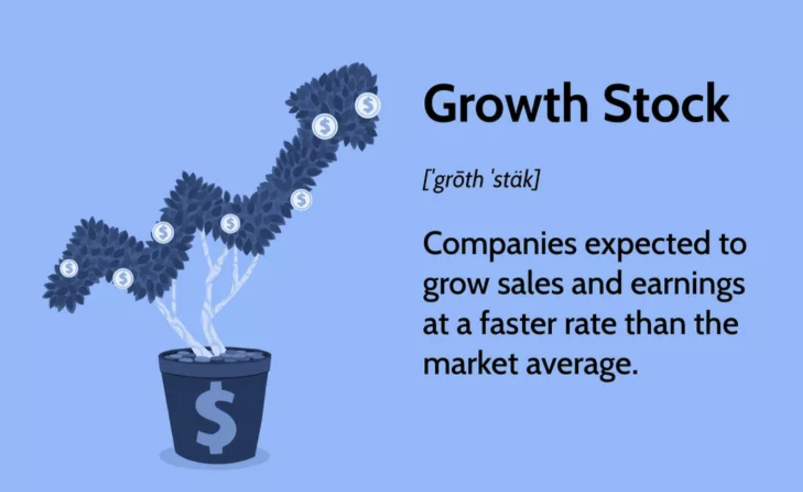

## Table of Contents

## What are growth stocks?

Growth stocks are shares in companies that are expected to grow at a faster rate compared to other companies in the market. These companies usually reinvest their earnings back into the business to fuel expansion, new projects, or research and development, instead of paying dividends to shareholders. Because of their potential for rapid growth, investors are often willing to pay more for these stocks, which can lead to higher stock prices.

However, growth stocks can be riskier than other types of investments. Since these companies are often in their early stages or in fast-changing industries, there's a chance they might not meet their growth expectations. If a growth stock fails to deliver the anticipated results, its price can drop significantly. Despite this risk, many investors are attracted to growth stocks because of the possibility of earning substantial returns if the company succeeds.

## How do growth stocks differ from value stocks?

Growth stocks and value stocks are two different ways to invest in the stock market. Growth stocks are from companies that are expected to grow a lot and quickly. These companies usually don't pay much in dividends because they use their money to grow even more. People buy growth stocks hoping that the company will do well and the stock price will go up a lot. But, these stocks can be risky because if the company doesn't grow as expected, the stock price can fall a lot.

Value stocks, on the other hand, are from companies that are seen as good deals. These stocks are often cheaper than what they're really worth. People buy value stocks thinking that the company is undervalued and that the stock price will go up when others realize its true value. Value stocks usually come from more established companies and might pay dividends. They are considered less risky than [growth stocks](/wiki/growth-stocks), but they might not grow as fast.

In summary, growth stocks are about betting on fast growth and future potential, while value stocks are about finding bargains and waiting for the market to recognize their true value. Both types of stocks have their own risks and rewards, and investors choose based on their goals and how much risk they're willing to take.

## What are the key characteristics of growth stocks?

Growth stocks come from companies that are expected to grow a lot faster than other companies. These companies often use their money to expand their business, start new projects, or do more research and development instead of paying dividends to their shareholders. Because people think these companies will do really well in the future, they are often willing to pay more for the stocks. This can make the stock prices go up a lot.

However, growth stocks can be risky. Since these companies are usually in their early stages or in industries that change quickly, there's a chance they might not grow as much as people hope. If a growth stock doesn't meet its growth goals, its price can drop a lot. Even with this risk, many investors like growth stocks because they could make a lot of money if the company does well.

## What are some examples of well-known growth stocks?

Some well-known growth stocks are from companies like Tesla and Amazon. Tesla is a company that makes electric cars and has been growing fast because more people want to buy electric vehicles. Amazon started as an online bookstore but now sells almost everything and offers services like cloud computing. Both companies have seen their stock prices go up a lot over the years because people believe they will keep growing.

Another example is Netflix. It started by mailing DVDs to people but now streams movies and TV shows all over the world. Netflix has been adding more subscribers every year, which has helped its stock price grow. These companies are seen as growth stocks because they are expected to keep getting bigger and making more money in the future.

## How can investors identify potential growth stocks?

Investors can find potential growth stocks by looking at a few key things. First, they should check if the company is growing its sales and earnings quickly. Companies that are increasing their revenue and profits a lot each year are often good candidates for growth stocks. Another thing to look at is the company's plans for the future. If a company is investing a lot in new projects, research, or expanding into new markets, it might be a growth stock. Investors can also look at what industry the company is in. Industries that are growing fast, like technology or healthcare, often have more growth stocks.

Another way to spot growth stocks is by looking at what other investors and analysts are saying. If many people are excited about a company's future and think it will do well, that can be a sign of a growth stock. Also, investors can use financial ratios like the price-to-earnings (P/E) ratio. Growth stocks often have higher P/E ratios because people are willing to pay more for the stock due to the company's future potential. By combining these different ways of looking at a company, investors can find stocks that have a good chance of growing a lot in the future.

## What are the risks associated with investing in growth stocks?

Investing in growth stocks can be risky. One big risk is that the company might not grow as much as people expect. If a company doesn't meet its growth goals, its stock price can drop a lot. This can happen because the company is in a fast-changing industry, or because it's still in its early stages and hasn't proven it can keep growing. If the stock price falls, investors can lose money.

Another risk is that growth stocks often have high valuations. This means that people are paying a lot for the stock because they believe in the company's future. But if the company doesn't live up to these high expectations, the stock price can go down quickly. Also, growth stocks usually don't pay dividends, so investors aren't getting any regular income from their investment. They're betting on the stock price going up, which can be a risky strategy.

## How do growth stocks perform during different economic cycles?

Growth stocks often do well during times when the economy is growing. When people feel good about the economy, they are more willing to take risks and invest in companies that are expected to grow a lot. This can push the prices of growth stocks up. During these good times, growth companies can also find it easier to get money to invest in new projects or expand their business, which can help them keep growing.

However, growth stocks can struggle during economic downturns. When the economy is not doing well, people are more cautious and less likely to invest in risky stocks. They might prefer safer investments like bonds or value stocks. During bad economic times, it can also be harder for growth companies to get the money they need to keep growing. If a growth company can't meet its growth goals during a downturn, its stock price can fall a lot.

## What role do growth stocks play in a diversified investment portfolio?

Growth stocks can be an important part of a diversified investment portfolio. They are stocks from companies that are expected to grow a lot and quickly. By including growth stocks in a portfolio, an investor can have the chance to make more money if these companies do well. This can help balance out other investments that might not grow as fast but are more stable. So, growth stocks can add excitement and potential for big gains to a portfolio.

However, growth stocks also come with more risk. They can be from companies that are still new or in industries that change a lot. If these companies don't grow as expected, their stock prices can drop a lot. This is why it's important to not put all your money into growth stocks. By having a mix of different types of investments, like value stocks, bonds, and maybe some cash, an investor can protect themselves from big losses while still having the chance to benefit from the growth of these exciting companies.

## How should one evaluate the financial health of a growth stock?

To evaluate the financial health of a growth stock, start by looking at the company's revenue and earnings. You want to see if the company is growing its sales and profits a lot each year. This shows that the company is doing well and has a good chance of keeping up its growth. Also, check the company's debt. Too much debt can be a problem because it means the company has to pay back a lot of money, which can slow down its growth. 

Another important thing to look at is the company's cash flow. Good cash flow means the company has enough money to invest in new projects or expand its business. You can also look at the company's price-to-earnings (P/E) ratio. Growth stocks often have high P/E ratios because people are willing to pay more for them, hoping the company will do well in the future. But if the P/E ratio is too high, it might mean the stock is overvalued and could be risky. By looking at these things, you can get a better idea of whether a growth stock is a good investment.

## What are advanced valuation metrics used for assessing growth stocks?

When looking at growth stocks, investors often use advanced valuation metrics to get a better idea of how much the stock is worth. One common metric is the Price/Earnings to Growth (PEG) ratio. The PEG ratio takes the P/E ratio and divides it by the company's expected earnings growth rate. This helps investors see if a stock is a good value considering its growth. A lower PEG ratio might mean the stock is undervalued for its growth potential, while a higher PEG ratio could mean it's overvalued.

Another useful metric is the Price/Sales (P/S) ratio. This ratio compares the company's stock price to its revenue per share. It's helpful for growth stocks because these companies might not be making big profits yet, but they are growing their sales a lot. A lower P/S ratio can suggest that the stock is a good deal compared to its sales growth. Investors also look at the Discounted Cash Flow (DCF) model, which tries to figure out what a company is worth by looking at its future cash flows and bringing them back to today's value. This can be complex, but it gives a detailed view of a growth stock's potential value.

## How do macroeconomic factors influence the performance of growth stocks?

Macroeconomic factors can have a big impact on how well growth stocks do. When the economy is doing well and growing, people feel more confident and are more likely to invest in growth stocks. They believe that these companies will keep growing and make more money in the future. During these good times, growth companies can also find it easier to get money to invest in new projects or expand their business, which helps them keep growing. Low interest rates can also help because it's cheaper for companies to borrow money, and investors might be more willing to take risks.

On the other hand, when the economy is not doing well, growth stocks can struggle. During bad economic times, people are more cautious and less likely to invest in risky stocks. They might prefer safer investments like bonds or value stocks. It can also be harder for growth companies to get the money they need to keep growing. If a growth company can't meet its growth goals during a downturn, its stock price can fall a lot. So, the performance of growth stocks is closely tied to what's happening in the broader economy.

## What strategies can be employed to manage a portfolio heavily weighted in growth stocks?

Managing a portfolio that has a lot of growth stocks means you need to keep an eye on things and be ready to make changes. Growth stocks can be exciting because they have a chance to grow a lot, but they can also be risky. To manage this risk, you should regularly check how your stocks are doing. If a stock is not growing as expected or if the company is having problems, you might want to sell some of it and put the money into other stocks or investments that are doing better. Another good idea is to use stop-loss orders. These are orders that automatically sell your stock if it falls to a certain price, which can help you avoid big losses.

Another strategy is to make sure your portfolio is not too focused on just growth stocks. Even though you like growth stocks, it's smart to have some other types of investments too. You could add some value stocks, which are often more stable, or some bonds, which give you regular income and are less risky. This mix can help balance out the ups and downs of growth stocks. By spreading your money around, you can protect yourself from big losses if the growth stocks don't do well. It's all about finding the right balance so you can still have a chance at big gains without too much risk.

## What are the strategies for algo trading growth stocks?

Algorithmic trading offers a variety of strategies suitable for growth stocks, which are known for their rapid price movements and high [volatility](/wiki/volatility-trading-strategies). Two of the most effective strategies are [momentum](/wiki/momentum) strategies and mean reversion strategies, each providing unique opportunities to capture profits from the dynamic nature of growth stocks.

**Momentum Strategies:**

Momentum strategies are based on the principle that stocks which have performed well in the past are likely to continue performing well in the near future. This is particularly relevant for growth stocks, which often exhibit strong price trends due to news, earnings reports, or shifts in market sentiment. Algorithms can capitalize on these trends by utilizing historical data to identify when a stock's momentum is likely to continue.

A common momentum strategy involves calculating the rate of change (ROC) of a stock's price:

$$
\text{ROC} = \left( \frac{\text{Current Price} - \text{Price Ten Days Ago}}{\text{Price Ten Days Ago}} \right) \times 100
$$

Traders set thresholds to decide when to enter or [exit](/wiki/exit-strategy) trades. Algorithms can automate this process, quickly analyzing large datasets to pinpoint the best entry and exit points. Moreover, [machine learning](/wiki/machine-learning) models can enhance these strategies by predicting momentum continuation or reversal.

**Mean Reversion Strategies:**

Mean reversion strategies operate on the assumption that high-flying growth stocks will eventually return to their average price levels after experiencing significant deviations. This strategy is ideal for growth stocks that might experience substantial price corrections following sharp increases or decreases.

One approach to executing mean reversion is to use the Bollinger Bands, which indicate market overbought or oversold conditions:

- Upper Band = SMA(T) + (Standard Deviation × 2)
- Lower Band = SMA(T) - (Standard Deviation × 2)

If a stock's price crosses the upper band, a sell signal triggers, anticipating a shift back towards the average. Conversely, crossing the lower band generates a buy signal. Algorithms equipped with these rules can execute trades swiftly, outperforming manual trading by reacting promptly to market changes.

By employing these strategies, algorithmic traders can effectively navigate the unpredictable nature of growth stocks, capturing profits from both ongoing trends and reversals. Ultimately, the success of these strategies lies in their thorough [backtesting](/wiki/backtesting) and the ability of the algorithms to adapt to changing market conditions.

## References & Further Reading

[1]: Bergstra, J., Bardenet, R., Bengio, Y., & Kégl, B. (2011). ["Algorithms for Hyper-Parameter Optimization."](https://papers.nips.cc/paper_files/paper/2011/hash/86e8f7ab32cfd12577bc2619bc635690-Abstract.html) Advances in Neural Information Processing Systems 24.

[2]: ["Advances in Financial Machine Learning"](https://www.amazon.com/Advances-Financial-Machine-Learning-Marcos/dp/1119482089) by Marcos Lopez de Prado

[3]: ["Evidence-Based Technical Analysis: Applying the Scientific Method and Statistical Inference to Trading Signals"](https://www.wiley.com/en-gb/Evidence+Based+Technical+Analysis:+Applying+the+Scientific+Method+and+Statistical+Inference+to+Trading+Signals-p-9780470008744) by David Aronson

[4]: ["Machine Learning for Algorithmic Trading"](https://www.amazon.com/Machine-Learning-Algorithmic-Trading-intelligence/dp/9918608013) by Stefan Jansen

[5]: ["Quantitative Trading: How to Build Your Own Algorithmic Trading Business"](https://www.amazon.com/Quantitative-Trading-Build-Algorithmic-Business/dp/0470284889) by Ernest P. Chan