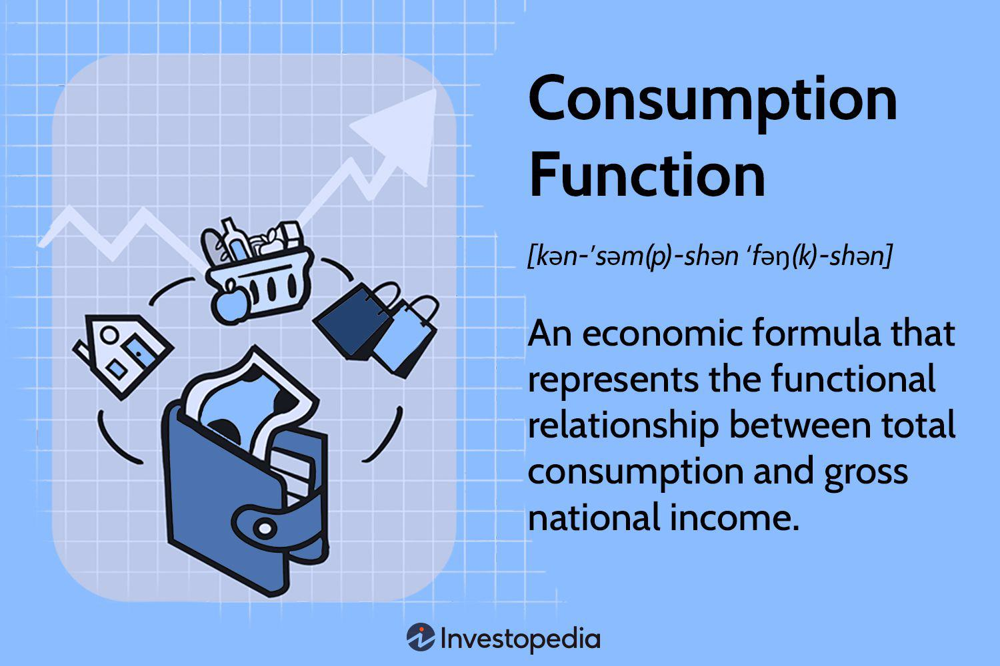

Algorithmic trading has become an indispensable aspect of modern financial markets, revolutionizing the way trades are executed. One notable feature enhancing this landscape is the Good 'Til Extended Market (GTEM) order, which offers traders remarkable flexibility. GTEM orders allow market participants to engage in trading beyond the traditional confines of regular trading hours, encompassing both pre-market and after-hours sessions. This flexibility is critical in a domain where seconds can greatly influence trading outcomes.

This article provides a thorough examination of GTEM orders within algorithmic trading. We will explore the operational mechanisms of GTEM orders, highlighting their potential advantages, such as increased market access and the ability to respond to after-hours events. It's important to also consider the drawbacks, such as increased volatility and reduced liquidity, which could pose challenges in execution. Furthermore, the impact of GTEM orders on trading strategies will be analyzed to understand their transformative role in crafting more nuanced and adaptive trading approaches.



In fast-paced trading environments, where rapid decision-making and execution are paramount, understanding the nuances of GTEM orders is crucial. These orders not only provide traders with enhanced opportunities for optimizing their strategies but also necessitate a careful evaluation of risk management techniques to mitigate any adverse effects arising from extended market volatility. As we embark on this exploration, the goal is to equip traders with the necessary insights to effectively integrate GTEM orders into their algorithmic trading toolkit, maximizing their potential for success in the dynamic financial markets.

## Table of Contents

## Understanding GTEM Orders

GTEM stands for 'Good 'Til Extended Market,' and represents a specific type of duration order that remains active during both pre-market and after-hours trading sessions. This functionality enables traders to execute buy or sell actions throughout the entire trading day, beyond the constraints of regular trading hours which typically operate from 9:30 AM to 4:00 PM Eastern Time for U.S. markets.

The primary advantage of GTEM orders lies in their ability to enhance the standard 'day order' by allowing trading activities outside normal market hours. Day orders expire at the end of the regular trading session, making them unsuitable for capitalizing on price movements that occur due to events taking place before the market opens or after it closes. GTEM orders address this limitation by staying active, thus offering traders greater flexibility in reacting to these movements.

In practice, traders typically use GTEM orders in conjunction with pricing constraints such as stops or limits. This is crucial given the market characteristics during extended hours. Price volatility tends to be higher, and liquidity is often lower outside regular trading hours. Stops and limits help mitigate risks associated with these conditions by automatically executing trades only when specified price criteria are met. For instance, a limit order could prevent a buy order from executing above a certain price, safeguarding the trader from potentially overpaying during volatile periods.

By accommodating trading in extended market sessions, GTEM orders enable a more continuous market perspective, allowing traders to manage risk and capitalize on opportunities that may arise from post-close earnings reports or pre-open economic announcements. This capability is valuable in a global financial landscape where news impacts markets around the clock.

## Advantages of GTEM Orders in Algorithmic Trading

GTEM (Good 'Til Extended Market) orders offer distinct advantages in [algorithmic trading](/wiki/algorithmic-trading) by permitting activity beyond standard market hours. This increased trading window allows traders to respond dynamically to market developments occurring outside regular trading sessions. For instance, notable earnings reports or significant economic releases often take place before or after regular market hours, leading to substantial price movements. By incorporating GTEM orders, traders can promptly react to these fluctuations, potentially leading to enhanced profitability.

The flexibility provided by GTEM orders enables algorithmic traders to optimize their trading strategies. Algorithms can monitor and act on extended trading sessions, allowing for better alignment with market events and ensuring more timely execution of trades. This expanded capability is particularly beneficial in scenarios where news releases trigger significant price [volatility](/wiki/volatility-trading-strategies), as algorithmic systems can swiftly adjust positions based on real-time data.

A key aspect of taking advantage of GTEM orders is the ability to capture a wider range of price movements throughout an extended trading day. By harnessing this flexibility, algorithmic strategies can be tailored to capitalize on short-term price inefficiencies. For example, algorithms can employ statistical [arbitrage](/wiki/arbitrage) techniques to identify and exploit price discrepancies that are more likely to occur outside regular trading hours due to less [liquidity](/wiki/liquidity-risk-premium) and market participants.

In Python, implementing algorithmic strategies that leverage GTEM orders might involve incorporating libraries such as `pandas` for data manipulation and `numpy` for numerical operations, ensuring efficient processing of real-time market data. Below is a simple code snippet demonstrating how a trader might set up an algorithm to monitor after-hours trading data:

```python
import pandas as pd
import numpy as np

# Load market data (this would typically be streamed in real-time)
market_data = pd.DataFrame({
    "timestamp": ["2023-10-28 16:00", "2023-10-28 16:01", "2023-10-28 16:02"],
    "price": [150.2, 150.5, 149.8]
})

# Example strategy: identify significant price changes indicating a trading opportunity
def identify_opportunities(data):
    data['pct_change'] = data['price'].pct_change()
    opportunities = data[data['pct_change'].abs() > 0.01]  # Identify changes > 1%
    return opportunities

# Call the function on market data
trading_opportunities = identify_opportunities(market_data)
print(trading_opportunities)
```

This code highlights how traders can set up automated systems to track and react to market movements during extended hours, underscoring the practicality of GTEM orders in capturing trading opportunities arising from after-hours market activity.

## Challenges and Risks Associated with GTEM Orders

GTEM orders, while offering traders increased flexibility, present several challenges and risks, particularly prevalent during periods of low liquidity like after-hours trading. The extended market hours can experience a significant reduction in the number of market participants, leading to lower liquidity. This lack of liquidity can amplify price volatility, posing a risk of unfavorable execution of trades. In such market conditions, bid-ask spreads tend to widen, making transactions potentially more expensive for traders.

Price volatility remains a critical concern when dealing with GTEM orders. The after-hours trading environment is more susceptible to abrupt price swings due to the reduced number of active traders and the lesser [volume](/wiki/volume-trading-strategy) of trades. These conditions can result in prices moving significantly between the time an order is placed and when it is executed. The exposure to drastic price changes can lead to orders being filled at prices substantially different from the expected or targeted ones, thereby impacting the profitability of trades.

To mitigate these challenges, algorithmic trading systems must integrate sophisticated risk management strategies. This includes setting appropriate price limits and stops to manage the risks associated with volatility effectively. Additionally, algorithms should be designed to account for the typical characteristics of extended market sessions, employing techniques such as volatility forecasting to predict and adapt to potential market movements.

Here's an example of how a simple Python algorithm might incorporate risk management for GTEM orders:

```python
import numpy as np

def manage_risk(price_data, volatility_threshold):
    """
    Manage risk by determining if a GTEM order should be executed based on price volatility.

    :param price_data: A numpy array of historical price data.
    :param volatility_threshold: A float representing the volatility threshold.
    :return: A boolean indicating whether the GTEM order should be executed.
    """
    volatility = np.std(price_data) / np.mean(price_data)
    if volatility < volatility_threshold:
        return True
    else:
        return False

# Example usage
historical_prices = np.array([100, 102, 101, 105, 107])
should_execute_order = manage_risk(historical_prices, 0.05)
```

In this example, the `manage_risk` function calculates the volatility of historical price data and compares it against a predefined threshold to decide whether to proceed with a GTEM order. By doing so, traders can better navigate the risks associated with extended trading hours and mitigate the impact of high volatility on trade executions. Ensuring these strategies are continually refined and updated is essential for sustaining effective risk management over time.

## Impact on Trading Strategies

Incorporating Good 'Til Extended Market (GTEM) orders into trading strategies allows traders to conduct more comprehensive market analyses and devise sophisticated execution tactics. GTEM orders enable algorithmic traders to consider market activity that spans beyond the confines of regular trading sessions, potentially improving execution efficiency. By accessing both pre-market and after-hours trading, traders can exploit the extended trading windows to gain significant insights into market dynamics.

Algorithmic trading systems can leverage GTEM orders to incorporate a range of data inputs and trading signals that occur outside the traditional trading hours. For example, significant market-moving events such as earnings reports, economic data releases, or geopolitical developments may take place after the market closes. GTEM orders facilitate the capture of price movements in response to these events, allowing algorithms to react quickly and optimize trade execution.

Moreover, the ability to trade based on information released outside regular hours can provide a substantial competitive advantage. In a market where timing and speed are critical, accessing off-hours information can lead to more informed decision-making. This capability requires algorithmic strategies to be meticulously designed with risk management protocols to handle potential volatility and liquidity constraints in the extended sessions.

For traders and firms operating in algorithmic trading, GTEM orders offer a framework to refine their strategies, ultimately leading to improved performance metrics such as fill rates and slippage reduction. The enhanced market visibility provided by prolonged trading sessions ensures that algorithmic models can be calibrated to react to a broader set of market signals, thus aligning trading tactics with evolving market conditions.

Incorporating Python for algorithmic strategy development can further optimize the use of GTEM orders. By utilizing libraries such as pandas for data manipulation and scikit-learn for [machine learning](/wiki/machine-learning), traders can design and test models that incorporate extended market data efficiently. This integration facilitates the development of robust trading algorithms capable of executing trades with precision across varying market conditions.

In summary, GTEM orders enable a shift toward more strategic and agile trading approaches, allowing algorithmic traders to enhance their market response capabilities and gain a competitive edge through extended trading opportunities.

## Conclusion

GTEM orders significantly enhance the capabilities of algorithmic trading by extending market access beyond regular trading hours. This increased flexibility enables traders to respond to international market movements, news releases, and economic indicators that occur when traditional markets are closed. However, traders must carefully consider the associated risks, such as increased price volatility and reduced liquidity. These factors can lead to unfavorable trade executions if not managed properly.

Advancements in technology and trading algorithms continue to refine the application of GTEM orders, making them more sophisticated and resilient. Enhanced data analytics, machine learning, and [artificial intelligence](/wiki/ai-artificial-intelligence) tools are instrumental in optimizing the execution of these orders, allowing for better risk assessments and decision-making processes. For example, traders can develop algorithms that dynamically adjust order parameters based on real-time market conditions—thereby minimizing potential drawbacks associated with liquidity and volatility.

To fully leverage the benefits of GTEM orders, a comprehensive understanding of these tools is essential. By analyzing historical data, traders can predict potential price movements and strategically time their trades to gain a competitive advantage. Moreover, the ability to trade on information released during extended hours can offer an edge over those relying solely on regular market sessions.

In summary, GTEM orders provide a valuable opportunity for traders seeking to expand their market strategies in today's rapidly changing financial landscape. To effectively capitalize on this, traders should balance the flexibility of broader market access with the necessary precautions against heightened volatility and liquidity challenges. With ongoing technological advancements, the use of GTEM orders is poised to become increasingly integral to successful algorithmic trading practices.

## References & Further Reading

[1]: Aldridge, I. (2013). ["High-Frequency Trading: A Practical Guide to Algorithmic Strategies and Trading Systems"](https://www.amazon.com/High-Frequency-Trading-Practical-Algorithmic-Strategies/dp/1118343506). Wiley.

[2]: Narang, R. K. (2013). ["Inside the Black Box: A Simple Guide to Quantitative and High Frequency Trading"](https://onlinelibrary.wiley.com/doi/book/10.1002/9781118662717). Wiley.

[3]: Lopez de Prado, M. (2018). ["Advances in Financial Machine Learning"](https://www.amazon.com/Advances-Financial-Machine-Learning-Marcos/dp/1119482089). Wiley.

[4]: Chan, E. P. (2008). ["Quantitative Trading: How to Build Your Own Algorithmic Trading Business"](https://github.com/egorpe/EPChan-QuantitativeTrading/blob/master/example7_6.m). Wiley.

[5]: Zhang, R., Russell, E., & Bobillot, J. (2020). ["Financial Markets Volatility and Performance Analysis"](https://www.researchgate.net/publication/343215813_COVID-19_and_the_United_States_financial_markets'_volatility). Springer.

[6]: Aronson, D. (2007). ["Evidence-Based Technical Analysis: Applying the Scientific Method and Statistical Inference to Trading Signals"](https://www.amazon.com/Evidence-Based-Technical-Analysis-Scientific-Statistical/dp/0470008741). Wiley.