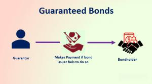

The world of finance and investment is characterized by constant change, with bonds serving as a fundamental component in managing risk and optimizing returns within investment portfolios. Traditionally seen as a conservative investment vehicle, bonds offer stability and income, providing a counterbalance to the volatility seen in equities. In this article, we delve into several topics central to the modern bond market, aiming to provide both novice and seasoned investors with actionable insights.

A primary focus is the concept of guaranteed bonds—an intriguing facet of the fixed income market. These bonds are debt securities bolstered by a third-party guarantee, ensuring the fulfillment of principal and interest obligations should the issuer default. Popular among those seeking low-risk investments, guaranteed bonds offer enhanced security by involving financial institutions or governmental bodies in their backing. This security enables even issuers with less-than-stellar credit ratings to access capital markets under more advantageous terms than would otherwise be possible.



Financial security is another cornerstone of our discussion, highlighting how bonds—particularly guaranteed ones—serve as essential elements in a well-diversified portfolio. Bonds provide a steady stream of income through periodic interest payments, thereby serving as a financial buffer during economic downturns. This aspect makes them invaluable for investors aiming for long-term financial stability and a balanced risk-to-reward ratio.

Moreover, the evolution brought forth by algorithmic trading in the bond market cannot be understated. By automating trade processes and optimizing execution timing and pricing, algorithmic trading has drastically altered how bonds are traded. This technology mitigates human error, accelerates transaction execution, and captures fleeting investment opportunities more efficiently than traditional methods.

Understanding these elements—guaranteed bonds, their role in financial security, and the revolutionary impact of algorithmic trading—provides investors with a toolkit to approach bond investments strategically and with foresight. By the end of this article, readers will have gained a nuanced perspective of these investment strategies and technologies, equipping them to navigate and capitalize on the evolving landscape of the bond market effectively.

## Table of Contents

## Understanding Guaranteed Bonds

A guaranteed bond is a class of debt security that provides additional assurances to investors through a guarantee on the principal and interest payments, offered by a third party. This feature serves as a significant factor in mitigating the risk of default typically associated with bond investments. Issuers often rely on entities such as financial institutions or government bodies to back these bonds, making them an attractive option for risk-averse investors.

Guaranteed bonds present several advantages due to their framework. Primarily, the guarantee acts as a safety net, ensuring that investors receive their due payments even if the issuer encounters financial difficulties. This makes guaranteed bonds particularly appealing during periods of economic uncertainty when the likelihood of issuer defaults may be higher.

Moreover, the guarantee provided by a reputable entity can empower issuers with suboptimal credit ratings to access capital market funding. By mitigating perceived risks, these issuers may obtain capital at costs that would otherwise be prohibitive. This is because investors, reassured by the third-party guarantee, are typically willing to settle for lower yields compared to what might be demanded from non-guaranteed debt issued by a borrower with weak credit standing.

The structural advantages of guaranteed bonds are not without potential downsides. The risk reduction provided by the third-party guarantee usually comes at the expense of yield, resulting in lower interest rates compared to non-guaranteed counterparts. Investors must weigh the benefit of reduced risk against the opportunity cost of potentially lower returns.

Overall, guaranteed bonds play a pivotal role in investment strategies aiming to balance risk and return, especially for investors inclined towards safeguarding principal investments. The unique structure of these bonds facilitates broader market entry for issuers while offering peace of mind and income stability to investors. However, the trade-off between enhanced security and subdued yield must be carefully considered in portfolio construction.

## Why Invest in Bonds for Financial Security?

Bonds play a pivotal role in achieving financial security within diversified investment portfolios. Their significance is underscored by their ability to provide stable income and assist in capital preservation, making them an attractive option for risk-averse investors. Bonds mitigate the [volatility](/wiki/volatility-trading-strategies) typically associated with equities by offering a predictable stream of interest payments, also known as bond yields. These payments contribute towards a steady cash flow, enhancing the portfolio's overall stability.

Investors seeking reliable financial cushions during economic downturns often turn to bonds, particularly guaranteed bonds. These instruments protect portfolios from market turbulence by ensuring capital preservation and consistent income. Guaranteed bonds, backed by third parties, provide an additional layer of security, fortifying them against issuer defaults and maintaining investor confidence.

Incorporating bonds into long-term investment strategies can facilitate the achievement of financial goals by balancing risk and reward. The fixed-income nature of bonds ensures that a portion of the portfolio consistently grows, minimizing exposure to market fluctuations. By aligning the bond portfolio's duration with investment timelines, investors can effectively plan for future financial obligations or retirement needs.

Bonds also act as a hedge against inflation when carefully selected and diversified. By choosing bonds with yields that outpace inflation rates, investors can preserve the real value of their investments. Moreover, the gradual growth in bond value, coupled with interest payments, can offset reductions in purchasing power due to inflation.

Overall, bonds are a crucial element in portfolios aimed at achieving financial security. Their ability to provide steady income, preserve capital, and balance against equity volatility is invaluable for investors pursuing both stability and growth.

## The Intersection of Algorithmic Trading and Bond Investment

Algorithmic trading has significantly reshaped the bond market, primarily by automating trades and refining the timing and pricing of executions. This approach utilizes mathematical models and computer algorithms to perform high-speed trading, which enhances efficiency and minimizes human errors. Consequently, transaction speed has become an essential [factor](/wiki/factor-investing) in seizing trading opportunities, especially in a competitive bond market that often sees rapid price fluctuations.

At its core, [algorithmic trading](/wiki/algorithmic-trading) involves using algorithms to analyze market data, identify trading opportunities, and execute orders automatically. A typical algorithm might monitor various financial indicators and execute trades when specific market conditions are met, thereby reducing reliance on human discretion. This form of trading is particularly beneficial for managing large bond portfolios, enabling investors to execute numerous small trades across multiple markets and securities, thus diversifying risk more effectively.

Despite these advantages, algorithmic trading introduces certain challenges, such as contributing to increased market volatility. The presence of numerous high-frequency traders can amplify price swings, as algorithms react instantaneously to market events. Moreover, technical issues or poorly designed algorithms can lead to significant market disruptions. Therefore, it is crucial for investors to implement robust risk management systems and ensure compliance with regulatory standards to mitigate these risks.

Practical applications of algorithmic trading in bond investment strategies can be illustrated through various case studies. For instance, some investment firms employ [machine learning](/wiki/machine-learning) techniques to refine their trading algorithms continuously. These algorithms learn from historical data to predict bond price movements more accurately, optimizing trading strategies over time. Such a system improves the precision of exposure and hedges against unfavorable market conditions, thereby enhancing overall portfolio performance.

Real-life examples, such as the "flash crash" events of the past decade, highlight both the capabilities and dangers of algorithmic trading. During these instances, algorithms rapidly exacerbated market crashes due to their speed and reaction-based nature. However, these events also prompted advancements in algorithmic design and infrastructure resilience, ultimately leading to more sophisticated and stable trading systems.

In conclusion, the intersection of algorithmic trading and bond investment offers significant potential for investors looking to optimize their portfolios. By understanding the mechanics and implications of algorithmic trading, investors can better navigate this dynamic landscape, exploiting opportunities while mitigating inherent risks. Continuous adaptation and technological enhancement remain pivotal strategies for capitalizing on the benefits while managing the complexities introduced by algorithmic trading.

## Overcoming Challenges and Seizing Opportunities

While algorithmic trading provides significant advantages in bond investments, such as increased efficiency and enhanced execution accuracy, it also introduces several challenges that investors must address. One of the primary concerns is the possibility of technical failures, which can result in substantial financial losses or missed trading opportunities. Technical failures include hardware malfunctions, software bugs, and connectivity issues. To mitigate these risks, investors should implement robust trading systems that comprise redundant architectures, thorough testing, and rapid failover mechanisms.

Market disruptions present another challenge in algorithmic trading. These disruptions can stem from erroneous trades, sudden market shifts, or even cyber attacks. Ensuring compliance with regulatory frameworks is crucial to minimize these risks. Regulations often mandate safeguards and testing to prevent scenarios like the 2010 Flash Crash, where automated trades exacerbated rapid market declines. Regular audits and updates of trading algorithms and systems can help maintain compliance and reinforce stability.

The continuous advancement of Artificial Intelligence (AI) and Machine Learning (ML) further enhances the capabilities of algorithmic trading. These technologies can analyze extensive datasets to recognize patterns and predict market movements more accurately than traditional trading algorithms. For example, algorithms can process news articles, social media sentiment, and historical price data to assess market sentiment and adjust trading strategies accordingly. This shift enables more informed decision-making and precise execution timing.

Consider the following basic Python code snippet for incorporating AI in trading strategies:

```python
import numpy as np
from sklearn.ensemble import RandomForestRegressor

# Sample data preparation
X_train = np.array([[feature_1, feature_2] for feature_1, feature_2 in market_data])
y_train = np.array([target for target in price_movements])

# Initialize and train the model
model = RandomForestRegressor(n_estimators=100)
model.fit(X_train, y_train)

# Predict future price movements based on new data
X_new = np.array([[new_feature_1, new_feature_2]])
predicted_movement = model.predict(X_new)
```

This example utilizes a Random Forest Regressor to forecast price movements based on historical features. Incorporating more complex models and larger datasets can elevate the precision of predictions significantly.

To seize opportunities in the bond market through algorithmic trading, investors must stay ahead of technological advancements and regulatory changes. They should invest in continuous learning through courses, seminars, and industry events. As the financial landscape evolves, maintaining a dynamic approach allows investors to harness algorithmic trading's full potential, optimizing portfolio returns while managing associated risks.

## Conclusion

The fusion of guaranteed bonds and algorithmic trading offers a promising avenue for securing financial stability and optimizing investment returns. By combining the stability of guaranteed bonds with the precision and efficiency of algorithmic trading, investors have a unique opportunity to enhance their portfolios. Guaranteed bonds, backed by a third party, provide an added layer of security, reducing the risk of default and ensuring reliable cash flows. Meanwhile, algorithmic trading introduces automation that enhances trading efficiencies and helps in accessing favorable market conditions dynamically.

Understanding and strategically implementing these tools can help investors effectively navigate the evolving financial landscape. The integration of these strategies allows for better risk management and the potential for improved returns. By incorporating automated trading algorithms, investors can not only handle larger volumes but also respond swiftly to market changes, thereby capturing timely opportunities that would be difficult to manage manually. This fusion of stability and technology empowers investors with a robust framework to manage their assets effectively.

Continuous learning and adaptation to market innovations will be key in maximizing the benefits of bond investments in the future. As technological advancements are relentless, keeping abreast of new developments in algorithmic trading is crucial. This includes understanding improvements in AI and machine learning that could enhance algorithm performance. Staying informed about changes in financial regulations is also vital to ensure compliance and protect investments.

Informed decision-making will ensure that portfolios remain resilient and profitable amidst changing economic conditions. Investors should engage in meticulous research and analysis to understand both current trends and emerging technologies. Leveraging data-driven insights, such as predictive analytics, can further bolster decision-making processes. In doing so, investors will be well-equipped to maintain portfolio stability and optimize returns, securing their financial future in a fluctuating market. 

This combination of guaranteed bonds and cutting-edge trading practices stands as a testament to the evolving strategies in modern finance, underscoring the importance of innovation and strategic foresight in sustaining long-term investment success.

## References & Further Reading

[1]: Plantin, G., & Rochet, J. C. (2008). ["When Insurers Go Bust: An Economic Analysis of the Role and Design of Prudential Regulation."](https://press.princeton.edu/books/hardcover/9780691129358/when-insurers-go-bust) Princeton University Press.

[2]: Fabozzi, F. J. (2019). ["Bond Markets, Analysis, and Strategies"](https://books.google.com/books/about/Fabozzi_Bond_Markets_Analysis_and_Strate.html?id=9JupBwAAQBAJ) (10th Edition). Pearson.

[3]: Lopez de Prado, M. (2018). ["Advances in Financial Machine Learning"](https://www.amazon.com/Advances-Financial-Machine-Learning-Marcos/dp/1119482089) Wiley.

[4]: Durbin, M. (2010). ["All About High-Frequency Trading"](https://www.mhebooklibrary.com/doi/book/10.1036/9780071743457) McGraw-Hill.

[5]: Redecki, A. (2011). ["Algorithmic Trading: Winning Strategies and Their Rationale"](https://zoboko.com/book/k034jlpv/algorithmic-trading-winning-strategies-and-their-rationale) MIT Press.