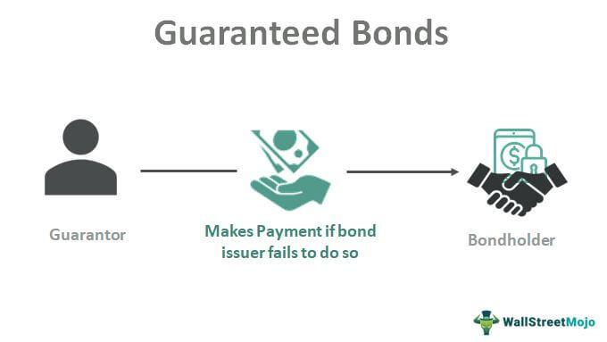

## Table of Contents

## What is a guaranteed bond?

A guaranteed bond is a type of bond where another party promises to pay back the bond if the original borrower cannot. This other party is called the guarantor. The guarantor can be a government, a bank, or another strong financial institution. Because of this promise, investors feel safer and are more likely to buy the bond. This makes it easier for the borrower to get money.

The main benefit of a guaranteed bond is that it lowers the risk for investors. If the borrower cannot pay back the bond, the guarantor will step in and make the payments. This means that even if the borrower has financial problems, the investor is still likely to get their money back. This makes guaranteed bonds very popular, especially in times when the economy is not doing well.

## Who issues guaranteed bonds?

Guaranteed bonds are issued by different kinds of organizations that need to borrow money. These can be companies, local governments, or even countries. They issue these bonds to raise money for big projects or to manage their finances. When they issue a guaranteed bond, they are promising to pay back the money they borrow, but they also have a guarantor who agrees to pay if they can't.

The guarantor is usually a strong and reliable organization, like a big bank or a government. For example, a small city might issue a bond to build a new school, and a state government might guarantee that bond. This makes investors feel safer because they know that even if the city runs into financial trouble, the state will step in and make sure they get their money back. This is why guaranteed bonds are popular; they offer a lower risk for investors.

## How does a guarantee enhance a bond's security?

A guarantee makes a bond safer for people who invest in it. When a bond is guaranteed, another strong organization, like a bank or a government, promises to pay back the money if the original borrower can't. This means that even if the company or city that issued the bond runs into money problems, the investor still has a good chance of getting their money back. This extra promise from the guarantor makes the bond less risky.

Because the bond is less risky, more people want to buy it. This can help the borrower get money more easily and at a lower cost. When investors feel safer, they are often willing to accept a lower [interest rate](/wiki/interest-rate-trading-strategies) on the bond. This is good for the borrower because they don't have to pay as much to borrow the money. So, a guarantee not only makes the bond safer for investors but also helps the borrower in the long run.

## What are the typical terms of a guarantee on a bond?

A guarantee on a bond usually has some key terms that both the borrower and the guarantor agree on. One important term is the duration of the guarantee, which is how long the guarantor agrees to be responsible if the borrower can't pay. This can be the entire time until the bond is paid off, or it might be for a shorter period. Another term is the conditions under which the guarantor will step in. This could be if the borrower misses a payment or goes bankrupt. The guarantee might also include any fees or costs that the guarantor can charge for providing the guarantee.

The guarantee also often includes limits on what the borrower can do. For example, the borrower might need to get the guarantor's approval before taking on more debt. There could also be rules about how the borrower uses the money they get from the bond. These terms help make sure that the borrower doesn't take on too much risk, which would make it harder for them to pay back the bond. By setting these terms clearly, the guarantor can help protect the investors' money and keep the bond safer.

## Can you explain the difference between a guaranteed bond and an uninsured bond?

A guaranteed bond is one where another organization, called a guarantor, promises to pay back the bond if the borrower can't. This makes the bond safer for people who invest in it. For example, if a small city issues a bond to build a new school, a state government might be the guarantor. If the city runs into money problems and can't pay back the bond, the state will step in and pay. This extra promise from the guarantor makes the bond less risky and more attractive to investors.

An uninsured bond, on the other hand, does not have this extra promise. If the borrower can't pay back the bond, the investor might lose their money. There's no other organization to step in and help. Because of this, uninsured bonds are riskier. Investors might demand a higher interest rate to make up for the extra risk. So, the main difference is that a guaranteed bond has an extra layer of safety, while an uninsured bond does not.

## What are the risks associated with investing in guaranteed bonds?

Even though guaranteed bonds are safer than uninsured bonds, they still have some risks. One risk is that the guarantor might not be able to pay if the borrower can't. If the guarantor is a big bank or a government, this is less likely, but it can still happen. For example, if a country's economy gets really bad, even the government might struggle to pay back the bond.

Another risk is that the bond might lose value if interest rates go up. When interest rates rise, new bonds will pay more, so people might want to sell their old bonds to buy the new ones. This can make the price of the old bonds go down. Even if the bond is guaranteed, the investor could lose money if they need to sell the bond before it matures.

## How do guaranteed bonds fit into a diversified investment portfolio?

Guaranteed bonds can be a good part of a diversified investment portfolio because they are safer than many other investments. When you have a mix of different types of investments, like stocks, bonds, and maybe some real estate, you spread out your risk. If one type of investment does badly, the others might do well and balance things out. Guaranteed bonds add to this safety because they have a guarantor who promises to pay back the money if the borrower can't. This makes them less risky than regular bonds, which can be a good thing if you want to keep your investments stable.

Including guaranteed bonds in your portfolio can also help you earn a steady income. These bonds usually pay interest regularly, which can be a good source of money while you wait for other investments, like stocks, to grow. By having some guaranteed bonds, you can feel more secure knowing that part of your money is in a safer place. This can be especially helpful if you are close to retirement or if you just want to make sure you have some money coming in no matter what happens in the stock market.

## What is the process for a bondholder to claim under the guarantee?

When a bondholder wants to claim under the guarantee, they first need to check if the borrower has missed a payment or gone bankrupt. If that happens, the bondholder should look at the bond's terms to see what they need to do next. Usually, they need to tell the guarantor about the problem and ask for the money they are owed. They might need to fill out a form or send a letter to start the claim process.

After the bondholder tells the guarantor about the problem, the guarantor will check to see if the claim is valid. If everything is correct, the guarantor will pay the bondholder the money they are owed. This might take some time, but the guarantor is supposed to help make sure the bondholder gets their money back. It's important for the bondholder to keep good records and follow the steps in the bond's terms to make the claim process go smoothly.

## How do credit ratings affect guaranteed bonds?

Credit ratings play a big role in how safe people think guaranteed bonds are. When a bond has a high credit rating, it means that the people who rate bonds think the borrower and the guarantor are very likely to pay back the money. This makes the bond more attractive to investors because they feel safer. If the bond has a low credit rating, it means there's a higher chance that the borrower or the guarantor might have trouble paying back the money. This makes the bond less attractive and can make it harder for the borrower to sell the bond.

Even though a guaranteed bond has a guarantor, the bond's credit rating still matters a lot. If the guarantor's credit rating goes down, it can make the bond less safe. This is because the guarantor might not be as strong as before. Investors keep an eye on these ratings to decide if they want to buy or keep the bond. So, a good credit rating for both the borrower and the guarantor can make the bond more popular and easier to sell.

## What are the legal implications of a bond guarantee?

A bond guarantee means that another group, like a bank or government, agrees to pay back the bond if the original borrower can't. This promise is a big deal and comes with legal responsibilities. The guarantor has to follow the rules in the guarantee agreement. If the borrower misses payments or goes bankrupt, the guarantor must step in and pay the bondholders. If the guarantor doesn't do this, bondholders can take legal action against them to get their money back.

These legal responsibilities make the bond safer for investors. But, there are also rules about what the borrower can do. For example, they might need to get the guarantor's okay before borrowing more money. If the borrower breaks these rules, the guarantor might not have to pay if the bond goes bad. This keeps everyone honest and makes sure the bond stays as safe as possible.

## How do market conditions influence the yield of guaranteed bonds?

Market conditions can change the yield of guaranteed bonds. When the economy is doing well, people might feel safer about investing in other things like stocks. This can make them want less guaranteed bonds, so the yield might go down. But if the economy is not doing well, people might want more guaranteed bonds because they are safer. This can make the yield go up because the borrower has to offer more interest to get people to buy the bonds.

Interest rates also affect the yield of guaranteed bonds. If interest rates go up, new bonds will pay more, so the price of old bonds might go down. This makes the yield on the old bonds go up because the interest they pay stays the same, but the price you pay for the bond is lower. If interest rates go down, the opposite happens. The price of the old bonds might go up, making their yield go down. So, market conditions like the economy and interest rates can really change how much a guaranteed bond pays.

## What are some historical examples of guaranteed bond defaults and their outcomes?

One famous example of a guaranteed bond default happened in the 1930s during the Great Depression. Many cities and towns in the United States issued bonds to build things like schools and roads. Some of these bonds were guaranteed by state governments. But when the economy crashed, a lot of these places couldn't pay back their bonds. Even though the states were supposed to step in and pay, some states were also in big trouble and couldn't help. This led to a lot of bondholders losing money, and it made people very wary of buying bonds for a long time.

Another example is from the 1990s in Russia. The Russian government issued bonds called GKOs, which were guaranteed by the government itself. But in 1998, Russia's economy got really bad, and the government couldn't pay back these bonds. This was a big shock because people thought the government's guarantee made the bonds safe. A lot of investors, including banks and other countries, lost a lot of money. It took Russia many years to recover from this, and it made people around the world more careful about investing in bonds from countries with shaky economies.

## References & Further Reading

[1]: Plantin, G., & Rochet, J. C. (2008). ["When Insurers Go Bust: An Economic Analysis of the Role and Design of Prudential Regulation."](https://press.princeton.edu/books/hardcover/9780691129358/when-insurers-go-bust) Princeton University Press.

[2]: Fabozzi, F. J. (2019). ["Bond Markets, Analysis, and Strategies"](https://books.google.com/books/about/Fabozzi_Bond_Markets_Analysis_and_Strate.html?id=9JupBwAAQBAJ) (10th Edition). Pearson.

[3]: Lopez de Prado, M. (2018). ["Advances in Financial Machine Learning"](https://www.amazon.com/Advances-Financial-Machine-Learning-Marcos/dp/1119482089) Wiley.

[4]: Durbin, M. (2010). ["All About High-Frequency Trading"](https://www.mhebooklibrary.com/doi/book/10.1036/9780071743457) McGraw-Hill.

[5]: Redecki, A. (2011). ["Algorithmic Trading: Winning Strategies and Their Rationale"](https://zoboko.com/book/k034jlpv/algorithmic-trading-winning-strategies-and-their-rationale) MIT Press.