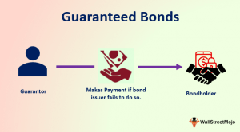

The investment landscape is vast and diverse, offering numerous options that vary in terms of risk and reward. For individuals seeking stability and a predictable income stream, a Guaranteed Income Bond (GIB) presents a compelling investment opportunity. GIBs are gaining popularity among investors who prioritize security rather than pursuing potentially higher returns associated with riskier investments such as stocks or mutual funds.

This article focuses on exploring Guaranteed Income Bonds, providing insight into their operational mechanisms, benefits, and limitations. Additionally, the comparison with other investment vehicles such as stocks and real estate will be addressed to offer a comprehensive understanding of where GIBs stand in relation to other options within the market. In recent years, technological advancements have introduced algorithmic trading, commonly known as algotrading, as a means to enhance financial investment strategies. This article will consider how algotrading may optimize bond investments, including those traditionally stable ones like GIBs, potentially enhancing their value in a diversified portfolio.

By engaging with this guide, investors should be equipped with the knowledge necessary to determine if GIBs align with their financial objectives and risk preferences. Consequently, readers will become better positioned to make informed decisions about incorporating GIBs into their investment strategy, balancing stability and income against potential growth opportunities.

## Table of Contents

## What is a Guaranteed Income Bond?

A Guaranteed Income Bond (GIB) is a fixed-term investment vehicle, primarily distributed by financial institutions such as banks or insurance companies. Designed to provide investors with a steady income, GIBs offer fixed returns over predetermined periods, typically ranging from six months to ten years. This predictability is particularly attractive to investors seeking consistent cash flows and is regarded as a key attribute of GIBs.

The core characteristic of a GIB is the protection of the investor's principal amount. This guarantee on the original capital makes GIBs especially appealing to risk-averse individuals who prioritize capital preservation. In the United Kingdom, life insurance firms are the primary issuers of these bonds, underscoring their low-risk nature and focus on providing a secure investment option.

The structure of a GIB ensures that the initial investment is returned to the investor at the end of the bond's term, coupled with the accrued interest. This fixed-income structure is what differentiates GIBs from other investment products like stocks, which tend to offer higher potential returns but come with increased volatility and risk. While GIBs might not deliver the substantial growth potential found in more diverse investment vehicles, they serve as a stable and reliable source of income, particularly valuable for those approaching or already in retirement. This stability and capital protection feature contribute to their growing popularity among conservative investors.

## Benefits of Investing in GIBs

The Guaranteed Income Bond (GIB) provides investors with a reliable and predictable income stream, primarily through fixed interest payments. This characteristic makes GIBs a particularly attractive investment vehicle for individuals who prioritize stability and routine financial inflow. Retirees, a demographic often reliant on regular income for covering day-to-day expenses, find GIBs especially beneficial due to their dependability and minimal risk profile.

One of the most significant advantages of GIBs is capital preservation. Throughout the term of the bond, the investor's initial principal is safeguarded, ensuring that the original amount is fully returned upon the maturity of the bond. This feature is crucial for risk-averse investors who seek to protect their capital from potential loss, offering peace of mind that their principal is secure.

In addition to providing fixed income and safeguarding capital, GIBs serve as strategic components within a diversified investment portfolio. These bonds contribute to the stability of an investment mix, as they tend to be less volatile compared to equities or other high-risk assets. By integrating GIBs, investors can achieve a balanced portfolio, effectively managing the overall risk exposure. This diversification strategy aligns with the principles of modern portfolio theory, which advocates for the inclusion of varied asset types to optimize returns while minimizing risk.

## Risks and Limitations of GIBs

While Guaranteed Income Bonds (GIBs) are lauded for their safety and stability, they are not entirely devoid of risks and limitations. One of the most significant concerns for investors is inflation risk. Inflation erodes the purchasing power of money, meaning that the fixed returns from GIBs may lose real value over time. Even though GIBs promise a nominal return, if the inflation rate exceeds this return, the investor's real income decreases. For instance, if a GIB offers a 3% nominal rate of return, but inflation is at 4%, the real return becomes:

$$
\text{Real Return} = \text{Nominal Return} - \text{Inflation Rate} = 3\% - 4\% = -1\%
$$

Such scenarios can undermine the primary goal of GIBs, which is to provide steady and predictable income.

Another notable limitation is the limited [liquidity](/wiki/liquidity-risk-premium) of GIBs. These bonds typically require investors to lock in their capital for the entire bond term, which can range from a few months to several years. This characteristic can be problematic for investors who may need access to their funds before the maturity date, as they might face penalties or receive less than the full return on their investment.

Economic conditions also represent a potential risk to GIBholders, albeit less directly compared to other investment vehicles. Although GIBs generally have better protection mechanisms, such as guarantees from reputable insurance companies or financial institutions, adverse economic conditions could challenge an issuer's ability to fulfill its payment obligations. In such cases, despite the relative safety nets, the failure of the issuer could result in delayed or reduced payments to the investor.

In conclusion, while GIBs are a secure and low-risk investment option, the risks of inflation, reduced liquidity, and economic factors impacting the issuer underscore the importance of understanding their limitations. These elements should be considered carefully to ensure that they align with an investor's overall financial strategy and risk tolerance.

## Algotrading and Bond Investments

Algorithmic trading, commonly referred to as algotrading, utilizes computer algorithms to automate trading processes, which can be particularly beneficial for investments such as bonds. Although it is often associated with equity markets, algotrading is increasingly being optimized for bonds to enhance decision-making and portfolio management.

Algotrading platforms process vast amounts of market data in real-time, allowing investors to identify profitable opportunities to buy or sell bonds. This high-speed analysis is indispensable in markets where price movements are slight but impactful. By applying sophisticated mathematical models and statistical methodologies, algorithms can assess bond market trends and execute trades at optimal moments, thus maximizing the efficiency of bond investments.

Additionally, algotrading assists in managing risk exposure and liquidity for securities like Guaranteed Income Bonds (GIBs), which have fixed returns. By continuously monitoring market conditions, these algorithms can adjust investment strategies to mitigate risks associated with [interest rate](/wiki/interest-rate-trading-strategies) fluctuations and credit changes. For example, an algorithm can be programmed to execute a stop-loss order when the price of a bond reaches a certain threshold, thereby limiting potential losses.

The process involves techniques such as [backtesting](/wiki/backtesting), where algorithms are tested on historical data to evaluate their performance before being deployed in live markets. This testing ensures that the strategies are robust and capable of delivering the desired outcomes under various market conditions.

Moreover, advanced algotrading systems incorporate [machine learning](/wiki/machine-learning) elements to refine their strategies over time. These systems can predict market movements with greater accuracy by learning from past trading patterns and market behaviors, continuously enhancing their decision-making processes.

In summary, algotrading represents a powerful tool for bond investors, providing the ability to make informed, data-driven decisions that maximize returns and minimize risks. While traditionally applied to more volatile markets, its application in bond investments like GIBs offers new levels of efficiency and precision, enhancing the overall investment strategy.

## Comparison with Other Investment Options

Guaranteed Income Bonds (GIBs) present a unique investment profile that appeals to individuals seeking stability and security in their portfolio. While they offer a predictable return, they generally yield lower returns compared to equities. Stocks, characterized by their heightened [volatility](/wiki/volatility-trading-strategies) and economic sensitivity, can provide substantial growth and dividends, yet they inherently [carry](/wiki/carry-trading) a higher risk of capital loss. In contrast, GIBs assure preservation of the original capital, making them a safer but less lucrative option.

Real estate represents another potential investment path, notable for its capacity for capital appreciation. Its value is influenced by factors such as location, property condition, and market cycles. Unlike GIBs, real estate investments demand significant capital outlay and bring exposure to market fluctuations, maintenance, and management responsibilities. However, the ability to generate rental income and benefit from property value appreciation is a distinct advantage.

Certificates of Deposit (CDs) share similarities with GIBs regarding security and fixed returns. However, CDs often provide lower interest rates, reflecting their straightforward, lower-risk structure. GIBs, when issued by reputable institutions, may offer more competitive returns while maintaining a similar risk profile.

In comparison to government bonds, GIBs can deliver higher yields, contingent on the issuer's credibility and market conditions. While government bonds are typically considered ultra-secure due to sovereign backing, GIBs issued by trusted entities can closely match this security level and yield improved financial returns. This advantage positions GIBs as a viable alternative for investors looking to balance risk and return efficiently.

In conclusion, GIBs are most suitable for investors prioritizing security and steady income over high-risk, high-reward scenarios. Their role as a stable investment vehicle can complement a diversified portfolio, catering to the varying risk appetites across different asset classes.

## Is GIB the Right Investment for You?

Guaranteed Income Bonds (GIBs) are tailor-made for individuals who emphasize stability and capital preservation within their investment strategy. These bonds provide a fixed income over a predetermined period, making them particularly suitable for retirees or individuals approaching retirement. Such investors often rely on regular income to meet living expenses, and the predictable nature of GIBs can help cover these costs without exposing their principal to market volatility.

However, for younger investors or those with a higher risk tolerance, GIBs may not align with their growth objectives. Younger investors often prioritize capital appreciation and might find equities more attractive due to their potential for higher, though more volatile, returns. Stocks, for instance, can potentially yield greater gains over the long term, albeit with increased risk. Hence, younger investors might consider more dynamic investment vehicles if their financial goals include substantial growth rather than stable income.

Investor suitability is crucial when contemplating GIBs. Individuals must evaluate their financial goals, risk tolerance, and investment timelines. For those who are risk-averse and prioritize steady returns over time, GIBs are an appealing option. Conversely, those open to taking calculated risks for potentially higher returns might explore alternative investments like equities or real estate.

Ultimately, informed decision-making involves aligning personal financial goals with the inherent characteristics of GIBs. This alignment ensures that one's investment portfolio is structured to meet individual needs and achieve desired outcomes effectively.

## Conclusion

Guaranteed Income Bonds (GIBs) provide a low-risk, steady investment avenue, appealing to investors who prioritize security and predictable returns. These bonds are designed to offer fixed income streams with guaranteed capital preservation upon maturity, making them an attractive option for individuals such as retirees who depend on reliable income sources. GIBs can form a foundational component in a diversified investment portfolio, complementing higher-risk assets while reducing overall risk exposure.

While GIBs offer security and stable returns, they also come with limitations such as inflation risk and limited liquidity. The real value of the fixed returns may be eroded by inflation over time, and investors are often required to commit their capital for the bond's full term, which can range from several months to multiple years. However, the dependable income provided by GIBs can help mitigate some of these risks, contributing to financial stability.

The inclusion of [algorithmic trading](/wiki/algorithmic-trading) (algotrading) in bond investments further enhances their attractiveness. Algotrading can optimize the investment process by automating trading decisions based on data-driven insights. By employing sophisticated algorithms, investors can manage portfolios more efficiently, identifying real-time opportunities and optimizing risk exposure and liquidity. This technological advantage can make traditionally stable investments like GIBs more dynamic and efficient.

To maximize the benefits of GIBs, investors must carefully evaluate their personal financial goals, risk tolerance, and investment horizons. For those who seek consistent returns with minimal risk, GIBs can be a suitable choice. Conversely, investors with higher risk appetites might explore other avenues like equities for potentially greater growth. By aligning investment choices with individual financial objectives and characteristics, investors can determine whether GIBs align well with their broader investment strategy.

## References & Further Reading

[1]: Bergstra, J., Bardenet, R., Bengio, Y., & Kégl, B. (2011). ["Algorithms for Hyper-Parameter Optimization."](https://dl.acm.org/doi/10.5555/2986459.2986743) Advances in Neural Information Processing Systems 24.

[2]: ["Advances in Financial Machine Learning"](https://www.amazon.com/Advances-Financial-Machine-Learning-Marcos/dp/1119482089) by Marcos Lopez de Prado

[3]: ["Evidence-Based Technical Analysis: Applying the Scientific Method and Statistical Inference to Trading Signals"](https://www.amazon.com/Evidence-Based-Technical-Analysis-Scientific-Statistical/dp/0470008741) by David Aronson

[4]: ["Machine Learning for Algorithmic Trading"](https://github.com/stefan-jansen/machine-learning-for-trading) by Stefan Jansen

[5]: ["Quantitative Trading: How to Build Your Own Algorithmic Trading Business"](https://www.amazon.com/Quantitative-Trading-Build-Algorithmic-Business/dp/1119800064) by Ernest P. Chan