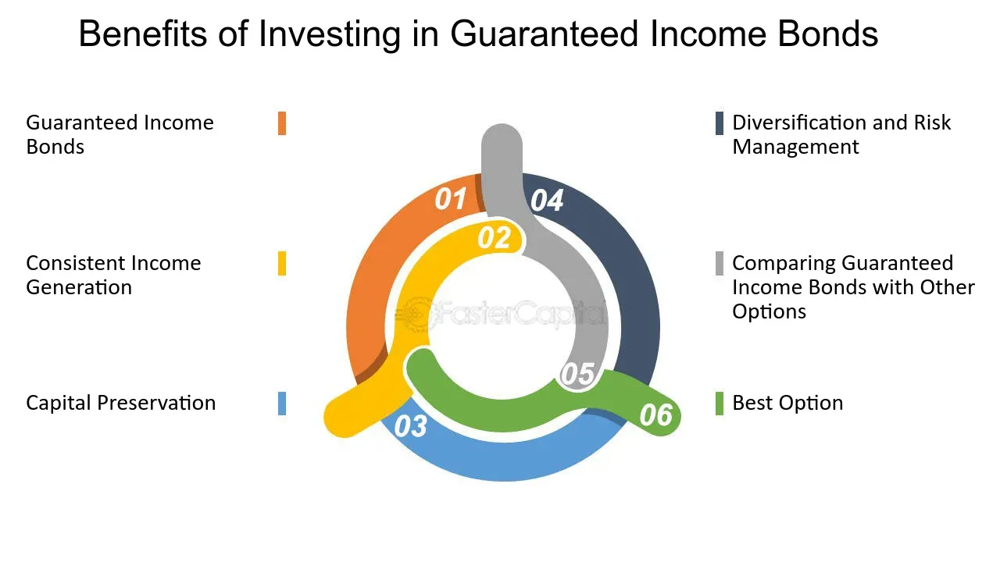

## Table of Contents

## What is a Guaranteed Income Bond?

A Guaranteed Income Bond is a type of savings account offered by banks and building societies. It's called "guaranteed" because the interest rate stays the same for the whole time you have the bond. You put your money in for a set period, like one year or five years, and you can't take it out until that time is up. This is different from a regular savings account where you can take your money out whenever you want.

These bonds are good if you want to know exactly how much interest you'll earn. Since the rate doesn't change, you can plan your finances better. But, there's a downside: if interest rates go up while you have the bond, you won't get the higher rate until your bond ends. So, you need to think about whether the fixed rate is worth not being able to get your money out for the whole term.

## How does a Guaranteed Income Bond work?

A Guaranteed Income Bond is a special kind of savings account where you put your money away for a certain time, like one year or five years. When you open the bond, the bank tells you the interest rate, and that rate stays the same until the bond ends. This means you know exactly how much money you will earn from the interest. You can't take your money out until the time is up, so it's good if you don't need to use that money for a while.

The main thing about these bonds is that they are safe and predictable. Because the [interest rate](/wiki/interest-rate-trading-strategies) is fixed, you don't have to worry about it going down. But, if interest rates go up while you have the bond, you won't get the new higher rate until your bond finishes. So, you need to think about whether the fixed rate is good enough for you to leave your money there for the whole time.

## What are the benefits of investing in a Guaranteed Income Bond?

One big benefit of a Guaranteed Income Bond is that it gives you a fixed interest rate. This means you know exactly how much money you will earn from your savings. It's good if you like to plan your money carefully because you can count on the same amount of interest every time. You don't have to worry about the interest rate going down and getting less money than you expected.

Another benefit is that these bonds are safe. The money you put in is protected, and you won't lose it. This makes it a good choice if you want to keep your savings secure without taking big risks. Since you can't take your money out until the bond ends, it also helps you save without the temptation to spend it on other things.

## Who typically offers Guaranteed Income Bonds?

Guaranteed Income Bonds are usually offered by banks and building societies. These are the same places where you might have a regular savings account or a checking account. They want to help people save money safely and earn a bit of interest, so they offer these bonds as one of their savings options.

These bonds are popular with people who want to know exactly how much interest they will earn. Banks and building societies like offering them because they can plan how much money they will have to pay out in interest. It's a win-win situation: the bank gets to use your money for a set time, and you get a fixed interest rate that you can count on.

## What is the typical term length for a Guaranteed Income Bond?

The typical term length for a Guaranteed Income Bond can be anywhere from one year to five years. Sometimes, you might find bonds that last even longer, like ten years, but one to five years is most common. The term length is how long you agree to leave your money in the bond without taking it out.

When you choose a bond, you pick the term length that works best for you. If you think you might need your money sooner, you might go for a shorter term like one year. If you're okay with leaving your money in for a while, a longer term like five years might give you a better interest rate. It's all about finding the right balance for your savings plan.

## How is the interest rate determined for a Guaranteed Income Bond?

The interest rate for a Guaranteed Income Bond is set by the bank or building society when you open the bond. They look at things like the current economic situation, what other banks are offering, and how long you're willing to leave your money with them. If you choose a longer term, like five years, the bank might offer a higher interest rate because they can use your money for a longer time.

Once the interest rate is set, it stays the same for the whole term of the bond. This means you know exactly how much interest you will earn, no matter what happens with the economy or other interest rates. It's good for planning because you can count on that fixed amount of interest until the bond ends.

## Can you access your money before the term ends in a Guaranteed Income Bond?

Usually, you can't take your money out of a Guaranteed Income Bond before the term ends. The whole point of these bonds is that you leave your money in for a set time, like one year or five years. If you could take it out early, it wouldn't be as safe for the bank, and they might not offer you the same fixed interest rate.

If you really need your money before the term is up, you might be able to get it out, but it's not easy. The bank might charge you a fee for taking your money out early, or they might not give you any interest at all. So, it's really important to think carefully about whether you can leave your money in the bond for the whole term before you put it in.

## What are the tax implications of income from a Guaranteed Income Bond?

The interest you earn from a Guaranteed Income Bond is usually taxable. This means you have to pay tax on the interest as part of your income. The tax you pay depends on how much money you make in total. If you're in a higher tax bracket, you'll pay more tax on the interest than someone in a lower tax bracket.

You need to report the interest you earn from the bond on your tax return. The bank or building society will send you a statement at the end of the tax year showing how much interest you earned. You can use this to fill out your tax return. If you're not sure how to do this, you might want to talk to a tax advisor or use tax software to help you.

## How do Guaranteed Income Bonds compare to other fixed income investments?

Guaranteed Income Bonds are one type of fixed income investment, and they are a bit different from others. A big difference is that they have a fixed interest rate that stays the same for the whole time you have the bond. This is good if you want to know exactly how much money you will earn. Other fixed income investments, like government bonds or corporate bonds, might have interest rates that change over time. Also, with Guaranteed Income Bonds, you can't take your money out until the term ends, which can be from one to five years. Other fixed income investments might let you sell them before they mature, but you might lose money if you do that.

Another way Guaranteed Income Bonds are different is how safe they are. They are offered by banks and building societies, which are usually very safe places to keep your money. The interest rate is guaranteed, so you won't lose your money. Other fixed income investments, like corporate bonds, can be riskier because the company might not be able to pay you back. Government bonds are usually very safe too, but the interest rates can change, and you might not get as much money as you expected. So, Guaranteed Income Bonds are good if you want a safe place to put your money and know exactly how much interest you will earn.

## What are the risks associated with Guaranteed Income Bonds?

One risk with Guaranteed Income Bonds is that you can't take your money out until the term ends. If something unexpected happens and you need your money before the bond is up, you might be in a tough spot. Some banks might let you take your money out early, but they could charge you a fee or not give you any interest at all. So, it's really important to make sure you won't need the money before the term is over.

Another risk is that the interest rate might not be as good as other investments. If you put your money in a Guaranteed Income Bond and then interest rates go up, you won't get the higher rate until your bond ends. This means you could miss out on [earning](/wiki/earning-announcement) more money if you had put your money somewhere else. It's a trade-off: you get the safety of knowing exactly how much interest you'll earn, but you might not get the best rate possible.

## How does inflation impact the returns of a Guaranteed Income Bond?

Inflation can make the money you earn from a Guaranteed Income Bond worth less over time. If the interest rate on your bond is lower than the rate of inflation, the buying power of your money goes down. For example, if you earn 2% interest but inflation is 3%, your money is actually losing value because prices are going up faster than your interest.

This means that even though you know exactly how much interest you will get from the bond, the real value of that interest might not keep up with the cost of living. It's important to think about inflation when you decide if a Guaranteed Income Bond is a good choice for you. If inflation is high, you might want to look at other investments that could give you a better return to keep up with rising prices.

## What should be considered when choosing between different Guaranteed Income Bonds?

When choosing between different Guaranteed Income Bonds, you should first look at the interest rate. Different banks and building societies might offer different rates, so you want to pick the one that gives you the most money. Also, think about how long the bond lasts. Some bonds might be for one year, while others could be for five years or more. If you think you might need your money sooner, go for a shorter term. If you can leave your money in for a while, a longer term might give you a better interest rate.

Another thing to consider is the bank or building society offering the bond. Make sure it's a place you trust and that your money will be safe there. You should also think about what will happen if you need to take your money out early. Some banks might let you do that, but they could charge you a fee or not give you any interest. So, it's important to read the rules carefully and make sure you're okay with them before you put your money in.

## What are the risks and limitations of GIBs?

While Guaranteed Income Bonds (GIBs) are lauded for their safety and stability, they are not entirely devoid of risks and limitations. One of the most significant concerns for investors is inflation risk. Inflation erodes the purchasing power of money, meaning that the fixed returns from GIBs may lose real value over time. Even though GIBs promise a nominal return, if the inflation rate exceeds this return, the investor's real income decreases. For instance, if a GIB offers a 3% nominal rate of return, but inflation is at 4%, the real return becomes:

$$
\text{Real Return} = \text{Nominal Return} - \text{Inflation Rate} = 3\% - 4\% = -1\%
$$

Such scenarios can undermine the primary goal of GIBs, which is to provide steady and predictable income.

Another notable limitation is the limited [liquidity](/wiki/liquidity-risk-premium) of GIBs. These bonds typically require investors to lock in their capital for the entire bond term, which can range from a few months to several years. This characteristic can be problematic for investors who may need access to their funds before the maturity date, as they might face penalties or receive less than the full return on their investment.

Economic conditions also represent a potential risk to GIBholders, albeit less directly compared to other investment vehicles. Although GIBs generally have better protection mechanisms, such as guarantees from reputable insurance companies or financial institutions, adverse economic conditions could challenge an issuer's ability to fulfill its payment obligations. In such cases, despite the relative safety nets, the failure of the issuer could result in delayed or reduced payments to the investor.

In conclusion, while GIBs are a secure and low-risk investment option, the risks of inflation, reduced liquidity, and economic factors impacting the issuer underscore the importance of understanding their limitations. These elements should be considered carefully to ensure that they align with an investor's overall financial strategy and risk tolerance.

## References & Further Reading

[1]: Bergstra, J., Bardenet, R., Bengio, Y., & Kégl, B. (2011). ["Algorithms for Hyper-Parameter Optimization."](https://dl.acm.org/doi/10.5555/2986459.2986743) Advances in Neural Information Processing Systems 24.

[2]: ["Advances in Financial Machine Learning"](https://www.amazon.com/Advances-Financial-Machine-Learning-Marcos/dp/1119482089) by Marcos Lopez de Prado

[3]: ["Evidence-Based Technical Analysis: Applying the Scientific Method and Statistical Inference to Trading Signals"](https://www.amazon.com/Evidence-Based-Technical-Analysis-Scientific-Statistical/dp/0470008741) by David Aronson

[4]: ["Machine Learning for Algorithmic Trading"](https://github.com/stefan-jansen/machine-learning-for-trading) by Stefan Jansen

[5]: ["Quantitative Trading: How to Build Your Own Algorithmic Trading Business"](https://www.amazon.com/Quantitative-Trading-Build-Algorithmic-Business/dp/1119800064) by Ernest P. Chan