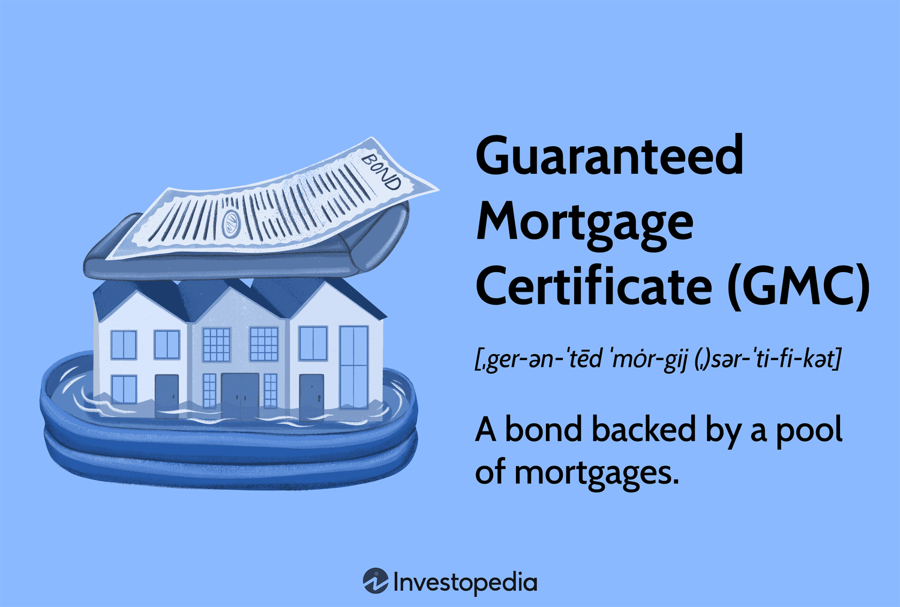

## Table of Contents

## What is a Guaranteed Mortgage Certificate?

A Guaranteed Mortgage Certificate, often called a GMC, is a type of investment where a bank or financial institution bundles together a bunch of home loans and then sells them to investors. These certificates are backed by the government, which means if the people who took out the home loans can't pay them back, the government will step in and make sure the investors still get their money.

Investors like GMCs because they are seen as safe investments. Since the government guarantees them, there's less risk that investors will lose their money. This makes GMCs a popular choice for people who want to invest their money without taking big risks. Plus, because the certificates are based on home loans, they can also provide a steady stream of income from the interest payments on those loans.

## How does a Guaranteed Mortgage Certificate work?

A Guaranteed Mortgage Certificate, or GMC, is like a special package of home loans that a bank puts together and sells to people who want to invest their money. Imagine a bunch of home loans all bundled up into one big package. When you buy a GMC, you're actually buying a piece of this big package. The bank then gives the money from selling the GMCs to the people who took out the home loans, and in return, the investors get the interest payments from those loans.

What makes GMCs special is that they come with a government promise. This means if the people who took out the home loans can't pay them back, the government steps in and makes sure the investors still get their money. This makes GMCs a safe choice for people who don't want to take big risks with their money. Plus, because the certificates are based on home loans, they can give investors a steady flow of money from the interest payments, making them a popular choice for those looking for a reliable investment.

## Who issues Guaranteed Mortgage Certificates?

Guaranteed Mortgage Certificates, or GMCs, are issued by banks and financial institutions. These organizations bundle together a group of home loans and then sell them to investors in the form of GMCs. The process starts when a bank makes home loans to people. Instead of keeping these loans, the bank can choose to sell them as part of a GMC to investors.

The government plays a key role with GMCs because it guarantees them. This means if the people who took out the home loans can't pay them back, the government will make sure the investors still get their money. This guarantee makes GMCs a safe investment option. Investors like them because they offer a steady income from the interest on the home loans and come with less risk thanks to the government's backing.

## What are the benefits of investing in Guaranteed Mortgage Certificates?

Investing in Guaranteed Mortgage Certificates, or GMCs, can be a smart move for people looking for a safe place to put their money. GMCs are backed by the government, which means if the people who took out the home loans can't pay them back, the government steps in and makes sure the investors still get their money. This makes GMCs a low-risk investment, which is great for people who don't want to take big chances with their savings.

Another big benefit of GMCs is that they can provide a steady stream of income. Since GMCs are made up of a bunch of home loans, the interest payments from these loans go to the investors. This can give you a regular flow of money, which is helpful if you're looking for a way to earn income without too much risk. Plus, because GMCs are easy to buy and sell, they can be a flexible part of your investment plan.

## What are the risks associated with Guaranteed Mortgage Certificates?

While Guaranteed Mortgage Certificates, or GMCs, are seen as safe investments because they are backed by the government, there are still some risks to think about. One risk is that interest rates might go up. If this happens, the value of the GMCs could go down because new home loans would have higher interest rates, making the older loans in the GMCs less attractive. This could mean you might not make as much money as you hoped, or you might even lose some if you need to sell your GMCs when interest rates are high.

Another risk is that even though the government guarantees GMCs, there's still a chance that the government could change its rules or face financial problems. If the government can't keep its promise to back the GMCs, then the investors could lose money. This is not very likely, but it's something to keep in mind. So, while GMCs are generally safe, it's good to know these risks before deciding to invest in them.

## How can one purchase a Guaranteed Mortgage Certificate?

To buy a Guaranteed Mortgage Certificate, or GMC, you can start by talking to a bank or a financial institution that offers them. These places usually have special departments that handle investments like GMCs. You'll need to fill out some forms and provide information about yourself, like your name, address, and how much money you want to invest. The bank will then check if you're eligible to buy a GMC and help you complete the purchase.

Once you've bought a GMC, you'll start getting regular interest payments from the home loans that are part of the certificate. These payments can be a good way to earn some extra money. Remember, though, that GMCs are investments, so it's a good idea to talk to a financial advisor to make sure they're the right choice for you and fit well with your other investments.

## What is the typical yield or return on a Guaranteed Mortgage Certificate?

The typical yield or return on a Guaranteed Mortgage Certificate, or GMC, can vary depending on a few things like the current interest rates and how the home loans in the certificate are doing. On average, you might see returns that are a bit higher than what you'd get from a regular savings account but not as high as riskier investments like stocks. Let's say, if a savings account might give you around 1% to 2% a year, a GMC could give you something like 3% to 5% a year.

These returns come from the interest payments that the people who took out the home loans pay back. Since the government guarantees GMCs, they're seen as a safe way to earn a steady income. But remember, the exact return you get can change over time, especially if interest rates go up or down. So, while GMCs can be a good choice for people looking for a safe investment with a bit more return than a savings account, it's always good to check the current rates and talk to a financial advisor to see if they're right for you.

## How do Guaranteed Mortgage Certificates compare to other investment options?

Guaranteed Mortgage Certificates, or GMCs, are different from other investments because they are backed by the government. This makes them a safe choice if you don't want to take big risks with your money. Compared to savings accounts, GMCs usually offer higher returns, maybe around 3% to 5% a year, while savings accounts might only give you 1% to 2%. But GMCs are not as risky as stocks, which can go up and down a lot and might give you higher returns if you're willing to take the risk.

Another way GMCs are different is that they give you a steady income from the interest payments on the home loans they're made of. This is good if you want regular money coming in without too much worry. Compared to bonds, which are also seen as safe investments, GMCs can sometimes offer better returns because they're tied to home loans. But like bonds, GMCs can lose value if interest rates go up. So, GMCs are a middle ground: safer than stocks but with better returns than savings accounts, making them a good choice for people looking for a balance between safety and [earning](/wiki/earning-announcement) a bit more money.

## What are the tax implications of investing in Guaranteed Mortgage Certificates?

When you invest in Guaranteed Mortgage Certificates, or GMCs, you need to know about the taxes you might have to pay. The interest you get from GMCs is usually considered regular income. This means you'll have to pay taxes on it at the same rate as your other income, like what you earn from your job. So, if you're in a higher tax bracket, you'll pay more taxes on the interest from your GMCs.

Another thing to keep in mind is that if you sell your GMCs for more than you paid for them, you might have to pay capital gains tax. This is a tax on the profit you make from selling investments. The rate for capital gains tax can be different depending on how long you held the GMCs before selling them. If you hold them for more than a year, you might pay a lower rate than if you sell them sooner. It's always a good idea to talk to a tax advisor to understand exactly how much you'll need to pay in taxes on your GMC investments.

## Can Guaranteed Mortgage Certificates be sold before maturity? If so, how?

Yes, you can sell Guaranteed Mortgage Certificates, or GMCs, before they reach their maturity date. To do this, you can work with the bank or financial institution where you bought the GMCs. They often have a special department that deals with buying and selling investments. You'll need to tell them you want to sell your GMCs, and they will help you find a buyer. This process can take some time, but the bank will guide you through it.

The price you get for your GMCs when you sell them early can be different from what you paid for them. If interest rates have gone up since you bought your GMCs, you might get less money because new home loans with higher interest rates are more attractive to buyers. On the other hand, if interest rates have gone down, you might be able to sell your GMCs for more. It's a good idea to talk to a financial advisor before deciding to sell your GMCs early to make sure it's the right move for you.

## What historical performance data is available for Guaranteed Mortgage Certificates?

Guaranteed Mortgage Certificates, or GMCs, have been around for a while, and looking at their history can help us understand how they've done over time. Over the years, GMCs have generally provided steady returns, often between 3% to 5% annually. This is better than what you might get from a regular savings account, which might only give you 1% to 2%. The reason GMCs do this well is because they are made up of a bunch of home loans, and the interest from those loans goes to the investors.

But, like any investment, GMCs can have ups and downs. For example, during times when interest rates were low, GMCs did really well because the home loans in them had higher interest rates than new loans. But when interest rates went up, the value of GMCs could drop because new home loans were more attractive. Overall, because the government backs GMCs, they've been a safe choice for people looking for a steady income without too much risk.

## What regulatory considerations should be taken into account when investing in Guaranteed Mortgage Certificates?

When you invest in Guaranteed Mortgage Certificates, or GMCs, there are some rules and regulations you should know about. GMCs are regulated by government agencies like the Federal Housing Administration (FHA) and the Government National Mortgage Association (Ginnie Mae). These agencies make sure that GMCs are safe for investors because the government backs them. This means there are strict rules about how GMCs can be created, sold, and managed to protect investors and keep the market fair.

Another thing to think about is the tax rules that apply to GMCs. The interest you earn from GMCs is usually taxed as regular income, which means you'll pay taxes on it at the same rate as your job earnings. If you sell your GMCs for more than you paid for them, you might also have to pay capital gains tax. The rate for this tax can be different depending on how long you held the GMCs. It's a good idea to talk to a tax advisor to understand all the tax rules and how they might affect your investment in GMCs.

## How can algorithmic trading be integrated with real estate finance?

The integration of [algorithmic trading](/wiki/algorithmic-trading) with real estate finance is enabling significant advancements in the accuracy and efficiency of property valuations. One of the primary methods by which algorithmic trading enhances valuation accuracy is through comparables analysis. Traditionally, this process involves comparing a property with similar ones that have recently sold in the same area, often relying on human valuation professionals. Algorithms, however, optimize this process by autonomously analyzing vast datasets to identify comparable properties, resulting in more precise and consistent valuations.

Algorithmic systems are adept at eliminating human biases and errors, standardizing procedures in real estate valuations. These algorithms are designed to continuously learn and adapt, leading to improvements in the predictive accuracy over time. For example, [machine learning](/wiki/machine-learning) models can be trained to recognize patterns and correlations within property data that might be missed by human analysts. This ensures consistency and accuracy in the assessment of property values. The linear regression model is frequently used in property valuation, expressed mathematically as:

$$
V = \beta_0 + \beta_1X_1 + \beta_2X_2 + \ldots + \beta_nX_n + \epsilon
$$

Where $V$ represents the property value, $\beta_0$ is the y-intercept, $\beta_1, \beta_2, ..., \beta_n$ are the coefficients for each independent variable $X_1, X_2, ..., X_n$, and $\epsilon$ denotes the error term.

In addition to property valuation, algorithmic trading plays a crucial role in enhancing investment decisions and risk assessments. Advanced data analytics enable the rapid processing of large volumes of real estate market data, offering insights that inform strategic investment choices. By leveraging the capabilities of algorithms, stakeholders in the real estate finance sector can better evaluate market trends, optimize portfolio diversification, and devise risk mitigation strategies.

Technological platforms utilizing algorithmic trading have emerged, offering innovative solutions for property transactions. These platforms often embed sophisticated trading algorithms into their frameworks, facilitating seamless property exchanges and enhancing market [liquidity](/wiki/liquidity-risk-premium). Furthermore, the integration of automation technologies in property transactions reduces operational costs and minimizes errors, leading to more efficient market operations.

Overall, the fusion of algorithmic trading with real estate finance is fostering a more dynamic, data-driven environment that improves the accuracy of property valuations and facilitates innovative transaction solutions. This transformation in operation and strategy is paving the way for enhanced market efficiency and investor return potential.

## References & Further Reading

[1]: Bergstra, J., Bardenet, R., Bengio, Y., & Kégl, B. (2011). ["Algorithms for Hyper-Parameter Optimization."](https://dl.acm.org/doi/10.5555/2986459.2986743) Advances in Neural Information Processing Systems 24.

[2]: ["Advances in Financial Machine Learning"](https://www.amazon.com/Advances-Financial-Machine-Learning-Marcos/dp/1119482089) by Marcos Lopez de Prado

[3]: ["Evidence-Based Technical Analysis: Applying the Scientific Method and Statistical Inference to Trading Signals"](https://www.amazon.com/Evidence-Based-Technical-Analysis-Scientific-Statistical/dp/0470008741) by David Aronson

[4]: ["Machine Learning for Algorithmic Trading"](https://github.com/stefan-jansen/machine-learning-for-trading) by Stefan Jansen

[5]: ["Quantitative Trading: How to Build Your Own Algorithmic Trading Business"](https://www.amazon.com/Quantitative-Trading-Build-Algorithmic-Business/dp/1119800064) by Ernest P. Chan