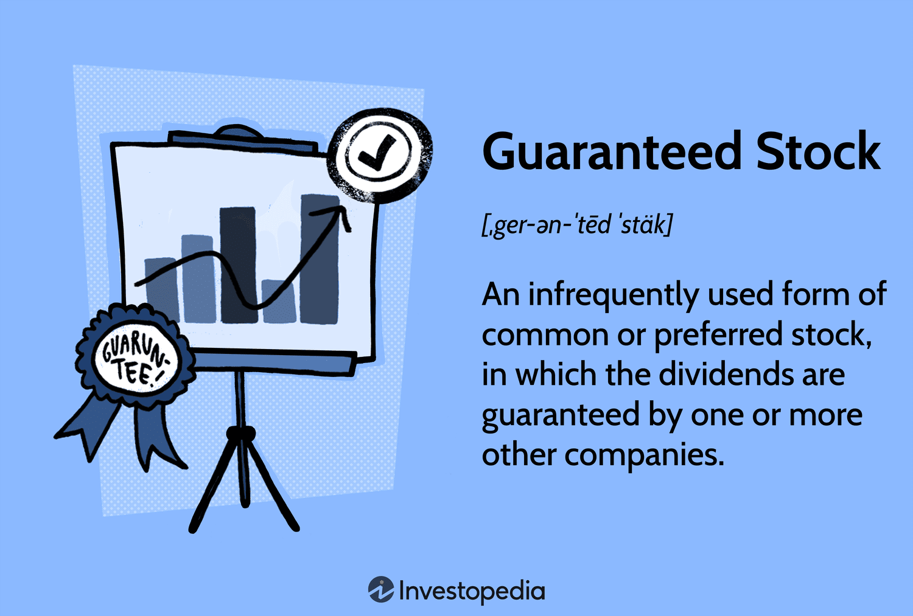

Stock market investing is a cornerstone of modern finance, offering individuals and institutions alike the opportunity to grow wealth and provide capital for businesses. The stock market enables the buying and selling of equity shares in publicly traded companies, facilitating capital formation, liquidity, and wealth accumulation. In today's globalized economy, the role of stock market investing has become increasingly significant, driving economic growth and development.

Technological advancements have profoundly affected trading practices over the past few decades. The introduction of electronic trading platforms has revolutionized how stocks are bought and sold, providing greater access and efficiency. Among these technological innovations, algorithmic trading has emerged as a dominant force. Algorithmic trading refers to the use of computer algorithms to automatically execute trades based on predefined criteria such as timing, price, and volume. This method offers numerous advantages, including the ability to execute trades at lightning-fast speeds and remove human emotion from trading decisions, thereby enhancing precision and consistency.



Investors are perpetually in search of 'guaranteed' investment opportunities that promise security and reliable returns. While truly guaranteed investments are rare, the concept pertains to financial products or arrangements that offer assured benefits under specific conditions. Algorithmic trading is often seen as a tool capable of finding or enhancing these opportunities, given its ability to process vast amounts of data and identify patterns that might not be immediately apparent to human traders.

The promise of combining guaranteed investment concepts with algorithmic trading is alluring. It suggests the potential for achieving stable returns through sophisticated and systematic approaches to trading. However, the reality is more complex, as financial markets are inherently dynamic and unpredictable. Thus, while algorithmic trading can augment the search for stable returns, it also requires prudent strategy design, risk management, and constant adaptation to market conditions. This discussion aims to explore the interplay between guaranteed investment strategies and algorithmic trading mechanisms, providing insights into both their potential and limitations.

## Table of Contents

## Understanding Guaranteed Stock

Guaranteed stock refers to a type of equity investment where the payment of dividends is assured by either the issuing company or a third party. This guarantee is particularly valuable to investors seeking stable income, as it offers an added layer of security in receiving expected returns. Typically, the assurance of dividends can attract risk-averse investors who prioritize consistent cash flows over potential capital gains.

### Guaranteed Dividends and Third-Party Guarantees

Guaranteed dividends ensure that investors receive a predetermined dividend payment regardless of the issuing company's financial performance. This guarantee can be either explicitly mentioned in the terms of issuance or undertaken by an external organization, such as an insurance company or a financial institution, providing a safety net to the investors. These third-party entities protect investors by stepping in to cover dividend payments if the issuing company fails to meet its obligations.

### Potential Benefits and Risks

One of the primary benefits of investing in guaranteed stocks is the reduced risk associated with dividend payments. Investors can rely on a steady stream of income, which can be particularly beneficial during economic downturns when other income-generating investments may be at risk. Additionally, guaranteed stocks can provide a sense of security, making them appealing to conservative investors or those partaking in retirement planning.

However, these stocks are not without risks. The assurance of dividends typically results in a lower potential for capital appreciation, as the guaranteed payments are factored into the stock's price. Moreover, the presence of a third-party guarantor introduces an additional layer of counterparty risk; if the guarantor defaults, investors may not receive the guaranteed payments.

### Rarity and Industry Specificity

Guaranteed stocks are relatively rare, primarily found in industries where companies possess stable and predictable cash flows, such as railroads and utilities. These sectors often have significant infrastructure investments and regulatory frameworks that allow for relatively stable revenue streams, thus offering a conducive environment for guaranteed dividend structures. In industries with more volatile financial performances, the feasibility of providing guaranteed dividends becomes less practical, contributing to the scarcity of such stocks in the broader market.

## Basics of Algorithmic Trading

Algorithmic trading, often referred to as algo-trading, involves the use of computer programs to execute financial market transactions based on predetermined criteria. These criteria can include factors such as timing, price, and quantity, enabling traders to execute orders with high speed and efficiency. In modern financial markets, [algorithmic trading](/wiki/algorithmic-trading) plays a significant role due to its capacity to handle large volumes of trades without the emotional bias that can affect human decision-making.

In essence, an algorithm is a set of rules designed to perform a specific task. In the context of trading, these algorithms can process vast amounts of data to identify trading opportunities, calculate optimal trade execution strategies, and manage transactions in milliseconds. This capability offers traders the advantage of capturing market opportunities that may not be visible to human traders or feasible to exploit in real-time.

The advantages of algorithmic trading are numerous. Firstly, it facilitates emotion-free trading by automating decision-making processes, thus reducing the impact of human emotions such as fear or greed, which can lead to impulsive trading decisions. Additionally, algorithmic trading ensures speed and efficiency, with trades being executed almost instantaneously in response to changes in the market. This speed allows traders to capitalize on short-lived market opportunities that might otherwise be missed. Moreover, the precision of algorithmic trading reduces the risk of human errors, such as order-entry mistakes, and ensures that trades are executed at the best available prices.

Several strategies are prevalent in algorithmic trading, each leveraging different market behaviors to generate returns. Trend-following strategies, for instance, attempt to capitalize on ongoing price movements by buying securities that are trending upwards and selling those trending downwards. This strategy is often devoid of predictive elements, instead relying on the belief that trends will persist for a period.

Arbitrage strategies exploit price discrepancies of the same asset across different markets or forms. For example, a stock might be priced differently on two different exchanges, and algorithms can simultaneously buy low on one and sell high on another to secure a profit. This strategy requires algorithms to act with remarkable speed and accuracy to ensure profitability before the market corrects the price discrepancy.

Lastly, index fund rebalancing strategies involve the periodic adjustment of a portfolio to match the current weights of various securities within an index. Algorithmic trading can efficiently manage this process by executing the necessary trades swiftly and cost-effectively.

In implementing these strategies, algorithms can be crafted using programming languages like Python. For instance, a simple Python script utilizing the `pandas` and `numpy` libraries can help calculate moving averages as part of a trend-following strategy:

```python
import pandas as pd
import numpy as np

def calculate_moving_average(data, window):
    return data['Close'].rolling(window=window).mean()

stock_data = pd.read_csv('stock_data.csv')
short_term_ma = calculate_moving_average(stock_data, window=50)  # 50-day moving average
long_term_ma = calculate_moving_average(stock_data, window=200)  # 200-day moving average

signals = np.where(short_term_ma > long_term_ma, 1, 0)  # Buy signal when short-term MA is above long-term MA
```

In conclusion, algorithmic trading represents a sophisticated approach to financial market transactions, relying on the precision and speed of computer algorithms to distinguish and act upon trading opportunities. Its role in modern finance is testament to the continuous technological advancements shaping trading practices.

## Algorithmic Trading Strategies and Guaranteed Investment Concepts

The intersection of algorithmic trading and guaranteed stock investments represents the fusion of automated financial technology with traditionally stable investment vehicles. This combination seeks to capitalize on the reliability of guaranteed stocks and the precision of algorithmic trading.

Algorithmic trading utilizes pre-programmed instructions to execute trades at speeds and frequencies that are impossible for a human trader. Specific strategies can potentially leverage the benefits of guaranteed stock investments. Two prevalent strategies are trend-following and mean reversion, each offering distinct mechanisms that could be adapted to guaranteed stocks.

**Trend-following strategies** involve algorithms that identify and capitalize on momentum in the market. Although guaranteed stocks have inherent stability due to their assured dividends or protection of principal, they can still exhibit trends within the confines of their typical price movements. Algorithms designed for trend-following can analyze historical price data to predict and exploit these mini-trends. For example, an algorithm might detect a consistent upward pattern in a utility stock guaranteed by a regulatory framework and attempt to capitalize on this by optimizing entry and exit points.

Python code for a basic trend-following strategy could look like this:

```python
import numpy as np

def trend_following_strategy(data, window=5):
    signals = np.zeros(len(data))
    for i in range(window, len(data)):
        if data[i] > np.mean(data[i-window:i]):
            signals[i] = 1  # Buy signal
        elif data[i] < np.mean(data[i-window:i]):
            signals[i] = -1  # Sell signal
    return signals
```

**Mean reversion** strategies rely on the assumption that stock prices oscillate around a mean value and eventually return to that average. Guaranteed stocks, often stable by nature, might frequently revert to a mean due to predictable cash flows and reduced volatility. An algorithm leveraging mean reversion might buy a stock when its price dips below its historical average and sell when it rises above.

Here is a sample Python code for a mean reversion strategy:

```python
def mean_reversion_strategy(data, window=10):
    signals = np.zeros(len(data))
    moving_average = np.convolve(data, np.ones(window)/window, mode='valid')
    for i in range(len(moving_average)):
        if data[i+window-1] > moving_average[i]:
            signals[i+window-1] = -1  # Sell signal
        elif data[i+window-1] < moving_average[i]:
            signals[i+window-1] = 1  # Buy signal
    return signals
```

While these strategies present clear benefits such as minimized human error, emotion-free trading, and operational efficiency, they also harbor limitations and risks. Guaranteed stocks, by their nature, tend to yield lower returns, and applying algorithmic strategies might result in diminished incremental gains compared to more volatile stocks. Additionally, the assumption that past patterns will hold in the future is a fundamental risk of algorithmic trading since markets can be influenced by unforeseen events.

Algorithmic traders must also be cognizant of execution risks such as potential slippage, and market impact costs, all of which can erode the expected benefits of deploying a strategy. Moreover, over-optimization on historical data, known as curve fitting, can lead to strategies that underperform in live markets. Therefore, while the allure of coupling algorithmic trading with guaranteed investments persists, it requires thorough understanding, testing, and continuous adaptation to market conditions to truly be effective and profitable.

## Technical Requirements and Risks of Algorithmic Trading

Algorithmic trading requires a sophisticated technical setup to efficiently execute trades and manage investment strategies. A robust infrastructure typically includes high-performance hardware, specialized software, and reliable network connectivity. High-speed computers equipped with powerful processors and ample memory are essential to execute complex calculations and process large data sets. Low-latency networks are crucial to ensure prompt execution of trades, allowing traders to exploit fleeting market opportunities.

Software is another critical component. Traders often use custom-built or third-party trading platforms that support automation. These platforms provide tools for developing, testing, and deploying trading algorithms. Popular programming languages like Python are widely used for scripting due to their extensive libraries for data analysis, [machine learning](/wiki/machine-learning), and financial modeling. For instance, libraries like NumPy and pandas are commonly used for handling numerical operations and data manipulation, while [backtesting](/wiki/backtesting) frameworks like Zipline or Backtrader facilitate testing trading strategies on historical data.

Backtesting is a fundamental process to validate trading algorithms before deploying them in live markets. It involves simulating a strategy over historical market data to assess its performance. By examining metrics such as historical returns, [volatility](/wiki/volatility-trading-strategies), and drawdowns, traders can refine their strategies and adjust parameters to optimize performance. Effective backtesting helps identify strategies that are potentially profitable while avoiding those that incur consistent losses.

The pursuit of algorithmic trading is not without risks. High capital costs are associated with acquiring and maintaining the necessary technology infrastructure. There is also significant reliance on technology; any hardware failure, software bug, or network disruption can lead to missed opportunities or financial losses. Furthermore, algorithmic trading is susceptible to market volatility; unpredictable price movements can result in substantial deviations from expected returns.

Regulatory considerations play a crucial role in algorithmic trading, necessitating compliance with market rules to ensure fair trading practices. Market authorities impose regulations to prevent market abuse, such as spoofing and front-running. Traders must ensure their algorithms are compliant and do not inadvertently engage in activities that violate these rules. In some jurisdictions, algorithmic trading firms are required to register with financial authorities and periodically report their activities.

Algorithmic trading offers considerable potential but demands a comprehensive understanding of both technical requirements and associated risks. A meticulous approach to building and maintaining the technical infrastructure, thorough backtesting of trading strategies, and adherence to regulatory frameworks are imperative for successful algorithmic trading.

## Investment Realities: Balancing the Promise with Practicality

The notion of achieving "guaranteed" returns through algorithmic trading is enticing but fraught with complexities. Algorithmic trading leverages advanced algorithms to make trading decisions, aiming for optimal financial outcomes. However, the unpredictability of financial markets inherently challenges any claim of guaranteed returns.

Realistic expectations are crucial when engaging with algorithmic trading. Markets are influenced by a myriad of factors, such as economic indicators, geopolitical events, and investor sentiment, all of which can affect asset prices. Algorithms, although sophisticated, rely on historical data to predict future market movements. This reliance imposes limitations, as past performance is not always indicative of future results. Thus, thorough market research is essential to inform algorithmic strategies. A comprehensive understanding of current market conditions, including regulatory changes and emerging economic trends, can significantly enhance the effectiveness of algorithms.

Moreover, the financial markets' dynamic nature necessitates continuous evaluation and adaptation of trading strategies. Algorithms need to be rigorously backtested against historical data, ensuring their validity over various market conditions. This process involves adjusting input variables and re-optimizing strategies in response to changing market dynamics. Continuous monitoring and updating of algorithms are indispensable, requiring traders to be ever-vigilant to evolving market trends and potential strategic pitfalls.

To empower themselves, investors must prioritize staying informed and making well-educated decisions. Subscribing to financial news services, participating in investment forums, and leveraging data analytics platforms are practical steps to remain updated on market developments. Additionally, investors should consider employing diversified strategies to manage risk. By not over-relying on a single algorithm or market, they can mitigate potential losses resulting from unforeseen market shifts.

In summary, the pursuit of "guaranteed" returns through algorithmic trading is more about managing probabilities than seeking certainties. Armed with realistic expectations, diligent market research, and a flexible approach, investors can effectively navigate the complexities of algorithmic trading to make informed and strategic investment decisions.

## Conclusion

Algorithmic trading plays a crucial role in the pursuit of guaranteed investment outcomes by offering systematic approaches to trading that promise speed, efficiency, and precision. However, it is important to recognize that while algorithmic trading can optimize trade execution and enhance portfolio management, it does not inherently guarantee profitable outcomes. The mathematical and statistical models that underpin algorithmic strategies are vital tools, yet they rely on assumptions and past data trends that may not always predict future market movements with certainty.

Understanding both the opportunities and limitations of algorithmic trading is essential. The opportunities are significant, ranging from executing trades at optimal prices to minimizing human error and emotional bias. For instance, algorithmic trading allows for high-frequency trading that capitalizes on minute price discrepancies, which would be impossible for a human trader to detect and act upon swiftly. Conversely, the limitations stem from the algorithms' dependency on data integrity, market [liquidity](/wiki/liquidity-risk-premium), and the inherent volatility of financial markets. Sophisticated algorithms could still falter if unexpected market conditions arise, leading to potential losses.

When embarking on algorithmic trading, it is critical for investors to possess a combination of technical prowess and deep market understanding. Technical expertise is necessary to design, implement, and fine-tune trading algorithms. Proficiency in programming languages like Python or C++ can be instrumental in crafting robust algorithms and performing comprehensive backtesting. In parallel, a sound knowledge of financial markets is indispensable to inform algorithm design and interpret outcomes effectively.

The investment landscape is continually evolving, characterized by technological advancements and shifting market dynamics. As such, the necessity for continuous learning and adaptation cannot be overstated. Traders and investors must remain vigilant and agile, updating their strategies to align with the latest market insights and regulatory requirements. Staying informed through financial news, research papers, and market analysis will equip investors with the necessary tools to navigate the complexities of modern trading environments.

In summary, while algorithmic trading presents a powerful avenue for seeking improved investment outcomes, it requires a balanced understanding of its capabilities and constraints. By combining technical skills with market savvy, investors can harness the potential of algorithms while remaining adaptable to the ever-changing financial landscape.

## FAQs

**FAQs**

1. **What is the role of algorithms in investing in guaranteed stocks?**

   Algorithmic trading involves using computer programs to assist in the decision-making process for investments. When applied to guaranteed stocks—securities that offer a promise of fixed dividends or principal—algorithms can help optimize the timing and [volume](/wiki/volume-trading-strategy) of trades. While guaranteed stocks provide some level of predictability due to their stability in dividends, algorithms enhance these investments by efficiently handling large volumes of data and executing trades with precision, potentially maximizing returns.

2. **Are there legal and ethical considerations associated with algorithmic trading?**

   Yes, algorithmic trading is subject to legal and ethical considerations. Legally, traders must comply with financial regulations such as the Markets in Financial Instruments Directive (MiFID II) in the European Union and the Securities Exchange Act in the United States. These regulations ensure transparency and aim to prevent market manipulation. Ethically, traders must consider the impact of high-frequency trades, which some argue may create market volatility. Firms must ensure that algorithms do not exploit systems unfairly and that they adhere to fair trading practices.

3. **What are some best practices for novice investors interested in algorithmic trading?**

   - **Education and Research:** Novice investors should educate themselves on both the theoretical and practical aspects of algorithmic trading. This includes understanding market dynamics, financial instruments, and the basics of programming if necessary.

   - **Start Simple:** Begin with straightforward strategies such as moving averages for trend-following before exploring more complex algorithms. 

   - **Backtesting:** Use historical data to simulate how a strategy would have performed in the past. This step is crucial for understanding potential outcomes and refining algorithms before deploying them in the live market.

   - **Risk Management:** Implement stop-loss orders and risk management techniques to protect capital. Ensure algorithms include parameters for controlling exposure and mitigating potential losses.

   - **Use Robust Software:** Choose reliable trading platforms that offer robust tools for algorithmic trading. Ensure the chosen software provides real-time data and analytics to support decision-making.

   - **Regulatory Compliance:** Stay informed about financial regulations to ensure trading activities comply with all legal requirements.

4. **Is it possible to achieve guaranteed returns using algorithmic trading?**

   While algorithmic trading can enhance the efficiency and precision of trades, it is important to note that achieving truly "guaranteed" returns is not feasible due to the inherent uncertainties and volatilities of financial markets. By using algorithms, investors can strategically manage risk and potentially improve returns; however, market research and realistic expectations are crucial components of any investment strategy.

## References & Further Reading

[1]: Aldridge, I. (2013). ["High-Frequency Trading: A Practical Guide to Algorithmic Strategies and Trading Systems."](https://www.amazon.com/High-Frequency-Trading-Practical-Algorithmic-Strategies/dp/1118343506) John Wiley & Sons.

[2]: Cartea, Á., Jaimungal, S., & Penalva, J. (2015). ["Algorithmic and High-Frequency Trading."](https://assets.cambridge.org/97811070/91146/frontmatter/9781107091146_frontmatter.pdf) Cambridge University Press.

[3]: Kissell, R. (2014). ["The Science of Algorithmic Trading and Portfolio Management."](https://www.sciencedirect.com/book/9780124016897/the-science-of-algorithmic-trading-and-portfolio-management) Academic Press.

[4]: Narang, R. (2013). ["Inside the Black Box: A Simple Guide to Quantitative and High-Frequency Trading."](https://onlinelibrary.wiley.com/doi/book/10.1002/9781118662717) John Wiley & Sons.

[5]: S&P Global Market Intelligence. (n.d.). ["Algorithmic Trading Strategies."](https://www.spglobal.com/market-intelligence/en) S&P Global.