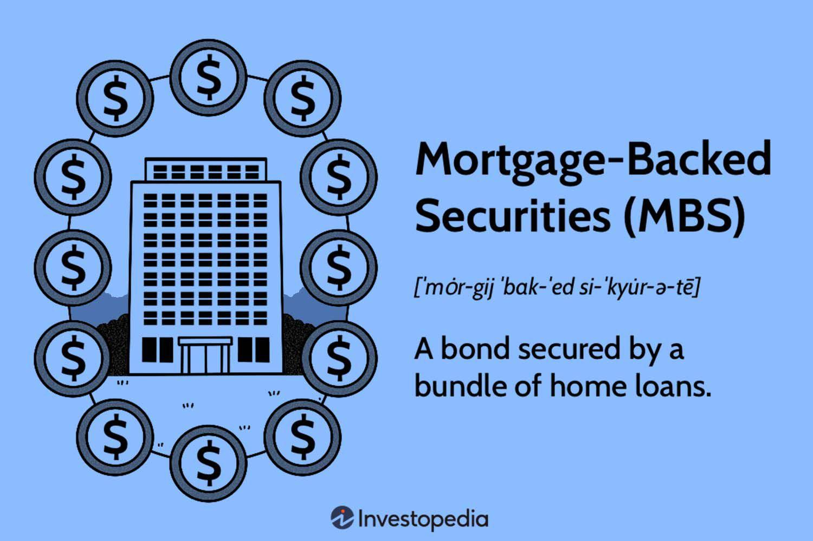

Mortgage-backed securities (MBS) stand as prominent financial instruments, intricately connecting homebuyers with investors. Emerging from the need to channel mortgage debt from lenders to the broader capital markets, MBS serve as a crucial bridge between housing finance and investment portfolios. This article examines the complexity of these instruments, focusing on financial guarantees, investment risks, and the role of algorithmic trading. By gaining insights into these elements, investors are better positioned to make informed decisions and successfully navigate the evolving real estate investment landscape.

Tracing back to their inception, MBS have evolved significantly, gaining prominence and experiencing increased scrutiny over the years. These securities have been instrumental in enabling liquidity in the housing market, thus facilitating home ownership and contributing to economic growth. However, the inherent complexity and the structured layers of risk associated with MBS cannot be overlooked, especially given their pivotal role in the financial landscape, culminating notably in the 2008 financial crisis. During this period, MBS, particularly those linked to subprime loans, revealed vulnerabilities in risk assessment and market practices, leading to widespread financial disruptions.



The piece further identifies key themes such as the various risks tied to MBS and their implications on financial markets. These include prepayment risks, interest rate fluctuations, and credit quality which challenge the investors' ability to accurately forecast returns. Moreover, the advancement of algorithmic trading has introduced a new frontier in MBS investment. By leveraging computational power and data analytics, algorithmic trading enhances market efficiency and precision, providing sophisticated tools for managing diverse MBS portfolios. Despite its advantages, this practice also introduces challenges related to data accuracy, market volatility, and regulatory compliance.

Emerging trends suggest that while MBS continue to play a significant role in modern financial markets, there remains a need for robust regulatory oversight to prevent past mishaps and safeguard against potential future crises. Through technology and strategic risk management, MBS stays relevant in promoting homeownership and offering diversified investment opportunities. Understanding the structural dynamics and historical lessons of MBS is essential for investors aiming to strategically engage with these complex financial instruments.

## Table of Contents

## Understanding Mortgage-Backed Securities

Mortgage-backed securities (MBS) are financial products that streamline mortgage loans by aggregating, or pooling, multiple loans and converting them into tradable assets. This process provides an essential link between the mortgage market and capital markets, offering investors an opportunity to earn returns based on the performance of these loans. Similar to bonds, MBS provide periodic payments derived from the interest and principal that homeowners pay on their mortgages.

The MBS market is largely categorized into two segments: agency-backed and non-agency-backed securities. Agency-backed MBS are issued by government-sponsored enterprises (GSEs) like Fannie Mae, Freddie Mac, and Ginnie Mae. These securities often come with implicit government guarantees, which help mitigate default risks. As a result, agency-backed MBS are generally perceived as lower risk investment options.

Conversely, non-agency MBS do not have such government guarantees, making them inherently riskier. However, they offer the potential for higher returns to compensate for increased credit risk. These securities might attract investors seeking higher yield opportunities, but thorough evaluation of the underlying loans' credit quality is essential to manage associated risks effectively.

MBS play a pivotal role in the broader housing finance system by enhancing [liquidity](/wiki/liquidity-risk-premium) and lowering risk exposure for mortgage lenders. By converting illiquid mortgage assets into liquid securities, lenders can use the proceeds to issue new loans, thus facilitating homeownership and stimulating economic activity. In summary, MBS contribute significantly to the smooth functioning of housing finance, providing benefits to both market participants and the wider economy.

## Types of Mortgage-Backed Securities

Mortgage-backed securities (MBS) are financial instruments created by pooling together mortgage loans, which are then sold to investors. The distinct structures of MBS, namely pass-throughs and collateralized mortgage obligations (CMOs), cater to different investor profiles based on their unique risk-return characteristics.

### Pass-Through Securities

Pass-through securities are the simplest form of MBS. These securities function by collecting repayments from the mortgage pool and passing them directly to investors. Each investor receives a proportional share of the principal and interest payments made by homeowners. A significant aspect of pass-throughs is the prepayment risk. Homeowners may pay off their mortgages earlier than expected due to refinancing or home sales, impacting the cash flows received by investors. This prepayment risk can affect the yield, making it crucial for investors to consider [interest rate](/wiki/interest-rate-trading-strategies) trends and borrower behavior.

### Collateralized Mortgage Obligations (CMOs)

Collateralized mortgage obligations represent a more structured type of MBS. CMOs segment the cash flows from mortgage pools into different tranches, each having distinct maturities and risk levels. This stratification allows investors to select tranches that align with their risk tolerance and investment horizons. For instance, shorter-maturity tranches might attract conservative investors, whereas longer-maturity or interest-only tranches may appeal to those seeking higher returns. By assigning different cash flow priorities to tranches, CMOs effectively manage prepayment risks, offering investors tailored investment solutions.

### Agency vs. Non-Agency MBS

When evaluating MBS, the distinction between agency and non-agency securities is crucial. Agency MBS are backed by government-sponsored entities like Fannie Mae, Freddie Mac, and Ginnie Mae, and [carry](/wiki/carry-trading) an implicit government guarantee that reduces the risk of default. These securities tend to have lower yields relative to their non-agency counterparts. Non-agency MBS, which lack such guarantees, carry higher credit and default risks but offer potential for greater returns. Investors in non-agency MBS must thoroughly analyze the underlying mortgage quality and the creditworthiness of borrowers to assess risks accurately.

In conclusion, understanding the various types of MBS and their associated risk-return profiles is fundamental for investors seeking to diversify their portfolios with these instruments. Whether opting for the straightforward structure of pass-throughs, the complex stratification of CMOs, or navigating the agency versus non-agency spectrum, informed decisions hinge on a comprehensive assessment of the characteristics and risks inherent in each MBS type.

## Financial Guarantees and Investment Risks

Mortgage-backed securities (MBS) are pivotal components of the financial landscape, often distinguished by the financial guarantees they carry, which significantly impact investment risks. Agency MBS are backed by government-sponsored entities like Fannie Mae, Freddie Mac, and Ginnie Mae. These agencies provide a safety net, ensuring that investors receive payments even if borrowers default. This guarantee considerably lowers the credit risk associated with these securities, making them attractive to risk-averse investors. Fannie Mae and Freddie Mac, in particular, offer implicit government guarantees, while Ginnie Mae provides an explicit government guarantee, ensuring the repayment of principal and interest.

Conversely, non-agency MBS do not benefit from such guarantees, rendering them subject to higher credit risks. These securities are issued by private entities, exposing investors to the quality and performance of the underlying mortgage loans. Due to the absence of backing by government agencies, non-agency MBS necessitate rigorous scrutiny of credit risks but, concurrently, offer potentially higher yields to compensate for their increased risk profile.

Investors must carefully evaluate several critical factors when engaging with MBS investments. One primary concern is prepayment risk, the risk that homeowners might pay off their mortgages early. This could happen if interest rates fall, leading borrowers to refinance at lower rates, subsequently reducing the expected returns for investors who will receive their principal back sooner than anticipated. Prepayment risk is particularly prevalent in pass-through MBS, where cash flows directly depend on the borrower’s payment schedule.

Interest rate fluctuations also present significant risks. Typically, as interest rates rise, the value of existing MBS may decline since newer issues might offer higher returns. The sensitivity to interest rate changes, often described as duration risk, necessitates careful market analysis and strategic position adjustments.

Additionally, the credit quality of the underlying mortgage loans is paramount. Factors such as borrower credit scores, loan-to-value ratios, and the economic environment influence the probability of defaults within the MBS pool. Investors must rigorously assess these variables to forecast potential financial returns and risks accurately.

In summary, while agency MBS offers a safeguard against defaults through government backing, resulting in lower yields, non-agency MBS presents higher risk and reward mechanisms, driven by the absence of such guarantees. A balanced investment approach, considering prepayment tendencies, interest rate trends, and credit quality, is essential for optimizing investment outcomes in MBS markets.

## Algorithmic Trading and Its Role in MBS

Algorithmic trading has significantly transformed the investment landscape for mortgage-backed securities (MBS), enhancing trading efficiency through the use of sophisticated algorithms to analyze vast amounts of data for rapid decision-making. These algorithms can assess a multitude of factors such as interest rates, prepayment speeds, and overall market conditions, enabling investors to optimize their MBS strategies with greater precision.

One of the primary advantages of [algorithmic trading](/wiki/algorithmic-trading) is its ability to handle complex MBS portfolios efficiently. Traditional trading methods can be cumbersome and time-consuming, whereas algorithms offer speed and accuracy, executing trades within milliseconds based on predefined criteria. This rapid execution is crucial in managing the intricacies of MBS, where market movements can significantly impact portfolio valuations.

Algorithms operate by processing historical and real-time data, using statistical models and [machine learning](/wiki/machine-learning) techniques to forecast market trends and identify potential investment opportunities. For instance, they might analyze historical interest rate trends to predict future movements, allowing investors to hedge against potential fluctuations. Similarly, algorithms can evaluate prepayment patterns, which affect the cash flow associated with MBS, thereby assisting investors in adjusting their positions accordingly.

Despite the benefits, algorithmic trading also presents several challenges. Ensuring data accuracy is paramount, as erroneous data can lead to flawed investment decisions. Moreover, market [volatility](/wiki/volatility-trading-strategies) demands that these algorithms be adaptable, promptly responding to quick shifts in market dynamics. Additionally, regulatory compliance is a critical concern, with authorities imposing various rules to maintain market integrity and prevent issues like market manipulation.

Algorithmic trading in the MBS market is supported by advanced programming languages like Python, valued for its extensive libraries and frameworks that cater to data analysis and financial modeling. Here's an example of a simple Python snippet that might be used to assess an MBS investment by analyzing interest rate trends:

```python
import numpy as np
import pandas as pd
from sklearn.linear_model import LinearRegression

# Example dataset of interest rates over time
data = {'Time': [1, 2, 3, 4, 5], 'InterestRate': [2.5, 2.6, 2.7, 2.85, 3.0]}
df = pd.DataFrame(data)

# Linear regression model to predict future interest rates
X = df[['Time']]
y = df['InterestRate']
model = LinearRegression()
model.fit(X, y)

# Predicting interest rate for the next time period
future_time = 6
predicted_rate = model.predict(np.array([[future_time]]))

print(f"Predicted Interest Rate for Time {future_time}: {predicted_rate[0]:.2f}%")
```

This script uses linear regression to predict future interest rates based on past values, assisting investors in projecting MBS returns in response to interest rate changes.

In summary, algorithmic trading in the MBS sector introduces unprecedented speed and precision, transforming the way investors manage complex portfolios. However, the need for accurate data, adaptability to volatility, and adherence to regulatory standards are essential to harness these benefits effectively.

## The Impact of the 2008 Financial Crisis on MBS

The 2008 financial crisis starkly highlighted the weaknesses within the mortgage-backed securities (MBS) market, with subprime mortgages being a notable point of vulnerability. At the core of the crisis was a systemic failure to accurately assess risks associated with these financial instruments. During the pre-crisis period, financial institutions frequently deployed inadequate models, often underestimating the credit risk inherent in subprime mortgage pools. This misjudgment was exacerbated by excessive leverage—a strategy where investors borrowed heavily to invest in MBS, betting on continued rises in housing prices. 

As housing prices began to decline, the adverse impacts of this leverage became apparent. Borrowers with subprime mortgages, characterized by lower creditworthiness, started defaulting at unprecedented rates. The ensuing cascade of defaults eroded the value of MBS portfolios, forcing financial institutions worldwide to confront substantial losses. This sequence of events not only destabilized financial markets but also triggered a global economic downturn.

In response to the crisis, regulatory bodies implemented a suite of measures aimed at bolstering transparency and mitigating future risks in the MBS market. Regulations such as the Dodd-Frank Wall Street Reform and Consumer Protection Act in the United States introduced stringent oversight protocols, mandating greater disclosure of the risk characteristics of MBS and enhancing capital requirements for financial institutions. Moreover, the establishment of the Consumer Financial Protection Bureau (CFPB) was aimed at ensuring fairer loan practices to prevent similarly imprudent lending.

These regulatory reforms have been instrumental in reshaping the landscape of the MBS market, fostering a framework where risk is more acutely managed. While these measures have increased costs for financial institutions in compliance and reporting, they are widely viewed as necessary steps to safeguard against the recurrence of a systemic failure akin to the 2008 crisis.

## Current Trends and Future Outlook

Regulatory reforms introduced after the 2008 financial crisis have been pivotal in stabilizing the mortgage-backed securities (MBS) market. These reforms focus on enhancing transparency, strengthening oversight, and improving risk management practices. Key initiatives include the Dodd-Frank Wall Street Reform and Consumer Protection Act, which mandates higher capital requirements and stress testing for financial institutions involved with MBS, and the establishment of the Consumer Financial Protection Bureau (CFPB) to oversee consumer-related financial products, including mortgages.

Technological advancements have significantly impacted the trading of MBS, enabling more efficient market operations. Algorithmic trading now plays a crucial role in this sector, utilizing vast datasets and machine learning techniques to optimize trading strategies based on real-time analysis of market variables. These technologies enhance the precision and speed of transactions, ultimately improving liquidity and price discovery within the market. The following Python pseudocode illustrates a simple algorithmic strategy that could be employed for trading MBS, incorporating interest rate analysis:

```python
import numpy as np

def moving_average_strategy(data, short_window=30, long_window=90):
    short_moving_avg = np.convolve(data, np.ones(short_window)/short_window, mode='valid')
    long_moving_avg = np.convolve(data, np.ones(long_window)/long_window, mode='valid')
    signal = np.zeros(len(short_moving_avg))
    signal[short_moving_avg > long_moving_avg] = 1  # Buy signal
    signal[short_moving_avg < long_moving_avg] = -1 # Sell signal
    return signal
```

This code calculates short and long moving averages and generates buy or sell signals accordingly, an approach that can be adapted for MBS trading algorithms.

Moreover, non-bank financial entities, such as hedge funds and private equity firms, are increasingly influential in the MBS market. These entities often have more flexible investment strategies and innovative financial products compared to traditional banks, contributing to the diversification and dynamism of the market landscape.

Looking forward, mortgage-backed securities are expected to continue playing a significant role in supporting homeownership, appealing to investors seeking diversified fixed-income assets. The shift towards sustainable and green MBS is gaining [momentum](/wiki/momentum), aligning with broader environmental, social, and governance ([ESG](/wiki/esg-investing)) investment trends. These instruments finance environmentally friendly projects and comply with ESG criteria, potentially appealing to a broader investor base concerned with social impact.

In summary, the MBS market is evolving with technological and regulatory advancements ensuring its stability and relevance. This evolution ensures that MBS remain a vital component of the financial ecosystem, supporting both investors and homebuyers in the future.

## Conclusion

Mortgage-backed securities (MBS) play a vital role in the financial ecosystem by providing both opportunities and potential risks for investors. They enable the conversion of illiquid mortgage assets into liquid, tradable financial instruments, thus facilitating capital flow and supporting the housing market. Comprehending the structural dynamics and risk profiles of MBS is crucial for investors to position themselves effectively. This involves understanding the distinct types of MBS, such as pass-throughs and collateralized mortgage obligations (CMOs), each with unique risk-return profiles influenced by factors like prepayment risk, interest rate fluctuations, and credit quality.

The advent of algorithmic trading has further transformed the MBS market. By utilizing advanced data analytics and computational power, algorithmic trading enhances the efficiency and precision of MBS transactions. Algorithms evaluate a myriad of factors, including interest rate trends and prepayment speeds, to develop optimized, responsive investment strategies. This technological advancement is indispensable for managing the complexities of MBS portfolios more effectively.

A thorough understanding of historical lessons, current trends, and regulatory environments is imperative for engaging with MBS successfully. The 2008 financial crisis highlighted the risks inherent to MBS, particularly with subprime mortgages and underscored the importance of accurate risk assessments. In response, regulatory reforms have been implemented to enhance transparency and stability in the MBS market.

In conclusion, MBS will continue to be a significant component of the global financial landscape. Their ability to support homeownership while offering diversified investment opportunities ensures their sustained relevance. However, investors must remain vigilant and informed about evolving market conditions and regulatory changes to navigate this complex financial terrain effectively.

## References & Further Reading

[1]: Fabozzi, F. J. (2016). ["The Handbook of Mortgage-Backed Securities, 7th Edition"](https://academic.oup.com/book/7943). Oxford University Press.

[2]: Gorton, G. B. (2010). ["Slapped by the Invisible Hand: The Panic of 2007"](https://papers.ssrn.com/sol3/papers.cfm?abstract_id=1401882). Oxford University Press.

[3]: Ashcraft, A. B., & Schuermann, T. (2008). ["Understanding the Securitization of Subprime Mortgage Credit."](https://papers.ssrn.com/sol3/papers.cfm?abstract_id=1071189) Federal Reserve Bank of New York Staff Report.

[4]: Hull, J. C. (2017). ["Risk Management and Financial Institutions, 5th Edition"](https://books.google.com/books/about/Risk_Management_and_Financial_Institutio.html?id=1J1QDwAAQBAJ). Wiley.

[5]: Fuster, A., et al. (2019). ["The Role of Technology in Mortgage Lending."](https://academic.oup.com/rfs/article/32/5/1854/5427780) National Bureau of Economic Research.