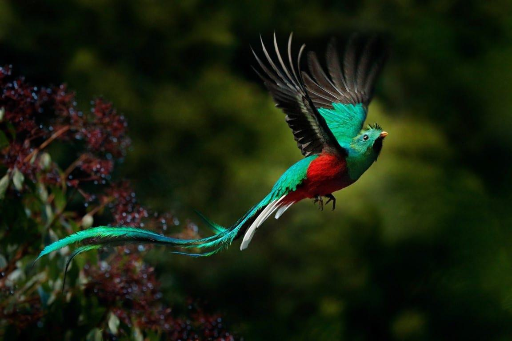

## Table of Contents

## What is the Guatemalan Quetzal?

The Guatemalan Quetzal is the official currency of Guatemala, a country in Central America. It is named after the quetzal bird, which is a colorful bird found in the region and is also a symbol of freedom in Guatemalan culture. The currency is abbreviated as "GTQ" and often symbolized as "Q." The quetzal was introduced in 1925, replacing the Guatemalan peso.

The quetzal is divided into 100 centavos. Banknotes are available in various denominations, including 1, 5, 10, 20, 50, 100, and 200 quetzales. Coins come in denominations of 1, 5, 10, 25, and 50 centavos, as well as 1 quetzal. The value of the quetzal can change compared to other currencies like the US dollar. People in Guatemala use the quetzal every day to buy things, pay for services, and more.

## How did the Guatemalan Quetzal get its name?

The Guatemalan Quetzal got its name from a special bird called the quetzal. This bird lives in the forests of Guatemala and other nearby countries. It has bright green and red feathers and a long tail. The quetzal is very important in Guatemalan culture because it stands for freedom and beauty. People in Guatemala love this bird so much that they decided to name their money after it.

When the Guatemalan Quetzal was first used in 1925, it replaced the old Guatemalan peso. The government chose the name "quetzal" to show how proud they are of their country and its natural beauty. Today, when people in Guatemala use the quetzal to buy things, it reminds them of their beautiful bird and their country's history.

## When was the Guatemalan Quetzal introduced as currency?

The Guatemalan Quetzal was introduced as the official currency of Guatemala in 1925. Before that, people in Guatemala used the Guatemalan peso. The government decided to change the currency to the quetzal to show how proud they are of their country and its special bird, the quetzal.

The quetzal bird is very important in Guatemala. It is known for its bright green and red feathers and long tail. People in Guatemala see the quetzal as a symbol of freedom and beauty. That's why they chose to name their money after this beautiful bird.

## What are the denominations of the Guatemalan Quetzal?

The Guatemalan Quetzal has different amounts of money that you can use. For paper money, you can find quetzals in 1, 5, 10, 20, 50, 100, and 200 quetzales. These are the big bills that people use to buy things that cost more money.

For coins, there are smaller amounts called centavos. You can find coins in 1, 5, 10, 25, and 50 centavos. There is also a coin worth 1 quetzal. People use these coins for buying things that cost less money.

## How does the exchange rate of the Quetzal work?

The exchange rate of the Guatemalan Quetzal tells you how many quetzals you can get for one unit of another currency, like the US dollar. This rate changes every day because it depends on how much people want to buy or sell quetzals compared to other currencies. If more people want quetzals, the value of the quetzal goes up. If fewer people want quetzals, the value goes down.

You can find out the current exchange rate from banks, money exchange places, or online websites. When you travel to Guatemala or send money there, you use the exchange rate to know how much your money is worth in quetzals. For example, if the exchange rate is 7.7 quetzals for 1 US dollar, then 10 US dollars would be worth 77 quetzals.

## What is the role of the Bank of Guatemala in managing the Quetzal?

The Bank of Guatemala, also known as Banco de Guatemala, is very important for managing the Quetzal. It is like the boss of all the money in Guatemala. The Bank of Guatemala makes sure that the Quetzal works well for people to use every day. They print the money, make new coins, and take old ones out of use when needed. They also keep an eye on how much money is in the country to make sure there is not too much or too little.

The Bank of Guatemala also helps decide the value of the Quetzal compared to other countries' money. They do this by working with other banks and looking at how much people want to buy or sell quetzals. This helps keep the Quetzal stable so that people can trust it when they buy things or save money. By doing all these things, the Bank of Guatemala makes sure that the Quetzal stays a good and reliable currency for everyone in Guatemala.

## How stable is the Guatemalan Quetzal compared to other currencies?

The Guatemalan Quetzal is pretty stable compared to some other currencies. It doesn't change its value too quickly like some other countries' money. The Bank of Guatemala helps keep it stable by watching how much people want to buy or sell quetzals and making sure there's the right amount of money in the country. This makes it easier for people in Guatemala to plan and use their money without big surprises.

But the Quetzal can still change in value compared to big currencies like the US dollar or the Euro. These changes happen slowly and are usually small. People who need to buy or sell quetzals can usually predict how much they will get or have to pay. Overall, the Quetzal is seen as a reliable currency in Central America, which helps the economy of Guatemala stay strong.

## What economic factors influence the value of the Quetzal?

The value of the Guatemalan Quetzal is affected by many things in the economy. One big thing is how much people want to buy or sell quetzals. If more people want to buy quetzals, its value goes up. If fewer people want them, the value goes down. Another thing is how much money the government has. If the government spends a lot of money and there's too much money around, the quetzal might lose value. Also, if Guatemala sells a lot of things to other countries, like coffee and bananas, and gets paid in other currencies, this can make the quetzal stronger.

Another [factor](/wiki/factor-investing) is the interest rates set by the Bank of Guatemala. If they make interest rates higher, it can attract more people to keep their money in quetzals, which makes the currency stronger. On the other hand, if interest rates are low, people might not want to keep their money in quetzals, and the currency could weaken. The overall health of Guatemala's economy, like how much people are working and how businesses are doing, also plays a big role. If the economy is doing well, the quetzal tends to be stronger. If the economy is struggling, the quetzal might lose value.

## How does the Quetzal impact trade and commerce in Guatemala?

The Guatemalan Quetzal is really important for trade and buying things in Guatemala. When people in Guatemala buy things from other countries, they use quetzals to pay for them. The value of the quetzal compared to other money, like the US dollar, can change how much things cost. If the quetzal is strong, Guatemalans can buy more things from other countries for less money. But if the quetzal is weak, things from other countries can become more expensive.

Inside Guatemala, the quetzal helps people buy and sell things every day. Businesses use quetzals to pay workers and to buy things they need. People use quetzals to buy food, clothes, and other things they need. If the quetzal is stable and people trust it, it makes it easier for businesses to plan and for people to save money. A stable quetzal helps keep the economy strong and helps people feel good about using their money.

## What are the security features on Quetzal banknotes and coins?

Guatemalan Quetzal banknotes and coins have special features to make sure they are real and not fake. On the banknotes, you can see a clear part called a window that shows a picture of the quetzal bird when you hold it up to the light. There's also a shiny strip that runs through the note, and if you look closely, you'll see tiny letters and numbers that are hard to copy. The paper feels special, too, because it has tiny fibers in it that you can see if you look really close.

Coins also have things to keep them safe from being copied. They have special patterns and shapes that are hard to make if you're not supposed to. Some coins have a shiny part that changes color when you move them around. All these things help make sure that the money people use in Guatemala is real and can be trusted.

## How has the design of the Quetzal currency evolved over time?

The design of the Guatemalan Quetzal has changed a lot since it first started in 1925. When it was new, the quetzal banknotes had pictures of important people and places in Guatemala. The first ones showed a picture of the quetzal bird on the front and scenes from Guatemala on the back. As time went on, the designs got better and more colorful. New banknotes were made with different colors and more details to make them harder to copy and easier to tell apart.

Over the years, the Bank of Guatemala kept updating the look of the quetzal. They added special features like clear windows and shiny strips to make sure the money was real. The coins also changed. They started with simple designs but got more detailed and included different shapes and colors. Today, the quetzal banknotes and coins show a lot about Guatemala's history and culture, and they keep getting better to help stop people from making fake money.

## What are the future prospects for the Guatemalan Quetzal in the global economy?

The future of the Guatemalan Quetzal in the global economy looks promising, but it depends on how well Guatemala's economy does. If Guatemala keeps growing and selling more things to other countries, the quetzal could become stronger. This would make it easier for people in Guatemala to buy things from other places and help the country's businesses do well. But if the economy has problems, the quetzal might not do as well. The Bank of Guatemala will keep working to make sure the quetzal stays stable and trusted by people around the world.

The quetzal is also affected by what happens in the world's big economies, like the United States and Europe. If these countries do well, it can help the quetzal because more people might want to buy things from Guatemala. But if these big economies have problems, it could make the quetzal weaker. Overall, the future of the quetzal will depend on how Guatemala manages its money and how it fits into the global economy. With good planning and strong trade, the quetzal can keep being a reliable currency for Guatemala.

## What is the Role of GTQ in Forex Markets?

The Guatemalan Quetzal (GTQ) plays a nuanced role in the foreign exchange ([forex](/wiki/forex-system)) markets, characterized by unique trading dynamics and [volatility](/wiki/volatility-trading-strategies) levels influenced by both domestic and international factors. As a free-floating currency, the GTQ's value is determined by supply and demand dynamics in the forex markets. However, its exposure to global economic activities makes the GTQ's forex performance subject to several critical influences.

### Trading Dynamics and Volatility

The GTQ's trade [volume](/wiki/volume-trading-strategy) in the forex markets is comparatively lower than that of major currencies like the U.S. dollar (USD), euro (EUR), or Japanese yen (JPY). Despite this, it is significant because it reflects Guatemala's economic activities and interactions with global markets. The volatility of the GTQ can be attributed to its responsiveness to economic indicators such as inflation rates, interest rates, and political stability within Guatemala. Due to its lower trade volume, the GTQ often exhibits higher volatility compared to more traded currencies, which can present both risks and opportunities for traders.

Forex traders often employ volatility measures such as the standard deviation or average true range (ATR) to gauge the GTQ's price fluctuations over a designated period. For example, the standard deviation ($\sigma$) of daily returns can be calculated to assess the currency’s volatility:

$$

\sigma = \sqrt{\frac{1}{N} \sum_{i=1}^{N} (r_i - \bar{r})^2}
$$

where $r_i$ represents individual daily returns and $\bar{r}$ is the average daily return over N trading days.

### Impact of International Trade and Remittances

International trade significantly impacts the GTQ, given Guatemala's steady export activities in agricultural products such as coffee, bananas, and sugar. The balance of trade influences the currency as an increase in exports can lead to a higher demand for the GTQ, potentially appreciating its value. Conversely, higher imports can increase the supply of the GTQ in forex markets, exerting downward pressure on its value.

Remittances form another crucial element in the GTQ's performance. As of recent data, Guatemala is one of the largest recipients of remittances in Latin America, primarily from Guatemalans living in the United States. These remittances bolster Guatemala's economy by increasing household incomes and consumption. When remittances are converted into GTQ from foreign currencies, particularly USD, an incremental demand for GTQ is created, which can influence the currency's forex standing.

In summary, the GTQ's role in the forex market is shaped by its volatility and interactive influences from international trade and remittance inflows. These elements make the GTQ both a challenging and potentially rewarding currency for forex traders, necessitating careful analysis and strategic trading approaches.

## References & Further Reading

[1]: Rolnick, D., Donti, P. L., Kaack, L. H., Kochanski, K., Lacoste, A., Sankaran, K., ... & Bengio, Y. (2019). ["Tackling Climate Change with Machine Learning."](https://arxiv.org/abs/1906.05433) *arXiv preprint arXiv:1906.05433*.

[2]: Lopez de Prado, M. (2018). ["Advances in Financial Machine Learning."](https://www.amazon.com/Advances-Financial-Machine-Learning-Marcos/dp/1119482089) Wiley.

[3]: Michie, D., Spiegelhalter, D. J., & Taylor, C. C. (Eds.). (1994). ["Machine Learning, Neural and Statistical Classification."](https://www.researchgate.net/publication/2335004_Machine_Learning_Neural_and_Statistical_Classification) Ellis Horwood.

[4]: Aronson, D. R. (2006). ["Evidence-Based Technical Analysis: Applying the Scientific Method and Statistical Inference to Trading Signals."](https://www.amazon.com/Evidence-Based-Technical-Analysis-Scientific-Statistical/dp/0470008741) Wiley & Sons.

[5]: Chan, E. (2008). ["Quantitative Trading: How to Build Your Own Algorithmic Trading Business."](https://github.com/ftvision/quant_trading_echan_book) John Wiley & Sons.