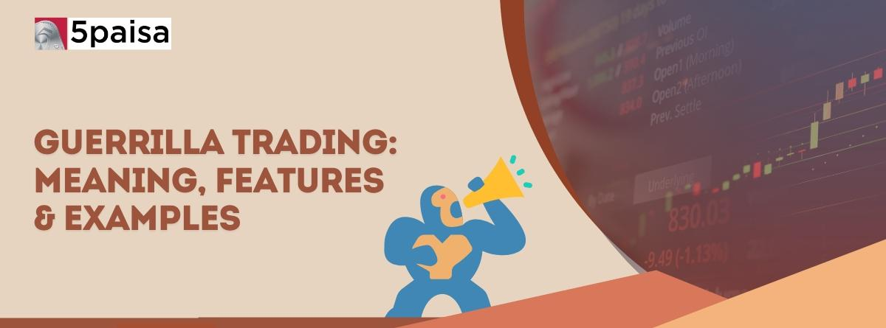

## Table of Contents

## What is guerrilla trading?

Guerrilla trading is a fast and aggressive way of buying and selling stocks or other financial assets. Traders who use this method try to make quick profits by taking advantage of small changes in the market. They often use a lot of borrowed money, which can make their gains bigger but also increases the risk of losing money.

This type of trading requires a lot of attention and quick decision-making. Guerrilla traders need to watch the market closely and be ready to act at any moment. It's not for everyone because it can be stressful and risky, but it can also be rewarding for those who are good at it and can handle the pressure.

## How does guerrilla trading differ from traditional trading?

Guerrilla trading and traditional trading are different in how they approach the market. Guerrilla trading is fast and aggressive. Traders who use this method try to make quick profits by jumping on small market changes. They often use a lot of borrowed money to make their gains bigger, but this also means they could lose more money if things go wrong. Guerrilla traders need to watch the market all the time and be ready to make quick decisions.

Traditional trading, on the other hand, is usually slower and more careful. Traders who use this method often hold onto their investments for a longer time, sometimes months or even years. They look at the big picture and make decisions based on long-term trends and careful analysis. Traditional trading is generally seen as less risky than guerrilla trading because it doesn't rely on quick, short-term moves in the market.

## What are the basic principles of guerrilla trading?

Guerrilla trading is all about being fast and aggressive in the stock market. The main idea is to make quick profits by taking advantage of small changes in the market. Traders who use this method watch the market very closely and are always ready to buy or sell at a moment's notice. They often use a lot of borrowed money to make their gains bigger, but this also means they could lose more money if the market moves against them.

Being a guerrilla trader means you have to be good at making quick decisions. You need to be able to spot opportunities and act on them fast. This type of trading can be very stressful and risky, but it can also be rewarding for those who are good at it and can handle the pressure. It's not for everyone, but for those who can manage it, guerrilla trading offers the chance to make money in a short amount of time.

## What kind of market conditions are best suited for guerrilla trading?

Guerrilla trading works best in markets that are moving a lot and changing quickly. When the market is going up and down a lot, there are more chances for guerrilla traders to make money. They can buy low and sell high in a short time. Markets with a lot of news and events that make prices change are good for guerrilla trading because there are more opportunities to make quick profits.

But guerrilla trading can be risky in markets that are not moving much. If the market is calm and prices are not changing a lot, it can be hard for guerrilla traders to find good opportunities. They might end up losing money if they can't find the right time to buy and sell. So, the best conditions for guerrilla trading are when the market is active and unpredictable.

## What are the essential tools and resources needed for guerrilla trading?

To do guerrilla trading well, you need some important tools and resources. A fast and reliable computer is a must because you need to be able to see what's happening in the market in real time. You also need a good internet connection so you can buy and sell quickly without any delays. A trading platform that has all the features you need, like real-time data and quick order execution, is very important. Many guerrilla traders use special software that can help them spot trends and make quick decisions.

Another key resource is access to real-time market data. This means you can see what's happening in the market right now, which is crucial for making fast trades. Some traders also use news feeds and financial news websites to stay updated on events that might affect the market. Having a good understanding of technical analysis can help too, as it lets you read charts and spot patterns that can guide your trading decisions. All these tools and resources help guerrilla traders stay on top of the market and make quick, smart trades.

## How can someone start practicing guerrilla trading?

To start practicing guerrilla trading, you first need to learn the basics. Read [books](/wiki/algo-trading-books) or watch videos about how the stock market works and what guerrilla trading is all about. It's also a good idea to take a [course](/wiki/best-algorithmic-trading-courses) or join a community where you can learn from people who are already doing it. Once you feel like you understand the basics, you can start using a demo trading account. This is a fake account where you can practice buying and selling without using real money. It's a safe way to get used to how fast and intense guerrilla trading can be.

After you've practiced on a demo account and feel ready, you can start with a small amount of real money. Begin with a small account so you don't risk losing a lot right away. Use the tools and resources you've learned about, like a fast computer, a good internet connection, and a reliable trading platform. Keep learning and improving your skills as you go. Remember, guerrilla trading can be risky, so always be careful and keep learning to get better at it.

## What are the common strategies used in guerrilla trading?

In guerrilla trading, one common strategy is called [scalping](/wiki/gamma-scalping). This means traders buy and sell stocks very quickly, often within minutes or even seconds, to make small profits from small price changes. They do this a lot of times in a day, and all those small profits can add up to a big amount. Scalping needs a lot of attention because you have to watch the market all the time and act fast.

Another strategy is called [momentum](/wiki/momentum) trading. This is when traders look for stocks that are moving a lot in one direction, either up or down. They jump in and trade with that movement, hoping to make money before the trend changes. Momentum traders use a lot of charts and data to spot these trends and make quick decisions.

Some guerrilla traders also use news trading. This means they watch for big news that can make stock prices move a lot. When they see news that could affect a stock, they buy or sell fast to take advantage of the price change. News trading can be risky because it's hard to predict how the market will react, but it can also lead to big profits if you get it right.

## What are the risks associated with guerrilla trading?

Guerrilla trading can be risky because it's all about making quick trades to make small profits. One big risk is that the market can move against you very fast. If you're using borrowed money to trade, which many guerrilla traders do, you could lose more than you have. This is called leverage, and it can make your losses bigger if things go wrong. Another risk is that you might make bad decisions if you're not watching the market closely enough or if you're not fast enough to act on the right opportunities.

Another problem with guerrilla trading is the stress it can cause. Because you have to make quick decisions all the time, it can be really hard on your mind and body. If you're not good at handling stress, you might make mistakes that cost you money. Also, because guerrilla trading is so fast-paced, there's a higher chance of making errors, like buying or selling at the wrong time. This can lead to big losses if you're not careful.

## How can risk management be effectively implemented in guerrilla trading?

To manage risk in guerrilla trading, it's important to set clear rules for yourself. One good rule is to use stop-loss orders. This means you tell your trading platform to sell a stock automatically if it drops to a certain price. This can help you limit how much money you lose on a single trade. Another rule is to never risk more than a small part of your money on one trade. If you only use a little bit of your money each time, even if you lose, you won't lose everything.

Another way to manage risk is to keep learning and practicing. The more you know about the market and the better you get at spotting trends, the less likely you are to make big mistakes. It's also a good idea to take breaks and not trade all the time. This can help you stay calm and make better decisions. Remember, even though guerrilla trading can be exciting, it's important to be careful and always think about how to protect your money.

## Can you provide a real-world example of guerrilla trading?

Imagine a trader named Sarah who decides to try guerrilla trading. She uses a fast computer and a good internet connection to watch the stock market all day. One morning, she sees that a company called TechCo is about to release a new product. The news makes the stock price of TechCo start to go up. Sarah quickly buys some shares of TechCo, hoping to sell them for a small profit soon. Within minutes, the price goes up a bit more, and she sells her shares, making a small profit. She does this many times throughout the day, always looking for small changes in the market to make quick trades.

Later that day, Sarah hears that another company, FoodCorp, is in the news because of a problem with their product. The stock price of FoodCorp starts to drop. Sarah quickly sells some shares of FoodCorp short, betting that the price will keep going down. It does, and after a few minutes, she buys back the shares at a lower price, making another small profit. By the end of the day, Sarah has made many small trades like these, adding up to a good amount of money. But she knows it's risky and she has to be very careful to keep watching the market and making quick decisions.

## What are the advanced techniques used by expert guerrilla traders?

Expert guerrilla traders often use a technique called [algorithmic trading](/wiki/algorithmic-trading). This means they use computer programs to make trades automatically based on certain rules. These programs can watch the market all the time and make trades much faster than a person could. They look for patterns in the market and make quick decisions to buy or sell. This can help the traders make more money because the computer can act faster and doesn't get tired or stressed like a person might.

Another advanced technique is called high-frequency trading. This is when traders make a lot of trades in a very short time, sometimes thousands of trades in a single day. They use special computers and software to do this. High-frequency trading can be very profitable, but it's also very risky. It needs a lot of money and technology, and even small mistakes can cost a lot. Expert guerrilla traders who use this technique need to be very good at understanding the market and using their tools to stay ahead.

## How does guerrilla trading adapt to different financial markets?

Guerrilla trading can work in many different financial markets, like stocks, [forex](/wiki/forex-system), and cryptocurrencies. The main idea is always the same: to make quick profits from small changes in the market. But the way guerrilla traders do this can change depending on the market. In the stock market, they might focus on news about companies or big events that can move stock prices. In the forex market, they watch for changes in currency values, often caused by economic news or policy changes. And in the [cryptocurrency](/wiki/cryptocurrency) market, they look for quick price changes that can happen because of news or just the way the market moves.

Even though the basic idea is the same, guerrilla traders need to know a lot about each market to do well. They need to understand what makes prices move in each market and how to use that knowledge to make quick trades. For example, in the forex market, they might use a lot of technical analysis to spot trends and make trades. In the cryptocurrency market, they might focus more on news and social media because those can have a big impact on prices. By learning about each market and using the right tools, guerrilla traders can adapt their strategies to make money no matter which market they're trading in.

## References & Further Reading

[1]: Bergstra, J., Bardenet, R., Bengio, Y., & Kégl, B. (2011). ["Algorithms for Hyper-Parameter Optimization."](https://dl.acm.org/doi/10.5555/2986459.2986743) Advances in Neural Information Processing Systems 24.

[2]: ["Advances in Financial Machine Learning"](https://www.amazon.com/Advances-Financial-Machine-Learning-Marcos/dp/1119482089) by Marcos Lopez de Prado

[3]: ["Evidence-Based Technical Analysis: Applying the Scientific Method and Statistical Inference to Trading Signals"](https://www.amazon.com/Evidence-Based-Technical-Analysis-Scientific-Statistical/dp/0470008741) by David Aronson

[4]: ["Machine Learning for Algorithmic Trading"](https://github.com/stefan-jansen/machine-learning-for-trading) by Stefan Jansen

[5]: ["Quantitative Trading: How to Build Your Own Algorithmic Trading Business"](https://github.com/LucindaYa/quant-resources/blob/master/Quantitative%20Trading%20How%20to%20Build%20Your%20Own%20Algorithmic%20Trading%20Business.pdf) by Ernest P. Chan