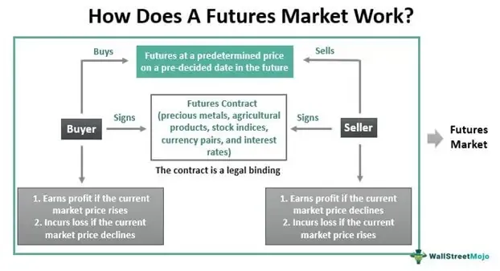

In the fast-paced world of financial trading, strategies that offer quick profits are highly sought after by investors and traders alike. Among these strategies, Guerrilla Trading stands out due to its unique focus on executing a high volume of small, rapid transactions aimed at capturing minor price fluctuations in the market. Unlike other trading strategies that may prioritize larger, long-term gains, Guerrilla Trading capitalizes on brief moments within the trading day, relying on the ability to quickly enter and exit positions as prices move.

This article aims to explore the intricacies of Guerrilla Trading, providing insights into the mechanics of how this strategy operates. The approach involves the use of advanced technical analysis tools and an emphasis on leveraging existing market conditions, enabling traders to potentially achieve quick, albeit small, profits consistently. However, like all trading strategies, Guerrilla Trading is not without its potential risks, which stem from the highly leveraged positions involved and the rapid decision-making required.



As part of our exploration, we will examine the benefits and drawbacks of Guerrilla Trading, comparing it with other common strategies such as day trading and swing trading. Key differentiators include the duration of trades and the frequency of transactions, which drive the need for speed and precision in Guerrilla Trading. This article will also discuss the future potential of Guerrilla Trading, particularly in light of technological advancements that enhance decision-making and execution speed. By understanding both the opportunities and challenges associated with Guerrilla Trading, readers can better evaluate its suitability as a component of their trading endeavors.

## Table of Contents

## What is Guerrilla Trading?

Guerrilla Trading is a short-term trading technique designed to capitalize on minor price movements within a financial market, aiming to achieve quick, small profits per transaction with minimal risk. This approach requires traders to execute multiple trades within a single trading session, which involves holding positions for mere minutes before closing them. The rapid execution seen in Guerrilla Trading is a distinctive feature that resembles scalping, another high-frequency trading strategy. However, Guerrilla Trading is executed at an even faster pace, demanding swift decision-making and execution skills.

The core objective of Guerrilla Trading is to minimize exposure to market volatility, reducing the chances of incurring substantial losses. This reduction in risk per trade is achieved through the avoidance of prolonged market exposure, favoring brief interactions that seek to exploit brief price discrepancies. The strategy thrives in highly liquid markets, where the ability to enter and exit positions quickly is significantly enhanced.

Although modeling tools and sophisticated trading platforms are often employed to enhance Guerrilla Trading practices, the essence of this strategy lies in its speed and precision. Traders engaging in Guerrilla Trading must rely heavily on technical analysis, employing charts and patterns to determine opportune moments for trade execution. The alignment of high-frequency trades with minimal profit targets necessitates a keen understanding of market dynamics and rapid reflexes, qualities that distinguish successful Guerrilla Traders from their peers.

## How Guerrilla Trading Works

Guerrilla Trading is particularly effective in the [forex](/wiki/forex-system) market due to the inherent characteristics of tight spreads and high [liquidity](/wiki/liquidity-risk-premium) that define this financial environment. Tight spreads refer to the minimal difference between the bid and ask prices, allowing traders to enter and [exit](/wiki/exit-strategy) positions with reduced costs, thereby optimizing their potential returns. High liquidity ensures that large volumes of trades can be executed without significantly affecting market prices, a crucial [factor](/wiki/factor-investing) for a strategy that relies on rapid transaction turnover.

Traders engaging in Guerrilla Trading employ advanced technical analysis tools to pinpoint profitable entry and exit points. These tools often include moving averages, Bollinger Bands, and various [momentum](/wiki/momentum) indicators, which help in identifying short-term trends and potential price reversals. The application of these tools requires a deep understanding of technical patterns and real-time data analysis to capitalize on fleeting opportunities. For instance, Python libraries such as 'Pandas' and 'TA-Lib' can be utilized to perform complex calculations and generate signals for optimal trade execution. Here is a basic Python snippet for calculating a moving average, a common technique used in Guerrilla Trading:

```python
import pandas as pd

# Sample data
data = {'Price': [1.301, 1.302, 1.303, 1.304, 1.305, 1.306, 1.307]}
prices = pd.DataFrame(data)

# Calculate a simple moving average
prices['SMA'] = prices['Price'].rolling(window=3).mean()

print(prices)
```

This strategic approach is highly leveraged, amplifying both the potential for high returns and the inherent risks involved. Leverage in the forex market allows traders to control a large position with a relatively small amount of capital. For example, with a leverage ratio of 1:100, a trader can control a position worth $100,000 with an initial margin of $1,000. While this magnifies the potential gains from favorable market movements, it equally increases the exposure to losses if the market moves against the trade. Thus, risk management is paramount, often involving the use of stop-loss orders and careful capital allocation to mitigate adverse outcomes.

In summary, Guerrilla Trading leverages the favorable conditions of the forex market, such as tight spreads and high liquidity, coupled with advanced technical analysis and strategic use of leverage, to execute rapid trades for small but consistent profits. However, the associated risks necessitate a disciplined and knowledgeable approach to trading.

## Benefits and Drawbacks of Guerrilla Trading

Guerrilla Trading offers significant benefits, primarily through its potential for consistent small profits. This strategy focuses on making numerous, rapid transactions, aiming to capitalize on minute price fluctuations. The advantage of this approach is that it minimizes the exposure to market [volatility](/wiki/volatility-trading-strategies), thereby reducing the risk of accruing large losses during market swings. This minimized exposure is particularly beneficial when trading in highly volatile markets, where prices can change drastically within short periods.

The risk management aspect of Guerrilla Trading makes it a compelling choice for traders seeking to limit their downside. By maintaining a brief presence in the market on each trade, traders are less vulnerable to significant adverse movements. This approach contrasts with longer-term strategies where prolonged exposure increases the possibility of encountering unfavorable conditions.

Despite its advantages, Guerrilla Trading comes with notable drawbacks. The high-frequency nature of executing numerous trades necessitates the payment of transaction costs on each individual trade. Over time, these costs can significantly affect the overall profitability of the trading strategy. For example, even if a trader achieves a consistent profit on numerous trades, the cumulative costs associated with frequent transactions, such as brokerage fees or spreads, may erode the financial gains.

Additionally, the strategy demands a high level of precision and quick decision-making, often requiring advanced technical trading systems and algorithms. Traders must be adequately equipped to enter and exit trades within seconds, making the need for a robust technological setup vital. This technological dependency can serve as a barrier for some traders, particularly those without access to advanced trading platforms or real-time data feeds.

In summary, while Guerrilla Trading presents opportunities for steady profits with reduced risk exposure, it also requires careful consideration of transaction costs and technological capabilities to ensure sustainable success.

## Guerrilla Trading vs. Other Strategies

Guerrilla Trading is distinct from many other trading strategies, primarily due to its exceptionally brief trade duration and [high frequency](/wiki/high-frequency-trading). This strategy is notably different from [day trading](/wiki/day-trading-spy), which typically involves holding positions for several hours within a single trading day. While day traders might execute several trades a day, Guerrilla Traders might execute even more, each lasting only a few minutes. The focus in Guerrilla Trading is on capturing minor price fluctuations, making it an extremely intensive approach requiring rapid decision-making and execution.

Compared to swing trading, the differences become even more pronounced. Swing trading involves holding positions from several days to weeks, aiming to capitalize on expected price movement trends. This strategy relies on technical analysis over longer time frames, allowing traders to set stop-loss and take-profit points based on broader market predictions. However, Guerrilla Trading zeros in on minute price movements and requires traders to react quickly to fleeting market opportunities.

Key to understanding Guerrilla Trading’s high-frequency approach is the concept of statistical [arbitrage](/wiki/arbitrage). It often utilizes [algorithmic trading](/wiki/algorithmic-trading) systems to predict and exploit small price inefficiencies in the market, often executing trades so rapidly that manual trading would not be feasible. Market liquidity and transaction costs play critical roles in the success of this strategy. For example, tighter bid-ask spreads in highly liquid markets, such as forex, enhance its effectiveness by minimizing the cost per trade.

By contrast, both day and swing traders can take advantage of less liquid markets because their strategies allow for adjusting to broader price movements over extended periods. The specificity and precision required in Guerrilla Trading limit its applicability to markets where such frequent trading can still be cost-effective.

In summary, while Guerrilla Trading shares some similarities with other trading strategies in terms of technical and risk analysis, its focus on short-duration trades and high transaction frequency marks a significant departure from methods like day and swing trading. This necessitates distinct execution systems and mental discipline to manage the rapid pace and large [volume](/wiki/volume-trading-strategy) of trades.

## Implementing Guerrilla Trading

Successful implementation of Guerrilla Trading necessitates a combination of discipline, speed, and the effective use of technology. Traders engaging in this strategy must be equipped to execute trades with minimal delay, often requiring a high-speed internet connection to ensure that their actions occur in real-time. This immediacy is crucial for capturing the small price fluctuations that Guerrilla Trading targets. 

Utilization of sophisticated trading tools and platforms is imperative for optimizing performance. Modern trading platforms offer a suite of features such as advanced charting tools, real-time data feeds, and algorithmic trading capabilities. These tools allow traders to conduct thorough technical analyses and automate trade executions, thereby achieving the precision and speed required for Guerrilla Trading. Platforms might include functions such as:

- **Automated Trading Systems (ATS):** These systems can execute trades based on pre-set criteria without human intervention, ensuring prompt reactions to market changes.
- **Technical Indicators and Analysis:** Tools such as Moving Averages, Relative Strength Index (RSI), and Bollinger Bands can help identify potential entry and exit points, although their use requires thorough understanding and experience.

Moreover, continuous learning and adaptation to evolving market conditions are essential. Financial markets are dynamic, and strategies that prove successful one day may not necessarily yield the same results the next. Traders must remain vigilant, continually updating their knowledge and refining their strategies. This includes adjusting to new market trends, understanding shifts in economic indicators, and incorporating the latest technological advancements in trading systems.

The practice of Guerrilla Trading also demands a high level of emotional control and discipline. The rapid pace and high frequency of trades can lead to stress and impulsive decision-making. Traders must develop a rigorous mental framework to prevent emotions from influencing their trading decisions. This often involves setting strict trading limits and adhering to predefined trading plans to mitigate risks.

In conclusion, implementing Guerrilla Trading effectively requires more than just the ability to execute rapid trades. It involves a comprehensive approach that includes leveraging technology, continuous education, and maintaining emotional resilience, all of which are necessary to thrive in the fast-paced environment of Guerrilla Trading.

## Real-world Examples of Guerrilla Trading

Real-world instances of Guerrilla Trading provide numerous insights into both its potential benefits and risks. Successful traders in this domain often employ a combination of disciplined strategies and robust risk management practices to achieve consistent profits. One prominent example involves a forex trader who utilized Guerrilla Trading techniques to exploit minor price discrepancies in the highly liquid EUR/USD currency pair. By meticulously analyzing historical data and employing advanced algorithmic tools, the trader managed to execute several profitable trades within a short time frame, showcasing the viability of Guerrilla Trading when precise execution and timing converge.

Conversely, lessons from failed attempts serve as cautionary tales highlighting the importance of emotional control and continuous market analysis. A noteworthy example includes a trader who, despite having a solid technical strategy, succumbed to psychological pressures in a volatile market. This resulted in impulsive trading decisions that deviated from their established plan, leading to significant financial losses. Such failures underscore the necessity for traders to maintain emotional discipline and adhere strictly to pre-defined trading strategies.

Moreover, continuous market analysis emerges as a critical component in Guerrilla Trading. The fast-paced nature of this strategy demands that traders remain vigilant and responsive to market changes. Successful practitioners often rely on a blend of real-time data feeds and predictive analytics to adapt swiftly to evolving market conditions. This adaptability enhances their ability to identify and capitalize on short-term price movements effectively.

In summary, real-world experiences in Guerrilla Trading demonstrate the fine line between success and failure, largely dictated by a trader's discipline, emotional control, and ability to adapt to market dynamics. These elements are crucial for leveraging the potential of Guerrilla Trading while mitigating its inherent risks.

## The Future of Guerrilla Trading

Advancements in technology continue to revolutionize the financial trading landscape, and Guerrilla Trading is poised to benefit significantly from these developments. The increasing speed and reliability of the internet, coupled with powerful computing capabilities, have made it possible for traders to execute transactions faster than ever before. These advancements reduce latency, enabling traders to capitalize on small price fluctuations that characterize Guerrilla Trading.

A key driver of this evolution is the growing accessibility and sophistication of trading algorithms. Complex algorithms can process vast amounts of market data in real-time, identifying optimal entry and exit points with greater precision. As these algorithms become more advanced, their integration into Guerrilla Trading strategies is likely to increase, enabling traders to automate decision-making processes and execute trades with minimal human intervention. This automation not only increases efficiency but also reduces the emotional bias sometimes associated with manual trading.

Machine learning and [artificial intelligence](/wiki/ai-artificial-intelligence) (AI) are also playing an increasingly important role in Guerrilla Trading. These technologies allow for the development of predictive models that can anticipate market trends based on historical data and current market conditions. As AI and [machine learning](/wiki/machine-learning) algorithms become more adept at learning from complex market environments, their implementation within Guerrilla Trading frameworks will likely offer a competitive advantage to traders who can adeptly incorporate them.

Despite technological advancements, the core principles of Guerrilla Trading—speed and precision—remain unchanged. These principles are essential due to the nature of the strategy, which involves executing numerous trades within short periods. Traders must ensure that their technology stack supports these principles by maintaining a high-performance trading platform that can handle the demands of Guerrilla Trading.

The future of Guerrilla Trading will likely see its strategies becoming more democratized as technology reduces barriers to entry. However, this increased participation in Guerrilla Trading will not eliminate the need for discipline and skill. Traders will still need to remain vigilant, continually updating their strategies to adapt to market changes and technological advancements. With the ongoing integration of sophisticated trading tools and techniques, Guerrilla Trading holds promise for those prepared to harness the full potential of modern technology in financial markets.

## Conclusion

Guerrilla Trading provides an exciting yet challenging opportunity in the trading world. This strategy, with its focus on rapid, small transactions, offers unique potential for those capable of executing it effectively. The nature of Guerrilla Trading demands that traders hone specific skills, such as quick decision-making and the ability to adapt quickly to market changes. Mastery of these skills, alongside the discipline to adhere to strategic rules, allows traders to potentially achieve significant rewards. 

As technological advancements continue to influence financial markets, Guerrilla Trading is expected to evolve. With the integration of faster trading platforms and advanced algorithmic tools, traders can execute strategies with increased speed and precision. Given these developments, Guerrilla Trading is likely to become even more significant in financial markets, offering those who are prepared an opportunity to capitalize on minor price fluctuations with greater efficacy. As technology progresses, the fundamental elements of speed and precision will remain at the core of successful Guerrilla Trading.

## References & Further Reading

[1]: Bergstra, J., Bardenet, R., Bengio, Y., & Kégl, B. (2011). ["Algorithms for Hyper-Parameter Optimization."](https://dl.acm.org/doi/10.5555/2986459.2986743) Advances in Neural Information Processing Systems 24.

[2]: ["Advances in Financial Machine Learning"](https://www.amazon.com/Advances-Financial-Machine-Learning-Marcos/dp/1119482089) by Marcos Lopez de Prado

[3]: ["Evidence-Based Technical Analysis: Applying the Scientific Method and Statistical Inference to Trading Signals"](https://www.amazon.com/Evidence-Based-Technical-Analysis-Scientific-Statistical/dp/0470008741) by David Aronson

[4]: ["Machine Learning for Algorithmic Trading"](https://github.com/stefan-jansen/machine-learning-for-trading) by Stefan Jansen

[5]: ["Quantitative Trading: How to Build Your Own Algorithmic Trading Business"](https://github.com/LucindaYa/quant-resources/blob/master/Quantitative%20Trading%20How%20to%20Build%20Your%20Own%20Algorithmic%20Trading%20Business.pdf) by Ernest P. Chan